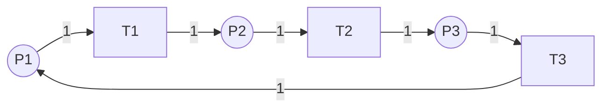
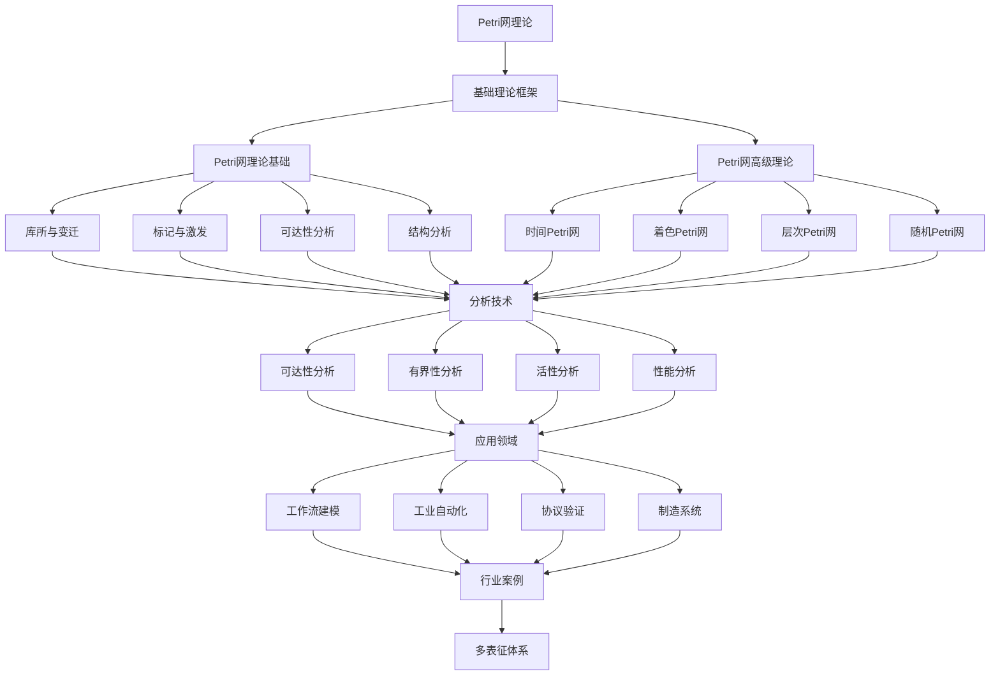

# 2.3-Petri网理论 分支导航

## 📑 目录

- [2.3-Petri网理论 分支导航](#23-petri网理论-分支导航)
  - [📑 目录](#-目录)
  - [1. 概述](#1-概述)
  - [2. 目录结构与本地跳转](#2-目录结构与本地跳转)
  - [3. 核心概念](#3-核心概念)
    - [3.1. Petri网基础](#31-petri网基础)
    - [3.2. 基本Petri网](#32-基本petri网)
    - [3.3. 高级Petri网](#33-高级petri网)
    - [3.4. 分析技术](#34-分析技术)
  - [4. 理论基础](#4-理论基础)
    - [4.1. Petri网形式化定义](#41-petri网形式化定义)
    - [4.2. 可达性分析](#42-可达性分析)
    - [4.3. 结构分析](#43-结构分析)
  - [5. 应用场景](#5-应用场景)
    - [5.1. 并发系统建模](#51-并发系统建模)
    - [5.2. 工作流系统](#52-工作流系统)
    - [5.3. 制造系统](#53-制造系统)
    - [5.4. 协议验证](#54-协议验证)
  - [6. 行业案例与多表征](#6-行业案例与多表征)
    - [6.1. 典型行业案例](#61-典型行业案例)
    - [6.2. 多表征示例](#62-多表征示例)
  - [7. 主题交叉引用](#7-主题交叉引用)
  - [8. 全链路知识流](#8-全链路知识流)
  - [9. 多表征](#9-多表征)
  - [10. 形式化语义](#10-形式化语义)
  - [11. 形式化语法与证明](#11-形式化语法与证明)
  - [12. 工具与实现](#12-工具与实现)
    - [12.1. Petri网工具](#121-petri网工具)
    - [12.2. 编程实现](#122-编程实现)
  - [13. 学习与研究路径](#13-学习与研究路径)
    - [13.1. 基础知识](#131-基础知识)
    - [13.2. 核心理论](#132-核心理论)
    - [13.3. 实践应用](#133-实践应用)
  - [14. 总结](#14-总结)

---

## 1. 概述

Petri网理论（Petri Net Theory）是由Carl Adam Petri在1962年提出的用于描述和分析并发系统的形式化方法。Petri网通过图形化的方式表示系统的状态、事件和它们之间的关系，为并发系统建模、分析和验证提供了强大的工具。

**核心特征**：

1. **图形化建模**：直观的图形表示系统结构
2. **并发语义**：自然表达并发和同步
3. **数学严格性**：有严格的数学基础
4. **分析技术**：成熟的可达性、有界性、活性分析
5. **扩展性**：支持时间、颜色、层次等扩展

**应用领域**：

- 并发系统建模
- 工作流系统设计
- 工业自动化系统
- 制造系统建模
- 协议验证
- 性能分析

---

## 2. 目录结构与本地跳转

- [2.3.1-Petri网理论基础](2.3.1-Petri网理论基础.md) - 理论基础文档
- [2.3.2-Petri网高级理论与应用](2.3.2-Petri网高级理论与应用.md) - 高级理论与应用文档

---

## 3. 核心概念

### 3.1. Petri网基础

Petri网是一种用于描述和分析并发系统的数学模型和图形工具。

**基本组成**：

1. **库所（Place）**：
   - 表示系统的状态或条件
   - 用圆圈表示
   - 可以包含令牌（token）

2. **变迁（Transition）**：
   - 表示事件或动作
   - 用矩形表示
   - 可以触发（fire）改变系统状态

3. **弧（Arc）**：
   - 连接库所和变迁
   - 用有向箭头表示
   - 可以有权重

4. **令牌（Token）**：
   - 表示资源或条件
   - 位于库所中
   - 变迁触发时移动

**Petri网示例**：



### 3.2. 基本Petri网

基本Petri网是最简单的Petri网形式，由库所、变迁、弧和初始标识组成。

**形式化定义**：

Petri网是一个四元组 $N = (P, T, F, M_0)$，其中：

- $P$：有限库所集合（places）
- $T$：有限变迁集合（transitions），且 $P \cap T = \emptyset$
- $F \subseteq (P \times T) \cup (T \times P)$：流关系（flow relation）
- $M_0: P \rightarrow \mathbb{N}$：初始标识（initial marking）

**变迁使能条件**：

变迁$t$在标识$M$下使能，当且仅当：
$$\forall p \in {}^{\bullet}t: M(p) \geq F(p, t)$$

其中${}^{\bullet}t$是变迁$t$的输入库所集合。

**变迁触发**：

当变迁$t$触发时，产生新标识$M'$：
$$M'(p) = M(p) - F(p, t) + F(t, p)$$

### 3.3. 高级Petri网

为了增强表达能力，Petri网有多种扩展形式：

1. **时间Petri网（Timed Petri Net）**：
   - 为变迁添加时间约束
   - 支持实时系统建模
   - 时间可以是固定值或区间

2. **着色Petri网（Colored Petri Net）**：
   - 令牌带有颜色（数据）
   - 减少状态空间
   - 支持复杂数据类型

3. **层次Petri网（Hierarchical Petri Net）**：
   - 支持子网嵌套
   - 模块化建模
   - 简化复杂系统

4. **随机Petri网（Stochastic Petri Net）**：
   - 变迁触发时间服从概率分布
   - 用于性能分析
   - 支持可靠性分析

### 3.4. 分析技术

Petri网有多种分析技术：

1. **可达性分析**：
   - 检查某个状态是否可达
   - 构建可达图
   - 验证系统性质

2. **有界性分析**：
   - 检查库所是否有界
   - 防止状态爆炸
   - 保证系统可分析

3. **活性分析**：
   - 检查变迁是否总是可以触发
   - 检测死锁
   - 保证系统活性

4. **结构分析**：
   - 基于Petri网结构
   - 不依赖初始标识
   - 更高效的分析方法

---

## 4. 理论基础

### 4.1. Petri网形式化定义

**定义 3.1.1 (预置和后置)**:

对于 $x \in P \cup T$：

- ${}^{\bullet}x = \{y \in P \cup T : (y, x) \in F\}$ (预置)
- $x^{\bullet} = \{y \in P \cup T : (x, y) \in F\}$ (后置)

**定义 3.1.2 (标识)**:

标识 $M: P \rightarrow \mathbb{N}$ 给每个库所分配令牌数量。

**定义 3.1.3 (变迁使能)**:

变迁$t \in T$在标识$M$下使能，记作$M[t\rangle$，当且仅当：
$$\forall p \in {}^{\bullet}t: M(p) \geq F(p, t)$$

**定义 3.1.4 (变迁触发)**:

如果$M[t\rangle$，则变迁$t$可以触发，产生新标识$M'$，记作$M[t\rangle M'$，其中：
$$M'(p) = M(p) - F(p, t) + F(t, p)$$

### 4.2. 可达性分析

**定义 3.2.1 (可达性)**:

标识$M'$从标识$M$可达，记作$M \rightarrow^* M'$，当且仅当存在变迁序列$\sigma = t_1 t_2 \ldots t_n$使得：
$$M[t_1\rangle M_1[t_2\rangle M_2 \ldots [t_n\rangle M'$$

**可达集**：

从初始标识$M_0$可达的所有标识的集合：
$$R(N, M_0) = \{M \mid M_0 \rightarrow^* M\}$$

**可达性问题**：

给定Petri网$N$和标识$M$，判断$M \in R(N, M_0)$。

**定理 3.2.1 (可达性问题的复杂性)**:

Petri网的可达性问题是EXPSPACE完全的。

### 4.3. 结构分析

**定义 3.3.1 (不变量)**:

对于Petri网$N = (P, T, F, M_0)$，向量$I: P \rightarrow \mathbb{Z}$是$P$-不变量，当且仅当：
$$\forall t \in T: \sum_{p \in P} I(p) \cdot (F(t, p) - F(p, t)) = 0$$

**$P$-不变量的意义**：

如果$I$是$P$-不变量，则对于所有可达标识$M$：
$$\sum_{p \in P} I(p) \cdot M(p) = \sum_{p \in P} I(p) \cdot M_0(p)$$

**定义 3.3.2 ($T$-不变量)**

向量$J: T \rightarrow \mathbb{Z}$是$T$-不变量，当且仅当：
$$\forall p \in P: \sum_{t \in T} J(t) \cdot (F(t, p) - F(p, t)) = 0$$

**$T$-不变量的意义**：

$T$-不变量表示可以重复执行的变迁序列，使系统回到初始状态。

---

## 5. 应用场景

### 5.1. 并发系统建模

Petri网自然表达并发和同步：

- **并发执行**：多个变迁可以同时使能
- **同步**：多个库所同时满足条件
- **互斥**：资源竞争和互斥访问
- **死锁检测**：分析系统是否存在死锁

### 5.2. 工作流系统

工作流系统是Petri网的典型应用：

- **流程建模**：用Petri网建模业务流程
- **流程验证**：验证流程的正确性
- **流程优化**：优化流程性能
- **流程执行**：基于Petri网执行流程

### 5.3. 制造系统

制造系统使用Petri网建模：

- **生产线建模**：建模生产线流程
- **资源调度**：调度制造资源
- **性能分析**：分析生产效率
- **故障诊断**：诊断系统故障

### 5.4. 协议验证

通信协议使用Petri网验证：

- **协议建模**：建模协议行为
- **性质验证**：验证协议性质
- **死锁检测**：检测协议死锁
- **性能分析**：分析协议性能

---

## 6. 行业案例与多表征

### 6.1. 典型行业案例

- **工作流系统**：Petri网在工作流建模中的应用（详见[4.5-WorkflowDomain](../../../4-软件架构与工程/4.5-WorkflowDomain/README.md)）
- **工业自动化**：Petri网在生产线控制中的应用
- **科学计算**：Petri网在科学计算流程中的应用（详见[5.2-科学计算](../../../5-行业应用与场景/5.2-科学计算/README.md)）
- **协议验证**：Petri网在通信协议验证中的应用

### 6.2. 多表征示例

- **符号表征**：库所、变迁、标识、Petri网公式、不变量
- **图结构**：Petri网图、变迁图、状态图、可达图、覆盖树
- **向量/张量**：库所向量、标识嵌入、不变量向量
- **自然语言**：定义、注释、描述、规范文档
- **图像/可视化**：Petri网结构图、流程图、状态空间图

---

## 7. 主题交叉引用

| 主题      | 基础理论 | 形式化模型 | 应用场景 | 算法实现 | 行业案例 | 多表征 |
|-----------|----------|------------|----------|----------|----------|--------|
| Petri网理论基础| ✅ | ✅       | ✅     | ✅     | ✅     | ✅   |
| Petri网高级理论| ✅ | ✅       | ✅     | ✅     | ✅     | ✅   |

**交叉引用**：

- [2.4-时态逻辑控制理论](../2.4-时态逻辑控制理论/README.md)：时态逻辑与Petri网结合
- [4.5-WorkflowDomain](../../../4-软件架构与工程/4.5-WorkflowDomain/README.md)：工作流建模
- [5.2-科学计算](../../../5-行业应用与场景/5.2-科学计算/README.md)：科学计算流程
- [2.2-自动机理论](../2.2-自动机理论/README.md)：自动机与Petri网的关系

---

## 8. 全链路知识流



---

## 9. 多表征

本分支支持多种表征方式，包括：

- **符号表征**：库所、变迁、标识、Petri网公式、不变量、覆盖树等
- **图结构**：Petri网图、变迁图、状态图、可达图、覆盖树、状态空间图等
- **向量/张量**：库所向量、标识嵌入、不变量向量、状态空间表示
- **自然语言**：定义、注释、描述、规范文档、分析报告
- **图像/可视化**：Petri网结构图、流程图、状态空间图、性能分析图

这些表征可互映，提升Petri网理论表达力。

---

## 10. 形式化语义

**语义域**：$D$，包括：

- 库所集合：$P = \{p_1, p_2, \ldots, p_n\}$
- 变迁集合：$T = \{t_1, t_2, \ldots, t_m\}$
- 流关系：$F \subseteq (P \times T) \cup (T \times P)$
- 标识空间：$\mathcal{M} = \mathbb{N}^P$（所有可能的标识）
- 执行序列：$\sigma: \mathbb{N} \to T$（变迁序列）

**解释函数**：$I: \mathcal{L} \to D$，将Petri网规范映射到语义对象：

- $I(\text{place}) \in P$：库所的解释
- $I(\text{transition}) \in T$：变迁的解释
- $I(\text{marking}) \in \mathcal{M}$：标识的解释
- $I(\text{execution}) \subseteq T^*$：执行序列的解释

**语义一致性**：每个Petri网结构/公式在$D$中有明确定义，满足：

- **局部性**：变迁的使能只依赖于输入库所的标识
- **确定性**：变迁触发产生唯一的新标识
- **可达性**：可达关系是自反和传递的
- **有界性**：有界Petri网的状态空间是有限的

---

## 11. 形式化语法与证明

**语法规则**：

Petri网的产生式：

- **库所产生式**：$P ::= p_1 \mid p_2 \mid \ldots \mid p_n$
- **变迁产生式**：$T ::= t_1 \mid t_2 \mid \ldots \mid t_m$
- **流关系产生式**：$F ::= (p, t) \mid (t, p) \mid F, F$
- **标识产生式**：$M ::= (p, k) \mid M, M$，其中$k \in \mathbb{N}$

**推理规则**：

Petri网的执行规则：

- **使能规则**：$\frac{M(p) \geq F(p, t) \text{ for all } p \in {}^{\bullet}t}{M[t\rangle}$
- **触发规则**：$\frac{M[t\rangle \quad M'(p) = M(p) - F(p, t) + F(t, p)}{M[t\rangle M'}$
- **序列规则**：$\frac{M[t_1\rangle M_1 \quad M_1[t_2\rangle M_2}{M[t_1 t_2\rangle M_2}$

**定理**：Petri网理论分支的语法系统具一致性与可扩展性。

**证明**：由Petri网产生式与推理规则递归定义，保证系统一致与可扩展。具体证明包括：

1. 语法系统的递归定义保证可判定性
2. 语义解释的一致性保证可靠性
3. 可达性问题的可判定性（对于有界Petri网）
4. 结构分析的有效性

---

## 12. 工具与实现

### 12.1. Petri网工具

**主流工具**：

1. **CPN Tools**：
   - 着色Petri网建模工具
   - 图形化编辑界面
   - 支持仿真和分析

2. **PIPE**：
   - Platform Independent Petri Net Editor
   - 支持多种Petri网类型
   - 可达性分析

3. **TINA**：
   - Time Petri Net Analyzer
   - 时间Petri网分析
   - 可达性、有界性、活性分析

4. **LoLA**：
   - Low Level Analyzer
   - 高性能Petri网分析
   - 支持大规模Petri网

### 12.2. 编程实现

**Python实现示例**：

```python
from collections import defaultdict
from typing import Dict, Set, List

class Place:
    def __init__(self, name: str, tokens: int = 0):
        self.name = name
        self.tokens = tokens

class Transition:
    def __init__(self, name: str):
        self.name = name
        self.input_places: Dict[Place, int] = {}
        self.output_places: Dict[Place, int] = {}

class PetriNet:
    def __init__(self):
        self.places: Dict[str, Place] = {}
        self.transitions: Dict[str, Transition] = {}

    def add_place(self, name: str, tokens: int = 0):
        self.places[name] = Place(name, tokens)

    def add_transition(self, name: str):
        self.transitions[name] = Transition(name)

    def add_arc(self, from_name: str, to_name: str, weight: int = 1):
        if from_name in self.places and to_name in self.transitions:
            place = self.places[from_name]
            transition = self.transitions[to_name]
            transition.input_places[place] = weight
        elif from_name in self.transitions and to_name in self.places:
            transition = self.transitions[from_name]
            place = self.places[to_name]
            transition.output_places[place] = weight

    def can_fire(self, transition_name: str) -> bool:
        transition = self.transitions[transition_name]
        return all(place.tokens >= weight
                  for place, weight in transition.input_places.items())

    def fire(self, transition_name: str) -> bool:
        if not self.can_fire(transition_name):
            return False

        transition = self.transitions[transition_name]

        # 消耗输入令牌
        for place, weight in transition.input_places.items():
            place.tokens -= weight

        # 产生输出令牌
        for place, weight in transition.output_places.items():
            place.tokens += weight

        return True
```

**Rust实现示例**：

```rust
use std::collections::{HashMap, HashSet};

#[derive(Debug, Clone)]
struct Place {
    name: String,
    tokens: u32,
}

#[derive(Debug, Clone)]
struct Transition {
    name: String,
    input_places: HashMap<String, u32>,
    output_places: HashMap<String, u32>,
}

struct PetriNet {
    places: HashMap<String, Place>,
    transitions: HashMap<String, Transition>,
}

impl PetriNet {
    fn new() -> Self {
        PetriNet {
            places: HashMap::new(),
            transitions: HashMap::new(),
        }
    }

    fn add_place(&mut self, name: String, tokens: u32) {
        self.places.insert(name.clone(), Place { name, tokens });
    }

    fn add_transition(&mut self, name: String) {
        self.transitions.insert(name.clone(), Transition {
            name,
            input_places: HashMap::new(),
            output_places: HashMap::new(),
        });
    }

    fn can_fire(&self, transition_name: &str) -> bool {
        if let Some(transition) = self.transitions.get(transition_name) {
            transition.input_places.iter().all(|(place_name, weight)| {
                self.places.get(place_name)
                    .map(|p| p.tokens >= *weight)
                    .unwrap_or(false)
            })
        } else {
            false
        }
    }

    fn fire(&mut self, transition_name: &str) -> bool {
        if !self.can_fire(transition_name) {
            return false;
        }

        if let Some(transition) = self.transitions.get(transition_name) {
            // 消耗输入令牌
            for (place_name, weight) in &transition.input_places {
                if let Some(place) = self.places.get_mut(place_name) {
                    place.tokens -= weight;
                }
            }

            // 产生输出令牌
            for (place_name, weight) in &transition.output_places {
                if let Some(place) = self.places.get_mut(place_name) {
                    place.tokens += weight;
                }
            }

            true
        } else {
            false
        }
    }
}
```

---

## 13. 学习与研究路径

### 13.1. 基础知识

1. **数学基础**：
   - 集合论
   - 图论
   - 线性代数
   - 离散数学

2. **计算机科学基础**：
   - 形式化方法
   - 并发理论
   - 自动机理论
   - 算法与数据结构

### 13.2. 核心理论

1. **基本Petri网**：
   - Petri网的定义和性质
   - 变迁使能和触发
   - 可达性分析
   - 有界性和活性

2. **高级Petri网**：
   - 时间Petri网
   - 着色Petri网
   - 层次Petri网
   - 随机Petri网

3. **分析技术**：
   - 可达性分析算法
   - 结构分析方法
   - 性能分析技术
   - 模型检查

### 13.3. 实践应用

1. **系统建模**：
   - 使用Petri网建模并发系统
   - 工作流系统建模
   - 制造系统建模

2. **系统分析**：
   - 使用工具分析Petri网
   - 验证系统性质
   - 性能分析

3. **研究前沿**：
   - 概率Petri网
   - 模糊Petri网
   - 量子Petri网
   - 机器学习在Petri网中的应用

---

## 14. 总结

Petri网理论是并发系统建模和分析的重要工具，通过图形化的方式直观地表示系统的结构和行为，同时具有严格的数学基础。从基本Petri网到各种高级扩展，Petri网理论为并发系统、工作流系统、制造系统等提供了强大的建模和分析能力。

**核心价值**：

1. **直观建模**：图形化表示系统结构
2. **并发语义**：自然表达并发和同步
3. **数学严格性**：有严格的数学基础
4. **分析技术**：成熟的分析方法

**应用前景**：

随着系统复杂性的增加，Petri网理论将继续发展，为更复杂的系统建模和分析提供支持。特别是在工作流系统、工业4.0、物联网等领域，Petri网理论将发挥越来越重要的作用。

---

[返回形式科学理论总导航](../README.md)
