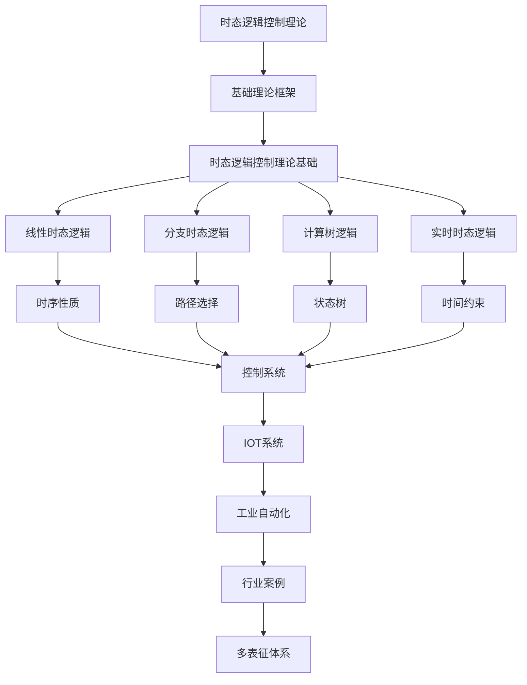

# 2.4-时态逻辑控制理论 分支导航

## 目录结构与本地跳转
- [2.4.1-时态逻辑控制理论基础](2.4.1-时态逻辑控制理论基础.md) - 预留分支

---

## 主题交叉引用
| 主题      | 基础理论 | 形式化模型 | 应用场景 | 算法实现 | 行业案例 | 多表征 |
|-----------|----------|------------|----------|----------|----------|--------|
| 时态逻辑控制理论基础| 预留 | 预留       | 预留     | 预留     | 预留     | 预留   |

- 交叉引用：[2.3-Petri网理论](../2.3-Petri网理论/README.md)、[2.6-控制理论](../2.6-控制理论/README.md)、[4.4-IOT](../../../4-软件架构与工程/4.4-IOT/README.md)

---

## 全链路知识流（Mermaid流程图）

---

[返回形式科学理论总导航](../README.md)
