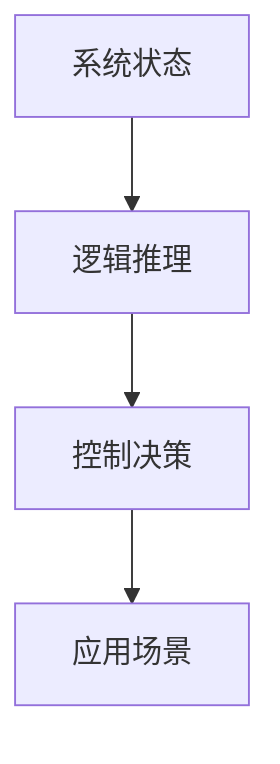

# 2.4 时态逻辑控制理论 主题导航与多表征案例（增强版）

## 目录结构与本地跳转

- [2.4.1 时态逻辑控制理论基础](./2.4.1-时态逻辑控制理论基础.md)
- [2.4.2 LTL线性时序逻辑](./2.4.2-LTL线性时序逻辑.md)
- [2.4.3 CTL分支时序逻辑](./2.4.3-CTL分支时序逻辑.md)
- [2.4.4 时序Petri网](./2.4.4-时序Petri网.md)
- [2.4.5 时态类型理论](./2.4.5-时态类型理论.md)

---

## 行业案例与多表征

### 2.4.x 典型行业案例

- 工业自动化：时序控制与安全验证（详见2.3-Petri网理论、2.6-控制理论、4.5-WorkflowDomain）
- 智能交通：时态逻辑在信号调度中的应用（详见5.2-科学计算）
- 软件验证：LTL/CTL在分布式系统一致性中的应用（详见2.5-分布式系统理论）

### 2.4.x 多表征示例

- 时态逻辑流程图、LTL/CTL推理树、时序Petri网结构图、时态类型推断、Latex公式等

---

[返回形式科学理论导航](../README.md)
