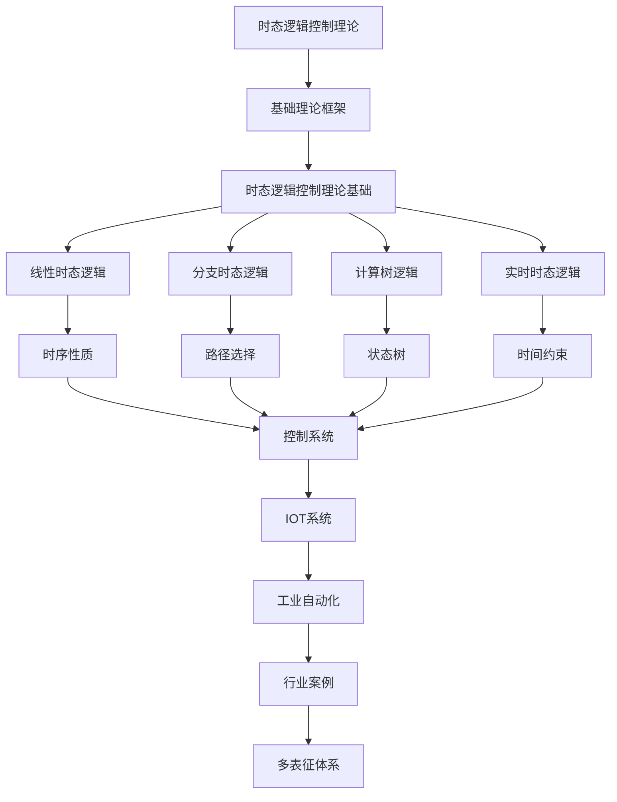

# 2.4-时态逻辑控制理论 分支导航

## 目录结构与本地跳转

- [2.4.1-时态逻辑控制理论基础](2.4.1-时态逻辑控制理论基础.md) - 预留分支

---

## 主题交叉引用

| 主题      | 基础理论 | 形式化模型 | 应用场景 | 算法实现 | 行业案例 | 多表征 |
|-----------|----------|------------|----------|----------|----------|--------|
| 时态逻辑控制理论基础| 预留 | 预留       | 预留     | 预留     | 预留     | 预留   |

- 交叉引用：[2.3-Petri网理论](../2.3-Petri网理论/README.md)、[2.6-控制理论](../2.6-控制理论/README.md)、[4.4-IOT](../../../4-软件架构与工程/4.4-IOT/README.md)

---

## 全链路知识流（Mermaid流程图）

---

[返回形式科学理论总导航](../README.md)

## 多表征

本分支支持多种表征方式，包括：

- 符号表征（时态公式、状态、转换、控制规则等）
- 图结构（时序图、状态转换图、控制流程图等）
- 向量/张量（状态向量、特征嵌入）
- 自然语言（定义、注释、描述）
- 图像/可视化（时序图、流程图、控制结构图等）
这些表征可互映，提升时态逻辑控制理论表达力。

## 形式化语义

- 语义域：$D$，如状态集合、时态关系、控制模型空间
- 解释函数：$I: S \to D$，将符号/结构映射到具体时态语义对象
- 语义一致性：每个时态结构/公式/控制规则在$D$中有明确定义

## 形式化语法与证明

- 语法规则：如时态公式产生式、推理规则、控制约束
- **定理**：时态逻辑控制理论分支的语法系统具一致性与可扩展性。
- **证明**：由时态公式、推理规则与控制约束递归定义，保证系统一致与可扩展。
