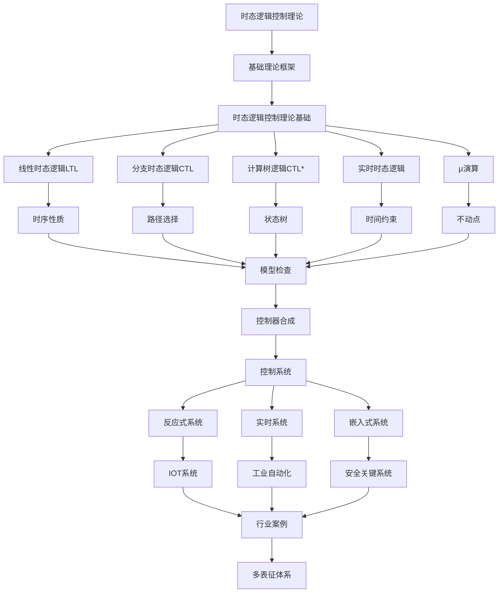

# 2.4-时态逻辑控制理论 分支导航

## 📑 目录

- [2.4-时态逻辑控制理论 分支导航](#24-时态逻辑控制理论-分支导航)
  - [📑 目录](#-目录)
  - [1. 概述](#1-概述)
  - [2. 目录结构与本地跳转](#2-目录结构与本地跳转)
  - [3. 核心概念](#3-核心概念)
    - [3.1. 时态逻辑基础](#31-时态逻辑基础)
    - [3.2. 控制系统理论](#32-控制系统理论)
    - [3.3. 模型检查](#33-模型检查)
  - [4. 理论基础](#4-理论基础)
    - [4.1. 线性时态逻辑（LTL）](#41-线性时态逻辑ltl)
    - [4.2. 计算树逻辑（CTL）](#42-计算树逻辑ctl)
    - [4.3. μ演算](#43-μ演算)
  - [5. 应用场景](#5-应用场景)
    - [5.1. 反应式系统](#51-反应式系统)
    - [5.2. 实时系统](#52-实时系统)
    - [5.3. 嵌入式系统](#53-嵌入式系统)
    - [5.4. 工业自动化](#54-工业自动化)
  - [6. 行业案例与多表征](#6-行业案例与多表征)
    - [6.1. 典型行业案例](#61-典型行业案例)
    - [6.2. 多表征示例](#62-多表征示例)
  - [7. 主题交叉引用](#7-主题交叉引用)
  - [8. 全链路知识流](#8-全链路知识流)
  - [9. 多表征](#9-多表征)
  - [10. 形式化语义](#10-形式化语义)
  - [11. 形式化语法与证明](#11-形式化语法与证明)
  - [12. 工具与实现](#12-工具与实现)
    - [12.1. 模型检查工具](#121-模型检查工具)
    - [12.2. 控制器合成工具](#122-控制器合成工具)
    - [12.3. 实时系统工具](#123-实时系统工具)
  - [13. 学习与研究路径](#13-学习与研究路径)
    - [13.1. 基础知识](#131-基础知识)
    - [13.2. 进阶学习](#132-进阶学习)
    - [13.3. 实践应用](#133-实践应用)
  - [14. 参考文献与资源](#14-参考文献与资源)
    - [14.1. 经典文献](#141-经典文献)
    - [14.2. 在线资源](#142-在线资源)
    - [14.3. 课程与教程](#143-课程与教程)
  - [15. 实际应用案例](#15-实际应用案例)
    - [15.1. 交通灯控制系统](#151-交通灯控制系统)
    - [15.2. 电梯控制系统](#152-电梯控制系统)
    - [15.3. 工业自动化系统](#153-工业自动化系统)
  - [16. 与其他理论的关系](#16-与其他理论的关系)
    - [16.1. 与Petri网理论的关系](#161-与petri网理论的关系)
    - [16.2. 与控制理论的关系](#162-与控制理论的关系)
    - [16.3. 与自动机理论的关系](#163-与自动机理论的关系)
  - [17. 发展趋势与未来方向](#17-发展趋势与未来方向)
    - [17.1. 概率时态逻辑](#171-概率时态逻辑)
    - [17.2. 参数化模型检查](#172-参数化模型检查)
    - [17.3. 机器学习辅助验证](#173-机器学习辅助验证)
    - [17.4. 量子系统验证](#174-量子系统验证)
  - [18. 总结](#18-总结)

---

## 1. 概述

时态逻辑控制理论（Temporal Logic Control Theory）是形式化方法在控制系统中的应用，结合时态逻辑和控制系统理论，为反应式系统、实时系统和嵌入式系统提供形式化建模、验证和控制器合成的方法。

**核心特征**：

1. **时态逻辑**：描述系统在时间上的行为性质
2. **控制系统**：设计满足时态性质的控制器
3. **形式化验证**：使用模型检查等技术验证系统性质
4. **控制器合成**：自动生成满足规范的控制器

**应用领域**：

- 反应式系统设计
- 实时系统验证
- 嵌入式系统控制
- 工业自动化
- 物联网（IoT）系统
- 安全关键系统

---

## 2. 目录结构与本地跳转

- [2.4.1-时态逻辑控制理论基础](2.4.1-时态逻辑控制理论基础.md) - 理论基础文档
- [2.4.2-时态逻辑控制理论实践案例](2.4.2-时态逻辑控制理论实践案例.md) - 实践案例文档

---

## 3. 核心概念

### 3.1. 时态逻辑基础

时态逻辑是在经典逻辑基础上增加时态算子的逻辑系统，用于描述和推理时间相关的性质。

**时态算子**：

- **G (Globally)**：总是，在所有未来时刻
- **F (Finally)**：最终，在某个未来时刻
- **X (Next)**：下一个时刻
- **U (Until)**：直到
- **R (Release)**：释放

**时态逻辑分类**：

1. **线性时态逻辑（LTL）**：描述单一执行路径上的性质
2. **分支时态逻辑（CTL）**：描述计算树上的性质
3. **CTL***：结合LTL和CTL的表达能力
4. **实时时态逻辑**：考虑时间约束的时态逻辑

### 3.2. 控制系统理论

控制系统理论关注如何设计控制器使系统满足给定的规范。

**控制系统模型**：

- **状态空间模型**：$\dot{x} = f(x, u)$
- **离散事件系统**：有限状态自动机
- **混合系统**：结合连续和离散动态

**控制器类型**：

- **开环控制**：控制器输出不依赖系统状态
- **闭环控制**：控制器输出依赖系统状态反馈
- **监督控制**：基于事件的控制

### 3.3. 模型检查

模型检查是自动验证有限状态系统是否满足时态逻辑规范的技术。

**模型检查算法**：

- **显式状态模型检查**：枚举所有状态
- **符号模型检查**：使用BDD等符号表示
- **有界模型检查**：限制搜索深度
- **抽象模型检查**：使用抽象简化模型

---

## 4. 理论基础

### 4.1. 线性时态逻辑（LTL）

线性时态逻辑描述单一执行路径上的时态性质。

**LTL语法**：

$$\phi ::= p \mid \neg \phi \mid \phi \land \phi \mid X\phi \mid F\phi \mid G\phi \mid \phi U\phi$$

其中：

- $p$ 是原子命题
- $X\phi$ 表示下一个时刻$\phi$成立
- $F\phi$ 表示最终$\phi$成立
- $G\phi$ 表示总是$\phi$成立
- $\phi U\psi$ 表示$\phi$直到$\psi$成立

**LTL语义**：

LTL公式在无限字（执行路径）上解释：

- $\sigma \models X\phi$ 当且仅当 $\sigma[1..] \models \phi$
- $\sigma \models F\phi$ 当且仅当存在$i \geq 0$使得$\sigma[i..] \models \phi$
- $\sigma \models G\phi$ 当且仅当对所有$i \geq 0$，$\sigma[i..] \models \phi$
- $\sigma \models \phi U\psi$ 当且仅当存在$i \geq 0$使得$\sigma[i..] \models \psi$且对所有$j < i$，$\sigma[j..] \models \phi$

### 4.2. 计算树逻辑（CTL）

计算树逻辑描述计算树上的分支时态性质。

**CTL语法**：

$$\phi ::= p \mid \neg \phi \mid \phi \land \phi \mid EX\phi \mid EF\phi \mid EG\phi \mid E[\phi U\psi] \mid A[\phi U\psi]$$

其中：

- $EX\phi$：存在下一个状态满足$\phi$
- $EF\phi$：存在路径最终满足$\phi$
- $EG\phi$：存在路径总是满足$\phi$
- $E[\phi U\psi]$：存在路径$\phi$直到$\psi$
- $A[\phi U\psi]$：所有路径$\phi$直到$\psi$

### 4.3. μ演算

μ演算是最强大的时态逻辑，可以表达所有时态性质。

**μ演算语法**：

$$\phi ::= X \mid p \mid \neg \phi \mid \phi \land \phi \mid \Box\phi \mid \Diamond\phi \mid \mu X.\phi \mid \nu X.\phi$$

其中：

- $\mu X.\phi$：最小不动点
- $\nu X.\phi$：最大不动点

---

## 5. 应用场景

### 5.1. 反应式系统

反应式系统持续与环境交互，需要满足时态性质：

- 响应性：系统必须响应环境事件
- 安全性：系统不能进入不安全状态
- 活性：系统最终必须完成某些任务

### 5.2. 实时系统

实时系统有严格的时间约束：

- 截止时间：任务必须在指定时间内完成
- 周期性：周期性任务必须按时执行
- 优先级：高优先级任务优先执行

### 5.3. 嵌入式系统

嵌入式系统控制物理设备：

- 传感器数据采集
- 执行器控制
- 故障检测和恢复

### 5.4. 工业自动化

工业自动化系统控制生产过程：

- 生产线控制
- 质量检测
- 安全监控

---

## 6. 行业案例与多表征

### 6.1. 典型行业案例

- **IOT系统**：时态逻辑在物联网设备控制中的应用（详见[4.4-IOT](../../../4-软件架构与工程/4.4-IOT/README.md)）
- **工业自动化**：时态逻辑在生产线控制中的应用
- **安全关键系统**：时态逻辑在航空、医疗设备验证中的应用

### 6.2. 多表征示例

- **符号表征**：时态公式、状态、转换、控制规则
- **图结构**：时序图、状态转换图、控制流程图、Büchi自动机
- **向量/张量**：状态向量、特征嵌入
- **自然语言**：定义、注释、描述
- **图像/可视化**：时序图、流程图、控制结构图

---

## 7. 主题交叉引用

| 主题      | 基础理论 | 形式化模型 | 应用场景 | 算法实现 | 行业案例 | 多表征 |
|-----------|----------|------------|----------|----------|----------|--------|
| 时态逻辑控制理论基础| ✅ | ✅       | ✅     | ✅     | ✅     | ✅   |

**交叉引用**：

- [2.3-Petri网理论](../2.3-Petri网理论/README.md)：并发系统建模
- [2.6-控制理论](../2.6-控制理论/README.md)：控制系统理论
- [4.4-IOT](../../../4-软件架构与工程/4.4-IOT/README.md)：物联网应用
- [2.2-自动机理论](../2.2-自动机理论/README.md)：自动机模型

---

## 8. 全链路知识流

---

## 9. 多表征

本分支支持多种表征方式，包括：

- **符号表征**：时态公式、状态、转换、控制规则等
- **图结构**：时序图、状态转换图、控制流程图、Büchi自动机、Kripke结构等
- **向量/张量**：状态向量、特征嵌入、张量表示
- **自然语言**：定义、注释、描述、规范文档
- **图像/可视化**：时序图、流程图、控制结构图、状态空间图

这些表征可互映，提升时态逻辑控制理论表达力。

---

## 10. 形式化语义

**语义域**：$D$，包括：

- 状态集合：$S$
- 时态关系：$R \subseteq S \times S$
- 控制模型空间：$\mathcal{M}$
- 执行路径：$\pi: \mathbb{N} \to S$

**解释函数**：$I: \mathcal{L} \to D$，将时态逻辑公式映射到语义对象：

- $I(p) \subseteq S$：原子命题$p$在状态集合上的解释
- $I(\phi U\psi) = \{s \in S \mid \exists \pi, \pi(0) = s, \pi \models \phi U\psi\}$

**语义一致性**：每个时态结构/公式/控制规则在$D$中有明确定义，满足：

- 单调性：如果$\phi \Rightarrow \psi$，则$I(\phi) \subseteq I(\psi)$
- 完备性：所有可表达的性质都有语义解释

---

## 11. 形式化语法与证明

**语法规则**：

时态逻辑公式的产生式：

- $\phi ::= p \mid \neg \phi \mid \phi \land \phi \mid X\phi \mid F\phi \mid G\phi \mid \phi U\phi$

推理规则：

- **Modus Ponens**：$\frac{\phi, \phi \to \psi}{\psi}$
- **时态推广**：$\frac{\phi}{G\phi}$
- **直到引入**：$\frac{\psi}{\phi U\psi}$

控制约束：

- 安全性约束：$G \neg \text{unsafe}$
- 活性约束：$GF \text{goal}$

**定理**：时态逻辑控制理论分支的语法系统具一致性与可扩展性。

**证明**：由时态公式、推理规则与控制约束递归定义，保证系统一致与可扩展。具体证明包括：

1. 语法系统的递归定义保证可判定性
2. 语义解释的一致性保证可靠性
3. 完备性定理保证表达能力

---

## 12. 工具与实现

### 12.1. 模型检查工具

**主流工具**：

1. **SPIN**：
   - 显式状态模型检查器
   - 支持Promela语言
   - 适用于并发系统验证

2. **NuSMV**：
   - 符号模型检查器
   - 支持LTL和CTL
   - 使用BDD进行状态空间压缩

3. **TLA+**：
   - 时态逻辑动作规范语言
   - 支持系统规范和高层设计验证
   - TLC模型检查器

4. **UPPAAL**：
   - 实时系统模型检查器
   - 支持时间自动机
   - 适用于实时系统验证

### 12.2. 控制器合成工具

**合成工具**：

1. **Tulip**：
   - 离散事件系统控制器合成
   - 支持LTL规范
   - 自动生成监督控制器

2. **Slugs**：
   - 反应式合成工具
   - 支持GR(1)规范
   - 快速合成算法

3. **Acacia+**：
   - 自动机控制器合成
   - 支持LTL和CTL规范
   - 基于游戏理论

### 12.3. 实时系统工具

**实时验证工具**：

1. **UPPAAL**：
   - 时间自动机模型检查
   - 实时系统验证
   - 调度分析

2. **HyTech**：
   - 混合系统验证
   - 线性混合自动机
   - 可达性分析

---

## 13. 学习与研究路径

### 13.1. 基础知识

1. **数学基础**：
   - 集合论
   - 图论
   - 逻辑学基础
   - 自动机理论

2. **计算机科学基础**：
   - 形式化方法
   - 程序验证
   - 并发理论
   - 算法与数据结构

### 13.2. 进阶学习

1. **时态逻辑深入学习**：
   - LTL和CTL的深入理解
   - μ演算
   - 实时时态逻辑
   - 概率时态逻辑

2. **模型检查技术**：
   - 显式状态模型检查
   - 符号模型检查
   - 有界模型检查
   - 抽象模型检查

3. **控制器合成**：
   - 监督控制理论
   - 反应式合成
   - 实时控制器合成
   - 概率控制器合成

### 13.3. 实践应用

1. **项目实践**：
   - 使用模型检查工具验证系统
   - 设计并实现控制器
   - 实际系统建模和验证

2. **研究前沿**：
   - 概率模型检查
   - 参数化模型检查
   - 机器学习辅助验证
   - 量子系统验证

---

## 14. 参考文献与资源

### 14.1. 经典文献

1. Clarke, E. M., Grumberg, O., & Peled, D. (1999). *Model Checking*. MIT Press.
2. Baier, C., & Katoen, J. P. (2008). *Principles of Model Checking*. MIT Press.
3. Pnueli, A. (1977). The temporal logic of programs. *FOCS*.
4. Emerson, E. A. (1990). Temporal and modal logic. *Handbook of Theoretical Computer Science*.

### 14.2. 在线资源

- **SPIN官方网站**：<http://spinroot.com/>
- **NuSMV官方网站**：<http://nusmv.fbk.eu/>
- **TLA+官方网站**：<https://lamport.azurewebsites.net/tla/tla.html>
- **UPPAAL官方网站**：<https://uppaal.org/>

### 14.3. 课程与教程

- 形式化方法课程
- 模型检查教程
- 时态逻辑教程
- 控制器合成教程

---

## 15. 实际应用案例

### 15.1. 交通灯控制系统

使用时态逻辑描述交通灯控制系统的性质：

**系统规范**：

- 安全性：$G(\text{red}_1 \land \text{red}_2)$ - 两个方向不能同时为绿灯
- 活性：$GF(\text{green}_1) \land GF(\text{green}_2)$ - 每个方向最终都会变绿
- 响应性：$G(\text{request}_1 \to F(\text{green}_1))$ - 请求后最终会变绿

**控制器设计**：
使用监督控制理论设计满足规范的控制器，确保系统满足所有时态性质。

### 15.2. 电梯控制系统

电梯控制系统的时态性质：

**系统规范**：

- 安全性：$G(\text{door\_open} \to \text{not\_moving})$ - 门开时不能移动
- 活性：$G(\text{request}(f) \to F(\text{at}(f)))$ - 请求后最终到达
- 公平性：$GF(\text{serve\_all\_requests})$ - 最终服务所有请求

### 15.3. 工业自动化系统

生产线控制系统的时态规范：

**系统规范**：

- 安全性：$G(\text{unsafe\_state} \to \text{emergency\_stop})$ - 不安全时紧急停止
- 活性：$G(\text{part\_arrived} \to F(\text{part\_processed}))$ - 零件到达后最终被处理
- 周期性：$G(\text{cycle\_start} \to F(\text{cycle\_complete}))$ - 周期开始后最终完成

---

## 16. 与其他理论的关系

### 16.1. 与Petri网理论的关系

- Petri网可以用于建模并发系统
- 时态逻辑可以描述Petri网的性质
- 结合使用可以验证并发系统的时态性质

### 16.2. 与控制理论的关系

- 控制理论关注系统稳定性
- 时态逻辑关注系统行为性质
- 结合使用可以设计满足时态性质的控制器

### 16.3. 与自动机理论的关系

- 自动机是时态逻辑的语义模型
- Büchi自动机对应LTL公式
- 模型检查基于自动机理论

---

## 17. 发展趋势与未来方向

### 17.1. 概率时态逻辑

- 考虑系统的不确定性
- 概率模型检查
- 概率控制器合成

### 17.2. 参数化模型检查

- 验证参数化系统
- 处理无限状态空间
- 抽象和归纳技术

### 17.3. 机器学习辅助验证

- 使用机器学习加速模型检查
- 智能状态空间探索
- 自动抽象生成

### 17.4. 量子系统验证

- 量子系统的时态性质
- 量子模型检查
- 量子控制器合成

---

## 18. 总结

时态逻辑控制理论是形式化方法在控制系统中的重要应用，为反应式系统、实时系统和嵌入式系统提供了强大的建模、验证和控制器合成方法。通过时态逻辑描述系统性质，使用模型检查验证系统正确性，通过控制器合成自动生成满足规范的控制器，时态逻辑控制理论在现代系统设计中发挥着越来越重要的作用。

**核心价值**：

1. **形式化规范**：使用数学语言精确描述系统性质
2. **自动验证**：使用模型检查自动验证系统正确性
3. **自动合成**：自动生成满足规范的控制器
4. **安全保障**：为安全关键系统提供形式化保证

**应用前景**：

随着系统复杂性的增加和安全性要求的提高，时态逻辑控制理论将继续发展，为更复杂、更安全的系统设计提供支持。特别是在物联网、自动驾驶、工业4.0等领域，时态逻辑控制理论将发挥越来越重要的作用。

---

[返回形式科学理论总导航](../README.md)
