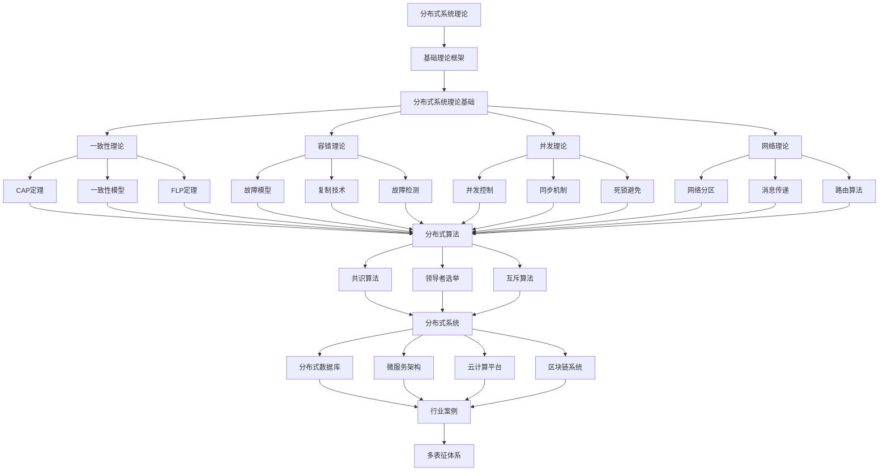

# 2.5-分布式系统理论 分支导航

## 📑 目录

- [2.5-分布式系统理论 分支导航](#25-分布式系统理论-分支导航)
  - [📑 目录](#-目录)
  - [1. 概述](#1-概述)
  - [2. 目录结构与本地跳转](#2-目录结构与本地跳转)
  - [3. 核心概念](#3-核心概念)
    - [3.1. 分布式系统基础](#31-分布式系统基础)
    - [3.2. 一致性理论](#32-一致性理论)
    - [3.3. 容错理论](#33-容错理论)
    - [3.4. 分布式算法](#34-分布式算法)
  - [4. 理论基础](#4-理论基础)
    - [4.1. CAP定理](#41-cap定理)
    - [4.2. FLP不可能性定理](#42-flp不可能性定理)
    - [4.3. 一致性模型](#43-一致性模型)
  - [5. 应用场景](#5-应用场景)
    - [5.1. 分布式数据库](#51-分布式数据库)
    - [5.2. 微服务架构](#52-微服务架构)
    - [5.3. 云计算平台](#53-云计算平台)
    - [5.4. 区块链系统](#54-区块链系统)
  - [6. 行业案例与多表征](#6-行业案例与多表征)
    - [6.1. 典型行业案例](#61-典型行业案例)
    - [6.2. 多表征示例](#62-多表征示例)
  - [7. 主题交叉引用](#7-主题交叉引用)
  - [8. 全链路知识流](#8-全链路知识流)
  - [9. 多表征](#9-多表征)
  - [10. 形式化语义](#10-形式化语义)
  - [11. 形式化语法与证明](#11-形式化语法与证明)
  - [12. 工具与实现](#12-工具与实现)
    - [12.1. 分布式系统框架](#121-分布式系统框架)
    - [12.2. 分布式数据库](#122-分布式数据库)
    - [12.3. 微服务框架](#123-微服务框架)
  - [13. 学习与研究路径](#13-学习与研究路径)
    - [13.1. 基础知识](#131-基础知识)
    - [13.2. 核心理论](#132-核心理论)
    - [13.3. 实践应用](#133-实践应用)
  - [14. 总结](#14-总结)

---

## 1. 概述

分布式系统理论（Distributed Systems Theory）是研究由多个独立计算机组成的系统如何通过网络进行通信和协调，共同完成特定任务的理论体系。它是现代计算机科学的核心理论之一，为分布式系统设计、实现和验证提供了坚实的理论基础。

**核心特征**：

1. **分布式性**：系统由多个独立节点组成
2. **并发性**：多个节点可以同时执行
3. **异步性**：节点间通信和时钟不同步
4. **容错性**：系统能够容忍部分节点故障
5. **一致性**：保证数据和服务的一致性

**应用领域**：

- 分布式数据库系统
- 微服务架构
- 云计算平台
- 区块链系统
- 分布式存储系统
- 分布式计算框架

---

## 2. 目录结构与本地跳转

- [2.5.1-分布式系统理论基础](2.5.1-分布式系统理论基础.md) - 理论基础文档
- [2.5.2-分布式系统理论实践案例](2.5.2-分布式系统理论实践案例.md) - 实践案例文档

---

## 3. 核心概念

### 3.1. 分布式系统基础

分布式系统是由多个独立计算机（节点）组成的系统，这些计算机通过网络进行通信和协调。

**分布式系统的特点**：

1. **并发性**：
   - 多个节点可以同时执行
   - 需要处理并发访问和竞争条件
   - 使用锁、信号量等同步机制

2. **缺乏全局时钟**：
   - 节点间时钟不同步
   - 使用逻辑时钟或向量时钟
   - 事件排序和因果关系

3. **部分故障**：
   - 部分节点可能故障
   - 网络分区可能发生
   - 需要容错机制

4. **消息传递**：
   - 通过消息进行通信
   - 消息可能丢失、重复、乱序
   - 需要可靠通信协议

**系统模型**：

- **同步模型**：消息传递和执行时间有上界
- **异步模型**：没有时间上界，更接近实际情况
- **部分同步模型**：介于同步和异步之间

### 3.2. 一致性理论

一致性理论是分布式系统的核心理论，研究如何在分布式环境下保证数据的一致性。

**CAP定理**：

在分布式系统中，一致性（Consistency）、可用性（Availability）和分区容错性（Partition tolerance）三者不能同时满足，最多只能满足其中两个。

**一致性模型**：

1. **强一致性**：
   - 所有节点看到相同的数据
   - 线性一致性（Linearizability）
   - 顺序一致性（Sequential Consistency）

2. **弱一致性**：
   - 允许暂时的不一致
   - 最终一致性（Eventual Consistency）
   - 因果一致性（Causal Consistency）

3. **最终一致性**：
   - 系统最终会达到一致状态
   - 适合高可用性要求
   - 需要解决冲突

### 3.3. 容错理论

容错理论研究如何使系统在部分节点故障时仍能正常工作。

**故障模型**：

1. **崩溃故障（Crash Failure）**：
   - 节点停止工作
   - 最简单的故障模型
   - 大多数系统假设崩溃故障

2. **拜占庭故障（Byzantine Failure）**：
   - 节点可能任意行为
   - 包括恶意行为
   - 需要拜占庭容错算法

3. **遗漏故障（Omission Failure）**：
   - 节点遗漏某些消息
   - 介于崩溃和拜占庭之间

**容错技术**：

- **复制**：数据和服务复制到多个节点
- **冗余**：使用冗余资源提高可靠性
- **故障检测**：检测节点故障
- **故障恢复**：从故障中恢复

### 3.4. 分布式算法

分布式算法是在分布式环境下执行的算法，需要考虑并发、异步和故障。

**经典算法**：

1. **共识算法**：
   - Paxos算法
   - Raft算法
   - PBFT算法

2. **领导者选举**：
   - Bully算法
   - Ring算法
   - Raft选举

3. **互斥算法**：
   - Lamport算法
   - Ricart-Agrawala算法
   - 分布式锁

---

## 4. 理论基础

### 4.1. CAP定理

**CAP定理（Brewer's Theorem）**：

在分布式系统中，以下三个性质最多只能同时满足两个：

1. **一致性（Consistency）**：所有节点看到相同的数据
2. **可用性（Availability）**：系统持续可用
3. **分区容错性（Partition tolerance）**：系统能够容忍网络分区

**形式化表述**：

设分布式系统$S = (N, M, C)$，其中：

- $N$：节点集合
- $M$：消息集合
- $C$：一致性约束

则：$\neg(C \land A \land P)$

**系统选择**：

- **CP系统**：保证一致性和分区容错性，牺牲可用性（如传统数据库）
- **AP系统**：保证可用性和分区容错性，牺牲一致性（如NoSQL数据库）
- **CA系统**：保证一致性和可用性，但不支持分区（单机系统）

### 4.2. FLP不可能性定理

**FLP不可能性定理（Fischer-Lynch-Paterson Impossibility）**：

在异步分布式系统中，即使只有一个节点可能崩溃，也不存在确定性的共识算法。

**定理内容**：

在异步消息传递模型中，如果存在节点崩溃故障，则不存在能够解决共识问题的确定性算法。

**影响**：

- 共识算法必须使用随机化或故障检测器
- 实际系统使用超时和故障检测
- 部分同步模型可以解决共识问题

### 4.3. 一致性模型

**线性一致性（Linearizability）**：

所有操作看起来像是在某个全局顺序下原子执行的。

**形式化定义**：

执行$E$是线性一致的，当且仅当存在一个全序关系$\prec$，使得：

1. $\prec$扩展了每个操作的程序顺序
2. 对于每个读操作$r$，$r$返回的值是$\prec$中最后一个写操作的值

**顺序一致性（Sequential Consistency）**：

所有操作看起来像是在某个顺序下执行的，且每个进程的操作按照程序顺序出现。

**最终一致性（Eventual Consistency）**：

如果不再有更新操作，系统最终会达到一致状态。

---

## 5. 应用场景

### 5.1. 分布式数据库

分布式数据库系统使用分布式系统理论保证数据一致性：

- **数据分片**：数据分布到多个节点
- **数据复制**：数据复制到多个节点
- **事务处理**：分布式事务保证一致性
- **查询优化**：分布式查询优化

### 5.2. 微服务架构

微服务架构是分布式系统的典型应用：

- **服务拆分**：系统拆分为多个微服务
- **服务通信**：服务间通过消息通信
- **服务发现**：动态发现和注册服务
- **负载均衡**：请求分发到多个服务实例

### 5.3. 云计算平台

云计算平台是大型分布式系统：

- **资源虚拟化**：虚拟化计算资源
- **弹性伸缩**：根据负载动态调整资源
- **多租户**：多个用户共享资源
- **容错和恢复**：自动故障检测和恢复

### 5.4. 区块链系统

区块链是去中心化的分布式系统：

- **共识机制**：使用共识算法达成一致
- **去中心化**：没有中央权威
- **不可篡改**：使用密码学保证数据完整性
- **智能合约**：自动执行的合约

---

## 6. 行业案例与多表征

### 6.1. 典型行业案例

- **分布式数据库**：分布式系统理论在数据库系统中的应用（详见[1-数据库系统](../../../1-数据库系统/README.md)）
- **微服务架构**：分布式系统理论在微服务中的应用（详见[4.3-微服务架构](../../../4-软件架构与工程/4.3-微服务架构/README.md)）
- **云计算平台**：分布式系统理论在云计算中的应用
- **区块链系统**：分布式系统理论在区块链中的应用

### 6.2. 多表征示例

- **符号表征**：进程、消息、同步原语、分布式协议
- **图结构**：进程通信图、网络拓扑、分布式流程图、状态转换图
- **向量/张量**：状态向量、特征嵌入、向量时钟
- **自然语言**：定义、注释、描述、规范文档
- **图像/可视化**：网络结构图、流程图、协议可视化、时序图

---

## 7. 主题交叉引用

| 主题      | 基础理论 | 形式化模型 | 应用场景 | 算法实现 | 行业案例 | 多表征 |
|-----------|----------|------------|----------|----------|----------|--------|
| 分布式系统理论基础| ✅ | ✅       | ✅     | ✅     | ✅     | ✅   |

**交叉引用**：

- [2.2-自动机理论](../2.2-自动机理论/README.md)：自动机模型用于分布式系统建模
- [1-数据库系统](../../../1-数据库系统/README.md)：分布式数据库系统
- [4.3-微服务架构](../../../4-软件架构与工程/4.3-微服务架构/README.md)：微服务架构
- [2.3-Petri网理论](../2.3-Petri网理论/README.md)：并发系统建模

---

## 8. 全链路知识流

---

## 9. 多表征

本分支支持多种表征方式，包括：

- **符号表征**：进程、消息、同步原语、分布式协议、一致性约束等
- **图结构**：进程通信图、网络拓扑、分布式流程图、状态转换图、时序图等
- **向量/张量**：状态向量、特征嵌入、向量时钟、状态空间表示
- **自然语言**：定义、注释、描述、规范文档、协议说明
- **图像/可视化**：网络结构图、流程图、协议可视化、系统架构图

这些表征可互映，提升分布式系统理论表达力。

---

## 10. 形式化语义

**语义域**：$D$，包括：

- 进程集合：$P = \{p_1, p_2, \ldots, p_n\}$
- 消息空间：$M = \{m_1, m_2, \ldots\}$
- 状态空间：$S = S_1 \times S_2 \times \cdots \times S_n$
- 事件集合：$E = \{\text{send}, \text{receive}, \text{local}\}$
- 执行轨迹：$\sigma: \mathbb{N} \to E$

**解释函数**：$I: \mathcal{L} \to D$，将分布式系统规范映射到语义对象：

- $I(\text{process}) \in P$：进程的解释
- $I(\text{message}) \in M$：消息的解释
- $I(\text{state}) \in S$：状态的解释
- $I(\text{execution}) \subseteq E^*$：执行轨迹的解释

**语义一致性**：每个分布式结构/协议/公式在$D$中有明确定义，满足：

- **局部性**：每个进程的状态只依赖于本地状态和接收的消息
- **全局性**：全局状态是所有进程状态的组合
- **因果性**：事件的因果关系在语义中体现

---

## 11. 形式化语法与证明

**语法规则**：

分布式系统的形式化语法：

- **进程语法**：$P ::= \text{skip} \mid x := e \mid P; P \mid \text{send}(m) \mid \text{receive}(m) \mid \text{if } b \text{ then } P \text{ else } P$
- **消息语法**：$M ::= (p, q, \text{data})$，表示从进程$p$到进程$q$的消息
- **系统语法**：$S ::= P_1 \parallel P_2 \parallel \cdots \parallel P_n$，表示$n$个进程的并行组合

**推理规则**：

分布式系统的推理规则：

- **局部执行**：$\frac{P \to P'}{P \parallel Q \to P' \parallel Q}$
- **消息发送**：$\frac{\text{send}(m) \to \text{skip}}{P \parallel Q \to P' \parallel Q'}$（消息加入消息队列）
- **消息接收**：$\frac{\text{receive}(m) \to \text{skip}}{P \parallel Q \to P' \parallel Q'}$（从消息队列接收）

**定理**：分布式系统理论分支的语法系统具一致性与可扩展性。

**证明**：由进程产生式、消息规则与协议定义递归定义，保证系统一致与可扩展。具体证明包括：

1. 语法系统的递归定义保证可判定性
2. 语义解释的一致性保证可靠性
3. 完备性定理保证表达能力
4. 安全性定理保证系统性质

---

## 12. 工具与实现

### 12.1. 分布式系统框架

**主流框架**：

1. **Apache Kafka**：
   - 分布式流处理平台
   - 高吞吐量消息队列
   - 支持分布式发布订阅

2. **Apache Zookeeper**：
   - 分布式协调服务
   - 提供配置管理、命名服务
   - 支持分布式锁和领导者选举

3. **etcd**：
   - 分布式键值存储
   - 使用Raft共识算法
   - 用于服务发现和配置管理

4. **Consul**：
   - 服务发现和配置管理
   - 健康检查
   - 多数据中心支持

### 12.2. 分布式数据库

**分布式数据库系统**：

1. **Cassandra**：
   - 分布式NoSQL数据库
   - 最终一致性
   - 高可用性

2. **MongoDB**：
   - 分布式文档数据库
   - 支持分片和复制
   - 灵活的数据模型

3. **CockroachDB**：
   - 分布式SQL数据库
   - 强一致性
   - 水平扩展

### 12.3. 微服务框架

**微服务框架**：

1. **Spring Cloud**：
   - Java微服务框架
   - 服务发现、配置管理
   - 断路器、网关

2. **Istio**：
   - 服务网格
   - 流量管理、安全
   - 可观测性

3. **Kubernetes**：
   - 容器编排平台
   - 服务发现、负载均衡
   - 自动扩缩容

---

## 13. 学习与研究路径

### 13.1. 基础知识

1. **计算机科学基础**：
   - 操作系统
   - 计算机网络
   - 算法与数据结构
   - 并发编程

2. **数学基础**：
   - 图论
   - 概率论
   - 逻辑学
   - 形式化方法

### 13.2. 核心理论

1. **一致性理论**：
   - CAP定理
   - 一致性模型
   - FLP不可能性定理
   - 向量时钟

2. **容错理论**：
   - 故障模型
   - 复制技术
   - 故障检测
   - 拜占庭容错

3. **分布式算法**：
   - 共识算法（Paxos、Raft）
   - 领导者选举
   - 互斥算法
   - 分布式锁

### 13.3. 实践应用

1. **系统设计**：
   - 分布式系统架构设计
   - 微服务架构设计
   - 分布式数据库设计

2. **系统实现**：
   - 使用分布式框架
   - 实现分布式算法
   - 系统测试和验证

3. **研究前沿**：
   - 区块链和共识机制
   - 边缘计算
   - 量子分布式系统
   - 机器学习在分布式系统中的应用

---

## 14. 总结

分布式系统理论是现代计算机科学的核心理论之一，为分布式系统设计、实现和验证提供了坚实的理论基础。通过一致性理论、容错理论、分布式算法等核心概念，分布式系统理论帮助我们理解和解决分布式环境下的各种挑战。

**核心价值**：

1. **理论基础**：为分布式系统提供形式化理论基础
2. **设计指导**：指导分布式系统的设计和实现
3. **问题解决**：解决一致性、容错、并发等问题
4. **系统验证**：验证分布式系统的正确性

**应用前景**：

随着云计算、微服务、区块链等技术的发展，分布式系统理论将继续发挥重要作用。特别是在大规模分布式系统、边缘计算、物联网等领域，分布式系统理论将提供关键的理论支撑。

---

[返回形式科学理论总导航](../README.md)
