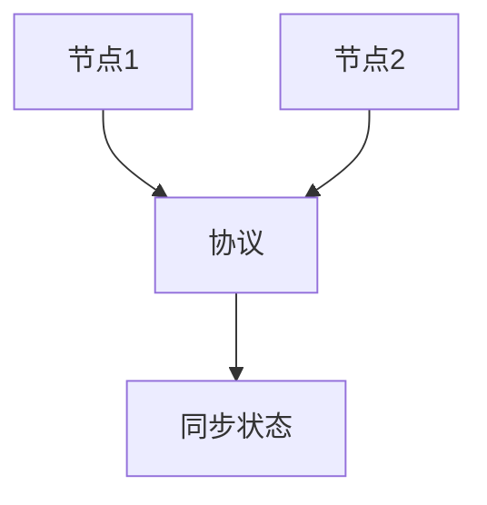

# 2.5 分布式系统理论 主题导航与多表征案例

## 目录结构与本地跳转

- [2.5.1 分布式系统理论基础](./2.5.1-分布式系统理论基础.md)

---

## 行业案例与多表征

### 2.5.x 典型行业案例

- 金融系统：分布式账本与一致性协议（详见5.1-金融数据分析、2.2-自动机理论）
- 云计算平台：分布式存储与调度（详见3.5.7-数据存储与访问、4.3-微服务架构）

### 2.5.x 多表征示例

- 分布式架构图、一致性协议状态图、任务调度流程图、Latex公式等

---

[返回形式科学理论导航](../README.md)
