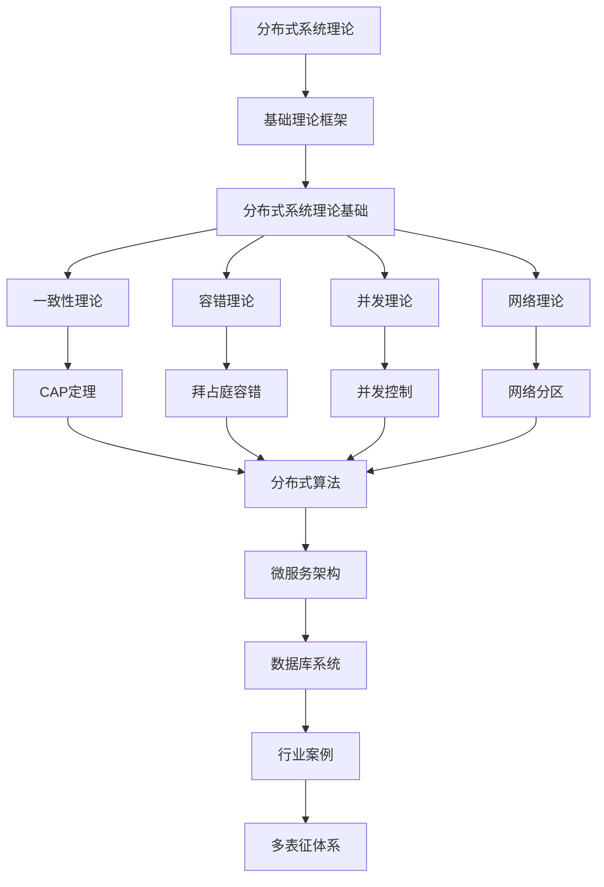

# 2.5-分布式系统理论 分支导航

## 目录结构与本地跳转

- [2.5.1-分布式系统理论基础](2.5.1-分布式系统理论基础.md) - 预留分支

---

## 主题交叉引用

| 主题      | 基础理论 | 形式化模型 | 应用场景 | 算法实现 | 行业案例 | 多表征 |
|-----------|----------|------------|----------|----------|----------|--------|
| 分布式系统理论基础| 预留 | 预留       | 预留     | 预留     | 预留     | 预留   |

- 交叉引用：[2.2-自动机理论](../2.2-自动机理论/README.md)、[1-数据库系统](../../../1-数据库系统/README.md)、[4.3-微服务架构](../../../4-软件架构与工程/4.3-微服务架构/README.md)

---

## 全链路知识流（Mermaid流程图）

---

## 多表征

分布式系统理论分支支持多种表征方式，包括：

- 符号表征（进程、消息、同步原语等）
- 图结构（进程通信图、网络拓扑）
- 向量/张量（状态向量、特征嵌入）
- 自然语言（定义、注释、描述）
- 图像/可视化（网络结构图、流程图等）
这些表征可互映，提升理论表达力。

## 形式化语义

- 语义域：$D$，如进程集合、消息空间、同步关系、模型空间
- 解释函数：$I: S \to D$，将符号/结构映射到具体分布式语义对象
- 语义一致性：每个分布式结构/公式在$D$中有明确定义

## 形式化语法与证明

- 语法规则：如进程产生式、消息规则、同步约束
- **定理**：分布式系统理论分支的语法系统具一致性与可扩展性。
- **证明**：由进程产生式与消息规则递归定义，保证系统一致与可扩展。

[返回形式科学理论总导航](../README.md)
