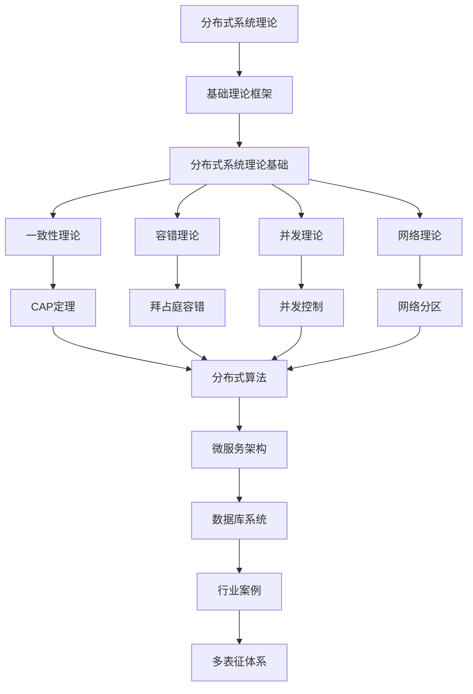

# 2.5-分布式系统理论 分支导航

## 目录结构与本地跳转

- [2.5.1-分布式系统理论基础](2.5.1-分布式系统理论基础.md) - 预留分支

---

## 主题交叉引用

| 主题      | 基础理论 | 形式化模型 | 应用场景 | 算法实现 | 行业案例 | 多表征 |
|-----------|----------|------------|----------|----------|----------|--------|
| 分布式系统理论基础| 预留 | 预留       | 预留     | 预留     | 预留     | 预留   |

- 交叉引用：[2.2-自动机理论](../2.2-自动机理论/README.md)、[1-数据库系统](../../../1-数据库系统/README.md)、[4.3-微服务架构](../../../4-软件架构与工程/4.3-微服务架构/README.md)

---

## 全链路知识流（Mermaid流程图）

---

[返回形式科学理论总导航](../README.md)
