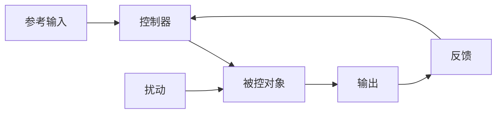

# 2.6.1 控制理论基础

## 📑 目录

- [2.6.1 控制理论基础](#261-控制理论基础)
  - [📑 目录](#-目录)
  - [1. 摘要](#1-摘要)
  - [2. 控制论概述](#2-控制论概述)
    - [2.1. 控制论的定义](#21-控制论的定义)
    - [2.2. 控制系统的基本组成](#22-控制系统的基本组成)
    - [2.3. 控制系统的分类](#23-控制系统的分类)
  - [3. 控制论中的形式模型](#3-控制论中的形式模型)
    - [3.1. 状态空间模型](#31-状态空间模型)
      - [3.1.1. 连续时间系统](#311-连续时间系统)
      - [3.1.2. 离散时间系统](#312-离散时间系统)
      - [3.1.3. 可控性与可观性](#313-可控性与可观性)
    - [3.2. 事件驱动与混合模型](#32-事件驱动与混合模型)
      - [3.2.1. 离散事件系统](#321-离散事件系统)
      - [3.2.2. 混合自动机](#322-混合自动机)
      - [3.2.3. 随机模型](#323-随机模型)
    - [3.3. 逻辑与计算模型](#33-逻辑与计算模型)
      - [3.3.1. 时序逻辑](#331-时序逻辑)
      - [3.3.2. 进程代数](#332-进程代数)
      - [3.3.3. 形式语言](#333-形式语言)
  - [4. 控制系统设计与分析](#4-控制系统设计与分析)
    - [4.1. 基于模型的设计](#41-基于模型的设计)
      - [4.1.1. 状态反馈控制](#411-状态反馈控制)
      - [4.1.2. 观测器设计](#412-观测器设计)
      - [4.1.3. 监督控制理论](#413-监督控制理论)
      - [4.1.4. 鲁棒性分析](#414-鲁棒性分析)
    - [4.2. 最优与预测控制](#42-最优与预测控制)
      - [4.2.1. 最优控制问题](#421-最优控制问题)
      - [4.2.2. Pontryagin最大原理](#422-pontryagin最大原理)
      - [4.2.3. 动态规划](#423-动态规划)
      - [4.2.4. 预测控制](#424-预测控制)
    - [4.3. 分布式与并行系统](#43-分布式与并行系统)
      - [4.3.1. 并发性理论](#431-并发性理论)
      - [4.3.2. 分布式算法验证](#432-分布式算法验证)
      - [4.3.3. 一致性模型](#433-一致性模型)
  - [5. 高级与跨学科模型](#5-高级与跨学科模型)
    - [5.1. 不确定性与近似模型](#51-不确定性与近似模型)
      - [5.1.1. 非确定性自动机](#511-非确定性自动机)
      - [5.1.2. 区间模型](#512-区间模型)
      - [5.1.3. 模糊模型](#513-模糊模型)
    - [5.2. 认知与语义模型](#52-认知与语义模型)
      - [5.2.1. 符号认知架构](#521-符号认知架构)
      - [5.2.2. 神经网络模型](#522-神经网络模型)
    - [5.3. 信息论与控制](#53-信息论与控制)
      - [5.3.1. 信息论基础](#531-信息论基础)
      - [5.3.2. 信息与控制的关系](#532-信息与控制的关系)
  - [6. 形式模型的验证与演化](#6-形式模型的验证与演化)
    - [6.1. 模型检验与定理证明](#61-模型检验与定理证明)
      - [6.1.1. 模型检验方法](#611-模型检验方法)
      - [6.1.2. 定理证明工具](#612-定理证明工具)
    - [6.2. 仿真与测试](#62-仿真与测试)
      - [6.2.1. 仿真方法](#621-仿真方法)
      - [6.2.2. 测试策略](#622-测试策略)
    - [6.3. 模型演化与自适应](#63-模型演化与自适应)
      - [6.3.1. 自适应控制](#631-自适应控制)
      - [6.3.2. 在线学习](#632-在线学习)
  - [7. 实际应用案例](#7-实际应用案例)
    - [7.1. 工业控制系统](#71-工业控制系统)
    - [7.2. 机器人控制系统](#72-机器人控制系统)
    - [7.3. 网络控制系统](#73-网络控制系统)
  - [8. 形式化定义与证明](#8-形式化定义与证明)
    - [8.1. 控制系统形式化](#81-控制系统形式化)
    - [8.2. 稳定性理论形式化](#82-稳定性理论形式化)
  - [9. 多表征](#9-多表征)
  - [10. 总结与展望](#10-总结与展望)
    - [10.1. 总结](#101-总结)
    - [10.2. 未来展望](#102-未来展望)
  - [11. 参考文献](#11-参考文献)

---

## 1. 摘要

控制理论是研究动态系统行为调节和优化的数学理论，广泛应用于工程、生物学、经济学和社会科学等领域。本文档系统梳理控制理论基础，涵盖状态空间模型、控制系统设计与分析、最优控制、鲁棒控制、自适应控制等核心内容，为控制系统设计和实现提供理论基础。

---

## 2. 控制论概述

### 2.1. 控制论的定义

**控制论（Cybernetics）**是研究系统控制和通信的科学，由Norbert Wiener在1948年提出。

**控制论的核心概念**：

1. **反馈**：系统输出对输入的影响
2. **信息**：系统状态和行为的表示
3. **控制**：通过输入调节系统行为
4. **稳定性**：系统在扰动下的行为特性

**控制论的应用领域**：

- **工程控制**：自动控制系统、机器人控制
- **生物控制**：生物系统调节、神经控制
- **经济控制**：经济系统调节、市场控制
- **社会控制**：社会系统管理、组织控制

### 2.2. 控制系统的基本组成

**控制系统的基本组成**：



**组成部分**：

1. **被控对象（Plant）**：需要控制的系统
2. **控制器（Controller）**：产生控制信号的装置
3. **传感器（Sensor）**：测量系统输出的装置
4. **执行器（Actuator）**：执行控制信号的装置
5. **反馈回路（Feedback Loop）**：将输出反馈到输入

### 2.3. 控制系统的分类

**按控制方式分类**：

1. **开环控制**：控制信号不依赖输出
2. **闭环控制**：控制信号依赖输出反馈
3. **前馈控制**：控制信号依赖扰动预测

**按系统特性分类**：

1. **线性系统**：满足叠加原理
2. **非线性系统**：不满足叠加原理
3. **时变系统**：参数随时间变化
4. **时不变系统**：参数不随时间变化

**按时间特性分类**：

1. **连续时间系统**：状态连续变化
2. **离散时间系统**：状态离散变化
3. **混合系统**：连续和离散混合

---

## 3. 控制论中的形式模型

### 3.1. 状态空间模型

#### 3.1.1. 连续时间系统

**连续时间线性系统**：

$$\dot{x}(t) = Ax(t) + Bu(t)$$

$$y(t) = Cx(t) + Du(t)$$

其中：

- $x(t) \in \mathbb{R}^n$：状态向量
- $u(t) \in \mathbb{R}^m$：输入向量
- $y(t) \in \mathbb{R}^p$：输出向量
- $A \in \mathbb{R}^{n \times n}$：状态矩阵
- $B \in \mathbb{R}^{n \times m}$：输入矩阵
- $C \in \mathbb{R}^{p \times n}$：输出矩阵
- $D \in \mathbb{R}^{p \times m}$：直通矩阵

**系统解**：

$$x(t) = e^{At}x(0) + \int_0^t e^{A(t-\tau)}Bu(\tau)d\tau$$

**示例**：二阶系统

```python
import numpy as np
import matplotlib.pyplot as plt
from scipy.integrate import odeint

# 二阶系统：质量-弹簧-阻尼器
# m*x'' + c*x' + k*x = u
# 状态空间表示：x1 = x, x2 = x'
# x1' = x2
# x2' = -k/m*x1 - c/m*x2 + 1/m*u

m, c, k = 1.0, 0.5, 2.0  # 质量、阻尼、刚度

A = np.array([[0, 1],
              [-k/m, -c/m]])
B = np.array([[0],
              [1/m]])
C = np.array([[1, 0]])
D = np.array([[0]])

def system_dynamics(x, t, u):
    """系统动态方程"""
    return A @ x + B @ u

# 仿真
t = np.linspace(0, 10, 1000)
x0 = [0, 0]  # 初始状态
u = 1.0  # 单位阶跃输入

x = odeint(system_dynamics, x0, t, args=(u,))
y = (C @ x.T).T

plt.plot(t, y)
plt.xlabel('Time (s)')
plt.ylabel('Position')
plt.title('Second-Order System Response')
plt.grid(True)
plt.show()
```

#### 3.1.2. 离散时间系统

**离散时间线性系统**：

$$x_{k+1} = Ax_k + Bu_k$$

$$y_k = Cx_k + Du_k$$

其中 $k$ 是离散时间索引。

**系统解**：

$$x_k = A^k x_0 + \sum_{i=0}^{k-1} A^{k-1-i}Bu_i$$

**示例**：数字控制系统

```python
import numpy as np
import matplotlib.pyplot as plt

# 离散时间系统
A = np.array([[0.9, 0.1],
              [0, 0.8]])
B = np.array([[1],
              [0.5]])
C = np.array([[1, 0]])
D = np.array([[0]])

# 初始状态
x0 = np.array([[0],
               [0]])

# 仿真
N = 100
x = np.zeros((2, N+1))
y = np.zeros((1, N+1))
u = np.ones((1, N))  # 单位阶跃输入

x[:, 0:1] = x0
for k in range(N):
    x[:, k+1:k+2] = A @ x[:, k:k+1] + B @ u[:, k:k+1]
    y[:, k] = (C @ x[:, k:k+1])[0, 0]

plt.plot(range(N), y[0, :N])
plt.xlabel('Time step')
plt.ylabel('Output')
plt.title('Discrete-Time System Response')
plt.grid(True)
plt.show()
```

#### 3.1.3. 可控性与可观性

**可控性（Controllability）**：

系统 $(A, B)$ 是可控的，当且仅当可控性矩阵满秩：

$$\text{rank}[B, AB, A^2B, \ldots, A^{n-1}B] = n$$

**可观性（Observability）**：

系统 $(A, C)$ 是可观的，当且仅当可观性矩阵满秩：

$$\text{rank}\begin{bmatrix} C \\ CA \\ CA^2 \\ \vdots \\ CA^{n-1} \end{bmatrix} = n$$

**示例**：可控性检查

```python
import numpy as np
from scipy.linalg import matrix_rank

def is_controllable(A, B):
    """检查系统是否可控"""
    n = A.shape[0]
    controllability_matrix = B
    for i in range(1, n):
        controllability_matrix = np.hstack([controllability_matrix, A**i @ B])
    return matrix_rank(controllability_matrix) == n

# 示例系统
A = np.array([[0, 1],
              [-2, -3]])
B = np.array([[0],
              [1]])

print(f"系统可控: {is_controllable(A, B)}")
```

### 3.2. 事件驱动与混合模型

#### 3.2.1. 离散事件系统

**离散事件系统（DES）**是状态在离散事件发生时发生跳变的系统。

**有限状态机（FSM）**：

$$M = (Q, \Sigma, \delta, q_0, F)$$

其中：

- $Q$：状态集合
- $\Sigma$：事件集合
- $\delta: Q \times \Sigma \to Q$：状态转移函数
- $q_0$：初始状态
- $F$：接受状态集合

**示例**：简单状态机

```python
from enum import Enum

class State(Enum):
    IDLE = "idle"
    RUNNING = "running"
    STOPPED = "stopped"

class Event(Enum):
    START = "start"
    STOP = "stop"
    RESET = "reset"

class StateMachine:
    def __init__(self):
        self.state = State.IDLE
        self.transitions = {
            (State.IDLE, Event.START): State.RUNNING,
            (State.RUNNING, Event.STOP): State.STOPPED,
            (State.STOPPED, Event.RESET): State.IDLE,
        }

    def transition(self, event):
        """状态转移"""
        key = (self.state, event)
        if key in self.transitions:
            self.state = self.transitions[key]
            return True
        return False

# 使用示例
sm = StateMachine()
print(f"初始状态: {sm.state}")
sm.transition(Event.START)
print(f"启动后: {sm.state}")
sm.transition(Event.STOP)
print(f"停止后: {sm.state}")
```

#### 3.2.2. 混合自动机

**混合自动机（Hybrid Automaton）**：

$$H = (Q, X, f, Init, Dom, E, G, R)$$

其中：

- $Q$：离散状态集合
- $X$：连续状态空间
- $f: Q \times X \to \dot{X}$：连续动态
- $Init \subseteq Q \times X$：初始状态集合
- $Dom: Q \to 2^X$：不变域
- $E \subseteq Q \times Q$：边集合
- $G: E \to 2^X$：守卫条件
- $R: E \times X \to 2^X$：重置映射

**示例**：温度控制系统

```python
class HybridAutomaton:
    def __init__(self):
        self.q = "OFF"  # 离散状态：OFF, ON
        self.x = 20.0   # 连续状态：温度
        self.target = 25.0
        self.hysteresis = 1.0

    def continuous_dynamics(self, dt):
        """连续动态"""
        if self.q == "ON":
            # 加热：温度上升
            self.x += 0.5 * dt
        else:
            # 冷却：温度下降
            self.x -= 0.2 * dt

    def check_guards(self):
        """检查守卫条件"""
        if self.q == "OFF" and self.x < self.target - self.hysteresis:
            self.q = "ON"
        elif self.q == "ON" and self.x > self.target + self.hysteresis:
            self.q = "OFF"

    def simulate(self, T, dt):
        """仿真"""
        times = []
        temps = []
        states = []

        for t in np.arange(0, T, dt):
            self.continuous_dynamics(dt)
            self.check_guards()
            times.append(t)
            temps.append(self.x)
            states.append(self.q)

        return times, temps, states
```

#### 3.2.3. 随机模型

**马尔可夫链（Markov Chain）**：

$$P(X_{k+1} = j | X_k = i, X_{k-1}, \ldots, X_0) = P(X_{k+1} = j | X_k = i)$$

**转移概率矩阵**：

$$P = [p_{ij}]$$

其中 $p_{ij} = P(X_{k+1} = j | X_k = i)$。

**示例**：简单马尔可夫链

```python
import numpy as np

class MarkovChain:
    def __init__(self, transition_matrix, initial_state):
        self.P = transition_matrix
        self.state = initial_state
        self.n_states = len(transition_matrix)

    def step(self):
        """一步转移"""
        self.state = np.random.choice(
            self.n_states,
            p=self.P[self.state]
        )
        return self.state

    def simulate(self, n_steps):
        """仿真"""
        states = [self.state]
        for _ in range(n_steps):
            states.append(self.step())
        return states

# 示例：天气模型（晴、雨、阴）
P = np.array([
    [0.7, 0.2, 0.1],  # 从晴转移
    [0.3, 0.4, 0.3],  # 从雨转移
    [0.2, 0.3, 0.5]   # 从阴转移
])

mc = MarkovChain(P, initial_state=0)
states = mc.simulate(100)
print(f"状态序列: {states[:10]}")
```

### 3.3. 逻辑与计算模型

#### 3.3.1. 时序逻辑

**线性时态逻辑（LTL）**：

- $\Box p$：总是 $p$（Globally）
- $\Diamond p$：最终 $p$（Eventually）
- $p \mathcal{U} q$：$p$ 直到 $q$（Until）
- $\bigcirc p$：下一个 $p$（Next）

**示例**：LTL公式

$$\Box(\text{request} \to \Diamond \text{response})$$

表示：总是，如果请求发生，则最终会有响应。

**计算树逻辑（CTL）**：

- $EX p$：存在路径，下一步 $p$
- $AX p$：所有路径，下一步 $p$
- $EF p$：存在路径，最终 $p$
- $AF p$：所有路径，最终 $p$

#### 3.3.2. 进程代数

**CCS（Calculus of Communicating Systems）**：

- $P ::= 0 | a.P | P + Q | P | Q | P \backslash L | A$
- $a.P$：执行动作 $a$ 后变成 $P$
- $P + Q$：选择 $P$ 或 $Q$
- $P | Q$：$P$ 和 $Q$ 并行

**CSP（Communicating Sequential Processes）**：

- $P ::= STOP | SKIP | a \to P | P \Box Q | P ||| Q$
- $a \to P$：执行动作 $a$ 后变成 $P$
- $P \Box Q$：外部选择
- $P ||| Q$：交错并行

#### 3.3.3. 形式语言

**形式语言分类**：

1. **正则语言**：有限自动机
2. **上下文无关语言**：下推自动机
3. **上下文相关语言**：线性有界自动机
4. **递归可枚举语言**：图灵机

---

## 4. 控制系统设计与分析

### 4.1. 基于模型的设计

#### 4.1.1. 状态反馈控制

**状态反馈控制律**：

$$u = -Kx + r$$

其中 $K$ 是反馈增益矩阵，$r$ 是参考输入。

**闭环系统**：

$$\dot{x} = (A - BK)x + Br$$

**极点配置**：通过选择 $K$ 使闭环系统极点位于期望位置。

**示例**：极点配置

```python
import numpy as np
from scipy.signal import place_poles

# 系统
A = np.array([[0, 1],
              [-2, -3]])
B = np.array([[0],
              [1]])

# 期望极点
desired_poles = [-1, -2]

# 极点配置
K = place_poles(A, B, desired_poles).gain_matrix
print(f"反馈增益矩阵 K = \n{K}")

# 闭环系统
A_cl = A - B @ K
eigenvalues = np.linalg.eigvals(A_cl)
print(f"闭环极点: {eigenvalues}")
```

#### 4.1.2. 观测器设计

**Luenberger观测器**：

$$\hat{\dot{x}} = A\hat{x} + Bu + L(y - C\hat{x})$$

其中 $L$ 是观测器增益矩阵。

**观测器误差动态**：

$$\dot{e} = (A - LC)e$$

其中 $e = x - \hat{x}$ 是估计误差。

**示例**：观测器设计

```python
import numpy as np
from scipy.signal import place_poles

# 系统
A = np.array([[0, 1],
              [-2, -3]])
C = np.array([[1, 0]])

# 期望观测器极点（通常比控制器极点快3-5倍）
desired_poles = [-5, -6]

# 观测器增益设计
L = place_poles(A.T, C.T, desired_poles).gain_matrix.T
print(f"观测器增益矩阵 L = \n{L}")

# 观测器误差动态
A_obs = A - L @ C
eigenvalues = np.linalg.eigvals(A_obs)
print(f"观测器误差极点: {eigenvalues}")
```

#### 4.1.3. 监督控制理论

**监督控制问题**：

给定系统 $G$ 和规范 $K$，设计监督器 $S$ 使得：

$$L(S/G) \subseteq K \subseteq L(G)$$

其中 $L(G)$ 是系统 $G$ 的语言，$L(S/G)$ 是受控系统的语言。

**可控性条件**：

$$\overline{K}\Sigma_u \cap L(G) \subseteq \overline{K}$$

其中 $\Sigma_u$ 是不可控事件集合。

#### 4.1.4. 鲁棒性分析

**Lyapunov稳定性**：

系统 $\dot{x} = f(x)$ 在平衡点 $x_e$ 是稳定的，如果存在Lyapunov函数 $V(x)$ 使得：

1. $V(x_e) = 0$
2. $V(x) > 0$ 对于 $x \neq x_e$
3. $\dot{V}(x) = \frac{\partial V}{\partial x}f(x) \leq 0$

**示例**：Lyapunov稳定性分析

```python
import numpy as np
import sympy as sp

# 系统：x' = -x^3
x = sp.Symbol('x')
f = -x**3

# 选择Lyapunov函数 V = x^2
V = x**2
dV_dx = sp.diff(V, x)
V_dot = dV_dx * f

print(f"V = {V}")
print(f"V_dot = {V_dot}")

# V_dot = 2x * (-x^3) = -2x^4 <= 0
# 系统是稳定的
```

### 4.2. 最优与预测控制

#### 4.2.1. 最优控制问题

**最优控制问题**：

最小化代价函数：

$$J = \int_0^T L(x(t), u(t), t)dt + F(x(T))$$

受约束于：

$$\dot{x} = f(x, u, t), \quad x(0) = x_0$$

$$g(x, u, t) \leq 0, \quad h(x, u, t) = 0$$

#### 4.2.2. Pontryagin最大原理

**Hamiltonian函数**：

$$H(x, u, \lambda, t) = L(x, u, t) + \lambda^T f(x, u, t)$$

**最优性条件**：

1. **状态方程**：$\dot{x} = \frac{\partial H}{\partial \lambda}$
2. **协态方程**：$\dot{\lambda} = -\frac{\partial H}{\partial x}$
3. **最优控制**：$u^* = \arg\min_u H(x, u, \lambda, t)$
4. **边界条件**：$\lambda(T) = \frac{\partial F}{\partial x}(x(T))$

#### 4.2.3. 动态规划

**Bellman方程**：

$$V^*(x, t) = \min_u \left[ L(x, u, t) + V^*(f(x, u, t), t+1) \right]$$

**最优控制律**：

$$u^*(x, t) = \arg\min_u \left[ L(x, u, t) + V^*(f(x, u, t), t+1) \right]$$

#### 4.2.4. 预测控制

**模型预测控制（MPC）**：

在每个时刻 $k$，求解有限时域优化问题：

$$\min_{u_{k|k}, \ldots, u_{k+N-1|k}} \sum_{i=0}^{N-1} \ell(x_{k+i|k}, u_{k+i|k}) + V_f(x_{k+N|k})$$

受约束于：

$$x_{k+i+1|k} = f(x_{k+i|k}, u_{k+i|k})$$

$$x_{k|k} = x_k$$

$$u_{k+i|k} \in \mathcal{U}, \quad x_{k+i|k} \in \mathcal{X}$$

**示例**：MPC控制器

```python
import numpy as np
from scipy.optimize import minimize

class MPCController:
    def __init__(self, A, B, Q, R, N, umax, xmax):
        self.A = A
        self.B = B
        self.Q = Q
        self.R = R
        self.N = N  # 预测时域
        self.umax = umax
        self.xmax = xmax

    def cost_function(self, u_sequence, x0):
        """代价函数"""
        cost = 0
        x = x0
        for i in range(self.N):
            u = u_sequence[i]
            cost += x.T @ self.Q @ x + u.T @ self.R @ u
            x = self.A @ x + self.B @ u
        cost += x.T @ self.Q @ x  # 终端代价
        return cost[0, 0]

    def control(self, x0):
        """计算控制输入"""
        u0 = np.zeros((self.N, 1))
        bounds = [(-self.umax, self.umax) for _ in range(self.N)]

        result = minimize(
            self.cost_function,
            u0,
            args=(x0,),
            bounds=bounds,
            method='SLSQP'
        )

        return result.x[0]  # 返回第一个控制输入
```

### 4.3. 分布式与并行系统

#### 4.3.1. 并发性理论

**进程代数**：用于描述并发系统的形式化方法。

**标记图（Marked Graph）**：Petri网的特殊形式，每个位置只有一个输入和输出。

**时间自动机网络**：多个时间自动机的组合。

#### 4.3.2. 分布式算法验证

**一致性算法**：Paxos、Raft等。

**容错算法**：拜占庭容错、崩溃容错。

#### 4.3.3. 一致性模型

**线性一致性**：所有操作看起来是原子的。

**因果一致性**：保持因果关系。

**最终一致性**：最终所有副本一致。

---

## 5. 高级与跨学科模型

### 5.1. 不确定性与近似模型

#### 5.1.1. 非确定性自动机

**非确定性有限自动机（NFA）**：

$$M = (Q, \Sigma, \delta, q_0, F)$$

其中 $\delta: Q \times \Sigma \to 2^Q$ 是非确定性转移函数。

#### 5.1.2. 区间模型

**区间系统**：

$$\dot{x} \in [A]x + [B]u$$

其中 $[A]$ 和 $[B]$ 是区间矩阵。

#### 5.1.3. 模糊模型

**模糊控制系统**：使用模糊逻辑进行控制。

**模糊规则**：

IF $x_1$ is $A_1$ AND $x_2$ is $A_2$ THEN $u$ is $B$

### 5.2. 认知与语义模型

#### 5.2.1. 符号认知架构

**ACT-R**：自适应控制思维-理性架构。

**SOAR**：状态、操作和结果架构。

#### 5.2.2. 神经网络模型

**神经网络控制**：使用神经网络作为控制器。

**强化学习**：通过与环境交互学习最优策略。

### 5.3. 信息论与控制

#### 5.3.1. 信息论基础

**熵（Entropy）**：

$$H(X) = -\sum_{i} p(x_i) \log p(x_i)$$

**互信息（Mutual Information）**：

$$I(X; Y) = H(X) - H(X|Y)$$

#### 5.3.2. 信息与控制的关系

**信息论控制**：使用信息论方法设计控制器。

**最小信息控制**：最小化控制所需的信息量。

---

## 6. 形式模型的验证与演化

### 6.1. 模型检验与定理证明

#### 6.1.1. 模型检验方法

**状态空间探索**：穷举所有可能状态。

**符号模型检验**：使用BDD等符号表示。

**有界模型检验**：限制搜索深度。

#### 6.1.2. 定理证明工具

**Coq**：依赖类型函数式编程语言。

**Isabelle/HOL**：高阶逻辑定理证明器。

### 6.2. 仿真与测试

#### 6.2.1. 仿真方法

**离散事件仿真**：事件驱动的仿真。

**连续仿真**：数值积分方法。

**蒙特卡洛仿真**：随机采样方法。

#### 6.2.2. 测试策略

**覆盖率分析**：代码覆盖率、分支覆盖率。

**形式化测试**：基于规范的测试。

### 6.3. 模型演化与自适应

#### 6.3.1. 自适应控制

**模型参考自适应控制（MRAC）**：

使系统输出跟踪参考模型输出。

**自校正控制**：在线估计参数并调整控制器。

#### 6.3.2. 在线学习

**强化学习**：通过试错学习最优策略。

**在线优化**：实时优化控制参数。

---

## 7. 实际应用案例

### 7.1. 工业控制系统

**PID控制器**：比例-积分-微分控制器。

**应用**：温度控制、压力控制、流量控制。

### 7.2. 机器人控制系统

**运动控制**：轨迹跟踪、路径规划。

**力控制**：力/力矩控制。

### 7.3. 网络控制系统

**网络化控制**：通过网络传输控制信号。

**时延补偿**：补偿网络时延。

---

## 8. 形式化定义与证明

### 8.1. 控制系统形式化

**控制系统形式化定义**：

设控制系统 $\Sigma = (X, U, Y, f, h)$，其中：

- $X$：状态空间
- $U$：输入空间
- $Y$：输出空间
- $f: X \times U \to X$：状态转移函数
- $h: X \to Y$：输出函数

### 8.2. 稳定性理论形式化

**Lyapunov稳定性形式化**：

平衡点 $x_e$ 是稳定的，如果：

$$\forall \epsilon > 0, \exists \delta > 0: \|x(0) - x_e\| < \delta \Rightarrow \|x(t) - x_e\| < \epsilon$$

---

## 9. 多表征

控制理论基础支持多种表征方式，包括：

- **符号表征**：控制变量、状态、反馈、控制律等
- **图结构**：控制流程图、状态图、反馈结构图等
- **向量/张量**：状态向量、控制嵌入、参数矩阵
- **自然语言**：定义、注释、描述
- **图像/可视化**：控制结构图、流程图、反馈可视化等

这些表征可互映，提升控制理论表达力。

---

## 10. 总结与展望

### 10.1. 总结

控制理论基础提供了：

1. **形式化模型**：状态空间模型、事件驱动模型、混合模型
2. **设计方法**：状态反馈、观测器设计、最优控制
3. **分析方法**：稳定性分析、鲁棒性分析
4. **验证方法**：模型检验、定理证明、仿真测试

### 10.2. 未来展望

1. **量子控制**：量子系统的控制
2. **生物启发控制**：基于生物系统的控制方法
3. **复杂网络控制**：网络化系统的控制
4. **机器学习控制**：基于机器学习的控制方法

---

## 11. 参考文献

1. Ogata, K. (2010). Modern Control Engineering. Prentice Hall.
2. Astrom, K. J., & Murray, R. M. (2010). Feedback Systems: An Introduction for Scientists and Engineers. Princeton University Press.
3. Baier, C., & Katoen, J.-P. (2008). Principles of Model Checking. MIT Press.
4. Alur, R. (2015). Principles of Cyber-Physical Systems. MIT Press.
5. Tabuada, P. (2009). Verification and Control of Hybrid Systems: A Symbolic Approach. Springer.
6. Ramadge, P. J., & Wonham, W. M. (1987). Supervisory control of a class of discrete event processes. SIAM Journal on Control and Optimization, 25(1), 206-230.
7. Lynch, N. (1996). Distributed Algorithms. Morgan Kaufmann.
8. Khalil, H. K. (2002). Nonlinear Systems. Prentice Hall.
9. Slotine, J. J. E., & Li, W. (1991). Applied Nonlinear Control. Prentice Hall.
10. Zhou, K., Doyle, J. C., & Glover, K. (1996). Robust and Optimal Control. Prentice Hall.

---

[返回控制理论导航](../README.md)
