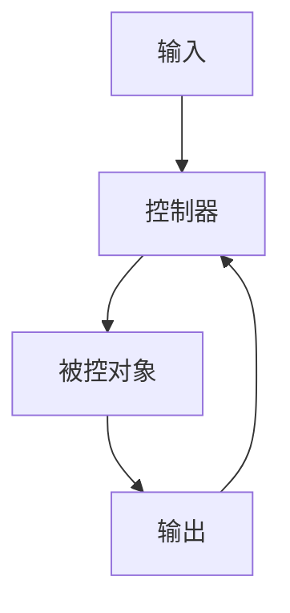

# 2.6 控制理论 主题导航与多表征案例

## 目录结构与本地跳转

- [2.6.1 控制理论基础](./2.6.1-控制理论基础.md)

---

## 行业案例与多表征

### 2.6.x 典型行业案例

- 工业自动化：PID控制与最优控制（详见2.4-时态逻辑控制理论、2.3-Petri网理论、4.5-WorkflowDomain）
- 智能制造：自适应控制与数据驱动优化（详见3.5-数据分析与ETL、5.2-科学计算）

### 2.6.x 多表征示例

- 控制系统结构图、时序图、控制律公式、仿真结果等

---

[返回形式科学理论导航](../README.md)
