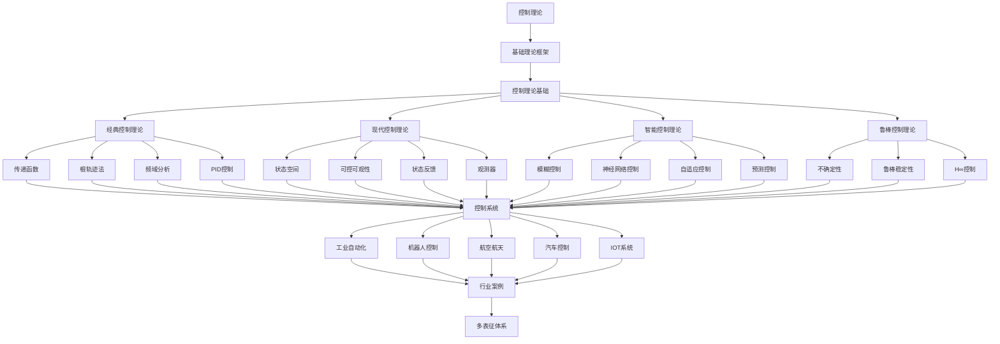

# 2.6-控制理论 分支导航

## 📑 目录

- [2.6-控制理论 分支导航](#26-控制理论-分支导航)
  - [📑 目录](#-目录)
  - [1. 概述](#1-概述)
  - [2. 目录结构与本地跳转](#2-目录结构与本地跳转)
  - [3. 核心概念](#3-核心概念)
    - [3.1. 控制理论基础](#31-控制理论基础)
    - [3.2. 经典控制理论](#32-经典控制理论)
    - [3.3. 现代控制理论](#33-现代控制理论)
    - [3.4. 智能控制理论](#34-智能控制理论)
  - [4. 理论基础](#4-理论基础)
    - [4.1. 状态空间模型](#41-状态空间模型)
    - [4.2. 稳定性理论](#42-稳定性理论)
    - [4.3. 控制器设计](#43-控制器设计)
  - [5. 应用场景](#5-应用场景)
    - [5.1. 工业自动化](#51-工业自动化)
    - [5.2. 机器人控制](#52-机器人控制)
    - [5.3. 航空航天](#53-航空航天)
    - [5.4. 汽车控制](#54-汽车控制)
  - [6. 行业案例与多表征](#6-行业案例与多表征)
    - [6.1. 典型行业案例](#61-典型行业案例)
    - [6.2. 多表征示例](#62-多表征示例)
  - [7. 主题交叉引用](#7-主题交叉引用)
  - [8. 全链路知识流](#8-全链路知识流)
  - [9. 多表征](#9-多表征)
  - [10. 形式化语义](#10-形式化语义)
  - [11. 形式化语法与证明](#11-形式化语法与证明)
  - [12. 工具与实现](#12-工具与实现)
    - [12.1. 控制系统设计工具](#121-控制系统设计工具)
    - [12.2. 硬件实现](#122-硬件实现)
    - [12.3. 软件实现](#123-软件实现)
  - [13. 学习与研究路径](#13-学习与研究路径)
    - [13.1. 基础知识](#131-基础知识)
    - [13.2. 核心理论](#132-核心理论)
    - [13.3. 实践应用](#133-实践应用)
  - [14. 总结](#14-总结)

---

## 1. 概述

控制理论（Control Theory）是研究如何通过调节系统输入来使系统输出达到期望值的理论体系。它是工程学和数学的交叉学科，为自动控制系统设计、分析和优化提供了理论基础。

**核心特征**：

1. **系统建模**：建立系统的数学模型
2. **控制器设计**：设计满足性能要求的控制器
3. **稳定性分析**：分析系统的稳定性
4. **性能优化**：优化系统的性能指标
5. **鲁棒性**：保证系统对不确定性的鲁棒性

**应用领域**：

- 工业自动化
- 机器人控制
- 航空航天
- 汽车控制
- 物联网（IoT）系统
- 智能家居

---

## 2. 目录结构与本地跳转

- [2.6.1-控制理论基础](2.6.1-控制理论基础.md) - 理论基础文档

---

## 3. 核心概念

### 3.1. 控制理论基础

控制理论研究的核心问题是如何设计控制器使系统满足给定的性能要求。

**控制系统组成**：

1. **被控对象（Plant）**：
   - 需要控制的系统
   - 可以是物理系统或过程
   - 具有输入和输出

2. **控制器（Controller）**：
   - 根据系统状态和参考输入产生控制信号
   - 可以是PID控制器、状态反馈控制器等
   - 目标是使系统输出跟踪参考输入

3. **传感器（Sensor）**：
   - 测量系统输出
   - 提供反馈信号
   - 可能引入测量噪声

4. **执行器（Actuator）**：
   - 执行控制信号
   - 将控制信号转换为物理动作
   - 可能有饱和和延迟

**控制系统类型**：

- **开环控制**：控制器输出不依赖系统输出
- **闭环控制（反馈控制）**：控制器输出依赖系统输出反馈
- **前馈控制**：控制器输出依赖参考输入和干扰

### 3.2. 经典控制理论

经典控制理论主要研究单输入单输出（SISO）线性时不变系统。

**核心方法**：

1. **传递函数**：
   - 系统输入输出的拉普拉斯变换比
   - 描述系统的频域特性
   - 用于系统分析和设计

2. **根轨迹法**：
   - 分析系统参数变化对极点位置的影响
   - 用于控制器参数设计
   - 保证系统稳定性

3. **频域分析**：
   - 使用Bode图、Nyquist图分析系统
   - 分析系统的频率响应
   - 设计满足频域指标的控制器

4. **PID控制**：
   - 比例-积分-微分控制
   - 最常用的控制器
   - 简单有效

### 3.3. 现代控制理论

现代控制理论主要研究多输入多输出（MIMO）系统，使用状态空间方法。

**核心方法**：

1. **状态空间模型**：
   - 使用状态变量描述系统
   - 支持MIMO系统
   - 时域分析方法

2. **可控性和可观性**：
   - 可控性：能否通过输入控制所有状态
   - 可观性：能否通过输出观测所有状态
   - 系统设计的基础

3. **状态反馈控制**：
   - 使用系统状态设计控制器
   - 极点配置
   - 最优控制

4. **观测器设计**：
   - 估计不可测状态
   - 全维观测器
   - 降维观测器

### 3.4. 智能控制理论

智能控制理论结合人工智能方法，处理复杂和不确定系统。

**核心方法**：

1. **模糊控制**：
   - 使用模糊逻辑
   - 处理不确定性
   - 适合非线性系统

2. **神经网络控制**：
   - 使用神经网络
   - 自适应控制
   - 学习控制

3. **自适应控制**：
   - 自动调整控制器参数
   - 适应系统变化
   - 鲁棒自适应控制

4. **预测控制**：
   - 基于模型预测
   - 优化控制序列
   - 处理约束

---

## 4. 理论基础

### 4.1. 状态空间模型

**连续时间系统**：

$$\dot{x}(t) = Ax(t) + Bu(t)$$
$$y(t) = Cx(t) + Du(t)$$

其中：

- $x(t) \in \mathbb{R}^n$：状态向量
- $u(t) \in \mathbb{R}^m$：输入向量
- $y(t) \in \mathbb{R}^p$：输出向量
- $A, B, C, D$：系统矩阵

**离散时间系统**：

$$x_{k+1} = Ax_k + Bu_k$$
$$y_k = Cx_k + Du_k$$

**可控性**：

系统$(A, B)$可控，当且仅当可控性矩阵满秩：
$$\text{rank}[B, AB, A^2B, \ldots, A^{n-1}B] = n$$

**可观性**：

系统$(A, C)$可观，当且仅当可观性矩阵满秩：
$$\text{rank}[C^T, (A^T)C^T, (A^T)^2C^T, \ldots, (A^T)^{n-1}C^T] = n$$

### 4.2. 稳定性理论

**Lyapunov稳定性**：

系统$\dot{x} = f(x)$在平衡点$x_e$处稳定，如果对于任意$\epsilon > 0$，存在$\delta > 0$，使得：
$$||x(0) - x_e|| < \delta \Rightarrow ||x(t) - x_e|| < \epsilon, \forall t \geq 0$$

**渐近稳定性**：

系统在平衡点$x_e$处渐近稳定，如果：

1. 系统在$x_e$处稳定
2. $\lim_{t \to \infty} x(t) = x_e$

**Lyapunov定理**：

如果存在正定函数$V(x)$使得$\dot{V}(x) < 0$，则系统渐近稳定。

### 4.3. 控制器设计

**状态反馈控制**：

$$u = -Kx + r$$

其中$K$是反馈增益矩阵，$r$是参考输入。

**极点配置**：

通过选择反馈增益$K$，使闭环系统$(A - BK)$的极点位于期望位置。

**LQR控制**：

线性二次调节器（LQR）最小化性能指标：
$$J = \int_0^{\infty} (x^T Q x + u^T R u) dt$$

其中$Q$和$R$是权重矩阵。

---

## 5. 应用场景

### 5.1. 工业自动化

工业自动化系统使用控制理论：

- **过程控制**：控制工业过程参数
- **运动控制**：控制机械运动
- **温度控制**：控制温度系统
- **压力控制**：控制压力系统

### 5.2. 机器人控制

机器人系统使用控制理论：

- **轨迹跟踪**：跟踪期望轨迹
- **力控制**：控制接触力
- **协调控制**：多机器人协调
- **自适应控制**：适应环境变化

### 5.3. 航空航天

航空航天系统使用控制理论：

- **飞行控制**：控制飞机姿态和轨迹
- **姿态控制**：控制卫星姿态
- **导航控制**：控制飞行路径
- **鲁棒控制**：处理不确定性

### 5.4. 汽车控制

汽车系统使用控制理论：

- **发动机控制**：控制发动机参数
- **制动控制**：控制制动系统
- **转向控制**：控制转向系统
- **自动驾驶**：自动控制车辆

---

## 6. 行业案例与多表征

### 6.1. 典型行业案例

- **IOT系统**：控制理论在物联网设备控制中的应用（详见[4.4-IOT](../../../4-软件架构与工程/4.4-IOT/README.md)）
- **工业自动化**：控制理论在生产线控制中的应用
- **科学计算**：控制理论在科学计算中的应用（详见[5.2-科学计算](../../../5-行业应用与场景/5.2-科学计算/README.md)）
- **机器人系统**：控制理论在机器人控制中的应用

### 6.2. 多表征示例

- **符号表征**：控制变量、状态、反馈、控制律、传递函数
- **图结构**：控制流程图、状态图、反馈结构图、Bode图、Nyquist图
- **向量/张量**：状态向量、控制嵌入、参数矩阵、系统矩阵
- **自然语言**：定义、注释、描述、规范文档
- **图像/可视化**：控制结构图、流程图、反馈可视化、频域图

---

## 7. 主题交叉引用

| 主题      | 基础理论 | 形式化模型 | 应用场景 | 算法实现 | 行业案例 | 多表征 |
|-----------|----------|------------|----------|----------|----------|--------|
| 控制理论基础| ✅ | ✅       | ✅     | ✅     | ✅     | ✅   |

**交叉引用**：

- [2.4-时态逻辑控制理论](../2.4-时态逻辑控制理论/README.md)：时态逻辑与控制理论结合
- [4.4-IOT](../../../4-软件架构与工程/4.4-IOT/README.md)：物联网应用
- [5.2-科学计算](../../../5-行业应用与场景/5.2-科学计算/README.md)：科学计算应用
- [2.3-Petri网理论](../2.3-Petri网理论/README.md)：离散事件系统控制

---

## 8. 全链路知识流



---

## 9. 多表征

本分支支持多种表征方式，包括：

- **符号表征**：控制变量、状态、反馈、控制律、传递函数、状态空间模型等
- **图结构**：控制流程图、状态图、反馈结构图、Bode图、Nyquist图、根轨迹图等
- **向量/张量**：状态向量、控制嵌入、参数矩阵、系统矩阵、状态空间表示
- **自然语言**：定义、注释、描述、规范文档、设计报告
- **图像/可视化**：控制结构图、流程图、反馈可视化、频域图、时域响应图

这些表征可互映，提升控制理论表达力。

---

## 10. 形式化语义

**语义域**：$D$，包括：

- 状态空间：$\mathcal{X} \subseteq \mathbb{R}^n$
- 输入空间：$\mathcal{U} \subseteq \mathbb{R}^m$
- 输出空间：$\mathcal{Y} \subseteq \mathbb{R}^p$
- 控制律空间：$\mathcal{K} = \{K: \mathcal{X} \to \mathcal{U}\}$
- 系统动态：$f: \mathcal{X} \times \mathcal{U} \to \mathcal{X}$

**解释函数**：$I: \mathcal{L} \to D$，将控制理论规范映射到语义对象：

- $I(\text{state}) \in \mathcal{X}$：状态的解释
- $I(\text{input}) \in \mathcal{U}$：输入的解释
- $I(\text{output}) \in \mathcal{Y}$：输出的解释
- $I(\text{controller}) \in \mathcal{K}$：控制器的解释
- $I(\text{system}) = f$：系统动态的解释

**语义一致性**：每个控制结构/反馈/公式在$D$中有明确定义，满足：

- **因果性**：系统输出依赖于当前和过去的输入
- **稳定性**：稳定系统的状态有界
- **可控性**：可控系统可以通过输入控制状态
- **可观性**：可观系统可以通过输出观测状态

---

## 11. 形式化语法与证明

**语法规则**：

控制系统的形式化语法：

- **状态语法**：$x ::= x_1 \mid x_2 \mid \ldots \mid x_n$
- **输入语法**：$u ::= u_1 \mid u_2 \mid \ldots \mid u_m$
- **输出语法**：$y ::= y_1 \mid y_2 \mid \ldots \mid y_p$
- **系统语法**：$\dot{x} = f(x, u)$ 或 $x_{k+1} = f(x_k, u_k)$
- **控制器语法**：$u = K(x, r)$，其中$r$是参考输入

**推理规则**：

控制系统的推理规则：

- **系统演化**：$\frac{\dot{x} = f(x, u) \quad u = K(x, r)}{\dot{x} = f(x, K(x, r))}$
- **稳定性**：$\frac{\exists V(x) > 0, \dot{V}(x) < 0}{\text{系统渐近稳定}}$
- **可控性**：$\frac{\text{rank}[B, AB, \ldots, A^{n-1}B] = n}{\text{系统可控}}$

**定理**：控制理论分支的语法系统具一致性与可扩展性。

**证明**：由控制产生式、反馈规则与控制律定义递归定义，保证系统一致与可扩展。具体证明包括：

1. 语法系统的递归定义保证可判定性
2. 语义解释的一致性保证可靠性
3. 稳定性定理保证系统稳定性
4. 可控性定理保证系统可控性

---

## 12. 工具与实现

### 12.1. 控制系统设计工具

**主流工具**：

1. **MATLAB/Simulink**：
   - 控制系统设计和仿真
   - 支持多种控制方法
   - 代码生成

2. **Python Control**：
   - Python控制系统库
   - 状态空间分析
   - 频域分析

3. **SciPy**：
   - 科学计算库
   - 信号处理
   - 优化算法

4. **GNU Octave**：
   - MATLAB的开源替代
   - 控制系统工具箱
   - 免费开源

### 12.2. 硬件实现

**控制器硬件**：

1. **PLC（可编程逻辑控制器）**：
   - 工业控制
   - 实时控制
   - 可靠性高

2. **微控制器**：
   - 嵌入式控制
   - 低成本
   - 低功耗

3. **FPGA**：
   - 高速控制
   - 并行处理
   - 可重构

### 12.3. 软件实现

**Python实现示例**：

```python
import numpy as np
from scipy import signal
import matplotlib.pyplot as plt

# 状态空间模型
A = np.array([[0, 1], [-1, -0.5]])
B = np.array([[0], [1]])
C = np.array([[1, 0]])
D = np.array([[0]])

# 创建系统
sys = signal.StateSpace(A, B, C, D)

# 设计PID控制器
Kp, Ki, Kd = 1.0, 0.1, 0.01
pid = signal.TransferFunction([Kd, Kp, Ki], [1, 0])

# 闭环系统
closed_loop = signal.feedback(sys * pid)

# 阶跃响应
t, y = signal.step(closed_loop)
plt.plot(t, y)
plt.xlabel('Time')
plt.ylabel('Output')
plt.title('Step Response')
plt.grid(True)
plt.show()
```

**Rust实现示例**：

```rust
use nalgebra::{DMatrix, DVector};

struct StateSpace {
    A: DMatrix<f64>,
    B: DMatrix<f64>,
    C: DMatrix<f64>,
    D: DMatrix<f64>,
}

impl StateSpace {
    fn new(A: DMatrix<f64>, B: DMatrix<f64>,
           C: DMatrix<f64>, D: DMatrix<f64>) -> Self {
        StateSpace { A, B, C, D }
    }

    fn step(&self, x: &DVector<f64>, u: &DVector<f64>) -> DVector<f64> {
        &self.A * x + &self.B * u
    }

    fn output(&self, x: &DVector<f64>, u: &DVector<f64>) -> DVector<f64> {
        &self.C * x + &self.D * u
    }
}

// PID控制器
struct PIDController {
    kp: f64,
    ki: f64,
    kd: f64,
    integral: f64,
    last_error: f64,
}

impl PIDController {
    fn new(kp: f64, ki: f64, kd: f64) -> Self {
        PIDController {
            kp, ki, kd,
            integral: 0.0,
            last_error: 0.0,
        }
    }

    fn control(&mut self, error: f64, dt: f64) -> f64 {
        self.integral += error * dt;
        let derivative = (error - self.last_error) / dt;
        self.last_error = error;

        self.kp * error + self.ki * self.integral + self.kd * derivative
    }
}
```

---

## 13. 学习与研究路径

### 13.1. 基础知识

1. **数学基础**：
   - 线性代数
   - 微积分
   - 微分方程
   - 复变函数

2. **工程基础**：
   - 电路分析
   - 信号与系统
   - 机械系统
   - 热力学

### 13.2. 核心理论

1. **经典控制理论**：
   - 传递函数
   - 根轨迹法
   - 频域分析
   - PID控制

2. **现代控制理论**：
   - 状态空间方法
   - 可控性和可观性
   - 状态反馈控制
   - 观测器设计

3. **高级控制理论**：
   - 鲁棒控制
   - 自适应控制
   - 最优控制
   - 预测控制

### 13.3. 实践应用

1. **系统建模**：
   - 建立系统数学模型
   - 系统辨识
   - 参数估计

2. **控制器设计**：
   - 设计满足性能要求的控制器
   - 控制器参数整定
   - 控制器实现

3. **系统分析**：
   - 稳定性分析
   - 性能分析
   - 鲁棒性分析

4. **研究前沿**：
   - 非线性控制
   - 分布式控制
   - 网络化控制
   - 量子控制

---

## 14. 总结

控制理论是自动控制系统设计和分析的理论基础，从经典控制理论到现代控制理论，再到智能控制理论，控制理论不断发展，为各种控制系统提供了强大的设计工具和分析方法。

**核心价值**：

1. **系统建模**：建立系统的数学模型
2. **控制器设计**：设计满足性能要求的控制器
3. **稳定性分析**：分析系统的稳定性
4. **性能优化**：优化系统的性能指标

**应用前景**：

随着系统复杂性的增加和智能化要求的提高，控制理论将继续发展，为更复杂、更智能的系统提供支持。特别是在机器人、自动驾驶、工业4.0、物联网等领域，控制理论将发挥越来越重要的作用。

---

[返回形式科学理论总导航](../README.md)
