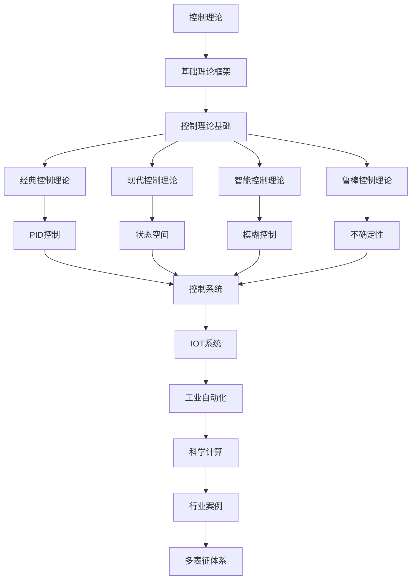

# 2.6-控制理论 分支导航

## 目录结构与本地跳转

- [2.6.1-控制理论基础](2.6.1-控制理论基础.md) - 预留分支

---

## 主题交叉引用

| 主题      | 基础理论 | 形式化模型 | 应用场景 | 算法实现 | 行业案例 | 多表征 |
|-----------|----------|------------|----------|----------|----------|--------|
| 控制理论基础| 预留   | 预留       | 预留     | 预留     | 预留     | 预留   |

- 交叉引用：[2.4-时态逻辑控制理论](../2.4-时态逻辑控制理论/README.md)、[4.4-IOT](../../../4-软件架构与工程/4.4-IOT/README.md)、[5.2-科学计算](../../../5-行业应用与场景/5.2-科学计算/README.md)

---

## 全链路知识流（Mermaid流程图）

---

[返回形式科学理论总导航](../README.md)

## 多表征

本分支支持多种表征方式，包括：

- 符号表征（控制变量、状态、反馈、控制律等）
- 图结构（控制流程图、状态图、反馈结构图等）
- 向量/张量（状态向量、控制嵌入、参数矩阵）
- 自然语言（定义、注释、描述）
- 图像/可视化（控制结构图、流程图、反馈可视化等）
这些表征可互映，提升控制理论表达力。

## 形式化语义

- 语义域：$D$，如控制变量集合、状态空间、反馈关系、控制模型空间
- 解释函数：$I: S \to D$，将符号/结构映射到具体控制语义对象
- 语义一致性：每个控制结构/反馈/公式在$D$中有明确定义

## 形式化语法与证明

- 语法规则：如控制产生式、反馈规则、约束条件、控制律定义
- **定理**：控制理论分支的语法系统具一致性与可扩展性。
- **证明**：由控制产生式、反馈规则与控制律定义递归定义，保证系统一致与可扩展。
