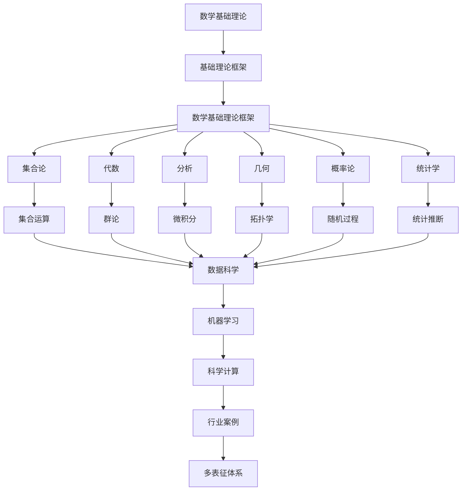

# 2.7-数学基础理论 分支导航

## 目录结构与本地跳转

- [2.7.1-数学基础理论框架](2.7.1-数学基础理论框架.md) - 预留分支

---

## 主题交叉引用

| 主题      | 基础理论 | 形式化模型 | 应用场景 | 算法实现 | 行业案例 | 多表征 |
|-----------|----------|------------|----------|----------|----------|--------|
| 数学基础理论框架| 预留 | 预留       | 预留     | 预留     | 预留     | 预留   |

- 交叉引用：[3.1-基础理论](../../../3-数据模型与算法/3.1-基础理论/README.md)、[3.4-AI与机器学习算法](../../../3-数据模型与算法/3.4-AI与机器学习算法/README.md)、[5.2-科学计算](../../../5-行业应用与场景/5.2-科学计算/README.md)

---

## 全链路知识流（Mermaid流程图）

---

[返回形式科学理论总导航](../README.md)
