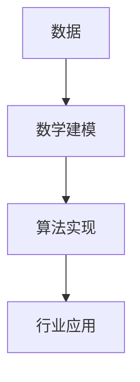

# 2.7 数学基础理论 主题导航与多表征案例（增强版）

## 目录结构与本地跳转

- [2.7.1 数学基础理论框架](./2.7.1-数学基础理论框架.md)
- [2.7.2 集合论基础](./2.7.2-集合论基础.md)
- [2.7.3 数理逻辑](./2.7.3-数理逻辑.md)
- [2.7.4 抽象代数](./2.7.4-抽象代数.md)
- [2.7.5 几何基础](./2.7.5-几何基础.md)
- [2.7.6 数学分析](./2.7.6-数学分析.md)
- [2.7.7 概率与统计](./2.7.7-概率与统计.md)
- [2.7.8 模型论与范畴论](./2.7.8-模型论与范畴论.md)

---

## 行业案例与多表征

### 2.7.x 典型行业案例

- 金融建模：概率统计与风险分析（详见5.1-金融数据分析、3.5.4-专业数据分析算法）
- AI算法：线性代数与优化理论（详见3.4-AI与机器学习算法、3.4.6-优化理论与算法）
- 科学计算：微分方程与数值分析（详见5.2-科学计算）

### 2.7.x 多表征示例

- 数学公式、知识图谱、集合/代数/几何/概率结构图、数据流图、仿真结果等

---

[返回形式科学理论导航](../README.md)
