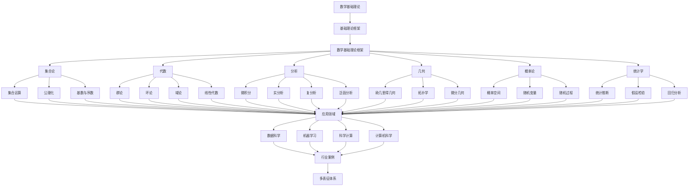

# 2.7-数学基础理论 分支导航

## 📑 目录

- [2.7-数学基础理论 分支导航](#27-数学基础理论-分支导航)
  - [📑 目录](#-目录)
  - [1. 概述](#1-概述)
  - [2. 目录结构与本地跳转](#2-目录结构与本地跳转)
  - [3. 核心概念](#3-核心概念)
    - [3.1. 集合论](#31-集合论)
    - [3.2. 代数](#32-代数)
    - [3.3. 分析学](#33-分析学)
    - [3.4. 几何与拓扑](#34-几何与拓扑)
  - [4. 理论基础](#4-理论基础)
    - [4.1. 形式化基础](#41-形式化基础)
    - [4.2. 元数学](#42-元数学)
    - [4.3. 数学哲学](#43-数学哲学)
  - [5. 应用场景](#5-应用场景)
  - [6. 行业案例与多表征](#6-行业案例与多表征)
  - [7. 主题交叉引用](#7-主题交叉引用)
  - [8. 全链路知识流](#8-全链路知识流)
  - [9. 多表征](#9-多表征)
  - [10. 形式化语义](#10-形式化语义)
  - [11. 形式化语法与证明](#11-形式化语法与证明)
  - [12. 工具与实现](#12-工具与实现)
  - [13. 学习与研究路径](#13-学习与研究路径)
  - [14. 总结](#14-总结)

---

## 1. 概述

数学基础理论（Mathematical Foundations）是研究数学的基本概念、结构、方法和理论的体系，为形式科学理论、数据科学、计算机科学等领域提供了坚实的数学基础。它是所有形式科学的基础，为各种理论和技术提供了严格的数学工具。

**核心特征**：

1. **严格性**：使用形式化方法确保严格性
2. **抽象性**：高度抽象的概念和结构
3. **普遍性**：适用于多个领域
4. **系统性**：完整的理论体系
5. **可证明性**：基于逻辑推理的证明

**应用领域**：

- 形式科学理论
- 数据科学与机器学习
- 计算机科学
- 科学计算
- 工程应用
- 理论物理

---

## 2. 目录结构与本地跳转

- [2.7.1-数学基础理论框架](2.7.1-数学基础理论框架.md) - 理论基础文档

---

## 3. 核心概念

### 3.1. 集合论

集合论（Set Theory）是数学的基础，研究集合及其运算和性质。

**基本概念**：

- **集合**：由元素组成的整体
- **元素**：集合的成员
- **子集**：一个集合包含在另一个集合中
- **并集、交集、补集**：集合的基本运算

**公理化集合论**：

- **ZFC公理系统**：Zermelo-Fraenkel集合论
- **选择公理**：AC（Axiom of Choice）
- **连续统假设**：CH（Continuum Hypothesis）

**形式化表示**：

$$A \cup B = \{x \mid x \in A \lor x \in B\}$$
$$A \cap B = \{x \mid x \in A \land x \in B\}$$
$$A^c = \{x \mid x \notin A\}$$

### 3.2. 代数

代数（Algebra）研究代数结构及其性质。

**基本代数结构**：

1. **群（Group）**：
   - 结合律、单位元、逆元
   - $(G, \cdot)$，其中$\cdot$是二元运算

2. **环（Ring）**：
   - 加法群、乘法半群
   - 分配律

3. **域（Field）**：
   - 加法群、乘法群（除零）
   - 分配律

**线性代数**：

- **向量空间**：线性组合、基、维数
- **线性变换**：矩阵表示
- **特征值与特征向量**

### 3.3. 分析学

分析学（Analysis）研究函数、极限、连续、微积分等概念。

**微积分**：

- **极限**：$\lim_{x \to a} f(x) = L$
- **导数**：$f'(x) = \lim_{h \to 0} \frac{f(x+h) - f(x)}{h}$
- **积分**：$\int_a^b f(x) dx$

**实分析**：

- **实数系统**：完备性、连续性
- **函数序列**：一致收敛
- **测度论**：Lebesgue测度

**复分析**：

- **复数**：$z = a + bi$
- **解析函数**：Cauchy-Riemann方程
- **复积分**：Cauchy积分定理

### 3.4. 几何与拓扑

几何（Geometry）研究空间和形状，拓扑（Topology）研究空间的连续性质。

**欧几里得几何**：

- 点、线、面
- 距离、角度
- 平行、垂直

**拓扑学**：

- **拓扑空间**：$(X, \tau)$，其中$\tau$是开集族
- **连续性**：开集的原像是开集
- **同胚**：连续双射

**微分几何**：

- **流形**：局部欧几里得空间
- **切空间**：切向量
- **度规**：距离和角度

---

## 4. 理论基础

### 4.1. 形式化基础

**公理系统**：

数学建立在公理系统之上：

- **公理**：不证自明的基本命题
- **定义**：对概念的精确定义
- **定理**：从公理推导出的命题
- **证明**：严格的逻辑推理

**形式化验证**：

使用形式化方法验证数学证明：

- 符号逻辑
- 证明助手（Coq、Isabelle、Lean）
- 形式化数学库

### 4.2. 元数学

元数学（Metamathematics）研究数学本身的理论。

**证明论（Proof Theory）**：

- 研究证明的结构和性质
- 证明的复杂度
- 证明的规范化

**模型论（Model Theory）**：

- 研究数学结构的模型
- 模型的存在性和唯一性
- 模型之间的关系

**递归论（Recursion Theory）**：

- 研究可计算性
- 图灵机
- 不可判定问题

### 4.3. 数学哲学

数学哲学研究数学的本质和基础。

**数学基础学派**：

1. **逻辑主义**：数学是逻辑的延伸
2. **形式主义**：数学是符号游戏
3. **直觉主义**：数学是心智构造
4. **柏拉图主义**：数学对象客观存在

**哥德尔不完备性定理**：

任何足够强的形式系统，如果是一致的，则是不完备的。

---

## 5. 应用场景

### 5.1. 数据科学

数学在数据科学中的应用：

- **线性代数**：数据处理、降维
- **概率论**：统计推断、机器学习
- **优化理论**：参数估计、模型训练
- **图论**：网络分析、知识图谱

### 5.2. 机器学习

数学在机器学习中的核心作用：

- **线性代数**：神经网络、矩阵运算
- **微积分**：梯度下降、反向传播
- **概率论**：贝叶斯推理、生成模型
- **优化理论**：损失函数最小化

### 5.3. 计算机科学

数学在计算机科学中的应用：

- **离散数学**：算法设计、数据结构
- **逻辑学**：程序验证、形式化方法
- **图论**：网络算法、图数据库
- **计算理论**：复杂度分析、可计算性

### 5.4. 科学计算

数学在科学计算中的应用：

- **数值分析**：数值方法、误差分析
- **偏微分方程**：物理建模、仿真
- **优化理论**：工程设计、参数优化
- **统计方法**：数据分析、实验设计

---

## 6. 行业案例与多表征

### 6.1. 典型行业案例

- **数据科学基础理论**：数学在数据科学中的应用（详见[3.1-基础理论](../../../3-数据模型与算法/3.1-基础理论/README.md)）
- **AI与机器学习**：数学在机器学习中的核心作用（详见[3.4-AI与机器学习算法](../../../3-数据模型与算法/3.4-AI与机器学习算法/README.md)）
- **科学计算**：数学在科学计算中的应用（详见[5.2-科学计算](../../../5-行业应用与场景/5.2-科学计算/README.md)）

### 6.2. 多表征示例

- **符号表征**：数学符号、公式、结构、证明
- **数学图谱/结构图/证明图**：概念关系图、证明结构图、理论体系图
- **向量/张量**：数学对象嵌入、特征向量、几何表示
- **自然语言**：定义、注释、描述、证明文本
- **图像/可视化**：几何图形、函数图像、结构图、证明可视化

---

## 7. 主题交叉引用

| 主题      | 基础理论 | 形式化模型 | 应用场景 | 算法实现 | 行业案例 | 多表征 |
|-----------|----------|------------|----------|----------|----------|--------|
| 数学基础理论框架| ✅ | ✅       | ✅     | ✅     | ✅     | ✅   |

**交叉引用**：

- [3.1-基础理论](../../../3-数据模型与算法/3.1-基础理论/README.md)：数据科学中的数学
- [3.4-AI与机器学习算法](../../../3-数据模型与算法/3.4-AI与机器学习算法/README.md)：机器学习中的数学
- [5.2-科学计算](../../../5-行业应用与场景/5.2-科学计算/README.md)：科学计算中的数学
- [2.1-类型理论](../2.1-类型理论/README.md)：类型理论中的数学

---

## 8. 全链路知识流

---

## 9. 多表征

本分支支持多种表征方式，包括：

- **符号表征**：数学符号、公式、结构、证明、公理系统
- **数学图谱/结构图/证明图**：概念关系图、证明结构图、理论体系图、依赖图
- **向量/张量**：数学对象嵌入、特征向量、几何表示、张量表示
- **自然语言**：定义、注释、描述、证明文本、数学文献
- **图像/可视化**：几何图形、函数图像、结构图、证明可视化、数据可视化

这些表征可互映，提升数学基础理论表达力。

---

## 10. 形式化语义

**语义域**：$D$，包括：

- 数学对象集：$\mathcal{M} = \{m_1, m_2, \ldots\}$
- 结构集：$\mathcal{S} = \{S_1, S_2, \ldots\}$
- 模型空间：$\text{Mod}(T)$（理论$T$的模型）
- 证明空间：$\text{Proof}(T)$（理论$T$的证明）

**解释函数**：$I: \mathcal{L} \to D$，将数学规范映射到语义对象：

- $I(\text{object}) \in \mathcal{M}$：数学对象的解释
- $I(\text{structure}) \in \mathcal{S}$：结构的解释
- $I(\text{formula}) \in \text{Mod}(T)$：公式的模型解释
- $I(\text{proof}) \in \text{Proof}(T)$：证明的解释

**语义一致性**：每个数学结构/公式/证明在$D$中有明确定义，满足：

- **结构一致性**：数学结构满足公理
- **逻辑一致性**：理论逻辑一致
- **语义正确性**：语义解释正确

---

## 11. 形式化语法与证明

**语法规则**：

数学的形式化语法：

- **项语法**：$t ::= x \mid c \mid f(t_1, \ldots, t_n)$
- **公式语法**：$\phi ::= t_1 = t_2 \mid R(t_1, \ldots, t_n) \mid \neg \phi \mid \phi \land \phi \mid (\forall x)\phi$
- **证明语法**：$\pi ::= \text{Axiom} \mid \text{Inference}(\pi_1, \ldots, \pi_n)$

**推理规则**：

数学的推理规则：

- **Modus Ponens**：$\frac{\phi \to \psi, \phi}{\psi}$
- **全称引入**：$\frac{\phi(x)}{\forall x \phi(x)}$
- **全称消除**：$\frac{\forall x \phi(x)}{\phi(t)}$

**定理**：数学基础理论分支的语法系统具一致性与可扩展性。

**证明**：由公式产生式、推理规则与证明规则递归定义，保证系统一致与可扩展。具体证明包括：

1. 语法系统的递归定义保证可判定性
2. 逻辑系统的一致性保证可靠性
3. 语义解释的一致性保证正确性
4. 哥德尔完备性定理保证表达能力

---

## 12. 工具与实现

### 12.1. 数学软件

**计算软件**：

1. **MATLAB**：
   - 数值计算
   - 矩阵运算
   - 可视化

2. **Mathematica**：
   - 符号计算
   - 数学建模
   - 可视化

3. **Python科学计算**：
   - NumPy：数值计算
   - SciPy：科学计算
   - SymPy：符号计算

### 12.2. 证明助手

**形式化证明工具**：

1. **Coq**：
   - 交互式定理证明器
   - 依赖类型
   - 形式化数学库

2. **Isabelle**：
   - 通用证明助手
   - 高阶逻辑
   - 自动证明

3. **Lean**：
   - 定理证明器
   - 依赖类型
   - 数学库

### 12.3. 可视化工具

**数学可视化**：

1. **GeoGebra**：
   - 几何绘图
   - 函数图像
   - 动态演示

2. **Desmos**：
   - 函数图像
   - 交互式图形
   - 在线工具

---

## 13. 学习与研究路径

### 13.1. 基础知识

1. **数学基础**：
   - 集合论
   - 逻辑学
   - 数论
   - 组合数学

2. **核心数学**：
   - 线性代数
   - 微积分
   - 概率论
   - 统计学

### 13.2. 高级理论

1. **抽象代数**：
   - 群论
   - 环论
   - 域论
   - 范畴论

2. **分析学**：
   - 实分析
   - 复分析
   - 泛函分析
   - 偏微分方程

3. **几何与拓扑**：
   - 拓扑学
   - 微分几何
   - 代数几何

### 13.3. 应用方向

1. **计算数学**：
   - 数值分析
   - 科学计算
   - 优化理论

2. **应用数学**：
   - 数学建模
   - 统计方法
   - 机器学习数学

3. **研究前沿**：
   - 代数几何
   - 数论
   - 数学物理
   - 计算数学

---

## 14. 总结

数学基础理论是所有形式科学的基础，为数据科学、计算机科学、物理科学等领域提供了严格的数学工具。从集合论到代数，从分析学到几何，数学基础理论涵盖了数学的核心领域，为各个学科提供了理论基础和方法论。

**核心价值**：

1. **理论基础**：为各学科提供数学基础
2. **严格性**：确保理论的严格性
3. **工具性**：提供强大的数学工具
4. **普遍性**：适用于多个领域

**应用前景**：

随着数据科学、人工智能、科学计算等领域的快速发展，数学基础理论将继续发挥重要作用，特别是在机器学习、优化理论、数值计算等领域，数学基础理论将提供关键的理论支撑和计算方法。

---

[返回形式科学理论总导航](../README.md)
