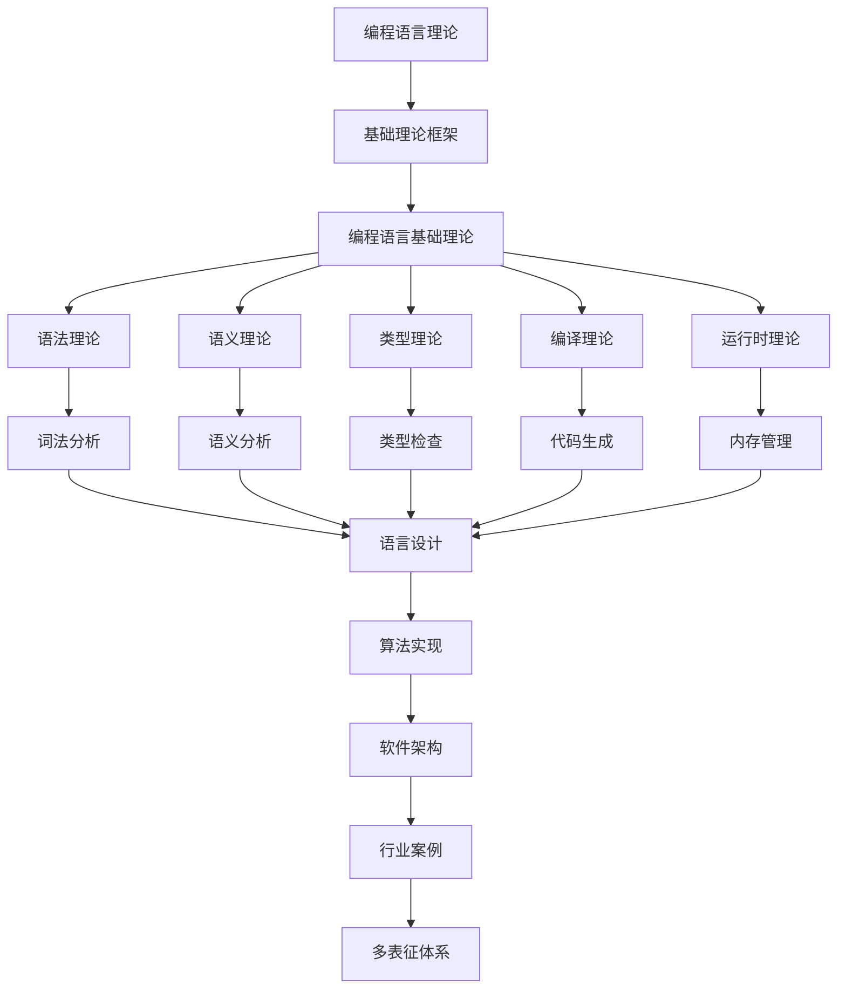

# 2.8-编程语言理论 分支导航

## 📑 目录

- [2.8-编程语言理论 分支导航](#28-编程语言理论-分支导航)
  - [📑 目录](#-目录)
  - [1. 概述](#1-概述)
  - [2. 目录结构与本地跳转](#2-目录结构与本地跳转)
  - [3. 核心概念](#3-核心概念)
    - [3.1. 语法理论](#31-语法理论)
    - [3.2. 语义理论](#32-语义理论)
    - [3.3. 类型理论](#33-类型理论)
    - [3.4. 编译理论](#34-编译理论)
  - [4. 理论基础](#4-理论基础)
    - [4.1. 形式语法](#41-形式语法)
    - [4.2. 形式语义](#42-形式语义)
    - [4.3. 类型系统](#43-类型系统)
  - [5. 应用场景](#5-应用场景)
    - [5.1. 编程语言设计](#51-编程语言设计)
    - [5.2. 编译器开发](#52-编译器开发)
    - [5.3. 程序验证](#53-程序验证)
  - [6. 行业案例与多表征](#6-行业案例与多表征)
    - [6.1. 典型行业案例](#61-典型行业案例)
    - [6.2. 多表征示例](#62-多表征示例)
  - [7. 主题交叉引用](#7-主题交叉引用)
  - [8. 全链路知识流](#8-全链路知识流)
  - [9. 多表征](#9-多表征)
  - [10. 形式化语义](#10-形式化语义)
  - [11. 形式化语法与证明](#11-形式化语法与证明)
  - [12. 工具与实现](#12-工具与实现)
    - [12.1. 编译器工具](#121-编译器工具)
    - [12.2. 语言实现工具](#122-语言实现工具)
    - [12.3. 类型检查工具](#123-类型检查工具)
  - [13. 学习与研究路径](#13-学习与研究路径)
    - [13.1. 基础知识](#131-基础知识)
    - [13.2. 核心理论](#132-核心理论)
    - [13.3. 实践应用](#133-实践应用)
  - [14. 总结](#14-总结)

---

## 1. 概述

编程语言理论（Programming Language Theory）是研究编程语言设计、实现和使用的理论体系。它结合了形式化方法、类型理论、编译理论等多个领域，为编程语言的设计、实现和优化提供了理论基础。

**核心特征**：

1. **语法理论**：研究编程语言的语法结构
2. **语义理论**：研究编程语言的语义定义
3. **类型理论**：研究类型系统和类型检查
4. **编译理论**：研究编译器设计和实现
5. **运行时理论**：研究程序执行和内存管理

**应用领域**：

- 编程语言设计
- 编译器开发
- 程序验证
- 代码优化
- 静态分析
- 语言实现

---

## 2. 目录结构与本地跳转

- [2.8.1-编程语言基础理论](2.8.1-编程语言基础理论.md) - 理论基础文档

---

## 3. 核心概念

### 3.1. 语法理论

语法理论研究编程语言的语法结构，包括词法分析和语法分析。

**词法分析（Lexical Analysis）**：

- 将源代码分解为词法单元（token）
- 识别关键字、标识符、运算符等
- 使用正则表达式和有限自动机

**语法分析（Syntax Analysis）**：

- 将词法单元组织成语法树
- 使用上下文无关文法（CFG）
- 生成抽象语法树（AST）

**语法形式化**：

使用BNF（Backus-Naur Form）或EBNF（Extended BNF）描述语法：

```text
<expression> ::= <term> | <expression> '+' <term>
<term> ::= <factor> | <term> '*' <factor>
<factor> ::= <number> | '(' <expression> ')'
```

### 3.2. 语义理论

语义理论研究编程语言的语义定义，包括操作语义、指称语义和公理语义。

**操作语义（Operational Semantics）**：

- 通过执行规则定义语义
- 小步语义：逐步执行
- 大步语义：直接得到结果

**指称语义（Denotational Semantics）**：

- 将程序映射到数学对象
- 使用域理论
- 支持程序等价性证明

**公理语义（Axiomatic Semantics）**：

- 使用逻辑公式描述程序性质
- Hoare逻辑
- 程序验证

### 3.3. 类型理论

类型理论研究类型系统和类型检查，是编程语言理论的核心。

**类型系统**：

- **静态类型**：编译时类型检查
- **动态类型**：运行时类型检查
- **强类型**：严格的类型规则
- **弱类型**：允许类型转换

**类型检查**：

- **类型推断**：自动推断类型
- **类型推导**：从表达式推导类型
- **多态性**：参数多态、子类型多态

### 3.4. 编译理论

编译理论研究编译器设计和实现，包括词法分析、语法分析、语义分析、代码生成等。

**编译器阶段**：

1. **词法分析**：源代码 → 词法单元
2. **语法分析**：词法单元 → 语法树
3. **语义分析**：语法树 → 语义树
4. **中间代码生成**：语义树 → 中间代码
5. **代码优化**：中间代码优化
6. **目标代码生成**：中间代码 → 目标代码

---

## 4. 理论基础

### 4.1. 形式语法

**上下文无关文法（CFG）**：

文法$G = (V, T, P, S)$，其中：

- $V$：非终结符集合
- $T$：终结符集合
- $P$：产生式集合
- $S$：开始符号

**Chomsky层次结构**：

- **类型0**：无限制文法（图灵机）
- **类型1**：上下文相关文法
- **类型2**：上下文无关文法（下推自动机）
- **类型3**：正则文法（有限自动机）

### 4.2. 形式语义

**操作语义规则**：

小步语义规则：
$$\frac{e_1 \to e_1'}{e_1 + e_2 \to e_1' + e_2}$$

大步语义规则：
$$\frac{e_1 \Downarrow v_1 \quad e_2 \Downarrow v_2}{e_1 + e_2 \Downarrow v_1 + v_2}$$

**指称语义**：

$$\mathcal{D}[\text{while } b \text{ do } c] = \text{fix } F$$

其中$F$是连续函数。

### 4.3. 类型系统

**简单类型λ演算（STLC）**：

类型语法：
$$\tau ::= \text{Bool} \mid \text{Int} \mid \tau \to \tau$$

类型规则：
$$\frac{\Gamma, x:\tau_1 \vdash e:\tau_2}{\Gamma \vdash \lambda x:\tau_1.e:\tau_1 \to \tau_2}$$

---

## 5. 应用场景

### 5.1. 编程语言设计

- 设计新编程语言
- 语言特性设计
- 语法和语义定义
- 类型系统设计

### 5.2. 编译器开发

- 编译器实现
- 代码优化
- 静态分析
- 程序转换

### 5.3. 程序验证

- 程序正确性验证
- 类型安全保证
- 程序等价性证明
- 形式化验证

---

## 6. 行业案例与多表征

### 6.1. 典型行业案例

- **类型系统**：类型理论在编程语言中的应用（详见[2.1-类型理论](../2.1-类型理论/README.md)）
- **算法实现**：编程语言理论在算法实现中的应用（详见[3.3-算法实现](../../../3-数据模型与算法/3.3-算法实现/README.md)）
- **设计模式**：编程语言特性在设计模式中的应用（详见[4.2-设计模式](../../../4-软件架构与工程/4.2-设计模式/README.md)）

### 6.2. 多表征示例

- **符号表征**：语法、语义、类型、操作符、表达式
- **抽象语法树/图结构**：AST、依赖图、控制流图、数据流图
- **向量/张量**：语法嵌入、特征向量、代码嵌入
- **自然语言**：定义、注释、描述、规范文档
- **图像/可视化**：语法结构图、流程图、类型关系图

---

## 7. 主题交叉引用

| 主题      | 基础理论 | 形式化模型 | 应用场景 | 算法实现 | 行业案例 | 多表征 |
|-----------|----------|------------|----------|----------|----------|--------|
| 编程语言基础理论| ✅ | ✅       | ✅     | ✅     | ✅     | ✅   |

**交叉引用**：

- [2.1-类型理论](../2.1-类型理论/README.md)：类型系统理论
- [3.3-算法实现](../../../3-数据模型与算法/3.3-算法实现/README.md)：算法实现
- [4.2-设计模式](../../../4-软件架构与工程/4.2-设计模式/README.md)：设计模式
- [2.2-自动机理论](../2.2-自动机理论/README.md)：自动机在编译中的应用

---

## 8. 全链路知识流



---

## 9. 多表征

本分支支持多种表征方式，包括：

- **符号表征**：语法、语义、类型、操作符、表达式、语句等
- **抽象语法树/图结构**：AST、依赖图、控制流图、数据流图、类型关系图等
- **向量/张量**：语法嵌入、特征向量、代码嵌入、语义向量
- **自然语言**：定义、注释、描述、规范文档、设计文档
- **图像/可视化**：语法结构图、流程图、类型关系图、编译器结构图

这些表征可互映，提升编程语言理论表达力。

---

## 10. 形式化语义

**语义域**：$D$，包括：

- 语法结构集：$\mathcal{S}$（所有可能的语法结构）
- 类型集：$\mathcal{T}$（所有可能的类型）
- 值域：$\mathcal{V}$（所有可能的值）
- 环境：$\mathcal{E} = \text{Var} \to \mathcal{V}$（变量到值的映射）
- 语义函数：$\mathcal{D}: \mathcal{S} \to \mathcal{E} \to \mathcal{V}$

**解释函数**：$I: \mathcal{L} \to D$，将编程语言规范映射到语义对象：

- $I(\text{expression}) \in \mathcal{S}$：表达式的解释
- $I(\text{type}) \in \mathcal{T}$：类型的解释
- $I(\text{value}) \in \mathcal{V}$：值的解释
- $I(\text{program}) = \mathcal{D}$：程序的语义解释

**语义一致性**：每个编程语言结构/表达式/类型在$D$中有明确定义，满足：

- **类型安全**：类型系统保证类型安全
- **语义确定性**：程序有确定的语义
- **组合性**：复合结构的语义由组成部分的语义组合

---

## 11. 形式化语法与证明

**语法规则**：

编程语言的产生式：

- **表达式语法**：$e ::= x \mid n \mid e_1 + e_2 \mid \lambda x.e \mid e_1 e_2$
- **类型语法**：$\tau ::= \text{Int} \mid \text{Bool} \mid \tau_1 \to \tau_2$
- **语句语法**：$s ::= x := e \mid \text{if } e \text{ then } s_1 \text{ else } s_2 \mid \text{while } e \text{ do } s$

**推理规则**：

类型系统的推理规则：

- **变量规则**：$\frac{x:\tau \in \Gamma}{\Gamma \vdash x:\tau}$
- **应用规则**：$\frac{\Gamma \vdash e_1:\tau_1 \to \tau_2 \quad \Gamma \vdash e_2:\tau_1}{\Gamma \vdash e_1 e_2:\tau_2}$
- **抽象规则**：$\frac{\Gamma, x:\tau_1 \vdash e:\tau_2}{\Gamma \vdash \lambda x.e:\tau_1 \to \tau_2}$

**定理**：编程语言理论分支的语法系统具一致性与可扩展性。

**证明**：由语法产生式、类型规则与推理规则递归定义，保证系统一致与可扩展。具体证明包括：

1. 语法系统的递归定义保证可判定性
2. 类型系统的类型安全定理
3. 语义解释的一致性保证可靠性
4. 程序等价性证明

---

## 12. 工具与实现

### 12.1. 编译器工具

**主流编译器**：

1. **GCC**：
   - GNU编译器集合
   - 支持多种语言
   - 广泛使用

2. **LLVM**：
   - 模块化编译器框架
   - 支持多种语言
   - 代码优化

3. **Rust编译器**：
   - Rust语言编译器
   - 类型安全保证
   - 内存安全

### 12.2. 语言实现工具

**解析器生成器**：

1. **Yacc/Bison**：
   - 语法分析器生成器
   - 支持LALR(1)文法
   - 广泛使用

2. **ANTLR**：
   - 解析器生成器
   - 支持多种文法
   - 易于使用

3. **Parser Combinators**：
   - 函数式解析器组合子
   - Haskell、Rust等语言支持
   - 灵活强大

### 12.3. 类型检查工具

**类型检查器**：

1. **TypeScript**：
   - JavaScript的类型检查器
   - 渐进式类型系统
   - 广泛使用

2. **MyPy**：
   - Python的类型检查器
   - 静态类型检查
   - 类型注解

3. **Flow**：
   - JavaScript的类型检查器
   - Facebook开发
   - 类型推断

---

## 13. 学习与研究路径

### 13.1. 基础知识

1. **数学基础**：
   - 离散数学
   - 逻辑学
   - 集合论
   - 图论

2. **计算机科学基础**：
   - 数据结构与算法
   - 计算理论
   - 自动机理论
   - 形式化方法

### 13.2. 核心理论

1. **语法理论**：
   - 形式语法
   - 词法分析
   - 语法分析
   - 解析器设计

2. **语义理论**：
   - 操作语义
   - 指称语义
   - 公理语义
   - 程序验证

3. **类型理论**：
   - 类型系统
   - 类型检查
   - 类型推断
   - 多态性

### 13.3. 实践应用

1. **语言设计**：
   - 设计新编程语言
   - 语言特性设计
   - 语法和语义定义

2. **编译器开发**：
   - 实现编译器
   - 代码优化
   - 静态分析

3. **研究前沿**：
   - 依赖类型
   - 线性类型
   - 并发编程语言
   - 量子编程语言

---

## 14. 总结

编程语言理论是计算机科学的核心理论之一，为编程语言的设计、实现和使用提供了理论基础。从语法理论到语义理论，从类型系统到编译理论，编程语言理论涵盖了编程语言的各个方面。

**核心价值**：

1. **语言设计**：为编程语言设计提供理论基础
2. **编译器开发**：为编译器实现提供方法
3. **程序验证**：为程序正确性验证提供工具
4. **代码优化**：为代码优化提供技术

**应用前景**：

随着编程语言的发展和新需求的出现，编程语言理论将继续发展，为更强大、更安全、更易用的编程语言提供支持。特别是在类型系统、并发编程、程序验证等领域，编程语言理论将发挥越来越重要的作用。

---

## 深入学习建议

### 理论基础强化

**数学基础**：

- **逻辑学**：命题逻辑、谓词逻辑
- **集合论**：集合、关系、函数
- **范畴论**：范畴、函子、自然变换
- **代数**：群、环、域

**计算机科学基础**：

- **计算理论**：可计算性、复杂度理论
- **形式化方法**：形式化验证
- **类型理论**：类型系统、类型检查
- **编译器设计**：编译器原理

### 实践能力提升

**编程能力**：

- **多语言编程**：函数式、命令式、逻辑式语言
- **编译器开发**：编译器实现
- **类型系统**：类型系统实现
- **形式化工具**：形式化验证工具

**工具使用**：

- **编译器工具**：编译器工具链
- **类型检查器**：类型检查工具
- **形式化工具**：形式化验证工具
- **性能分析**：性能分析工具

---

## 学习资源汇总

### 在线课程

- **Coursera**：编程语言课程
- **edX**：编译器设计课程
- **Udemy**：编程语言实现课程
- **YouTube**：编程语言教程

### 书籍推荐

- **入门书籍**：《程序设计语言：实践之路》
- **进阶书籍**：《Types and Programming Languages》
- **应用书籍**：《编译器设计》
- **工具书籍**：《LLVM教程》

### 学术资源

- **期刊**：ACM TOPLAS、Journal of Functional Programming
- **会议**：POPL、PLDI、ICFP
- **数据库**：IEEE Xplore、ACM Digital Library
- **预印本**：arXiv、ResearchGate

---

## 实践项目建议

### 基础项目

- **解释器实现**：简单语言解释器
- **类型检查器**：类型检查器实现
- **语法分析**：语法分析器实现
- **代码生成**：代码生成器实现

### 进阶项目

- **编译器实现**：完整编译器实现
- **类型系统**：类型系统实现
- **优化器**：编译器优化器
- **语言设计**：新语言设计

### 高级项目

- **高级语言特性**：高级语言特性实现
- **并行编译器**：并行编译器实现
- **形式化编译器**：形式化验证的编译器
- **语言工具**：语言工具开发

---

## 职业发展路径

### 学术研究

- **研究方向**：编程语言、编译器、类型系统
- **职业路径**：博士研究、博士后、教职、研究机构

### 工业应用

- **应用领域**：编译器开发、语言设计、工具开发
- **职业路径**：编译器工程师、语言设计师、工具开发者

---

[返回形式科学理论总导航](../README.md)
