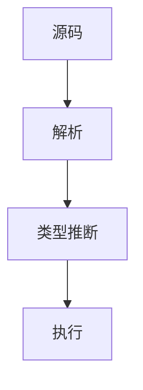

# 2.8 编程语言理论 主题导航与多表征案例（增强版）

## 目录结构与本地跳转

- [2.8.1 编程语言基础理论](./2.8.1-编程语言基础理论.md)
- [2.8.2 语法与文法](./2.8.2-语法与文法.md)
- [2.8.3 语义理论](./2.8.3-语义理论.md)
- [2.8.4 类型系统](./2.8.4-类型系统.md)
- [2.8.5 抽象解释与静态分析](./2.8.5-抽象解释与静态分析.md)
- [2.8.6 领域特定语言DSL](./2.8.6-领域特定语言DSL.md)

---

## 行业案例与多表征

### 2.8.x 典型行业案例

- 金融合约DSL：安全性与可验证性（详见5.1-金融数据分析、2.1-类型理论）
- AI推理系统：领域特定语言与自动推理（详见3.4-AI与机器学习算法）
- 编译器设计：语法分析、类型检查与优化（详见2.2-自动机理论、2.1-类型理论）

### 2.8.x 多表征示例

- 语法树、类型推断流程图、DSL结构图、抽象解释流程、代码片段等

---

[返回形式科学理论导航](../README.md)
