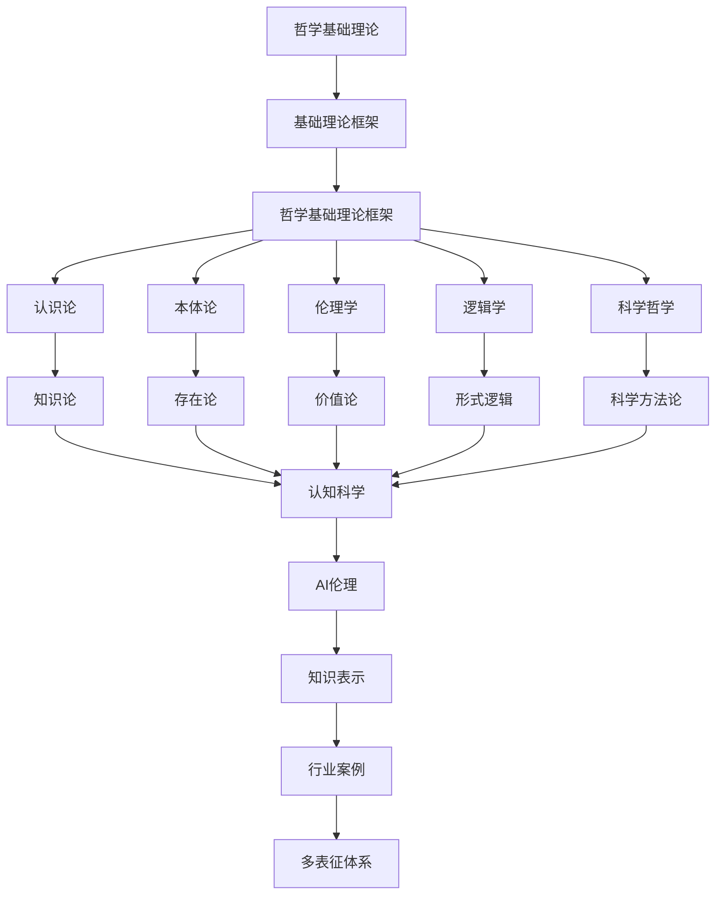

# 2.9-哲学基础理论 分支导航

## 目录结构与本地跳转
- [2.9.1-哲学基础理论框架](2.9.1-哲学基础理论框架.md) - 预留分支

---

## 主题交叉引用
| 主题      | 基础理论 | 形式化模型 | 应用场景 | 算法实现 | 行业案例 | 多表征 |
|-----------|----------|------------|----------|----------|----------|--------|
| 哲学基础理论框架| 预留 | 预留       | 预留     | 预留     | 预留     | 预留   |

- 交叉引用：[2.7-数学基础理论](../2.7-数学基础理论/README.md)、[3.4-AI与机器学习算法](../../../3-数据模型与算法/3.4-AI与机器学习算法/README.md)、[6.1-知识表示](../../../6-知识图谱与可视化/6.1-知识表示/README.md)

---

## 全链路知识流（Mermaid流程图）

---

[返回形式科学理论总导航](../README.md)
