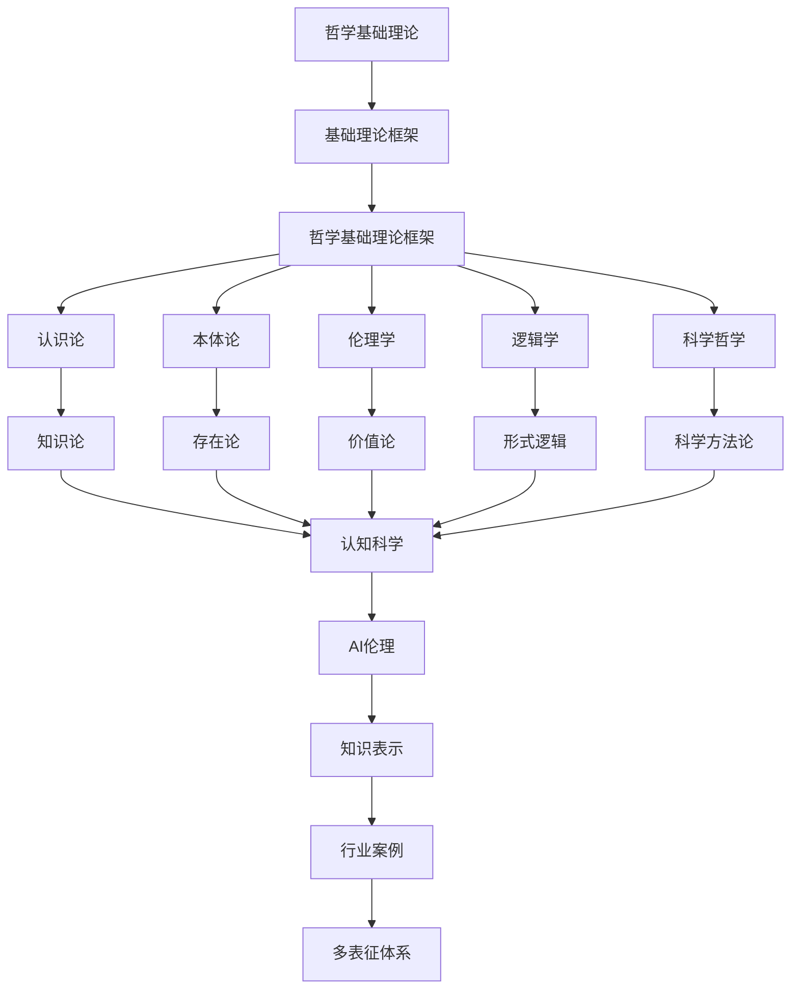

# 2.9-哲学基础理论 分支导航

## 目录结构与本地跳转

- [2.9.1-哲学基础理论框架](2.9.1-哲学基础理论框架.md) - 预留分支

---

## 主题交叉引用

| 主题      | 基础理论 | 形式化模型 | 应用场景 | 算法实现 | 行业案例 | 多表征 |
|-----------|----------|------------|----------|----------|----------|--------|
| 哲学基础理论框架| 预留 | 预留       | 预留     | 预留     | 预留     | 预留   |

- 交叉引用：[2.7-数学基础理论](../2.7-数学基础理论/README.md)、[3.4-AI与机器学习算法](../../../3-数据模型与算法/3.4-AI与机器学习算法/README.md)、[6.1-知识表示](../../../6-知识图谱与可视化/6.1-知识表示/README.md)

---

## 全链路知识流（Mermaid流程图）

---

[返回形式科学理论总导航](../README.md)

## 多表征

哲学基础理论分支支持多种表征方式，包括：

- 概念符号、命题逻辑
- 哲学关系图/语义网络
- 向量/张量（哲学概念嵌入）
- 自然语言与可视化
这些表征可互映，提升哲学理论的表达力。

## 形式化语义

- 语义域：$D$，如哲学概念集、命题集、关系集
- 解释函数：$I: S \to D$，将符号/结构映射到哲学语义对象
- 语义一致性：每个哲学结构/公式在$D$中有明确定义

## 形式化语法与证明

- 语法规则：如命题产生式、推理规则、关系约束
- **定理**：哲学基础理论分支的语法系统具一致性与可扩展性。
- **证明**：由命题产生式与推理规则递归定义，保证系统一致与可扩展。
