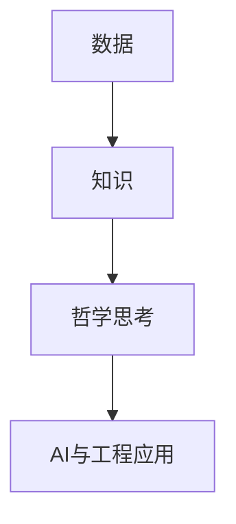

# 2.9 哲学基础理论 主题导航与多表征案例

## 目录结构与本地跳转

- [2.9.1 哲学基础理论框架](./2.9.1-哲学基础理论框架.md)

---

## 行业案例与多表征

### 2.9.x 典型行业案例

- 数据科学哲学：数据定义、知识论与AI伦理（详见3.1-基础理论、3.4-AI与机器学习算法、5.3-机器学习）
- 形式科学与工程：形式化方法的哲学基础（详见2.1-类型理论、2.3-Petri网理论、4.1-软件架构基础理论）

### 2.9.x 多表征示例

- 哲学概念图、知识图谱、推理流程图、Latex公式等

---

[返回形式科学理论导航](../README.md)
