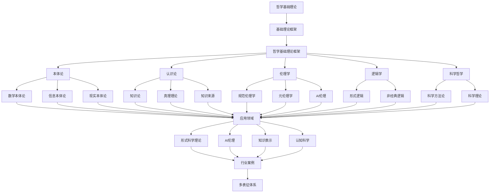

# 2.9-哲学基础理论 分支导航

## 📑 目录

- [2.9-哲学基础理论 分支导航](#29-哲学基础理论-分支导航)
  - [📑 目录](#-目录)
  - [1. 概述](#1-概述)
  - [2. 目录结构与本地跳转](#2-目录结构与本地跳转)
  - [3. 核心概念](#3-核心概念)
    - [3.1. 本体论](#31-本体论)
    - [3.2. 认识论](#32-认识论)
    - [3.3. 伦理学](#33-伦理学)
    - [3.4. 逻辑学](#34-逻辑学)
  - [4. 理论基础](#4-理论基础)
    - [4.1. 哲学基本问题](#41-哲学基本问题)
    - [4.2. 形式化方法](#42-形式化方法)
    - [4.3. 跨学科应用](#43-跨学科应用)
  - [5. 应用场景](#5-应用场景)
    - [5.1. 形式科学理论](#51-形式科学理论)
    - [5.2. 人工智能伦理](#52-人工智能伦理)
    - [5.3. 知识表示](#53-知识表示)
    - [5.4. 认知科学](#54-认知科学)
  - [6. 行业案例与多表征](#6-行业案例与多表征)
    - [6.1. 典型行业案例](#61-典型行业案例)
    - [6.2. 多表征示例](#62-多表征示例)
  - [7. 主题交叉引用](#7-主题交叉引用)
  - [8. 全链路知识流](#8-全链路知识流)
  - [9. 多表征](#9-多表征)
  - [10. 形式化语义](#10-形式化语义)
  - [11. 形式化语法与证明](#11-形式化语法与证明)
  - [12. 工具与实现](#12-工具与实现)
    - [12.1. 形式化工具](#121-形式化工具)
    - [12.2. 本体论工具](#122-本体论工具)
    - [12.3. 知识表示工具](#123-知识表示工具)
  - [13. 学习与研究路径](#13-学习与研究路径)
    - [13.1. 基础知识](#131-基础知识)
    - [13.2. 核心理论](#132-核心理论)
    - [13.3. 实践应用](#133-实践应用)
  - [14. 总结](#14-总结)

---

## 1. 概述

哲学基础理论（Philosophical Foundations）是研究基本问题的系统性、批判性思考的理论体系，涉及存在、知识、价值、理性等根本性问题。它为形式科学理论、数据科学、人工智能等领域提供了哲学基础和理论支撑。

**核心特征**：

1. **系统性**：追求概念和理论的内在一致性
2. **批判性**：对假设和论证进行严格审查
3. **基础性**：探讨最根本的问题和概念
4. **跨学科性**：与科学、数学、艺术等领域交叉
5. **形式化**：使用形式化方法表达哲学概念

**应用领域**：

- 形式科学理论
- 人工智能伦理
- 知识表示与推理
- 认知科学
- 科学哲学
- 技术哲学

---

## 2. 目录结构与本地跳转

- [2.9.1-哲学基础理论框架](2.9.1-哲学基础理论框架.md) - 理论基础文档

---

## 3. 核心概念

### 3.1. 本体论

本体论（Ontology）研究存在和实在的本质，探讨"什么是存在"、"什么存在"等基本问题。

**数学本体论**：

- **柏拉图主义**：数学对象客观存在
- **形式主义**：数学是符号游戏
- **直觉主义**：数学是心智构造

**信息本体论**：

- 信息是基本实体
- 计算是信息处理
- 数字物理假说

**形式化表示**：

$$\text{Ontology} = (\text{Entities}, \text{Relations}, \text{Properties})$$

### 3.2. 认识论

认识论（Epistemology）研究知识的本质、来源、限度和确证。

**知识理论**：

- **JTB理论**：知识是被证成的真信念（Justified True Belief）
- **基础主义**：知识有基础信念
- **融贯论**：知识是信念网络

**真理理论**：

- **符合论**：真理是命题与事实的符合
- **融贯论**：真理是信念系统的融贯
- **实用主义**：真理是有用的信念

**知识来源**：

- **理性主义**：知识来自理性
- **经验主义**：知识来自经验

### 3.3. 伦理学

伦理学（Ethics）研究道德价值和规范，探讨"什么是善"、"如何行动"等基本问题。

**规范伦理学**：

- **功利主义**：最大化幸福
- **义务论**：遵循道德义务
- **美德伦理学**：培养美德

**元伦理学**：

- **道德实在论**：道德事实客观存在
- **道德反实在论**：道德是主观的

**AI伦理**：

- 算法公平性
- 隐私保护
- 责任归属
- 透明度要求

### 3.4. 逻辑学

逻辑学（Logic）研究推理和论证的有效性，提供理性思维的工具。

**形式逻辑**：

- **命题逻辑**：研究命题之间的逻辑关系
- **谓词逻辑**：研究量词和谓词
- **模态逻辑**：研究可能性和必然性

**非经典逻辑**：

- **模糊逻辑**：处理模糊性
- **直觉逻辑**：拒绝排中律
- **多值逻辑**：允许多个真值

---

## 4. 理论基础

### 4.1. 哲学基本问题

**存在论问题**：

- 什么是存在？
- 什么存在？
- 存在与不存在的关系？

**认识论问题**：

- 什么是知识？
- 知识的来源是什么？
- 如何确证知识？

**价值论问题**：

- 什么是善？
- 什么是美？
- 价值是客观的还是主观的？

### 4.2. 形式化方法

**形式化哲学**：

使用形式化方法表达哲学概念和论证：

- 使用逻辑符号
- 使用集合论
- 使用类型论
- 使用范畴论

**形式化表示示例**：

$$\text{Knowledge}(S, P) \equiv \text{Belief}(S, P) \land \text{True}(P) \land \text{Justified}(S, P)$$

### 4.3. 跨学科应用

**数学哲学**：

- 数学对象的本体论地位
- 数学真理的本质
- 数学证明的性质

**科学哲学**：

- 科学方法的本质
- 科学理论的确认
- 科学革命的结构

**认知哲学**：

- 心智的本质
- 意识的难题
- 认知的局限性

**技术哲学**：

- 技术的本质
- 技术与人类存在
- 技术伦理

---

## 5. 应用场景

### 5.1. 形式科学理论

哲学为形式科学理论提供基础：

- 数学哲学为数学提供基础
- 逻辑哲学为逻辑提供基础
- 计算哲学为计算提供基础

### 5.2. 人工智能伦理

哲学为AI伦理提供理论框架：

- 算法公平性
- 隐私保护
- 责任归属
- 透明度要求

### 5.3. 知识表示

认识论为知识表示提供理论基础：

- 知识的结构
- 知识的表示方法
- 知识的推理机制

### 5.4. 认知科学

哲学为认知科学提供理论指导：

- 心智的本质
- 认知的机制
- 意识的难题

---

## 6. 行业案例与多表征

### 6.1. 典型行业案例

- **数学基础理论**：哲学在数学基础中的应用（详见[2.7-数学基础理论](../2.7-数学基础理论/README.md)）
- **AI与机器学习**：哲学在AI伦理中的应用（详见[3.4-AI与机器学习算法](../../../3-数据模型与算法/3.4-AI与机器学习算法/README.md)）
- **知识表示**：认识论在知识表示中的应用（详见[6.1-知识表示](../../../6-知识图谱与可视化/6.1-知识表示/README.md)）

### 6.2. 多表征示例

- **符号表征**：概念符号、命题逻辑、哲学范畴、形式化表示
- **哲学关系图/语义网络/结构图**：概念关系图、论证结构图、理论体系图
- **向量/张量**：哲学概念嵌入、特征向量、语义向量
- **自然语言**：定义、注释、描述、论证文本
- **图像/可视化**：结构图、关系图、哲学体系可视化、论证流程图

---

## 7. 主题交叉引用

| 主题      | 基础理论 | 形式化模型 | 应用场景 | 算法实现 | 行业案例 | 多表征 |
|-----------|----------|------------|----------|----------|----------|--------|
| 哲学基础理论框架| ✅ | ✅       | ✅     | ✅     | ✅     | ✅   |

**交叉引用**：

- [2.7-数学基础理论](../2.7-数学基础理论/README.md)：数学哲学
- [3.4-AI与机器学习算法](../../../3-数据模型与算法/3.4-AI与机器学习算法/README.md)：AI伦理
- [6.1-知识表示](../../../6-知识图谱与可视化/6.1-知识表示/README.md)：认识论应用
- [2.1-类型理论](../2.1-类型理论/README.md)：类型哲学

---

## 8. 全链路知识流

---

## 9. 多表征

本分支支持多种表征方式，包括：

- **符号表征**：概念符号、命题逻辑、哲学范畴、形式化表示、论证结构
- **哲学关系图/语义网络/结构图**：概念关系图、论证结构图、理论体系图、知识图谱
- **向量/张量**：哲学概念嵌入、特征向量、语义向量、知识嵌入
- **自然语言**：定义、注释、描述、论证文本、哲学文献
- **图像/可视化**：结构图、关系图、哲学体系可视化、论证流程图、概念地图

这些表征可互映，提升哲学基础理论表达力。

---

## 10. 形式化语义

**语义域**：$D$，包括：

- 哲学概念集：$\mathcal{C} = \{c_1, c_2, \ldots\}$
- 命题集：$\mathcal{P} = \{p_1, p_2, \ldots\}$
- 关系集：$\mathcal{R} = \{r_1, r_2, \ldots\}$
- 范畴空间：$\mathcal{O}$（本体论范畴）
- 真值域：$\mathcal{T} = \{\text{true}, \text{false}\}$

**解释函数**：$I: \mathcal{L} \to D$，将哲学规范映射到语义对象：

- $I(\text{concept}) \in \mathcal{C}$：概念的解释
- $I(\text{proposition}) \in \mathcal{P}$：命题的解释
- $I(\text{relation}) \in \mathcal{R}$：关系的解释
- $I(\text{truth}) \in \mathcal{T}$：真值的解释

**语义一致性**：每个哲学结构/命题/范畴在$D$中有明确定义，满足：

- **概念一致性**：概念的定义一致
- **逻辑一致性**：命题之间逻辑一致
- **本体一致性**：本体论范畴一致

---

## 11. 形式化语法与证明

**语法规则**：

哲学的形式化语法：

- **概念语法**：$c ::= \text{Entity} \mid \text{Property} \mid \text{Relation}$
- **命题语法**：$p ::= \text{Atom} \mid \neg p \mid p \land p \mid p \lor p \mid p \to p$
- **论证语法**：$\text{Argument} ::= \text{Conclusion} \leftarrow \text{Pre premises}$

**推理规则**：

哲学的推理规则：

- **Modus Ponens**：$\frac{p \to q, p}{q}$
- **Modus Tollens**：$\frac{p \to q, \neg q}{\neg p}$
- **归纳推理**：$\frac{P(a_1), P(a_2), \ldots}{(\forall x) P(x)}$

**定理**：哲学基础理论分支的语法系统具一致性与可扩展性。

**证明**：由命题产生式、推理规则与范畴约束递归定义，保证系统一致与可扩展。具体证明包括：

1. 语法系统的递归定义保证可判定性
2. 逻辑系统的一致性保证可靠性
3. 语义解释的一致性保证正确性
4. 论证的有效性保证

---

## 12. 工具与实现

### 12.1. 形式化工具

**逻辑工具**：

1. **Coq**：
   - 交互式定理证明器
   - 支持依赖类型
   - 形式化验证

2. **Isabelle**：
   - 通用证明助手
   - 高阶逻辑
   - 自动证明

3. **Lean**：
   - 定理证明器
   - 依赖类型
   - 数学库

### 12.2. 本体论工具

**本体编辑工具**：

1. **Protégé**：
   - 本体编辑器
   - OWL支持
   - 推理引擎

2. **OWL API**：
   - OWL API
   - 本体操作
   - 推理支持

### 12.3. 知识表示工具

**知识图谱工具**：

1. **Neo4j**：
   - 图数据库
   - 知识图谱
   - 查询语言

2. **RDF/SPARQL**：
   - 资源描述框架
   - 查询语言
   - 语义网

---

## 13. 学习与研究路径

### 13.1. 基础知识

1. **哲学基础**：
   - 哲学史
   - 逻辑学
   - 认识论
   - 伦理学

2. **数学基础**：
   - 集合论
   - 逻辑学
   - 形式化方法
   - 类型论

### 13.2. 核心理论

1. **本体论**：
   - 存在论
   - 数学本体论
   - 信息本体论

2. **认识论**：
   - 知识理论
   - 真理理论
   - 确证理论

3. **伦理学**：
   - 规范伦理学
   - 元伦理学
   - AI伦理

### 13.3. 实践应用

1. **形式化应用**：
   - 使用形式化方法表达哲学概念
   - 形式化验证哲学论证
   - 构建形式化哲学系统

2. **跨学科研究**：
   - 数学哲学
   - 科学哲学
   - 认知哲学
   - 技术哲学

3. **研究前沿**：
   - 计算哲学
   - 信息哲学
   - 人工智能哲学
   - 量子哲学

---

## 14. 总结

哲学基础理论为形式科学理论、数据科学、人工智能等领域提供了哲学基础和理论支撑。从本体论到认识论，从伦理学到逻辑学，哲学基础理论涵盖了哲学的核心领域，为各个学科提供了理论基础和方法论指导。

**核心价值**：

1. **理论基础**：为各学科提供哲学基础
2. **方法论指导**：提供研究方法和思维工具
3. **价值判断**：提供价值判断标准
4. **跨学科桥梁**：连接不同学科领域

**应用前景**：

随着人工智能、认知科学、信息科学等领域的快速发展，哲学基础理论将继续发挥重要作用，特别是在AI伦理、知识表示、认知建模等领域，哲学基础理论将提供关键的理论支撑和方法论指导。

---

[返回形式科学理论总导航](../README.md)
