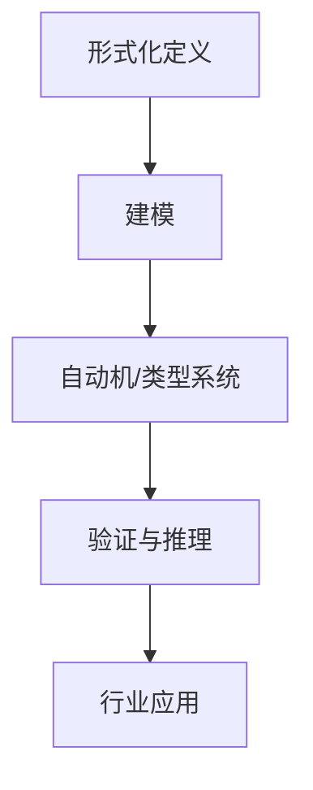

# 形式科学理论

## 概述

形式科学理论是研究形式系统的科学，包括数学、逻辑学、理论计算机科学、信息论、系统理论、决策理论、统计学等。形式科学使用形式语言来表达思想，使用形式推理来获得结论。本目录下整理了与数据科学密切相关的几个重要形式科学理论分支。

## 内容结构

### 1. 类型理论

类型理论是一种形式化的数学理论，用于研究类型系统，它是程序语言设计和验证的基础。

- [基础类型理论](2.1-类型理论/2.1.1-基础类型理论.md) - 介绍类型理论的基本概念、简单类型λ演算、依赖类型等
- [线性类型理论](2.1-类型理论/2.1.2-线性类型理论.md) - 探讨资源敏感的线性逻辑和线性类型系统

### 2. 自动机理论

自动机理论研究抽象计算机和可计算性问题，是形式语言理论的基础。

- [自动机理论基础](2.2-自动机理论/2.2.1-自动机理论基础.md) - 介绍有限自动机、下推自动机、图灵机等概念

### 3. Petri网理论

Petri网是一种图形化的数学建模工具，特别适用于描述和研究分布式系统。

- [Petri网理论基础](2.3-Petri网理论/2.3.1-Petri网理论基础.md) - 介绍Petri网的基本概念、性质和应用

### 4. 时态逻辑控制理论

时态逻辑控制理论结合了时态逻辑和控制理论，用于形式化验证和合成具有时间属性的系统。

- [时态逻辑控制理论基础](2.4-时态逻辑控制理论/2.4.1-时态逻辑控制理论基础.md) - 介绍线性时态逻辑、计算树逻辑等概念及其在控制中的应用

### 5. 分布式系统理论

分布式系统理论研究由多个独立计算节点组成的系统，这些节点通过消息传递进行通信和协调。

- [分布式系统理论基础](2.5-分布式系统理论/2.5.1-分布式系统理论基础.md) - 介绍分布式系统的基本概念、一致性模型、共识算法等

### 6. 控制理论

控制理论是研究动态系统行为调节和优化的数学理论，广泛应用于工程、生物学、经济学和社会科学等领域。

- [控制理论基础](2.6-控制理论/2.6.1-控制理论基础.md) - 介绍控制系统的基本概念、线性控制系统理论、现代控制理论、非线性控制理论等

## 关联与应用

这些形式科学理论在数据科学中有广泛的应用：

1. **类型理论** 为编程语言设计和数据模型提供理论基础
2. **自动机理论** 用于文本处理、编译器设计和模式识别
3. **Petri网理论** 应用于工作流管理、业务流程建模和并发系统分析
4. **时态逻辑控制理论** 用于实时系统验证和合成
5. **分布式系统理论** 为大规模数据处理和分布式数据库提供理论支持
6. **控制理论** 在机器学习、优化算法、反馈系统和自适应系统中有重要应用

## 学习路径

1. 首先了解基础类型理论，掌握类型系统的基本概念
2. 学习自动机理论，理解形式语言和计算模型
3. 深入Petri网理论，学习并发和分布式系统的建模方法
4. 探索时态逻辑控制理论，了解形式化验证的方法
5. 研究分布式系统理论，掌握分布式算法和一致性模型
6. 学习控制理论，理解系统动态行为的调节和优化方法

## 参考资源

- Pierce, B. C. (2002). Types and Programming Languages. MIT Press.
- Hopcroft, J. E., Motwani, R., & Ullman, J. D. (2006). Introduction to Automata Theory, Languages, and Computation. Pearson.
- Reisig, W. (2013). Understanding Petri Nets: Modeling Techniques, Analysis Methods, Case Studies. Springer.
- Baier, C., & Katoen, J. P. (2008). Principles of Model Checking. MIT Press.
- Lynch, N. A. (1996). Distributed Algorithms. Morgan Kaufmann.
- Åström, K. J., & Murray, R. M. (2010). Feedback Systems: An Introduction for Scientists and Engineers. Princeton University Press.

---

*本目录将作为形式科学理论体系的核心，为软件工程和系统设计提供坚实的理论基础。*

# 2 形式科学理论 主题导航与多表征案例

## 目录结构与本地跳转

- [2.1 类型理论](./2.1-类型理论/README.md)
- [2.2 自动机理论](./2.2-自动机理论/README.md)
- [2.3 Petri网理论](./2.3-Petri网理论/README.md)
- [2.4 时态逻辑控制理论](./2.4-时态逻辑控制理论/README.md)
- [2.5 分布式系统理论](./2.5-分布式系统理论/README.md)
- [2.6 控制理论](./2.6-控制理论/README.md)
- [2.7 数学基础理论](./2.7-数学基础理论/README.md)
- [2.8 编程语言理论](./2.8-编程语言理论/README.md)
- [2.9 哲学基础理论](./2.9-哲学基础理论/README.md)

---

## 行业案例与多表征

### 2.x 典型行业案例

- 金融建模：形式化方法在风险建模、合规验证中的应用（详见5.1-金融数据分析、3.2-形式化模型）
- 分布式系统：一致性协议与自动机理论（详见2.5-分布式系统理论、3.3.3-并发控制算法）
- 控制系统：时态逻辑与Petri网在工业自动化中的应用（详见2.4-时态逻辑控制理论、2.3-Petri网理论、4.5-WorkflowDomain）
- AI理论：类型理论与编程语言在AI推理系统中的作用（详见3.4-AI与机器学习算法、2.8-编程语言理论）

### 2.x 多表征示例

- 形式化推理流程图、自动机状态图、Petri网结构图、Latex公式、知识图谱等

---

[返回数据分析与ETL](../3-数据模型与算法/3.5-数据分析与ETL/README.md)
