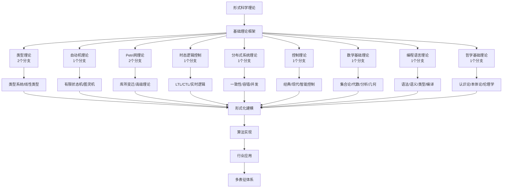
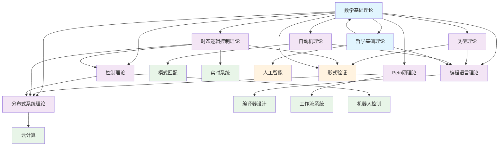

# 形式科学理论

## 概述

形式科学理论是研究形式系统的科学，包括数学、逻辑学、理论计算机科学、信息论、系统理论、决策理论、统计学等。形式科学使用形式语言来表达思想，使用形式推理来获得结论。本目录下整理了与数据科学密切相关的几个重要形式科学理论分支。

## 内容结构

### 1. 类型理论

类型理论是一种形式化的数学理论，用于研究类型系统，它是程序语言设计和验证的基础。

- [基础类型理论](2.1-类型理论/2.1.1-基础类型理论.md) - 介绍类型理论的基本概念、简单类型λ演算、依赖类型等
- [线性类型理论](2.1-类型理论/2.1.2-线性类型理论.md) - 探讨资源敏感的线性逻辑和线性类型系统

### 2. 自动机理论

自动机理论研究抽象计算机和可计算性问题，是形式语言理论的基础。

- [自动机理论基础](2.2-自动机理论/2.2.1-自动机理论基础.md) - 介绍有限自动机、下推自动机、图灵机等概念

### 3. Petri网理论

Petri网是一种图形化的数学建模工具，特别适用于描述和研究分布式系统。

- [Petri网理论基础](2.3-Petri网理论/2.3.1-Petri网理论基础.md) - 介绍Petri网的基本概念、性质和应用

### 4. 时态逻辑控制理论

时态逻辑控制理论结合了时态逻辑和控制理论，用于形式化验证和合成具有时间属性的系统。

- [时态逻辑控制理论基础](2.4-时态逻辑控制理论/2.4.1-时态逻辑控制理论基础.md) - 介绍线性时态逻辑、计算树逻辑等概念及其在控制中的应用

### 5. 分布式系统理论

分布式系统理论研究由多个独立计算节点组成的系统，这些节点通过消息传递进行通信和协调。

- [分布式系统理论基础](2.5-分布式系统理论/2.5.1-分布式系统理论基础.md) - 介绍分布式系统的基本概念、一致性模型、共识算法等

### 6. 控制理论

控制理论是研究动态系统行为调节和优化的数学理论，广泛应用于工程、生物学、经济学和社会科学等领域。

- [控制理论基础](2.6-控制理论/2.6.1-控制理论基础.md) - 介绍控制系统的基本概念、线性控制系统理论、现代控制理论、非线性控制理论等

## 关联与应用

这些形式科学理论在数据科学中有广泛的应用：

1. **类型理论** 为编程语言设计和数据模型提供理论基础
2. **自动机理论** 用于文本处理、编译器设计和模式识别
3. **Petri网理论** 应用于工作流管理、业务流程建模和并发系统分析
4. **时态逻辑控制理论** 用于实时系统验证和合成
5. **分布式系统理论** 为大规模数据处理和分布式数据库提供理论支持
6. **控制理论** 在机器学习、优化算法、反馈系统和自适应系统中有重要应用

## 学习路径

1. 首先了解基础类型理论，掌握类型系统的基本概念
2. 学习自动机理论，理解形式语言和计算模型
3. 深入Petri网理论，学习并发和分布式系统的建模方法
4. 探索时态逻辑控制理论，了解形式化验证的方法
5. 研究分布式系统理论，掌握分布式算法和一致性模型
6. 学习控制理论，理解系统动态行为的调节和优化方法

## 参考资源

- Pierce, B. C. (2002). Types and Programming Languages. MIT Press.
- Hopcroft, J. E., Motwani, R., & Ullman, J. D. (2006). Introduction to Automata Theory, Languages, and Computation. Pearson.
- Reisig, W. (2013). Understanding Petri Nets: Modeling Techniques, Analysis Methods, Case Studies. Springer.
- Baier, C., & Katoen, J. P. (2008). Principles of Model Checking. MIT Press.
- Lynch, N. A. (1996). Distributed Algorithms. Morgan Kaufmann.
- Åström, K. J., & Murray, R. M. (2010). Feedback Systems: An Introduction for Scientists and Engineers. Princeton University Press.

---

*本目录将作为形式科学理论体系的核心，为软件工程和系统设计提供坚实的理论基础。*

# 2-形式科学理论 总导航

## 目录结构与完成情况

- [2.1-类型理论](2.1-类型理论/README.md) - **2个分支，预留框架**
- [2.2-自动机理论](2.2-自动机理论/README.md) - **1个分支，预留框架**
- [2.3-Petri网理论](2.3-Petri网理论/README.md) - **2个分支，预留框架**
- [2.4-时态逻辑控制理论](2.4-时态逻辑控制理论/README.md) - **1个分支，预留框架**
- [2.5-分布式系统理论](2.5-分布式系统理论/README.md) - **1个分支，预留框架**
- [2.6-控制理论](2.6-控制理论/README.md) - **1个分支，预留框架**
- [2.7-数学基础理论](2.7-数学基础理论/README.md) - **1个分支，预留框架**
- [2.8-编程语言理论](2.8-编程语言理论/README.md) - **1个分支，预留框架**
- [2.9-哲学基础理论](2.9-哲学基础理论/README.md) - **1个分支，预留框架**

---

## 主题交叉引用

| 分支      | 基础理论 | 形式化模型 | 应用场景 | 算法实现 | 行业案例 | 多表征 |
|-----------|----------|------------|----------|----------|----------|--------|
| 类型理论  | 预留     | 预留       | 预留     | 预留     | 预留     | 预留   |
| 自动机理论| 预留     | 预留       | 预留     | 预留     | 预留     | 预留   |
| Petri网理论| 预留    | 预留       | 预留     | 预留     | 预留     | 预留   |
| 时态逻辑  | 预留     | 预留       | 预留     | 预留     | 预留     | 预留   |
| 分布式理论| 预留     | 预留       | 预留     | 预留     | 预留     | 预留   |
| 控制理论  | 预留     | 预留       | 预留     | 预留     | 预留     | 预留   |
| 数学基础  | 预留     | 预留       | 预留     | 预留     | 预留     | 预留   |
| 编程语言  | 预留     | 预留       | 预留     | 预留     | 预留     | 预留   |
| 哲学基础  | 预留     | 预留       | 预留     | 预留     | 预留     | 预留   |

- 交叉引用：[1-数据库系统](../1-数据库系统/README.md)、[3-数据模型与算法](../3-数据模型与算法/README.md)、[4-软件架构与工程](../4-软件架构与工程/README.md)、[5-行业应用与场景](../5-行业应用与场景/README.md)、[6-知识图谱与可视化](../6-知识图谱与可视化/README.md)

---

## 全链路知识流（Mermaid流程图）



---

## 知识体系特色

- **理论基础**: 为软件工程和系统设计提供坚实的数学和逻辑基础
- **形式化方法**: 严格的数学建模和逻辑推理方法
- **交叉融合**: 与数据库、算法、架构、行业应用深度结合
- **持续扩展**: 预留框架支持后续深度细化和理论发展

---

[返回Analysis总导航](../README.md)

# 2-形式科学理论 - 知识导航索引

## 📚 目录结构

```
2-形式科学理论/
├── README.md                           # 本导航文件
├── 2.1-类型理论/                       # 类型系统与类型安全
│   ├── 2.1.1-基础类型理论.md
│   ├── 2.1.1-类型理论基础.md
│   ├── 2.1.2-线性类型理论.md
│   └── README.md
├── 2.2-自动机理论/                     # 计算模型与状态机
│   ├── 2.2.1-自动机理论基础.md
│   └── README.md
├── 2.3-Petri网理论/                   # 并发系统建模
│   ├── 2.3.1-Petri网理论基础.md
│   ├── 2.3.2-Petri网高级理论与应用.md
│   └── README.md
├── 2.4-时态逻辑控制理论/               # 时间与状态逻辑
│   ├── 2.4.1-时态逻辑控制理论基础.md
│   └── README.md
├── 2.5-分布式系统理论/                 # 分布式计算基础
│   ├── 2.5.1-分布式系统理论基础.md
│   └── README.md
├── 2.6-控制理论/                       # 系统控制与稳定性
│   ├── 2.6.1-控制理论基础.md
│   └── README.md
├── 2.7-数学基础理论/                   # 数学形式化基础
│   ├── 2.7.1-数学基础理论框架.md
│   └── README.md
├── 2.8-编程语言理论/                   # 语言设计与语义
│   ├── 2.8.1-编程语言基础理论.md
│   └── README.md
└── 2.9-哲学基础理论/                   # 认知与逻辑哲学
    ├── 2.9.1-哲学基础理论框架.md
    └── README.md
```

## 🔗 主题交叉引用表

| 理论分支 | 核心概念 | 关联理论 | 应用领域 |
|---------|---------|---------|---------|
| **类型理论** | 类型安全、类型推断 | 编程语言理论、数学基础 | 编译器设计、形式验证 |
| **自动机理论** | 状态机、正则表达式 | 计算理论、Petri网 | 编译器、模式匹配 |
| **Petri网理论** | 并发建模、死锁检测 | 分布式系统、控制理论 | 工作流、并发系统 |
| **时态逻辑** | 时间推理、状态转换 | 控制理论、分布式系统 | 实时系统、协议验证 |
| **分布式系统** | 一致性、容错性 | Petri网、时态逻辑 | 云计算、区块链 |
| **控制理论** | 稳定性、反馈控制 | 时态逻辑、数学基础 | 机器人、自动化 |
| **数学基础** | 集合论、逻辑学 | 所有理论分支 | 形式化验证、证明 |
| **编程语言** | 语法语义、类型系统 | 类型理论、自动机 | 语言设计、编译器 |
| **哲学基础** | 认知论、逻辑学 | 数学基础、所有理论 | 人工智能、认知科学 |

## 🌊 全链路知识流图



## 🎯 知识体系特色

### 🔬 **形式化严谨性**

- 基于数学基础的形式化定义
- 严格的逻辑推理体系
- 可验证的理论框架

### 🌐 **跨领域融合**

- 理论间的深度交叉引用
- 从基础到应用的完整链路
- 多维度知识表征

### 🚀 **实践导向**

- 理论到工程应用的映射
- 实际系统设计的指导
- 问题求解的方法论

### 🔄 **动态演进**

- 理论体系的持续完善
- 新技术的理论支撑
- 跨学科知识整合

## 📖 学习路径建议

### 🥇 **入门路径**

1. **数学基础理论** → 建立形式化思维
2. **自动机理论** → 理解计算模型
3. **编程语言理论** → 应用基础理论

### 🥈 **进阶路径**

1. **类型理论** → 深入类型系统
2. **Petri网理论** → 并发系统建模
3. **分布式系统理论** → 大规模系统

### 🥉 **专家路径**

1. **时态逻辑控制理论** → 实时系统
2. **控制理论** → 系统稳定性
3. **哲学基础理论** → 认知与逻辑

## 🔍 快速导航

- **[类型理论](./2.1-类型理论/)** - 类型系统与安全
- **[自动机理论](./2.2-自动机理论/)** - 计算模型基础
- **[Petri网理论](./2.3-Petri网理论/)** - 并发系统建模
- **[时态逻辑控制理论](./2.4-时态逻辑控制理论/)** - 时间与状态
- **[分布式系统理论](./2.5-分布式系统理论/)** - 分布式计算
- **[控制理论](./2.6-控制理论/)** - 系统控制
- **[数学基础理论](./2.7-数学基础理论/)** - 形式化基础
- **[编程语言理论](./2.8-编程语言理论/)** - 语言设计
- **[哲学基础理论](./2.9-哲学基础理论/)** - 认知与逻辑

---

*本导航为形式科学理论体系提供系统化的知识组织框架，支持从基础理论到实际应用的完整学习路径。*
