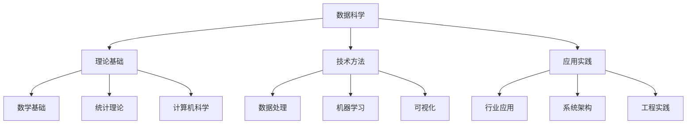

# 3.1.1 数据科学基础理论框架

## 摘要

本文档从数据科学的视角，构建了一个完整的理论框架，涵盖数据定义、数据处理、数据应用和数据理论的四个核心维度。该框架为整个项目的知识体系提供了理论基础和方法论指导。

## 目录

1. [数据科学的定义与范畴](#1-数据科学的定义与范畴)
2. [核心理论维度](#2-核心理论维度)
3. [数据科学的知识体系](#3-数据科学的知识体系)
4. [形式化理论基础](#4-形式化理论基础)
5. [应用实践框架](#5-应用实践框架)
6. [前沿发展方向](#6-前沿发展方向)

## 1. 数据科学的定义与范畴

### 1.1 数据科学的本质

数据科学是一门跨学科的领域，它结合了统计学、计算机科学、数学、领域知识等多个学科，旨在从数据中提取有价值的信息和知识。

**形式化定义**：
设 $D$ 为数据集，$M$ 为模型空间，$K$ 为知识空间，则数据科学可以定义为：

$$\text{DataScience}: D \times M \rightarrow K$$

其中：

- $D = \{d_1, d_2, ..., d_n\}$ 表示数据集合
- $M = \{m_1, m_2, ..., m_k\}$ 表示模型集合
- $K = \{k_1, k_2, ..., k_l\}$ 表示知识集合

### 1.2 数据科学的范畴

数据科学涵盖以下主要领域：

1. **数据获取与预处理**
   - 数据收集
   - 数据清洗
   - 数据转换
   - 数据集成

2. **数据存储与管理**
   - 数据库系统
   - 数据仓库
   - 分布式存储
   - 数据治理

3. **数据分析与挖掘**
   - 统计分析
   - 机器学习
   - 深度学习
   - 知识发现

4. **数据可视化与展示**
   - 图表设计
   - 交互式可视化
   - 仪表板
   - 报告生成

## 2. 核心理论维度

### 2.1 数据定义层 (Data Definition Layer)

数据定义层关注数据的本质、结构和语义。

#### 2.1.1 数据类型理论

**基本数据类型**：

- 数值型：$\mathbb{R}, \mathbb{Z}, \mathbb{Q}$
- 字符型：$\Sigma^*$ (字符串集合)
- 布尔型：$\mathbb{B} = \{true, false\}$
- 时间型：$\mathbb{T}$ (时间戳集合)

**复合数据类型**：

- 数组：$A[T] = \{a_1, a_2, ..., a_n\}$
- 记录：$R = \{f_1: T_1, f_2: T_2, ..., f_n: T_n\}$
- 集合：$S = \{x_1, x_2, ..., x_n\}$
- 映射：$M: K \rightarrow V$

#### 2.1.2 数据结构理论

**线性结构**：

- 数组：$A[i] = v_i$
- 链表：$L = (v_1, next_1) \rightarrow (v_2, next_2) \rightarrow ...$
- 栈：$S = [v_1, v_2, ..., v_n]$
- 队列：$Q = [v_1, v_2, ..., v_n]$

**非线性结构**：

- 树：$T = (V, E)$ 其中 $E \subseteq V \times V$
- 图：$G = (V, E)$ 其中 $E \subseteq V \times V$
- 哈希表：$H: K \rightarrow V$

### 2.2 数据处理层 (Data Processing Layer)

数据处理层关注数据的转换、计算和优化。

#### 2.2.1 算法复杂度理论

**时间复杂度**：

- $O(1)$ - 常数时间
- $O(\log n)$ - 对数时间
- $O(n)$ - 线性时间
- $O(n \log n)$ - 线性对数时间
- $O(n^2)$ - 二次时间
- $O(2^n)$ - 指数时间

**空间复杂度**：

- $S(n)$ 表示算法在最坏情况下需要的额外空间

#### 2.2.2 并行计算理论

**并行模型**：

- PRAM (Parallel Random Access Machine)
- MapReduce
- 流式计算
- 图计算

**并行算法复杂度**：

- 工作复杂度：$W(n)$
- 深度复杂度：$D(n)$
- 并行度：$P(n) = W(n)/D(n)$

### 2.3 数据应用层 (Data Application Layer)

数据应用层关注数据在实际场景中的应用。

#### 2.3.1 行业应用分类

1. **金融行业**
   - 风险建模
   - 投资组合优化
   - 欺诈检测
   - 信用评分

2. **医疗健康**
   - 疾病诊断
   - 药物发现
   - 基因组学
   - 医学影像分析

3. **电子商务**
   - 推荐系统
   - 用户行为分析
   - 库存优化
   - 价格策略

4. **制造业**
   - 预测性维护
   - 质量控制
   - 供应链优化
   - 生产计划

#### 2.3.2 应用架构模式

**数据流水线**：

```text
数据源 → 数据采集 → 数据存储 → 数据处理 → 数据应用 → 结果输出
```

**微服务架构**：

- 数据服务
- 分析服务
- 可视化服务
- API网关

### 2.4 数据理论层 (Data Theory Layer)

数据理论层关注数据科学的理论基础和形式化证明。

#### 2.4.1 统计理论基础

**概率论**：

- 概率空间：$(\Omega, \mathcal{F}, P)$
- 随机变量：$X: \Omega \rightarrow \mathbb{R}$
- 期望：$E[X] = \int x dP(x)$
- 方差：$\text{Var}(X) = E[(X - E[X])^2]$

**统计推断**：

- 参数估计
- 假设检验
- 置信区间
- 贝叶斯推断

#### 2.4.2 机器学习理论

**监督学习**：

- 输入空间：$\mathcal{X}$
- 输出空间：$\mathcal{Y}$
- 假设空间：$\mathcal{H}$
- 损失函数：$L: \mathcal{Y} \times \mathcal{Y} \rightarrow \mathbb{R}$

**无监督学习**：

- 聚类分析
- 降维技术
- 密度估计
- 异常检测

## 3. 数据科学的知识体系

### 3.1 知识图谱结构



### 3.2 知识层次结构

1. **概念层**：基本定义和术语
2. **理论层**：形式化理论和证明
3. **方法层**：具体算法和技术
4. **应用层**：实际应用和案例
5. **工具层**：软件工具和平台

## 4. 形式化理论基础

### 4.1 集合论基础

**集合运算**：

- 并集：$A \cup B = \{x | x \in A \text{ or } x \in B\}$
- 交集：$A \cap B = \{x | x \in A \text{ and } x \in B\}$
- 差集：$A - B = \{x | x \in A \text{ and } x \notin B\}$
- 补集：$A^c = \{x | x \notin A\}$

**关系理论**：

- 等价关系：自反、对称、传递
- 偏序关系：自反、反对称、传递
- 函数关系：单值性

### 4.2 代数结构

**群论**：

- 群：$(G, \cdot)$ 满足结合律、单位元、逆元
- 环：$(R, +, \cdot)$ 满足加法群、乘法半群、分配律
- 域：$(F, +, \cdot)$ 满足环的性质且乘法群

**线性代数**：

- 向量空间：$(V, +, \cdot)$
- 线性变换：$T: V \rightarrow W$
- 特征值和特征向量：$T(v) = \lambda v$

### 4.3 拓扑学基础

**度量空间**：

- 度量：$d: X \times X \rightarrow \mathbb{R}$
- 开集：$U \subseteq X$ 是开集当且仅当 $\forall x \in U, \exists \epsilon > 0, B(x, \epsilon) \subseteq U$
- 连续映射：$f: X \rightarrow Y$ 连续当且仅当开集的原像是开集

## 5. 应用实践框架

### 5.1 CRISP-DM 方法论

**六个阶段**：

1. **业务理解** (Business Understanding)
2. **数据理解** (Data Understanding)
3. **数据准备** (Data Preparation)
4. **建模** (Modeling)
5. **评估** (Evaluation)
6. **部署** (Deployment)

### 5.2 数据科学项目生命周期


### 5.3 质量保证框架

**数据质量维度**：

- 准确性 (Accuracy)
- 完整性 (Completeness)
- 一致性 (Consistency)
- 及时性 (Timeliness)
- 有效性 (Validity)

**模型质量指标**：

- 准确率 (Accuracy)
- 精确率 (Precision)
- 召回率 (Recall)
- F1分数 (F1-Score)
- AUC-ROC

## 6. 前沿发展方向

### 6.1 人工智能与机器学习

**深度学习**：

- 神经网络架构
- 卷积神经网络 (CNN)
- 循环神经网络 (RNN)
- 变换器 (Transformer)

**强化学习**：

- Q学习
- 策略梯度
- 深度强化学习
- 多智能体系统

### 6.2 大数据技术

**分布式计算**：

- Hadoop生态系统
- Spark计算框架
- Flink流处理
- Kubernetes容器编排

**数据湖与数据仓库**：

- 数据湖架构
- 数据仓库设计
- 数据网格
- 数据编织

### 6.3 新兴技术

**量子计算**：

- 量子比特
- 量子算法
- 量子机器学习
- 量子优化

**边缘计算**：

- 边缘设备
- 边缘智能
- 联邦学习
- 隐私保护

---

## 参考文献

1. Provost, F., & Fawcett, T. (2013). Data Science for Business.
2. James, G., Witten, D., Hastie, T., & Tibshirani, R. (2013). An Introduction to Statistical Learning.
3. Bishop, C. M. (2006). Pattern Recognition and Machine Learning.
4. Murphy, K. P. (2012). Machine Learning: A Probabilistic Perspective.

---

**最后更新**: 2024年12月
**版本**: v1.0
**状态**: 进行中
