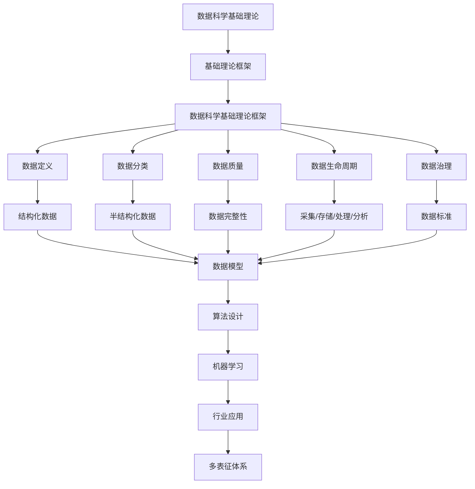

# 3.1-基础理论 分支导航

## 📑 目录

- [3.1-基础理论 分支导航](#31-基础理论-分支导航)
  - [📑 目录](#-目录)
  - [1. 概述](#1-概述)
  - [2. 目录结构与本地跳转](#2-目录结构与本地跳转)
  - [3. 核心概念](#3-核心概念)
    - [3.1. 数据科学定义](#31-数据科学定义)
    - [3.2. 数据科学方法论](#32-数据科学方法论)
    - [3.3. 数据类型](#33-数据类型)
  - [4. 理论基础](#4-理论基础)
    - [4.1. 统计学习理论](#41-统计学习理论)
    - [4.2. 数据生命周期](#42-数据生命周期)
    - [4.3. 数据治理](#43-数据治理)
  - [5. 应用场景](#5-应用场景)
    - [5.1. 数据分析](#51-数据分析)
    - [5.2. 机器学习](#52-机器学习)
    - [5.3. 商业智能](#53-商业智能)
  - [6. 行业案例与多表征](#6-行业案例与多表征)
    - [6.1. 典型行业案例](#61-典型行业案例)
    - [6.2. 多表征示例](#62-多表征示例)
  - [7. 主题交叉引用](#7-主题交叉引用)
  - [8. 全链路知识流](#8-全链路知识流)
  - [9. 多表征](#9-多表征)
  - [10. 形式化语义](#10-形式化语义)
  - [11. 形式化语法与证明](#11-形式化语法与证明)
  - [12. 工具与实现](#12-工具与实现)
    - [12.1. 数据处理工具](#121-数据处理工具)
    - [12.2. 机器学习工具](#122-机器学习工具)
    - [12.3. 可视化工具](#123-可视化工具)
  - [13. 学习与研究路径](#13-学习与研究路径)
    - [13.1. 基础知识](#131-基础知识)
    - [13.2. 核心技能](#132-核心技能)
    - [13.3. 实践应用](#133-实践应用)
  - [14. 总结](#14-总结)
  - [15. 数据科学方法论详解](#15-数据科学方法论详解)
    - [15.1. CRISP-DM模型详解](#151-crisp-dm模型详解)
    - [15.2. 数据科学工作流](#152-数据科学工作流)
    - [15.3. 数据科学最佳实践](#153-数据科学最佳实践)
  - [16. 数据科学工具生态](#16-数据科学工具生态)
    - [16.1. 数据处理工具](#161-数据处理工具)
    - [16.2. 机器学习框架](#162-机器学习框架)
    - [16.3. 大数据工具](#163-大数据工具)
  - [17. 数据科学伦理与合规](#17-数据科学伦理与合规)
    - [17.1. 数据隐私](#171-数据隐私)
    - [17.2. 算法公平性](#172-算法公平性)
    - [17.3. 可解释性](#173-可解释性)
  - [深入学习建议](#深入学习建议)
    - [理论基础强化](#理论基础强化)
    - [实践能力提升](#实践能力提升)
  - [学习资源汇总](#学习资源汇总)
    - [在线课程](#在线课程)
    - [书籍推荐](#书籍推荐)
    - [学术资源](#学术资源)
  - [实践项目建议](#实践项目建议)
    - [基础项目](#基础项目)
    - [进阶项目](#进阶项目)
    - [高级项目](#高级项目)
  - [职业发展路径](#职业发展路径)
    - [学术研究](#学术研究)
    - [工业应用](#工业应用)

---

## 1. 概述

数据科学基础理论是数据科学学科的理论基础，涵盖了数据处理、分析和应用的核心概念。
它结合了统计学、计算机科学和领域知识，为数据科学实践提供理论指导和方法论。

**核心特征**：

1. **跨学科性**：结合统计学、计算机科学和领域知识
2. **方法论**：提供系统化的数据科学方法论
3. **理论基础**：为数据科学实践提供理论基础
4. **应用导向**：面向实际应用和问题解决

**应用领域**：

- 数据分析和挖掘
- 机器学习和人工智能
- 商业智能和决策支持
- 科学研究和工程应用

---

## 2. 目录结构与本地跳转

- [3.1.1-数据科学基础理论框架](3.1.1-数据科学基础理论框架.md) - 理论基础文档

---

## 3. 核心概念

### 3.1. 数据科学定义

数据科学是跨学科领域，结合了统计学、计算机科学和领域知识，用于从数据中提取知识和洞察。

**核心公式**：
$$\text{数据科学} = \text{统计学} + \text{计算机科学} + \text{领域知识}$$

### 3.2. 数据科学方法论

**CRISP-DM模型**：

1. 业务理解
2. 数据理解
3. 数据准备
4. 建模
5. 评估
6. 部署

### 3.3. 数据类型

**数据分类**：

- **结构化数据**：表格、数据库
- **半结构化数据**：JSON、XML
- **非结构化数据**：文本、图像、视频

**数据质量维度**：

- 完整性、一致性、准确性、及时性

---

## 4. 理论基础

### 4.1. 统计学习理论

统计学习理论为机器学习提供理论基础，包括VC维、PAC学习等概念。

### 4.2. 数据生命周期

数据生命周期包括数据采集、存储、处理、分析和归档等阶段。

### 4.3. 数据治理

数据治理包括数据标准、数据质量、数据安全和数据合规等方面。

---

## 5. 应用场景

### 5.1. 数据分析

数据科学基础理论在数据分析中的应用包括描述性分析、诊断性分析、预测性分析和规范性分析。

### 5.2. 机器学习

数据科学基础理论为机器学习提供理论基础，包括模型选择、评估和优化。

### 5.3. 商业智能

数据科学基础理论在商业智能中的应用包括报表生成、仪表盘和决策支持。

---

## 6. 行业案例与多表征

### 6.1. 典型行业案例

- **数学基础理论**：数据科学中的数学基础（详见[2.7-数学基础理论](../../../2-形式科学理论/2.7-数学基础理论/README.md)）
- **形式化模型**：数据模型的形式化（详见[3.2-形式化模型](../3.2-形式化模型/README.md)）
- **机器学习**：数据科学在机器学习中的应用（详见[5.3-机器学习](../../../5-行业应用与场景/5.3-机器学习/README.md)）

### 6.2. 多表征示例

- **符号表征**：数据结构、算法、模型、公式
- **图结构**：数据流图、模型结构图、算法流程图
- **向量/张量**：特征向量、嵌入、参数矩阵
- **自然语言**：定义、注释、描述
- **图像/可视化**：结构图、流程图、可视化结果

---

## 7. 主题交叉引用

| 主题      | 基础理论 | 形式化模型 | 应用场景 | 算法实现 | 行业案例 | 多表征 |
|-----------|----------|------------|----------|----------|----------|--------|
| 数据科学基础理论框架| ✅ | ✅       | ✅     | ✅     | ✅     | ✅   |

**交叉引用**：

- [2.7-数学基础理论](../../../2-形式科学理论/2.7-数学基础理论/README.md)：数据科学中的数学基础
- [3.2-形式化模型](../3.2-形式化模型/README.md)：数据模型的形式化
- [5.3-机器学习](../../../5-行业应用与场景/5.3-机器学习/README.md)：数据科学在机器学习中的应用

---

## 8. 全链路知识流



---

## 9. 多表征

基础理论分支支持多种表征方式，包括：

- **符号表征**：数据结构、算法、模型、公式、统计指标
- **图结构**：数据流图、模型结构图、算法流程图、知识图谱
- **向量/张量**：特征向量、嵌入、参数矩阵、张量数据
- **自然语言**：定义、注释、描述、方法论文档
- **图像/可视化**：结构图、流程图、可视化结果、统计图表

这些表征可互映，提升理论与算法表达力。

---

## 10. 形式化语义

**语义域**：$D$，包括：

- 数据对象集：$\mathcal{D} = \{d_1, d_2, \ldots\}$
- 模型空间：$\mathcal{M}$
- 算法操作空间：$\mathcal{A}$
- 统计空间：$\mathcal{S}$

**解释函数**：$I: \mathcal{L} \to D$，将数据科学规范映射到语义对象：

- $I(\text{data}) \in \mathcal{D}$：数据的解释
- $I(\text{model}) \in \mathcal{M}$：模型的解释
- $I(\text{algorithm}) \in \mathcal{A}$：算法的解释
- $I(\text{statistic}) \in \mathcal{S}$：统计量的解释

**语义一致性**：每个数据结构/算法/模型在$D$中有明确定义，满足数据质量要求、模型有效性、算法正确性。

---

## 11. 形式化语法与证明

**语法规则**：

- **数据结构语法**：$DS ::= Array \mid List \mid Tree \mid Graph$
- **算法语法**：$Algorithm ::= Sort \mid Search \mid Cluster \mid Classify$
- **模型语法**：$Model ::= Linear \mid NonLinear \mid Ensemble$

**推理规则**：

- **数据质量**：$\frac{Quality(d) \geq threshold}{d \text{ is valid}}$
- **模型有效性**：$\frac{Accuracy(m) \geq threshold}{m \text{ is valid}}$

**定理**：基础理论分支的语法系统具一致性与可扩展性。

**证明**：由数据结构、算法定义与推理规则递归定义，保证系统一致与可扩展。

---

## 12. 工具与实现

### 12.1. 数据处理工具

- **Python**：Pandas、NumPy、SciPy
- **R语言**：统计分析
- **SQL**：数据查询

### 12.2. 机器学习工具

- **Scikit-learn**：Python机器学习库
- **TensorFlow**：深度学习框架
- **PyTorch**：深度学习框架

### 12.3. 可视化工具

- **Matplotlib**：Python绘图
- **Seaborn**：统计可视化
- **Plotly**：交互式可视化

---

## 13. 学习与研究路径

### 13.1. 基础知识

1. **数学基础**：线性代数、概率论、统计学
2. **编程基础**：Python、R、SQL

### 13.2. 核心技能

1. **数据处理**：数据清洗、转换、验证
2. **统计分析**：描述统计、推断统计
3. **机器学习**：监督学习、无监督学习

### 13.3. 实践应用

1. **项目实践**：数据分析项目、机器学习项目
2. **工具掌握**：数据处理工具、机器学习工具
3. **研究前沿**：深度学习、强化学习、自动化机器学习

---

## 14. 总结

数据科学基础理论是数据科学学科的理论基础，为数据科学实践提供理论指导和方法论。从数据定义到数据治理，从统计学习到机器学习，数据科学基础理论涵盖了数据科学的各个方面。

**核心价值**：

1. **理论基础**：为数据科学实践提供理论基础
2. **方法论**：提供系统化的数据科学方法论
3. **工具支持**：提供强大的工具和框架
4. **应用导向**：面向实际应用和问题解决

**应用前景**：
随着大数据、人工智能等技术的发展，数据科学基础理论将继续发展，特别是在自动化机器学习、可解释AI、数据治理等领域，数据科学基础理论将提供更强大的理论支撑。

---

## 15. 数据科学方法论详解

### 15.1. CRISP-DM模型详解

**业务理解阶段**：

- 确定业务目标
- 评估当前情况
- 制定数据挖掘目标
- 制定项目计划

**数据理解阶段**：

- 收集初始数据
- 描述数据
- 探索数据
- 验证数据质量

**数据准备阶段**：

- 选择数据
- 清洗数据
- 构造数据
- 集成数据
- 格式化数据

**建模阶段**：

- 选择建模技术
- 生成测试设计
- 建立模型
- 评估模型

**评估阶段**：

- 评估结果
- 审查过程
- 确定下一步

**部署阶段**：

- 制定部署计划
- 监控和维护
- 生成最终报告
- 审查项目

### 15.2. 数据科学工作流

**典型工作流**：

1. 问题定义
2. 数据收集
3. 数据探索
4. 特征工程
5. 模型训练
6. 模型评估
7. 模型部署
8. 模型监控

### 15.3. 数据科学最佳实践

**数据管理**：

- 数据版本控制
- 数据文档化
- 数据质量保证
- 数据安全

**模型管理**：

- 模型版本控制
- 模型文档化
- 模型监控
- 模型更新

---

## 16. 数据科学工具生态

### 16.1. 数据处理工具

**Python生态系统**：

- Pandas：数据分析和处理
- NumPy：数值计算
- SciPy：科学计算
- Dask：并行计算

**R语言**：

- dplyr：数据操作
- ggplot2：数据可视化
- caret：机器学习

### 16.2. 机器学习框架

**传统机器学习**：

- Scikit-learn：Python机器学习库
- XGBoost：梯度提升框架
- LightGBM：轻量级梯度提升

**深度学习**：

- TensorFlow：Google深度学习框架
- PyTorch：Facebook深度学习框架
- Keras：高级神经网络API

### 16.3. 大数据工具

**分布式计算**：

- Apache Spark：大数据处理
- Apache Hadoop：分布式存储和计算
- Apache Flink：流处理

**数据存储**：

- HDFS：分布式文件系统
- HBase：NoSQL数据库
- Cassandra：分布式数据库

---

## 17. 数据科学伦理与合规

### 17.1. 数据隐私

**隐私保护技术**：

- 数据脱敏
- 差分隐私
- 同态加密
- 联邦学习

### 17.2. 算法公平性

**公平性指标**：

- 统计均等
- 机会均等
- 个体公平

### 17.3. 可解释性

**可解释性方法**：

- LIME：局部可解释模型
- SHAP：SHapley Additive exPlanations
- 特征重要性
- 模型可视化

**LIME可解释性示例**：

```python
from lime import lime_tabular
from sklearn.ensemble import RandomForestClassifier
from sklearn.datasets import load_iris
from sklearn.model_selection import train_test_split
import numpy as np

# 加载数据
iris = load_iris()
X_train, X_test, y_train, y_test = train_test_split(
    iris.data, iris.target, test_size=0.2, random_state=42
)

# 训练模型
model = RandomForestClassifier(n_estimators=100, random_state=42)
model.fit(X_train, y_train)

# 创建LIME解释器
explainer = lime_tabular.LimeTabularExplainer(
    X_train,
    feature_names=iris.feature_names,
    class_names=iris.target_names,
    mode='classification'
)

# 解释单个预测
instance_idx = 0
explanation = explainer.explain_instance(
    X_test[instance_idx],
    model.predict_proba,
    num_features=4
)

# 显示解释结果
print(f"真实标签: {iris.target_names[y_test[instance_idx]]}")
print(f"预测标签: {iris.target_names[model.predict([X_test[instance_idx]])[0]]}")
explanation.show_in_notebook(show_table=True)
```

**SHAP可解释性示例**：

```python
import shap
from sklearn.ensemble import RandomForestClassifier
from sklearn.datasets import load_iris
import pandas as pd

# 加载数据
iris = load_iris()
X = pd.DataFrame(iris.data, columns=iris.feature_names)
y = iris.target

# 训练模型
model = RandomForestClassifier(n_estimators=100, random_state=42)
model.fit(X, y)

# 创建SHAP解释器
explainer = shap.TreeExplainer(model)
shap_values = explainer.shap_values(X)

# 可视化SHAP值
shap.summary_plot(shap_values, X, plot_type="bar")
shap.summary_plot(shap_values[0], X)  # 对于类别0

# 单个样本的解释
shap.force_plot(
    explainer.expected_value[0],
    shap_values[0][0],
    X.iloc[0],
    matplotlib=True
)
```

---

## 深入学习建议

### 理论基础强化

**数学基础**：

- **线性代数**：矩阵运算、向量空间
- **概率论**：概率分布、统计推断
- **微积分**：优化理论、梯度下降
- **统计学**：假设检验、回归分析

**计算机科学基础**：

- **数据结构**：树、图、哈希表
- **算法设计**：排序、搜索、图算法
- **数据库理论**：关系数据库、NoSQL
- **分布式系统**：分布式计算、并行处理

### 实践能力提升

**编程能力**：

- **Python**：NumPy、Pandas、Scikit-learn
- **R**：统计分析、数据可视化
- **SQL**：数据查询和处理
- **大数据工具**：Spark、Hadoop

**Python数据科学完整示例**：

```python
import numpy as np
import pandas as pd
from sklearn.model_selection import train_test_split
from sklearn.preprocessing import StandardScaler
from sklearn.ensemble import RandomForestClassifier
from sklearn.metrics import classification_report, confusion_matrix
import matplotlib.pyplot as plt
import seaborn as sns

class DataSciencePipeline:
    """
    数据科学完整流程示例

    包含：数据加载、探索性分析、特征工程、模型训练、评估
    """

    def __init__(self, data_path):
        """初始化数据科学流程"""
        self.data_path = data_path
        self.data = None
        self.X_train = None
        self.X_test = None
        self.y_train = None
        self.y_test = None
        self.scaler = StandardScaler()
        self.model = None

    def load_data(self):
        """加载数据"""
        self.data = pd.read_csv(self.data_path)
        print(f"数据形状: {self.data.shape}")
        print(f"缺失值:\n{self.data.isnull().sum()}")
        return self.data

    def exploratory_analysis(self):
        """探索性数据分析"""
        # 基本统计信息
        print("基本统计信息:")
        print(self.data.describe())

        # 数据分布可视化
        if self.data.select_dtypes(include=[np.number]).shape[1] > 0:
            numeric_cols = self.data.select_dtypes(include=[np.number]).columns
            fig, axes = plt.subplots(2, 2, figsize=(12, 10))
            for idx, col in enumerate(numeric_cols[:4]):
                ax = axes[idx // 2, idx % 2]
                self.data[col].hist(bins=30, ax=ax)
                ax.set_title(f'{col} 分布')
            plt.tight_layout()
            plt.show()

        # 相关性分析
        if self.data.select_dtypes(include=[np.number]).shape[1] > 1:
            corr_matrix = self.data.select_dtypes(include=[np.number]).corr()
            plt.figure(figsize=(10, 8))
            sns.heatmap(corr_matrix, annot=True, cmap='coolwarm', center=0)
            plt.title('特征相关性矩阵')
            plt.show()

    def preprocess_data(self, target_column, test_size=0.2):
        """数据预处理"""
        # 处理缺失值
        self.data = self.data.fillna(self.data.mean())

        # 分离特征和目标
        X = self.data.drop(columns=[target_column])
        y = self.data[target_column]

        # 编码分类变量
        X = pd.get_dummies(X, drop_first=True)

        # 划分训练集和测试集
        self.X_train, self.X_test, self.y_train, self.y_test = train_test_split(
            X, y, test_size=test_size, random_state=42, stratify=y
        )

        # 特征缩放
        self.X_train = self.scaler.fit_transform(self.X_train)
        self.X_test = self.scaler.transform(self.X_test)

        return self.X_train, self.X_test, self.y_train, self.y_test

    def train_model(self, model_type='random_forest', **kwargs):
        """训练模型"""
        if model_type == 'random_forest':
            self.model = RandomForestClassifier(
                n_estimators=kwargs.get('n_estimators', 100),
                max_depth=kwargs.get('max_depth', None),
                random_state=42
            )

        self.model.fit(self.X_train, self.y_train)
        return self.model

    def evaluate_model(self):
        """评估模型"""
        # 训练集预测
        y_train_pred = self.model.predict(self.X_train)
        train_accuracy = (y_train_pred == self.y_train).mean()

        # 测试集预测
        y_test_pred = self.model.predict(self.X_test)
        test_accuracy = (y_test_pred == self.y_test).mean()

        print(f"训练集准确率: {train_accuracy:.4f}")
        print(f"测试集准确率: {test_accuracy:.4f}")

        # 分类报告
        print("\n分类报告:")
        print(classification_report(self.y_test, y_test_pred))

        # 混淆矩阵
        cm = confusion_matrix(self.y_test, y_test_pred)
        plt.figure(figsize=(8, 6))
        sns.heatmap(cm, annot=True, fmt='d', cmap='Blues')
        plt.title('混淆矩阵')
        plt.ylabel('真实标签')
        plt.xlabel('预测标签')
        plt.show()

        return {
            'train_accuracy': train_accuracy,
            'test_accuracy': test_accuracy,
            'confusion_matrix': cm
        }

    def feature_importance(self):
        """特征重要性分析"""
        if hasattr(self.model, 'feature_importances_'):
            importances = self.model.feature_importances_
            feature_names = pd.get_dummies(
                self.data.drop(columns=[self.data.columns[-1]]),
                drop_first=True
            ).columns

            # 创建特征重要性DataFrame
            feature_importance_df = pd.DataFrame({
                'feature': feature_names,
                'importance': importances
            }).sort_values('importance', ascending=False)

            # 可视化
            plt.figure(figsize=(10, 6))
            sns.barplot(data=feature_importance_df.head(10),
                       x='importance', y='feature')
            plt.title('Top 10 特征重要性')
            plt.xlabel('重要性')
            plt.tight_layout()
            plt.show()

            return feature_importance_df

# 使用示例
# pipeline = DataSciencePipeline('data.csv')
# pipeline.load_data()
# pipeline.exploratory_analysis()
# pipeline.preprocess_data('target_column')
# pipeline.train_model()
# pipeline.evaluate_model()
# pipeline.feature_importance()
```

**工具使用**：

- **数据工具**：Jupyter、Tableau
- **机器学习**：TensorFlow、PyTorch
- **数据存储**：数据库、数据仓库
- **可视化工具**：Matplotlib、D3.js

**Jupyter Notebook数据分析示例**：

```python
# 完整的数据分析工作流
import pandas as pd
import numpy as np
import matplotlib.pyplot as plt
import seaborn as sns
from sklearn.preprocessing import LabelEncoder
from sklearn.model_selection import cross_val_score
from sklearn.ensemble import GradientBoostingRegressor

# 1. 数据加载和初步探索
df = pd.read_csv('sales_data.csv')
print("数据概览:")
print(df.head())
print(f"\n数据形状: {df.shape}")
print(f"缺失值统计:\n{df.isnull().sum()}")

# 2. 数据清洗
# 处理缺失值
df['price'] = df['price'].fillna(df['price'].median())
df['category'] = df['category'].fillna('Unknown')

# 处理异常值
Q1 = df['sales'].quantile(0.25)
Q3 = df['sales'].quantile(0.75)
IQR = Q3 - Q1
df = df[(df['sales'] >= Q1 - 1.5*IQR) & (df['sales'] <= Q3 + 1.5*IQR)]

# 3. 特征工程
# 编码分类变量
le = LabelEncoder()
df['category_encoded'] = le.fit_transform(df['category'])

# 创建时间特征
df['date'] = pd.to_datetime(df['date'])
df['year'] = df['date'].dt.year
df['month'] = df['date'].dt.month
df['day_of_week'] = df['date'].dt.dayofweek

# 4. 数据可视化
fig, axes = plt.subplots(2, 2, figsize=(15, 10))

# 销售额时间序列
axes[0, 0].plot(df.groupby('date')['sales'].sum())
axes[0, 0].set_title('销售额时间序列')
axes[0, 0].set_xlabel('日期')
axes[0, 0].set_ylabel('销售额')

# 类别分布
df['category'].value_counts().plot(kind='bar', ax=axes[0, 1])
axes[0, 1].set_title('类别分布')
axes[0, 1].set_xlabel('类别')
axes[0, 1].set_ylabel('数量')

# 价格与销售额关系
axes[1, 0].scatter(df['price'], df['sales'], alpha=0.5)
axes[1, 0].set_title('价格 vs 销售额')
axes[1, 0].set_xlabel('价格')
axes[1, 0].set_ylabel('销售额')

# 销售额分布
axes[1, 1].hist(df['sales'], bins=50)
axes[1, 1].set_title('销售额分布')
axes[1, 1].set_xlabel('销售额')
axes[1, 1].set_ylabel('频数')

plt.tight_layout()
plt.show()

# 5. 模型训练和评估
features = ['price', 'category_encoded', 'year', 'month', 'day_of_week']
X = df[features]
y = df['sales']

model = GradientBoostingRegressor(n_estimators=100, random_state=42)
scores = cross_val_score(model, X, y, cv=5, scoring='r2')
print(f"\n模型R²得分: {scores.mean():.4f} (+/- {scores.std() * 2:.4f})")

model.fit(X, y)
print(f"特征重要性:\n{pd.Series(model.feature_importances_, index=features).sort_values(ascending=False)}")
```

---

## 学习资源汇总

### 在线课程

- **Coursera**：数据科学课程
- **edX**：数据分析课程
- **Udemy**：数据科学实践课程
- **YouTube**：数据科学教程

### 书籍推荐

- **入门书籍**：《数据科学导论》
- **进阶书籍**：《统计学习方法》
- **应用书籍**：《数据科学实战》
- **工具书籍**：《Python数据科学手册》

### 学术资源

- **期刊**：Journal of Data Science、IEEE TKDE
- **会议**：KDD、ICDM、SIGMOD
- **数据库**：IEEE Xplore、ACM Digital Library
- **预印本**：arXiv、ResearchGate

---

## 实践项目建议

### 基础项目

- **数据分析**：数据分析项目
- **数据可视化**：数据可视化项目
- **机器学习**：机器学习项目
- **数据挖掘**：数据挖掘项目

### 进阶项目

- **大数据处理**：大数据处理项目
- **深度学习**：深度学习项目
- **推荐系统**：推荐系统项目
- **自然语言处理**：NLP项目

### 高级项目

- **端到端系统**：完整的数据科学系统
- **实时系统**：实时数据处理系统
- **分布式系统**：分布式数据处理
- **AI应用**：AI应用系统

---

## 职业发展路径

### 学术研究

- **研究方向**：数据科学、机器学习、数据挖掘
- **职业路径**：博士研究、博士后、教职、研究机构

### 工业应用

- **应用领域**：数据分析、机器学习、数据工程
- **职业路径**：数据科学家、数据分析师、数据工程师

---

[返回数据模型与算法总导航](../README.md)
