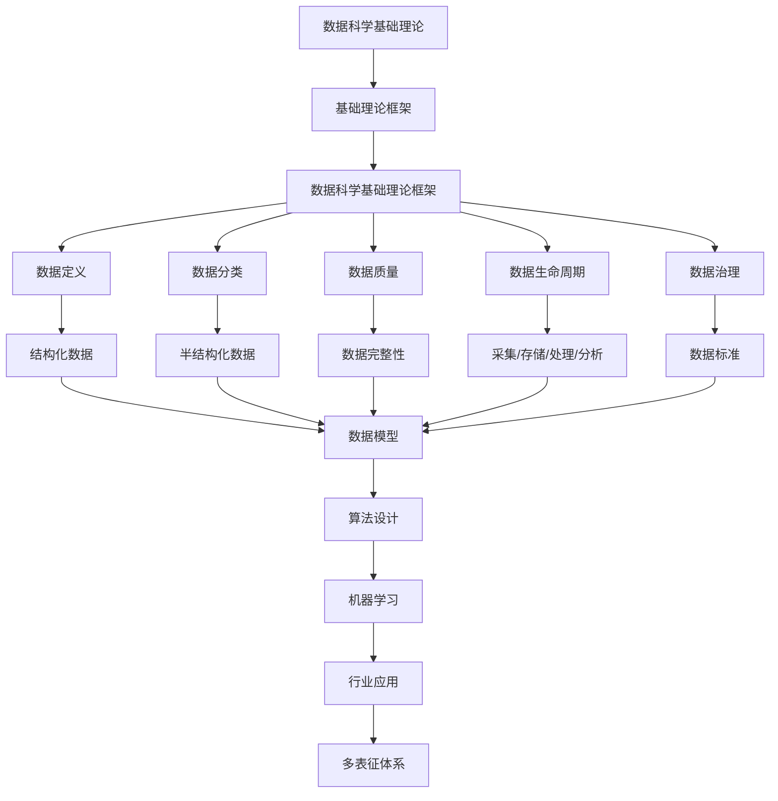

# 3.1-基础理论 分支导航

## 目录结构与本地跳转

- [3.1.1-数据科学基础理论框架](3.1.1-数据科学基础理论框架.md) - 预留分支

---

## 主题交叉引用

| 主题      | 基础理论 | 形式化模型 | 应用场景 | 算法实现 | 行业案例 | 多表征 |
|-----------|----------|------------|----------|----------|----------|--------|
| 数据科学基础理论框架| 预留 | 预留       | 预留     | 预留     | 预留     | 预留   |

- 交叉引用：[2.7-数学基础理论](../../../2-形式科学理论/2.7-数学基础理论/README.md)、[3.2-形式化模型](../3.2-形式化模型/README.md)、[5.3-机器学习](../../../5-行业应用与场景/5.3-机器学习/README.md)

---

## 全链路知识流（Mermaid流程图）

---

[返回数据模型与算法总导航](../README.md)

## 多表征

基础理论分支支持多种表征方式，包括：

- 符号表征（数据结构、算法、模型、公式等）
- 图结构（数据流图、模型结构图、算法流程图等）
- 向量/张量（特征向量、嵌入、参数矩阵）
- 自然语言（定义、注释、描述）
- 图像/可视化（结构图、流程图、可视化结果等）
这些表征可互映，提升理论与算法表达力。

## 形式化语义

- 语义域：$D$，如数据对象集、模型空间、算法操作空间
- 解释函数：$I: S \to D$，将符号/结构映射到具体语义对象
- 语义一致性：每个结构/公式/算法在$D$中有明确定义

## 形式化语法与证明

- 语法规则：如数据结构定义、算法伪代码、推理规则、约束条件
- **定理**：基础理论分支的语法系统具一致性与可扩展性。
- **证明**：由数据结构、算法定义与推理规则递归定义，保证系统一致与可扩展。
