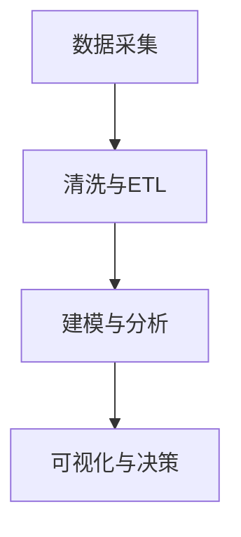

# 3.1 基础理论 主题导航与多表征案例

## 目录结构与本地跳转

- [3.1.1 数据科学基础理论框架](./3.1.1-数据科学基础理论框架.md)

---

## 行业案例与多表征

### 3.1.x 典型行业案例

- 金融数据科学：理论到实践的全流程（详见5.1-金融数据分析、3.5-数据分析与ETL）
- 科学计算：数据驱动建模与仿真（详见5.2-科学计算）
- 机器学习：理论基础与算法实现（详见3.4-AI与机器学习算法、5.3-机器学习）

### 3.1.x 多表征示例

- 理论框架图、数据流图、知识图谱、Latex公式等

---

[返回数据分析与ETL](../3.5-数据分析与ETL/README.md)
