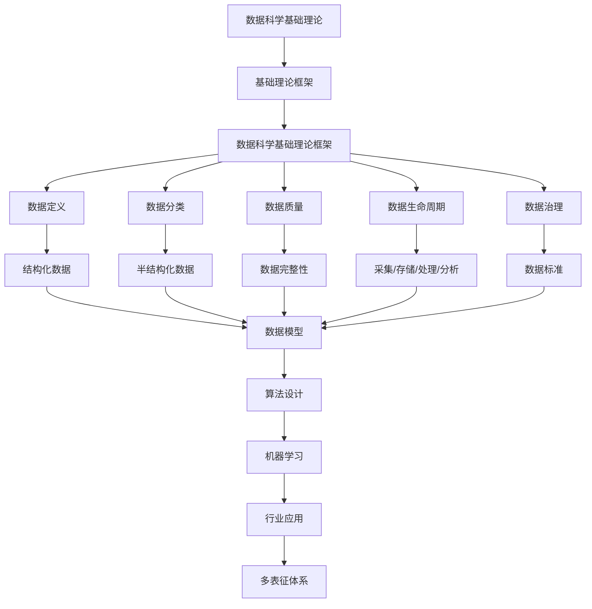

# 3.1-基础理论 分支导航

## 目录结构与本地跳转
- [3.1.1-数据科学基础理论框架](3.1.1-数据科学基础理论框架.md) - 预留分支

---

## 主题交叉引用
| 主题      | 基础理论 | 形式化模型 | 应用场景 | 算法实现 | 行业案例 | 多表征 |
|-----------|----------|------------|----------|----------|----------|--------|
| 数据科学基础理论框架| 预留 | 预留       | 预留     | 预留     | 预留     | 预留   |

- 交叉引用：[2.7-数学基础理论](../../../2-形式科学理论/2.7-数学基础理论/README.md)、[3.2-形式化模型](../3.2-形式化模型/README.md)、[5.3-机器学习](../../../5-行业应用与场景/5.3-机器学习/README.md)

---

## 全链路知识流（Mermaid流程图）

---

[返回数据模型与算法总导航](../README.md)
