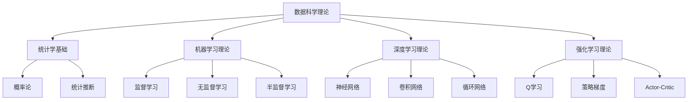

# 数据科学与机器学习理论体系

## 📑 目录

- [数据科学与机器学习理论体系](#数据科学与机器学习理论体系)
  - [📑 目录](#-目录)
  - [1. 概述](#1-概述)
    - [1.1. 理论基础](#11-理论基础)
    - [1.2. 核心概念](#12-核心概念)
    - [1.3. 理论框架](#13-理论框架)
  - [2. 统计学基础理论](#2-统计学基础理论)
    - [2.1. 概率论基础](#21-概率论基础)
      - [2.1.1. 概率空间](#211-概率空间)
      - [2.1.2. 随机变量](#212-随机变量)
    - [2.2. 统计推断](#22-统计推断)
      - [2.2.1. 参数估计](#221-参数估计)
      - [2.2.2. 假设检验](#222-假设检验)
  - [3. 机器学习理论](#3-机器学习理论)
    - [3.1. 学习理论](#31-学习理论)
      - [3.1.1. PAC学习理论](#311-pac学习理论)
      - [3.1.2. 泛化理论](#312-泛化理论)
    - [3.2. 监督学习](#32-监督学习)
      - [3.2.1. 线性回归](#321-线性回归)
  - [4. 逻辑回归](#4-逻辑回归)
  - [5. 支持向量机](#5-支持向量机)
  - [6. 无监督学习](#6-无监督学习)
    - [6.1. K-means聚类](#61-k-means聚类)
  - [7. 主成分分析](#7-主成分分析)
  - [8. 深度学习理论](#8-深度学习理论)
    - [8.1. 神经网络基础](#81-神经网络基础)
      - [8.1.1. 前馈神经网络](#811-前馈神经网络)
  - [9. 卷积神经网络](#9-卷积神经网络)
  - [10. 循环神经网络](#10-循环神经网络)
  - [11. 优化理论](#11-优化理论)
    - [11.1. 梯度下降](#111-梯度下降)
  - [12. 正则化](#12-正则化)
  - [13. 强化学习理论](#13-强化学习理论)
    - [13.1. 马尔可夫决策过程](#131-马尔可夫决策过程)
    - [13.2. Q学习](#132-q学习)
  - [14. 策略梯度](#14-策略梯度)
  - [15. 应用案例](#15-应用案例)
    - [15.1. 图像分类](#151-图像分类)
  - [16. 自然语言处理](#16-自然语言处理)
  - [17. 推荐系统](#17-推荐系统)
  - [18. 性能评估](#18-性能评估)
    - [18.1. 分类评估指标](#181-分类评估指标)
  - [19. 回归评估指标](#19-回归评估指标)
  - [20. 交叉验证](#20-交叉验证)
  - [21. 最佳实践](#21-最佳实践)
    - [21.1. 数据预处理](#211-数据预处理)
  - [22. 模型选择](#22-模型选择)
  - [23. 超参数调优](#23-超参数调优)
  - [24. 未来发展方向](#24-未来发展方向)
    - [24.1. 自动化机器学习](#241-自动化机器学习)
    - [24.2. 联邦学习](#242-联邦学习)
    - [24.3. 可解释AI](#243-可解释ai)
  - [25. 总结](#25-总结)
    - [25.1. 核心价值](#251-核心价值)
    - [25.2. 技术特色](#252-技术特色)

## 1. 概述

### 1.1. 理论基础

数据科学与机器学习理论体系是现代人工智能和数据科学的核心基础。它融合了统计学、数学、计算机科学和领域知识，为数据驱动的决策和智能系统提供理论支撑。

### 1.2. 核心概念

- **数据科学**：通过科学方法、算法和系统从数据中提取知识和洞察
- **机器学习**：使计算机能够在没有明确编程的情况下学习和改进
- **深度学习**：基于人工神经网络的机器学习方法
- **强化学习**：通过与环境交互学习最优策略

### 1.3. 理论框架



## 2. 统计学基础理论

### 2.1. 概率论基础

#### 2.1.1. 概率空间

**定义**：概率空间是一个三元组 $(\Omega, \mathcal{F}, P)$，其中：

- $\Omega$ 是样本空间
- $\mathcal{F}$ 是事件域（σ-代数）
- $P$ 是概率测度

**性质**：

- $P(\Omega) = 1$
- $P(\emptyset) = 0$
- $P(A \cup B) = P(A) + P(B) - P(A \cap B)$

#### 2.1.2. 随机变量

**定义**：随机变量 $X$ 是从样本空间到实数的可测函数。

**类型**：

- **离散随机变量**：取值可数
- **连续随机变量**：取值不可数

**期望**：
$$E[X] = \sum_{i} x_i P(X = x_i) \quad \text{(离散)}$$
$$E[X] = \int_{-\infty}^{\infty} x f(x) dx \quad \text{(连续)}$$

**方差**：
$$\text{Var}(X) = E[(X - E[X])^2] = E[X^2] - (E[X])^2$$

### 2.2. 统计推断

#### 2.2.1. 参数估计

**最大似然估计**：

给定独立同分布的样本 $X_1, X_2, \ldots, X_n$，似然函数为：

$$L(\theta) = \prod_{i=1}^{n} f(X_i; \theta)$$

最大似然估计为：
$$\hat{\theta}_{MLE} = \arg\max_{\theta} L(\theta)$$

**贝叶斯估计**：

后验分布：
$$P(\theta|X) = \frac{P(X|\theta)P(\theta)}{P(X)}$$

贝叶斯估计：
$$\hat{\theta}_{Bayes} = E[\theta|X]$$

#### 2.2.2. 假设检验

**零假设** $H_0$ 和备择假设 $H_1$

**显著性水平** $\alpha$：犯第一类错误的概率

**p值**：在零假设下，观察到当前或更极端结果的概率

**决策规则**：

- 如果 $p < \alpha$，拒绝 $H_0$
- 如果 $p \geq \alpha$，接受 $H_0$

## 3. 机器学习理论

### 3.1. 学习理论

#### 3.1.1. PAC学习理论

**定义**：概率近似正确（Probably Approximately Correct）学习

**PAC可学习性**：如果存在算法 $A$ 和多项式函数 $poly$，使得对于任意 $\epsilon > 0$ 和 $\delta > 0$，当样本数 $m \geq poly(1/\epsilon, 1/\delta, \text{size}(c))$ 时，算法 $A$ 以至少 $1-\delta$ 的概率输出一个错误率不超过 $\epsilon$ 的假设。

**VC维**：衡量假设类的复杂度

**定理**：对于有限VC维的假设类，PAC学习是可能的。

#### 3.1.2. 泛化理论

**泛化误差**：模型在未见数据上的期望误差

**经验误差**：模型在训练数据上的平均误差

**泛化界**：对于任何 $\delta > 0$，以至少 $1-\delta$ 的概率：

$$R(h) \leq \hat{R}(h) + \sqrt{\frac{\log(|\mathcal{H}|/\delta)}{2m}}$$

其中 $R(h)$ 是泛化误差，$\hat{R}(h)$ 是经验误差。

### 3.2. 监督学习

#### 3.2.1. 线性回归

**模型**：
$$y = \mathbf{w}^T \mathbf{x} + b$$

**损失函数**：
$$L(\mathbf{w}, b) = \frac{1}{2m} \sum_{i=1}^{m} (y_i - \mathbf{w}^T \mathbf{x}_i - b)^2$$

**梯度下降更新**：
$$\mathbf{w} := \mathbf{w} - \alpha \frac{1}{m} \sum_{i=1}^{m} (y_i - \mathbf{w}^T \mathbf{x}_i - b) \mathbf{x}_i$$

```python
# 线性回归实现
import numpy as np
from sklearn.linear_model import LinearRegression
import matplotlib.pyplot as plt

class LinearRegressionModel:
    def __init__(self, learning_rate=0.01, max_iterations=1000):
        self.learning_rate = learning_rate
        self.max_iterations = max_iterations
        self.weights = None
        self.bias = None

    def fit(self, X, y):
        """训练线性回归模型"""
        n_samples, n_features = X.shape

# 初始化参数
        self.weights = np.zeros(n_features)
        self.bias = 0

# 梯度下降
        for _ in range(self.max_iterations):
# 前向传播
            y_pred = np.dot(X, self.weights) + self.bias

# 计算梯度
            dw = (1/n_samples) * np.dot(X.T, (y_pred - y))
            db = (1/n_samples) * np.sum(y_pred - y)

# 更新参数
            self.weights -= self.learning_rate * dw
            self.bias -= self.learning_rate * db

    def predict(self, X):
        """预测"""
        return np.dot(X, self.weights) + self.bias

# 使用示例
X = np.random.randn(100, 2)
y = 3*X[:, 0] + 2*X[:, 1] + 1 + np.random.randn(100) * 0.1

model = LinearRegressionModel()
model.fit(X, y)
predictions = model.predict(X)
```

## 4. 逻辑回归

**模型**：
$$P(y=1|\mathbf{x}) = \frac{1}{1 + e^{-\mathbf{w}^T \mathbf{x} - b}}$$

**损失函数**（交叉熵）：
$$L(\mathbf{w}, b) = -\frac{1}{m} \sum_{i=1}^{m} [y_i \log(\hat{y}_i) + (1-y_i) \log(1-\hat{y}_i)]$$

**梯度**：
$$\frac{\partial L}{\partial \mathbf{w}} = \frac{1}{m} \sum_{i=1}^{m} (\hat{y}_i - y_i) \mathbf{x}_i$$

```python
# 逻辑回归实现
import numpy as np
from sklearn.linear_model import LogisticRegression

class LogisticRegressionModel:
    def __init__(self, learning_rate=0.01, max_iterations=1000):
        self.learning_rate = learning_rate
        self.max_iterations = max_iterations
        self.weights = None
        self.bias = None

    def sigmoid(self, z):
        """sigmoid函数"""
        return 1 / (1 + np.exp(-z))

    def fit(self, X, y):
        """训练逻辑回归模型"""
        n_samples, n_features = X.shape

# 初始化参数
        self.weights = np.zeros(n_features)
        self.bias = 0

# 梯度下降
        for _ in range(self.max_iterations):
# 前向传播
            z = np.dot(X, self.weights) + self.bias
            y_pred = self.sigmoid(z)

# 计算梯度
            dw = (1/n_samples) * np.dot(X.T, (y_pred - y))
            db = (1/n_samples) * np.sum(y_pred - y)

# 更新参数
            self.weights -= self.learning_rate * dw
            self.bias -= self.learning_rate * db

    def predict(self, X):
        """预测"""
        z = np.dot(X, self.weights) + self.bias
        y_pred = self.sigmoid(z)
        return (y_pred >= 0.5).astype(int)
```

## 5. 支持向量机

**目标函数**：
$$\min_{\mathbf{w}, b} \frac{1}{2} \|\mathbf{w}\|^2 + C \sum_{i=1}^{m} \xi_i$$

**约束条件**：
$$y_i(\mathbf{w}^T \mathbf{x}_i + b) \geq 1 - \xi_i, \quad \xi_i \geq 0$$

**对偶形式**：
$$\max_{\alpha} \sum_{i=1}^{m} \alpha_i - \frac{1}{2} \sum_{i,j=1}^{m} \alpha_i \alpha_j y_i y_j \mathbf{x}_i^T \mathbf{x}_j$$

```python
# SVM实现
import numpy as np
from sklearn.svm import SVC

class SVMModel:
    def __init__(self, C=1.0, kernel='rbf'):
        self.C = C
        self.kernel = kernel
        self.support_vectors = None
        self.support_vector_labels = None
        self.alphas = None
        self.b = None

    def rbf_kernel(self, x1, x2, gamma=1.0):
        """RBF核函数"""
        return np.exp(-gamma * np.sum((x1 - x2) ** 2))

    def fit(self, X, y):
        """训练SVM模型"""
        n_samples = X.shape[0]

# 构建核矩阵
        K = np.zeros((n_samples, n_samples))
        for i in range(n_samples):
            for j in range(n_samples):
                K[i, j] = self.rbf_kernel(X[i], X[j])

# 求解对偶问题（简化版本）
# 这里使用sklearn的实现
        self.svm = SVC(C=self.C, kernel=self.kernel)
        self.svm.fit(X, y)

    def predict(self, X):
        """预测"""
        return self.svm.predict(X)
```

## 6. 无监督学习

### 6.1. K-means聚类

**目标函数**：
$$\min_{\{S_k\}} \sum_{k=1}^{K} \sum_{\mathbf{x}_i \in S_k} \|\mathbf{x}_i - \mu_k\|^2$$

**算法步骤**：

1. 随机初始化K个聚类中心
2. 将每个样本分配到最近的聚类中心
3. 更新聚类中心为各簇的均值
4. 重复步骤2-3直到收敛

```python
# K-means实现
import numpy as np
from sklearn.cluster import KMeans

class KMeansModel:
    def __init__(self, n_clusters=3, max_iterations=100):
        self.n_clusters = n_clusters
        self.max_iterations = max_iterations
        self.centroids = None
        self.labels = None

    def fit(self, X):
        """训练K-means模型"""
        n_samples, n_features = X.shape

# 随机初始化聚类中心
        indices = np.random.choice(n_samples, self.n_clusters, replace=False)
        self.centroids = X[indices]

        for _ in range(self.max_iterations):
# 分配样本到最近的聚类中心
            distances = np.sqrt(((X - self.centroids[:, np.newaxis])**2).sum(axis=2))
            self.labels = np.argmin(distances, axis=0)

# 更新聚类中心
            new_centroids = np.array([X[self.labels == k].mean(axis=0)
                                    for k in range(self.n_clusters)])

# 检查收敛
            if np.allclose(self.centroids, new_centroids):
                break

            self.centroids = new_centroids

    def predict(self, X):
        """预测聚类标签"""
        distances = np.sqrt(((X - self.centroids[:, np.newaxis])**2).sum(axis=2))
        return np.argmin(distances, axis=0)
```

## 7. 主成分分析

**目标**：找到数据的主要方向，最大化方差

**数学形式**：
$$\max_{\mathbf{w}} \mathbf{w}^T \Sigma \mathbf{w}$$
$$\text{s.t.} \quad \|\mathbf{w}\| = 1$$

**解**：$\mathbf{w}$ 是协方差矩阵 $\Sigma$ 的特征向量

```python
# PCA实现
import numpy as np
from sklearn.decomposition import PCA

class PCAModel:
    def __init__(self, n_components=2):
        self.n_components = n_components
        self.components = None
        self.mean = None

    def fit(self, X):
        """训练PCA模型"""
# 中心化数据
        self.mean = np.mean(X, axis=0)
        X_centered = X - self.mean

# 计算协方差矩阵
        cov_matrix = np.cov(X_centered.T)

# 特征值分解
        eigenvalues, eigenvectors = np.linalg.eigh(cov_matrix)

# 选择最大的特征值对应的特征向量
        indices = np.argsort(eigenvalues)[::-1][:self.n_components]
        self.components = eigenvectors[:, indices]

    def transform(self, X):
        """降维"""
        X_centered = X - self.mean
        return np.dot(X_centered, self.components)

    def inverse_transform(self, X_transformed):
        """逆变换"""
        return np.dot(X_transformed, self.components.T) + self.mean
```

## 8. 深度学习理论

### 8.1. 神经网络基础

#### 8.1.1. 前馈神经网络

**前向传播**：
$$z^{(l)} = W^{(l)} a^{(l-1)} + b^{(l)}$$
$$a^{(l)} = \sigma(z^{(l)})$$

其中 $\sigma$ 是激活函数。

**反向传播**：
$$\delta^{(l)} = \frac{\partial J}{\partial z^{(l)}}$$
$$\frac{\partial J}{\partial W^{(l)}} = \delta^{(l)} (a^{(l-1)})^T$$
$$\frac{\partial J}{\partial b^{(l)}} = \delta^{(l)}$$

```python
# 神经网络实现
import numpy as np

class NeuralNetwork:
    def __init__(self, layer_sizes, learning_rate=0.01):
        self.layer_sizes = layer_sizes
        self.learning_rate = learning_rate
        self.weights = []
        self.biases = []

# 初始化权重和偏置
        for i in range(len(layer_sizes) - 1):
            w = np.random.randn(layer_sizes[i+1], layer_sizes[i]) * 0.01
            b = np.zeros((layer_sizes[i+1], 1))
            self.weights.append(w)
            self.biases.append(b)

    def sigmoid(self, z):
        """sigmoid激活函数"""
        return 1 / (1 + np.exp(-z))

    def sigmoid_derivative(self, z):
        """sigmoid导数"""
        s = self.sigmoid(z)
        return s * (1 - s)

    def forward_propagation(self, X):
        """前向传播"""
        self.activations = [X]
        self.z_values = []

        for i in range(len(self.weights)):
            z = np.dot(self.weights[i], self.activations[-1]) + self.biases[i]
            self.z_values.append(z)
            activation = self.sigmoid(z)
            self.activations.append(activation)

        return self.activations[-1]

    def backward_propagation(self, X, Y):
        """反向传播"""
        m = X.shape[1]
        delta = self.activations[-1] - Y

        for i in range(len(self.weights) - 1, -1, -1):
            dW = np.dot(delta, self.activations[i].T) / m
            db = np.sum(delta, axis=1, keepdims=True) / m

            if i > 0:
                delta = np.dot(self.weights[i].T, delta) * self.sigmoid_derivative(self.z_values[i-1])

            self.weights[i] -= self.learning_rate * dW
            self.biases[i] -= self.learning_rate * db

    def train(self, X, Y, epochs=1000):
        """训练神经网络"""
        for epoch in range(epochs):
# 前向传播
            output = self.forward_propagation(X)

# 反向传播
            self.backward_propagation(X, Y)

            if epoch % 100 == 0:
                loss = np.mean(np.square(output - Y))
                print(f"Epoch {epoch}, Loss: {loss}")
```

## 9. 卷积神经网络

**卷积操作**：
$$(f * k)(p) = \sum_{s+t=p} f(s) k(t)$$

**池化操作**：
$$\text{maxpool}(x) = \max_{i,j \in \text{window}} x_{i,j}$$

```python
# CNN实现
import numpy as np
import torch
import torch.nn as nn

class CNN(nn.Module):
    def __init__(self, num_classes=10):
        super(CNN, self).__init__()
        self.conv1 = nn.Conv2d(1, 32, kernel_size=3, padding=1)
        self.conv2 = nn.Conv2d(32, 64, kernel_size=3, padding=1)
        self.pool = nn.MaxPool2d(2, 2)
        self.fc1 = nn.Linear(64 * 7 * 7, 128)
        self.fc2 = nn.Linear(128, num_classes)
        self.relu = nn.ReLU()
        self.dropout = nn.Dropout(0.5)

    def forward(self, x):
# 第一个卷积块
        x = self.pool(self.relu(self.conv1(x)))

# 第二个卷积块
        x = self.pool(self.relu(self.conv2(x)))

# 展平
        x = x.view(-1, 64 * 7 * 7)

# 全连接层
        x = self.relu(self.fc1(x))
        x = self.dropout(x)
        x = self.fc2(x)

        return x

# 使用示例
model = CNN()
criterion = nn.CrossEntropyLoss()
optimizer = torch.optim.Adam(model.parameters(), lr=0.001)
```

## 10. 循环神经网络

**LSTM单元**：
$$f_t = \sigma(W_f \cdot [h_{t-1}, x_t] + b_f)$$
$$i_t = \sigma(W_i \cdot [h_{t-1}, x_t] + b_i)$$
$$\tilde{C}_t = \tanh(W_C \cdot [h_{t-1}, x_t] + b_C)$$
$$C_t = f_t * C_{t-1} + i_t * \tilde{C}_t$$
$$o_t = \sigma(W_o \cdot [h_{t-1}, x_t] + b_o)$$
$$h_t = o_t * \tanh(C_t)$$

```python
# LSTM实现
import torch
import torch.nn as nn

class LSTMModel(nn.Module):
    def __init__(self, input_size, hidden_size, num_layers, num_classes):
        super(LSTMModel, self).__init__()
        self.hidden_size = hidden_size
        self.num_layers = num_layers
        self.lstm = nn.LSTM(input_size, hidden_size, num_layers, batch_first=True)
        self.fc = nn.Linear(hidden_size, num_classes)

    def forward(self, x):
# 初始化隐藏状态
        h0 = torch.zeros(self.num_layers, x.size(0), self.hidden_size).to(x.device)
        c0 = torch.zeros(self.num_layers, x.size(0), self.hidden_size).to(x.device)

# LSTM前向传播
        out, _ = self.lstm(x, (h0, c0))

# 取最后一个时间步的输出
        out = self.fc(out[:, -1, :])

        return out

# 使用示例
model = LSTMModel(input_size=10, hidden_size=64, num_layers=2, num_classes=5)
criterion = nn.CrossEntropyLoss()
optimizer = torch.optim.Adam(model.parameters(), lr=0.001)
```

## 11. 优化理论

### 11.1. 梯度下降

**随机梯度下降**：
$$\theta_{t+1} = \theta_t - \alpha \nabla J(\theta_t)$$

**动量法**：
$$v_{t+1} = \beta v_t + (1-\beta) \nabla J(\theta_t)$$
$$\theta_{t+1} = \theta_t - \alpha v_{t+1}$$

**Adam优化器**：
$$m_t = \beta_1 m_{t-1} + (1-\beta_1) \nabla J(\theta_t)$$
$$v_t = \beta_2 v_{t-1} + (1-\beta_2) (\nabla J(\theta_t))^2$$
$$\hat{m}_t = \frac{m_t}{1-\beta_1^t}$$
$$\hat{v}_t = \frac{v_t}{1-\beta_2^t}$$
$$\theta_{t+1} = \theta_t - \frac{\alpha}{\sqrt{\hat{v}_t} + \epsilon} \hat{m}_t$$

```python
# 优化器实现
import numpy as np

class AdamOptimizer:
    def __init__(self, learning_rate=0.001, beta1=0.9, beta2=0.999, epsilon=1e-8):
        self.learning_rate = learning_rate
        self.beta1 = beta1
        self.beta2 = beta2
        self.epsilon = epsilon
        self.m = 0
        self.v = 0
        self.t = 0

    def update(self, params, grads):
        """更新参数"""
        self.t += 1

# 更新偏置修正的一阶矩估计
        self.m = self.beta1 * self.m + (1 - self.beta1) * grads
        m_hat = self.m / (1 - self.beta1 ** self.t)

# 更新偏置修正的二阶矩估计
        self.v = self.beta2 * self.v + (1 - self.beta2) * (grads ** 2)
        v_hat = self.v / (1 - self.beta2 ** self.t)

# 更新参数
        params -= self.learning_rate * m_hat / (np.sqrt(v_hat) + self.epsilon)

        return params
```

## 12. 正则化

**L2正则化**：
$$J_{reg}(\theta) = J(\theta) + \frac{\lambda}{2} \sum_{i} \theta_i^2$$

**Dropout**：
在训练时随机将一些神经元置零，防止过拟合。

**批归一化**：
$$\text{BN}(x) = \gamma \frac{x - \mu}{\sqrt{\sigma^2 + \epsilon}} + \beta$$

```python
# 正则化实现
import torch
import torch.nn as nn

class RegularizedModel(nn.Module):
    def __init__(self, input_size, hidden_size, output_size, dropout_rate=0.5):
        super(RegularizedModel, self).__init__()
        self.fc1 = nn.Linear(input_size, hidden_size)
        self.bn1 = nn.BatchNorm1d(hidden_size)
        self.dropout = nn.Dropout(dropout_rate)
        self.fc2 = nn.Linear(hidden_size, output_size)
        self.relu = nn.ReLU()

    def forward(self, x):
        x = self.fc1(x)
        x = self.bn1(x)
        x = self.relu(x)
        x = self.dropout(x)
        x = self.fc2(x)
        return x

# 使用L2正则化
model = RegularizedModel(input_size=10, hidden_size=64, output_size=5)
optimizer = torch.optim.Adam(model.parameters(), lr=0.001, weight_decay=1e-4)
```

## 13. 强化学习理论

### 13.1. 马尔可夫决策过程

**定义**：马尔可夫决策过程是一个五元组 $(S, A, P, R, \gamma)$，其中：

- $S$ 是状态空间
- $A$ 是动作空间
- $P$ 是状态转移概率
- $R$ 是奖励函数
- $\gamma$ 是折扣因子

**价值函数**：
$$V^\pi(s) = E^\pi[\sum_{t=0}^{\infty} \gamma^t R_t | S_0 = s]$$

**动作价值函数**：
$$Q^\pi(s, a) = E^\pi[\sum_{t=0}^{\infty} \gamma^t R_t | S_0 = s, A_0 = a]$$

### 13.2. Q学习

**Q学习更新规则**：
$$Q(s_t, a_t) \leftarrow Q(s_t, a_t) + \alpha[r_t + \gamma \max_{a} Q(s_{t+1}, a) - Q(s_t, a_t)]$$

```python
# Q学习实现
import numpy as np

class QLearningAgent:
    def __init__(self, state_size, action_size, learning_rate=0.1, discount_factor=0.95, epsilon=0.1):
        self.state_size = state_size
        self.action_size = action_size
        self.learning_rate = learning_rate
        self.discount_factor = discount_factor
        self.epsilon = epsilon
        self.q_table = np.zeros((state_size, action_size))

    def choose_action(self, state):
        """选择动作（ε-贪婪策略）"""
        if np.random.random() < self.epsilon:
            return np.random.randint(self.action_size)
        else:
            return np.argmax(self.q_table[state])

    def learn(self, state, action, reward, next_state, done):
        """学习更新Q值"""
        old_value = self.q_table[state, action]

        if done:
            target = reward
        else:
            target = reward + self.discount_factor * np.max(self.q_table[next_state])

        self.q_table[state, action] = old_value + self.learning_rate * (target - old_value)

    def train(self, env, episodes=1000):
        """训练智能体"""
        for episode in range(episodes):
            state = env.reset()
            total_reward = 0

            while True:
                action = self.choose_action(state)
                next_state, reward, done, _ = env.step(action)

                self.learn(state, action, reward, next_state, done)

                state = next_state
                total_reward += reward

                if done:
                    break

            if episode % 100 == 0:
                print(f"Episode {episode}, Total Reward: {total_reward}")
```

## 14. 策略梯度

**策略梯度定理**：
$$\nabla_\theta J(\theta) = E_{\pi_\theta}[\nabla_\theta \log \pi_\theta(a|s) Q^\pi(s, a)]$$

**REINFORCE算法**：
$$\theta_{t+1} = \theta_t + \alpha \nabla_\theta \log \pi_\theta(a_t|s_t) G_t$$

```python
# 策略梯度实现
import torch
import torch.nn as nn
import torch.optim as optim
import numpy as np

class PolicyNetwork(nn.Module):
    def __init__(self, state_size, action_size):
        super(PolicyNetwork, self).__init__()
        self.fc1 = nn.Linear(state_size, 64)
        self.fc2 = nn.Linear(64, 32)
        self.fc3 = nn.Linear(32, action_size)
        self.relu = nn.ReLU()
        self.softmax = nn.Softmax(dim=-1)

    def forward(self, x):
        x = self.relu(self.fc1(x))
        x = self.relu(self.fc2(x))
        x = self.softmax(self.fc3(x))
        return x

class PolicyGradientAgent:
    def __init__(self, state_size, action_size, learning_rate=0.001):
        self.policy_network = PolicyNetwork(state_size, action_size)
        self.optimizer = optim.Adam(self.policy_network.parameters(), lr=learning_rate)

    def choose_action(self, state):
        """选择动作"""
        state = torch.FloatTensor(state)
        action_probs = self.policy_network(state)
        action = torch.multinomial(action_probs, 1)
        return action.item(), action_probs[action.item()]

    def update_policy(self, states, actions, rewards):
        """更新策略"""
# 计算折扣奖励
        discounted_rewards = []
        G = 0
        for r in reversed(rewards):
            G = r + 0.99 * G
            discounted_rewards.insert(0, G)

# 标准化奖励
        discounted_rewards = torch.FloatTensor(discounted_rewards)
        discounted_rewards = (discounted_rewards - discounted_rewards.mean()) / (discounted_rewards.std() + 1e-8)

# 计算损失
        loss = 0
        for state, action, reward in zip(states, actions, discounted_rewards):
            state = torch.FloatTensor(state)
            action_probs = self.policy_network(state)
            log_prob = torch.log(action_probs[action])
            loss -= log_prob * reward

# 更新网络
        self.optimizer.zero_grad()
        loss.backward()
        self.optimizer.step()
```

## 15. 应用案例

### 15.1. 图像分类

```python
# 图像分类应用
import torch
import torch.nn as nn
import torchvision
import torchvision.transforms as transforms

# 数据预处理
transform = transforms.Compose([
    transforms.Resize((224, 224)),
    transforms.ToTensor(),
    transforms.Normalize(mean=[0.485, 0.456, 0.406], std=[0.229, 0.224, 0.225])
])

# 加载预训练模型
model = torchvision.models.resnet50(pretrained=True)
num_classes = 10
model.fc = nn.Linear(model.fc.in_features, num_classes)

# 训练模型
criterion = nn.CrossEntropyLoss()
optimizer = torch.optim.Adam(model.parameters(), lr=0.001)

# 训练循环
for epoch in range(num_epochs):
    for images, labels in train_loader:
        optimizer.zero_grad()
        outputs = model(images)
        loss = criterion(outputs, labels)
        loss.backward()
        optimizer.step()
```

## 16. 自然语言处理

```python
# 文本分类应用
import torch
import torch.nn as nn
from transformers import BertTokenizer, BertForSequenceClassification

# 加载预训练模型
tokenizer = BertTokenizer.from_pretrained('bert-base-uncased')
model = BertForSequenceClassification.from_pretrained('bert-base-uncased', num_labels=2)

# 文本预处理
def preprocess_text(text):
    inputs = tokenizer(text, return_tensors="pt", padding=True, truncation=True, max_length=512)
    return inputs

# 训练模型
optimizer = torch.optim.AdamW(model.parameters(), lr=2e-5)
criterion = nn.CrossEntropyLoss()

for epoch in range(num_epochs):
    for batch in train_dataloader:
        optimizer.zero_grad()
        inputs = preprocess_text(batch['text'])
        outputs = model(**inputs)
        loss = criterion(outputs.logits, batch['labels'])
        loss.backward()
        optimizer.step()
```

## 17. 推荐系统

```python
# 协同过滤推荐系统
import numpy as np
from sklearn.metrics.pairwise import cosine_similarity

class CollaborativeFiltering:
    def __init__(self, n_users, n_items):
        self.n_users = n_users
        self.n_items = n_items
        self.user_item_matrix = np.zeros((n_users, n_items))

    def fit(self, user_item_ratings):
        """训练模型"""
        for user_id, item_id, rating in user_item_ratings:
            self.user_item_matrix[user_id, item_id] = rating

    def get_recommendations(self, user_id, n_recommendations=5):
        """获取推荐"""
# 计算用户相似度
        user_similarities = cosine_similarity([self.user_item_matrix[user_id]], self.user_item_matrix)[0]

# 找到相似用户
        similar_users = np.argsort(user_similarities)[::-1][1:6]

# 生成推荐
        recommendations = []
        for similar_user in similar_users:
            user_items = self.user_item_matrix[similar_user]
            for item_id, rating in enumerate(user_items):
                if rating > 0 and self.user_item_matrix[user_id, item_id] == 0:
                    recommendations.append((item_id, rating * user_similarities[similar_user]))

# 排序并返回top-N推荐
        recommendations.sort(key=lambda x: x[1], reverse=True)
        return [item_id for item_id, _ in recommendations[:n_recommendations]]
```

## 18. 性能评估

### 18.1. 分类评估指标

```python
# 分类评估指标
from sklearn.metrics import accuracy_score, precision_score, recall_score, f1_score, confusion_matrix

def evaluate_classification(y_true, y_pred):
    """评估分类性能"""
    accuracy = accuracy_score(y_true, y_pred)
    precision = precision_score(y_true, y_pred, average='weighted')
    recall = recall_score(y_true, y_pred, average='weighted')
    f1 = f1_score(y_true, y_pred, average='weighted')
    conf_matrix = confusion_matrix(y_true, y_pred)

    return {
        'accuracy': accuracy,
        'precision': precision,
        'recall': recall,
        'f1_score': f1,
        'confusion_matrix': conf_matrix
    }
```

## 19. 回归评估指标

```python
# 回归评估指标
from sklearn.metrics import mean_squared_error, mean_absolute_error, r2_score

def evaluate_regression(y_true, y_pred):
    """评估回归性能"""
    mse = mean_squared_error(y_true, y_pred)
    mae = mean_absolute_error(y_true, y_pred)
    r2 = r2_score(y_true, y_pred)

    return {
        'mse': mse,
        'mae': mae,
        'r2_score': r2,
        'rmse': np.sqrt(mse)
    }
```

## 20. 交叉验证

```python
# 交叉验证
from sklearn.model_selection import cross_val_score, KFold

def cross_validate_model(model, X, y, cv=5):
    """交叉验证"""
    kfold = KFold(n_splits=cv, shuffle=True, random_state=42)
    scores = cross_val_score(model, X, y, cv=kfold, scoring='accuracy')

    return {
        'mean_score': scores.mean(),
        'std_score': scores.std(),
        'scores': scores
    }
```

## 21. 最佳实践

### 21.1. 数据预处理

```python
# 数据预处理最佳实践
import pandas as pd
from sklearn.preprocessing import StandardScaler, LabelEncoder
from sklearn.model_selection import train_test_split

def preprocess_data(data):
    """数据预处理"""
# 处理缺失值
    data = data.fillna(data.mean())

# 特征编码
    label_encoders = {}
    for column in data.select_dtypes(include=['object']):
        le = LabelEncoder()
        data[column] = le.fit_transform(data[column])
        label_encoders[column] = le

# 特征标准化
    scaler = StandardScaler()
    numerical_columns = data.select_dtypes(include=['float64', 'int64']).columns
    data[numerical_columns] = scaler.fit_transform(data[numerical_columns])

    return data, label_encoders, scaler
```

## 22. 模型选择

```python
# 模型选择策略
from sklearn.linear_model import LogisticRegression
from sklearn.ensemble import RandomForestClassifier
from sklearn.svm import SVC
from sklearn.neural_network import MLPClassifier

def select_best_model(X_train, X_test, y_train, y_test):
    """选择最佳模型"""
    models = {
        'Logistic Regression': LogisticRegression(),
        'Random Forest': RandomForestClassifier(),
        'SVM': SVC(),
        'Neural Network': MLPClassifier()
    }

    best_model = None
    best_score = 0

    for name, model in models.items():
        model.fit(X_train, y_train)
        score = model.score(X_test, y_test)

        if score > best_score:
            best_score = score
            best_model = model

        print(f"{name}: {score:.4f}")

    return best_model, best_score
```

## 23. 超参数调优

```python
# 超参数调优
from sklearn.model_selection import GridSearchCV, RandomizedSearchCV

def hyperparameter_tuning(model, param_grid, X_train, y_train):
    """超参数调优"""
# 网格搜索
    grid_search = GridSearchCV(
        model, param_grid, cv=5, scoring='accuracy', n_jobs=-1
    )
    grid_search.fit(X_train, y_train)

    return grid_search.best_estimator_, grid_search.best_score_
```

## 24. 未来发展方向

### 24.1. 自动化机器学习

- **AutoML**：自动化的模型选择和超参数调优
- **神经架构搜索**：自动设计神经网络架构
- **特征工程自动化**：自动特征选择和工程

### 24.2. 联邦学习

- **隐私保护**：在保护数据隐私的前提下进行模型训练
- **分布式学习**：跨设备、跨组织的协作学习
- **边缘计算**：在边缘设备上进行模型训练和推理

### 24.3. 可解释AI

- **模型解释**：理解模型决策过程
- **公平性**：确保模型决策的公平性
- **透明度**：提高模型的可解释性

## 25. 总结

数据科学与机器学习理论体系为现代AI应用提供了坚实的理论基础。通过深入理解这些理论，我们可以：

- **构建更好的模型**：基于理论指导设计更有效的算法
- **解决实际问题**：将理论应用到实际业务场景
- **推动技术发展**：为AI技术的进一步发展提供理论支撑

### 25.1. 核心价值

- **理论基础**：提供严格的数学和统计基础
- **实践指导**：为实际应用提供方法指导
- **创新驱动**：推动新技术和新方法的发展

### 25.2. 技术特色

- **理论严谨性**：基于严格的数学理论
- **实践导向性**：注重实际应用效果
- **持续发展性**：支持技术的持续演进

---

**相关链接**：

- [数据科学系统性分析框架](./3.1.20-数据科学系统性分析框架.md)
- [实时数据处理与流计算理论](./3.1.21-实时数据处理与流计算理论.md)
- [PostgreSQL与AI模型深度集成架构](../1-数据库系统/1.1-PostgreSQL/1.1.20-PostgreSQL与AI模型深度集成架构.md)

**最后更新时间**：2024年12月
**文档状态**：完成
**下一步计划**：继续完善其他核心文档，提升整体质量
