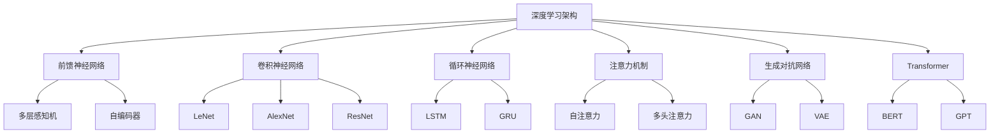

# 深度学习架构设计

## 1. 概述

### 1.1 理论基础

深度学习架构设计是现代人工智能的核心技术，它基于人工神经网络的理论基础，通过多层次的非线性变换来学习数据的复杂表示。深度学习架构的设计直接影响模型的性能、效率和可解释性。

### 1.2 核心概念

- **神经网络**：由多个神经元连接而成的计算模型
- **深度学习**：使用多层神经网络进行特征学习
- **架构设计**：网络结构的组织和设计
- **优化算法**：训练网络参数的方法

### 1.3 架构分类



## 2. 前馈神经网络架构

### 2.1 多层感知机 (MLP)

**数学定义**：
对于输入 $x \in \mathbb{R}^d$，MLP的输出为：

$$f(x) = W_L \sigma(W_{L-1} \sigma(\cdots \sigma(W_1 x + b_1) \cdots) + b_{L-1}) + b_L$$

其中 $W_i$ 是权重矩阵，$b_i$ 是偏置向量，$\sigma$ 是激活函数。

**架构设计**：

```python
import torch
import torch.nn as nn

class MLP(nn.Module):
    def __init__(self, input_dim, hidden_dims, output_dim, dropout=0.1):
        super(MLP, self).__init__()
        
        layers = []
        prev_dim = input_dim
        
        for hidden_dim in hidden_dims:
            layers.extend([
                nn.Linear(prev_dim, hidden_dim),
                nn.ReLU(),
                nn.Dropout(dropout)
            ])
            prev_dim = hidden_dim
        
        layers.append(nn.Linear(prev_dim, output_dim))
        
        self.network = nn.Sequential(*layers)
        
    def forward(self, x):
        return self.network(x)

# 使用示例
mlp = MLP(input_dim=784, hidden_dims=[512, 256, 128], output_dim=10)
```

### 2.2 自编码器 (Autoencoder)

**目标**：学习数据的压缩表示

**架构设计**：

```python
class Autoencoder(nn.Module):
    def __init__(self, input_dim, encoding_dim):
        super(Autoencoder, self).__init__()
        
        # 编码器
        self.encoder = nn.Sequential(
            nn.Linear(input_dim, 512),
            nn.ReLU(),
            nn.Linear(512, 256),
            nn.ReLU(),
            nn.Linear(256, encoding_dim)
        )
        
        # 解码器
        self.decoder = nn.Sequential(
            nn.Linear(encoding_dim, 256),
            nn.ReLU(),
            nn.Linear(256, 512),
            nn.ReLU(),
            nn.Linear(512, input_dim),
            nn.Sigmoid()
        )
        
    def forward(self, x):
        encoded = self.encoder(x)
        decoded = self.decoder(encoded)
        return decoded
    
    def encode(self, x):
        return self.encoder(x)
```

## 3. 卷积神经网络架构

### 3.1 基础CNN架构

**卷积操作**：
$$(f * k)(p) = \sum_{s+t=p} f(s) k(t)$$

**池化操作**：
$$\text{maxpool}(x) = \max_{i,j \in \text{window}} x_{i,j}$$

**架构设计**：

```python
class CNN(nn.Module):
    def __init__(self, num_classes=10):
        super(CNN, self).__init__()
        
        # 卷积层
        self.conv_layers = nn.Sequential(
            nn.Conv2d(1, 32, kernel_size=3, padding=1),
            nn.ReLU(),
            nn.MaxPool2d(2, 2),
            
            nn.Conv2d(32, 64, kernel_size=3, padding=1),
            nn.ReLU(),
            nn.MaxPool2d(2, 2),
            
            nn.Conv2d(64, 128, kernel_size=3, padding=1),
            nn.ReLU(),
            nn.MaxPool2d(2, 2)
        )
        
        # 全连接层
        self.fc_layers = nn.Sequential(
            nn.Linear(128 * 3 * 3, 512),
            nn.ReLU(),
            nn.Dropout(0.5),
            nn.Linear(512, num_classes)
        )
        
    def forward(self, x):
        x = self.conv_layers(x)
        x = x.view(x.size(0), -1)  # 展平
        x = self.fc_layers(x)
        return x
```

### 3.2 ResNet架构

**残差连接**：
$$F(x) = H(x) - x$$
$$H(x) = F(x) + x$$

**架构设计**：

```python
class ResidualBlock(nn.Module):
    def __init__(self, in_channels, out_channels, stride=1):
        super(ResidualBlock, self).__init__()
        
        self.conv1 = nn.Conv2d(in_channels, out_channels, kernel_size=3, 
                              stride=stride, padding=1, bias=False)
        self.bn1 = nn.BatchNorm2d(out_channels)
        self.conv2 = nn.Conv2d(out_channels, out_channels, kernel_size=3,
                              stride=1, padding=1, bias=False)
        self.bn2 = nn.BatchNorm2d(out_channels)
        
        self.shortcut = nn.Sequential()
        if stride != 1 or in_channels != out_channels:
            self.shortcut = nn.Sequential(
                nn.Conv2d(in_channels, out_channels, kernel_size=1, 
                         stride=stride, bias=False),
                nn.BatchNorm2d(out_channels)
            )
    
    def forward(self, x):
        out = torch.relu(self.bn1(self.conv1(x)))
        out = self.bn2(self.conv2(out))
        out += self.shortcut(x)
        out = torch.relu(out)
        return out

class ResNet(nn.Module):
    def __init__(self, block, num_blocks, num_classes=10):
        super(ResNet, self).__init__()
        self.in_channels = 64
        
        self.conv1 = nn.Conv2d(3, 64, kernel_size=3, stride=1, padding=1, bias=False)
        self.bn1 = nn.BatchNorm2d(64)
        
        self.layer1 = self.make_layer(block, 64, num_blocks[0], stride=1)
        self.layer2 = self.make_layer(block, 128, num_blocks[1], stride=2)
        self.layer3 = self.make_layer(block, 256, num_blocks[2], stride=2)
        self.layer4 = self.make_layer(block, 512, num_blocks[3], stride=2)
        
        self.linear = nn.Linear(512, num_classes)
    
    def make_layer(self, block, out_channels, num_blocks, stride):
        strides = [stride] + [1] * (num_blocks - 1)
        layers = []
        for stride in strides:
            layers.append(block(self.in_channels, out_channels, stride))
            self.in_channels = out_channels
        return nn.Sequential(*layers)
    
    def forward(self, x):
        out = torch.relu(self.bn1(self.conv1(x)))
        out = self.layer1(out)
        out = self.layer2(out)
        out = self.layer3(out)
        out = self.layer4(out)
        out = torch.avg_pool2d(out, 4)
        out = out.view(out.size(0), -1)
        out = self.linear(out)
        return out
```

## 4. 循环神经网络架构

### 4.1 LSTM架构

**LSTM单元**：
$$f_t = \sigma(W_f \cdot [h_{t-1}, x_t] + b_f)$$
$$i_t = \sigma(W_i \cdot [h_{t-1}, x_t] + b_i)$$
$$\tilde{C}_t = \tanh(W_C \cdot [h_{t-1}, x_t] + b_C)$$
$$C_t = f_t * C_{t-1} + i_t * \tilde{C}_t$$
$$o_t = \sigma(W_o \cdot [h_{t-1}, x_t] + b_o)$$
$$h_t = o_t * \tanh(C_t)$$

**架构设计**：

```python
class LSTMCell(nn.Module):
    def __init__(self, input_size, hidden_size):
        super(LSTMCell, self).__init__()
        self.input_size = input_size
        self.hidden_size = hidden_size
        
        self.W_f = nn.Linear(input_size + hidden_size, hidden_size)
        self.W_i = nn.Linear(input_size + hidden_size, hidden_size)
        self.W_C = nn.Linear(input_size + hidden_size, hidden_size)
        self.W_o = nn.Linear(input_size + hidden_size, hidden_size)
        
    def forward(self, x, h, c):
        combined = torch.cat([x, h], dim=1)
        
        f_t = torch.sigmoid(self.W_f(combined))
        i_t = torch.sigmoid(self.W_i(combined))
        C_tilde = torch.tanh(self.W_C(combined))
        o_t = torch.sigmoid(self.W_o(combined))
        
        c_new = f_t * c + i_t * C_tilde
        h_new = o_t * torch.tanh(c_new)
        
        return h_new, c_new

class LSTM(nn.Module):
    def __init__(self, input_size, hidden_size, num_layers, num_classes):
        super(LSTM, self).__init__()
        self.hidden_size = hidden_size
        self.num_layers = num_layers
        
        self.lstm_cells = nn.ModuleList([
            LSTMCell(input_size if i == 0 else hidden_size, hidden_size)
            for i in range(num_layers)
        ])
        
        self.fc = nn.Linear(hidden_size, num_classes)
        
    def forward(self, x):
        batch_size, seq_len, input_size = x.size()
        
        h = torch.zeros(self.num_layers, batch_size, self.hidden_size).to(x.device)
        c = torch.zeros(self.num_layers, batch_size, self.hidden_size).to(x.device)
        
        for t in range(seq_len):
            x_t = x[:, t, :]
            for layer in range(self.num_layers):
                if layer == 0:
                    h[layer], c[layer] = self.lstm_cells[layer](x_t, h[layer], c[layer])
                else:
                    h[layer], c[layer] = self.lstm_cells[layer](h[layer-1], h[layer], c[layer])
        
        out = self.fc(h[-1])
        return out
```

### 4.2 GRU架构

**GRU单元**：
$$z_t = \sigma(W_z \cdot [h_{t-1}, x_t])$$
$$r_t = \sigma(W_r \cdot [h_{t-1}, x_t])$$
$$\tilde{h}_t = \tanh(W \cdot [r_t * h_{t-1}, x_t])$$
$$h_t = (1 - z_t) * h_{t-1} + z_t * \tilde{h}_t$$

**架构设计**：

```python
class GRU(nn.Module):
    def __init__(self, input_size, hidden_size, num_layers, num_classes):
        super(GRU, self).__init__()
        self.hidden_size = hidden_size
        self.num_layers = num_layers
        
        self.gru = nn.GRU(input_size, hidden_size, num_layers, batch_first=True)
        self.fc = nn.Linear(hidden_size, num_classes)
        
    def forward(self, x):
        h0 = torch.zeros(self.num_layers, x.size(0), self.hidden_size).to(x.device)
        out, _ = self.gru(x, h0)
        out = self.fc(out[:, -1, :])
        return out
```

## 5. 注意力机制架构

### 5.1 自注意力机制

**注意力计算**：
$$\text{Attention}(Q, K, V) = \text{softmax}\left(\frac{QK^T}{\sqrt{d_k}}\right)V$$

其中 $Q$, $K$, $V$ 分别是查询、键、值矩阵。

**架构设计**：

```python
class SelfAttention(nn.Module):
    def __init__(self, d_model, num_heads):
        super(SelfAttention, self).__init__()
        self.d_model = d_model
        self.num_heads = num_heads
        self.d_k = d_model // num_heads
        
        self.W_q = nn.Linear(d_model, d_model)
        self.W_k = nn.Linear(d_model, d_model)
        self.W_v = nn.Linear(d_model, d_model)
        self.W_o = nn.Linear(d_model, d_model)
        
    def scaled_dot_product_attention(self, Q, K, V, mask=None):
        scores = torch.matmul(Q, K.transpose(-2, -1)) / math.sqrt(self.d_k)
        
        if mask is not None:
            scores = scores.masked_fill(mask == 0, -1e9)
        
        attention_weights = torch.softmax(scores, dim=-1)
        output = torch.matmul(attention_weights, V)
        
        return output, attention_weights
    
    def forward(self, x, mask=None):
        batch_size, seq_len, d_model = x.size()
        
        Q = self.W_q(x).view(batch_size, seq_len, self.num_heads, self.d_k).transpose(1, 2)
        K = self.W_k(x).view(batch_size, seq_len, self.num_heads, self.d_k).transpose(1, 2)
        V = self.W_v(x).view(batch_size, seq_len, self.num_heads, self.d_k).transpose(1, 2)
        
        output, attention_weights = self.scaled_dot_product_attention(Q, K, V, mask)
        
        output = output.transpose(1, 2).contiguous().view(batch_size, seq_len, d_model)
        output = self.W_o(output)
        
        return output, attention_weights
```

### 5.2 多头注意力

**多头注意力**：
$$\text{MultiHead}(Q, K, V) = \text{Concat}(\text{head}_1, \ldots, \text{head}_h)W^O$$

其中 $\text{head}_i = \text{Attention}(QW_i^Q, KW_i^K, VW_i^V)$

**架构设计**：

```python
class MultiHeadAttention(nn.Module):
    def __init__(self, d_model, num_heads):
        super(MultiHeadAttention, self).__init__()
        self.d_model = d_model
        self.num_heads = num_heads
        self.d_k = d_model // num_heads
        
        self.W_q = nn.Linear(d_model, d_model)
        self.W_k = nn.Linear(d_model, d_model)
        self.W_v = nn.Linear(d_model, d_model)
        self.W_o = nn.Linear(d_model, d_model)
        
    def forward(self, query, key, value, mask=None):
        batch_size = query.size(0)
        
        # 线性变换并分割为多头
        Q = self.W_q(query).view(batch_size, -1, self.num_heads, self.d_k).transpose(1, 2)
        K = self.W_k(key).view(batch_size, -1, self.num_heads, self.d_k).transpose(1, 2)
        V = self.W_v(value).view(batch_size, -1, self.num_heads, self.d_k).transpose(1, 2)
        
        # 计算注意力
        scores = torch.matmul(Q, K.transpose(-2, -1)) / math.sqrt(self.d_k)
        
        if mask is not None:
            scores = scores.masked_fill(mask == 0, -1e9)
        
        attention_weights = torch.softmax(scores, dim=-1)
        context = torch.matmul(attention_weights, V)
        
        # 合并多头
        context = context.transpose(1, 2).contiguous().view(batch_size, -1, self.d_model)
        output = self.W_o(context)
        
        return output, attention_weights
```

## 6. Transformer架构

### 6.1 Transformer编码器

**位置编码**：
$$PE_{(pos, 2i)} = \sin(pos / 10000^{2i/d_{model}})$$
$$PE_{(pos, 2i+1)} = \cos(pos / 10000^{2i/d_{model}})$$

**架构设计**：

```python
class PositionalEncoding(nn.Module):
    def __init__(self, d_model, max_len=5000):
        super(PositionalEncoding, self).__init__()
        
        pe = torch.zeros(max_len, d_model)
        position = torch.arange(0, max_len, dtype=torch.float).unsqueeze(1)
        div_term = torch.exp(torch.arange(0, d_model, 2).float() * (-math.log(10000.0) / d_model))
        
        pe[:, 0::2] = torch.sin(position * div_term)
        pe[:, 1::2] = torch.cos(position * div_term)
        pe = pe.unsqueeze(0).transpose(0, 1)
        
        self.register_buffer('pe', pe)
        
    def forward(self, x):
        return x + self.pe[:x.size(0), :]

class TransformerEncoder(nn.Module):
    def __init__(self, d_model, num_heads, num_layers, d_ff, dropout=0.1):
        super(TransformerEncoder, self).__init__()
        
        self.d_model = d_model
        self.num_layers = num_layers
        
        self.embedding = nn.Embedding(10000, d_model)  # 假设词汇表大小为10000
        self.pos_encoding = PositionalEncoding(d_model)
        
        encoder_layers = nn.TransformerEncoderLayer(
            d_model=d_model,
            nhead=num_heads,
            dim_feedforward=d_ff,
            dropout=dropout
        )
        
        self.transformer_encoder = nn.TransformerEncoder(encoder_layers, num_layers)
        self.dropout = nn.Dropout(dropout)
        
    def forward(self, src, src_mask=None):
        src = self.embedding(src) * math.sqrt(self.d_model)
        src = self.pos_encoding(src)
        src = self.dropout(src)
        
        output = self.transformer_encoder(src, src_mask)
        return output
```

### 6.2 BERT架构

**掩码语言模型**：
$$\mathcal{L} = \sum_{i \in \mathcal{M}} -\log P(x_i | x_{\setminus \mathcal{M}})$$

**架构设计**：

```python
class BERT(nn.Module):
    def __init__(self, vocab_size, d_model, num_heads, num_layers, d_ff, max_len=512):
        super(BERT, self).__init__()
        
        self.embedding = nn.Embedding(vocab_size, d_model)
        self.pos_encoding = PositionalEncoding(d_model, max_len)
        self.segment_embedding = nn.Embedding(2, d_model)  # 句子A和句子B
        
        encoder_layers = nn.TransformerEncoderLayer(
            d_model=d_model,
            nhead=num_heads,
            dim_feedforward=d_ff,
            dropout=0.1
        )
        
        self.transformer = nn.TransformerEncoder(encoder_layers, num_layers)
        
        # MLM头部
        self.mlm_head = nn.Sequential(
            nn.Linear(d_model, d_model),
            nn.GELU(),
            nn.LayerNorm(d_model),
            nn.Linear(d_model, vocab_size)
        )
        
        # NSP头部
        self.nsp_head = nn.Linear(d_model, 2)
        
    def forward(self, input_ids, token_type_ids=None, attention_mask=None):
        batch_size, seq_len = input_ids.size()
        
        # 嵌入
        embeddings = self.embedding(input_ids)
        embeddings += self.pos_encoding(embeddings)
        
        if token_type_ids is not None:
            embeddings += self.segment_embedding(token_type_ids)
        
        # Transformer编码
        if attention_mask is not None:
            attention_mask = attention_mask.unsqueeze(1).unsqueeze(2)
            attention_mask = (1.0 - attention_mask) * -10000.0
        
        encoded = self.transformer(embeddings, src_key_padding_mask=attention_mask)
        
        # MLM预测
        mlm_logits = self.mlm_head(encoded)
        
        # NSP预测
        nsp_logits = self.nsp_head(encoded[:, 0, :])  # [CLS] token
        
        return mlm_logits, nsp_logits
```

## 7. 生成对抗网络架构

### 7.1 GAN架构

**目标函数**：
$$\min_G \max_D V(D, G) = \mathbb{E}_{x \sim p_{data}(x)}[\log D(x)] + \mathbb{E}_{z \sim p_z(z)}[\log(1 - D(G(z)))]$$

**架构设计**：

```python
class Generator(nn.Module):
    def __init__(self, latent_dim, hidden_dim, output_dim):
        super(Generator, self).__init__()
        
        self.network = nn.Sequential(
            nn.Linear(latent_dim, hidden_dim),
            nn.ReLU(),
            nn.Linear(hidden_dim, hidden_dim * 2),
            nn.ReLU(),
            nn.Linear(hidden_dim * 2, hidden_dim * 4),
            nn.ReLU(),
            nn.Linear(hidden_dim * 4, output_dim),
            nn.Tanh()
        )
        
    def forward(self, z):
        return self.network(z)

class Discriminator(nn.Module):
    def __init__(self, input_dim, hidden_dim):
        super(Discriminator, self).__init__()
        
        self.network = nn.Sequential(
            nn.Linear(input_dim, hidden_dim * 4),
            nn.LeakyReLU(0.2),
            nn.Linear(hidden_dim * 4, hidden_dim * 2),
            nn.LeakyReLU(0.2),
            nn.Linear(hidden_dim * 2, hidden_dim),
            nn.LeakyReLU(0.2),
            nn.Linear(hidden_dim, 1),
            nn.Sigmoid()
        )
        
    def forward(self, x):
        return self.network(x)

class GAN(nn.Module):
    def __init__(self, latent_dim, hidden_dim, output_dim):
        super(GAN, self).__init__()
        self.generator = Generator(latent_dim, hidden_dim, output_dim)
        self.discriminator = Discriminator(output_dim, hidden_dim)
        
    def forward(self, z):
        return self.generator(z)
```

### 7.2 VAE架构

**变分下界**：
$$\mathcal{L} = \mathbb{E}_{q(z|x)}[\log p(x|z)] - D_{KL}(q(z|x) \| p(z))$$

**架构设计**：

```python
class VAE(nn.Module):
    def __init__(self, input_dim, hidden_dim, latent_dim):
        super(VAE, self).__init__()
        
        # 编码器
        self.encoder = nn.Sequential(
            nn.Linear(input_dim, hidden_dim),
            nn.ReLU(),
            nn.Linear(hidden_dim, hidden_dim),
            nn.ReLU()
        )
        
        self.fc_mu = nn.Linear(hidden_dim, latent_dim)
        self.fc_var = nn.Linear(hidden_dim, latent_dim)
        
        # 解码器
        self.decoder = nn.Sequential(
            nn.Linear(latent_dim, hidden_dim),
            nn.ReLU(),
            nn.Linear(hidden_dim, hidden_dim),
            nn.ReLU(),
            nn.Linear(hidden_dim, input_dim),
            nn.Sigmoid()
        )
        
    def encode(self, x):
        h = self.encoder(x)
        mu = self.fc_mu(h)
        log_var = self.fc_var(h)
        return mu, log_var
    
    def reparameterize(self, mu, log_var):
        std = torch.exp(0.5 * log_var)
        eps = torch.randn_like(std)
        return mu + eps * std
    
    def decode(self, z):
        return self.decoder(z)
    
    def forward(self, x):
        mu, log_var = self.encode(x)
        z = self.reparameterize(mu, log_var)
        return self.decode(z), mu, log_var
    
    def loss_function(self, recon_x, x, mu, log_var):
        # 重构损失
        BCE = nn.functional.binary_cross_entropy(recon_x, x, reduction='sum')
        
        # KL散度
        KLD = -0.5 * torch.sum(1 + log_var - mu.pow(2) - log_var.exp())
        
        return BCE + KLD
```

## 8. 架构优化技术

### 8.1 批归一化

**批归一化**：
$$\text{BN}(x) = \gamma \frac{x - \mu}{\sqrt{\sigma^2 + \epsilon}} + \beta$$

**实现**：

```python
class BatchNormMLP(nn.Module):
    def __init__(self, input_dim, hidden_dims, output_dim):
        super(BatchNormMLP, self).__init__()
        
        layers = []
        prev_dim = input_dim
        
        for hidden_dim in hidden_dims:
            layers.extend([
                nn.Linear(prev_dim, hidden_dim),
                nn.BatchNorm1d(hidden_dim),
                nn.ReLU(),
                nn.Dropout(0.2)
            ])
            prev_dim = hidden_dim
        
        layers.append(nn.Linear(prev_dim, output_dim))
        
        self.network = nn.Sequential(*layers)
        
    def forward(self, x):
        return self.network(x)
```

### 8.2 残差连接

**残差连接**：
$$F(x) = H(x) - x$$
$$H(x) = F(x) + x$$

**实现**：

```python
class ResidualBlock(nn.Module):
    def __init__(self, dim):
        super(ResidualBlock, self).__init__()
        self.layers = nn.Sequential(
            nn.Linear(dim, dim),
            nn.ReLU(),
            nn.Linear(dim, dim)
        )
        
    def forward(self, x):
        return x + self.layers(x)

class ResidualMLP(nn.Module):
    def __init__(self, input_dim, hidden_dim, output_dim, num_blocks):
        super(ResidualMLP, self).__init__()
        
        self.input_layer = nn.Linear(input_dim, hidden_dim)
        self.residual_blocks = nn.ModuleList([
            ResidualBlock(hidden_dim) for _ in range(num_blocks)
        ])
        self.output_layer = nn.Linear(hidden_dim, output_dim)
        
    def forward(self, x):
        x = self.input_layer(x)
        for block in self.residual_blocks:
            x = block(x)
        return self.output_layer(x)
```

### 8.3 注意力机制优化

**缩放点积注意力优化**：

```python
class OptimizedAttention(nn.Module):
    def __init__(self, d_model, num_heads):
        super(OptimizedAttention, self).__init__()
        self.d_model = d_model
        self.num_heads = num_heads
        self.d_k = d_model // num_heads
        
        self.W_qkv = nn.Linear(d_model, 3 * d_model)  # 合并QKV计算
        self.W_o = nn.Linear(d_model, d_model)
        
    def forward(self, x, mask=None):
        batch_size, seq_len, d_model = x.size()
        
        # 合并QKV计算
        qkv = self.W_qkv(x).chunk(3, dim=-1)
        q, k, v = map(lambda t: t.view(batch_size, seq_len, self.num_heads, self.d_k).transpose(1, 2), qkv)
        
        # 计算注意力
        scores = torch.matmul(q, k.transpose(-2, -1)) / math.sqrt(self.d_k)
        
        if mask is not None:
            scores = scores.masked_fill(mask == 0, -1e9)
        
        attention_weights = torch.softmax(scores, dim=-1)
        context = torch.matmul(attention_weights, v)
        
        # 合并多头
        context = context.transpose(1, 2).contiguous().view(batch_size, seq_len, d_model)
        output = self.W_o(context)
        
        return output
```

## 9. 应用案例

### 9.1 图像分类

```python
class ImageClassifier(nn.Module):
    def __init__(self, num_classes=10):
        super(ImageClassifier, self).__init__()
        
        # 特征提取
        self.features = nn.Sequential(
            nn.Conv2d(3, 64, 3, padding=1),
            nn.ReLU(),
            nn.MaxPool2d(2, 2),
            
            nn.Conv2d(64, 128, 3, padding=1),
            nn.ReLU(),
            nn.MaxPool2d(2, 2),
            
            nn.Conv2d(128, 256, 3, padding=1),
            nn.ReLU(),
            nn.MaxPool2d(2, 2)
        )
        
        # 分类器
        self.classifier = nn.Sequential(
            nn.Linear(256 * 4 * 4, 512),
            nn.ReLU(),
            nn.Dropout(0.5),
            nn.Linear(512, num_classes)
        )
        
    def forward(self, x):
        x = self.features(x)
        x = x.view(x.size(0), -1)
        x = self.classifier(x)
        return x
```

### 9.2 文本生成

```python
class TextGenerator(nn.Module):
    def __init__(self, vocab_size, embedding_dim, hidden_dim, num_layers):
        super(TextGenerator, self).__init__()
        
        self.embedding = nn.Embedding(vocab_size, embedding_dim)
        self.lstm = nn.LSTM(embedding_dim, hidden_dim, num_layers, batch_first=True)
        self.fc = nn.Linear(hidden_dim, vocab_size)
        
    def forward(self, x, hidden=None):
        embedded = self.embedding(x)
        output, hidden = self.lstm(embedded, hidden)
        output = self.fc(output)
        return output, hidden
    
    def generate(self, start_tokens, max_length, temperature=1.0):
        self.eval()
        with torch.no_grad():
            hidden = None
            current_tokens = start_tokens
            
            for _ in range(max_length):
                output, hidden = self.forward(current_tokens.unsqueeze(0), hidden)
                logits = output[0, -1, :] / temperature
                probs = torch.softmax(logits, dim=-1)
                next_token = torch.multinomial(probs, 1)
                current_tokens = torch.cat([current_tokens, next_token])
                
        return current_tokens
```

### 9.3 推荐系统

```python
class RecommenderSystem(nn.Module):
    def __init__(self, num_users, num_items, embedding_dim):
        super(RecommenderSystem, self).__init__()
        
        self.user_embedding = nn.Embedding(num_users, embedding_dim)
        self.item_embedding = nn.Embedding(num_items, embedding_dim)
        
        self.mlp = nn.Sequential(
            nn.Linear(embedding_dim * 2, embedding_dim),
            nn.ReLU(),
            nn.Linear(embedding_dim, embedding_dim // 2),
            nn.ReLU(),
            nn.Linear(embedding_dim // 2, 1),
            nn.Sigmoid()
        )
        
    def forward(self, user_ids, item_ids):
        user_emb = self.user_embedding(user_ids)
        item_emb = self.item_embedding(item_ids)
        
        combined = torch.cat([user_emb, item_emb], dim=1)
        output = self.mlp(combined)
        
        return output.squeeze()
```

## 10. 性能优化

### 10.1 模型压缩

**知识蒸馏**：

```python
class KnowledgeDistillation(nn.Module):
    def __init__(self, teacher_model, student_model, temperature=4.0, alpha=0.7):
        super(KnowledgeDistillation, self).__init__()
        self.teacher_model = teacher_model
        self.student_model = student_model
        self.temperature = temperature
        self.alpha = alpha
        
    def forward(self, x):
        teacher_output = self.teacher_model(x)
        student_output = self.student_model(x)
        return teacher_output, student_output
    
    def distillation_loss(self, teacher_output, student_output, labels):
        # 知识蒸馏损失
        distillation_loss = nn.functional.kl_div(
            torch.log_softmax(student_output / self.temperature, dim=1),
            torch.softmax(teacher_output / self.temperature, dim=1),
            reduction='batchmean'
        ) * (self.temperature ** 2)
        
        # 学生模型损失
        student_loss = nn.functional.cross_entropy(student_output, labels)
        
        # 总损失
        total_loss = self.alpha * distillation_loss + (1 - self.alpha) * student_loss
        
        return total_loss
```

### 10.2 量化技术

**动态量化**：

```python
class QuantizedModel(nn.Module):
    def __init__(self, model):
        super(QuantizedModel, self).__init__()
        self.model = torch.quantization.quantize_dynamic(
            model, {nn.Linear, nn.Conv2d}, dtype=torch.qint8
        )
        
    def forward(self, x):
        return self.model(x)
```

## 11. 最佳实践

### 11.1 架构设计原则

1. **模块化设计**：将复杂网络分解为可重用的模块
2. **渐进式构建**：从简单架构开始，逐步增加复杂度
3. **正则化技术**：使用Dropout、BatchNorm等防止过拟合
4. **残差连接**：在深层网络中使用残差连接
5. **注意力机制**：在需要关注特定部分时使用注意力

### 11.2 训练策略

1. **学习率调度**：使用学习率衰减策略
2. **早停机制**：防止过拟合
3. **数据增强**：增加训练数据的多样性
4. **梯度裁剪**：防止梯度爆炸
5. **混合精度训练**：提高训练效率

### 11.3 评估方法

1. **交叉验证**：确保模型的泛化能力
2. **混淆矩阵**：详细分析分类性能
3. **ROC曲线**：评估二分类性能
4. **AUC指标**：综合评估模型性能

## 12. 未来发展方向

### 12.1 自动化架构搜索

- **Neural Architecture Search (NAS)**
- **AutoML技术**
- **元学习架构**

### 12.2 可解释性

- **注意力可视化**
- **特征重要性分析**
- **决策路径追踪**

### 12.3 效率优化

- **模型压缩技术**
- **量化优化**
- **边缘计算适配**

---

**相关链接**：

- [数据科学与机器学习理论体系](./3.1.22-数据科学与机器学习理论体系.md)
- [PostgreSQL与AI模型深度集成架构](../1-数据库系统/1.1-PostgreSQL/1.1.20-PostgreSQL与AI模型深度集成架构.md)

**最后更新时间**：2024年12月
**文档状态**：完成
