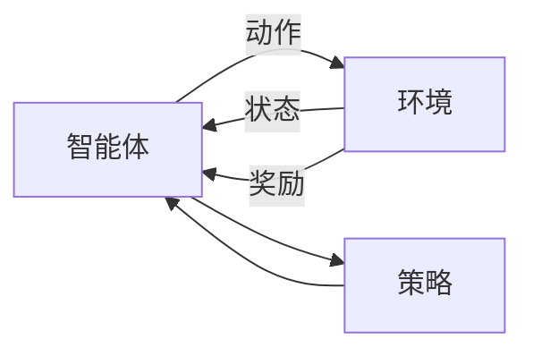

# 强化学习高级理论

## 1. 概述

### 1.1 理论基础

强化学习是机器学习的一个重要分支，它通过智能体与环境的交互来学习最优策略。强化学习的核心思想是通过试错和奖励机制来优化决策过程，使其能够在复杂环境中做出最优选择。

### 1.2 核心概念

- **智能体 (Agent)**：做出决策的实体
- **环境 (Environment)**：智能体交互的外部世界
- **状态 (State)**：环境在某一时刻的描述
- **动作 (Action)**：智能体可以执行的操作
- **奖励 (Reward)**：环境对动作的反馈
- **策略 (Policy)**：从状态到动作的映射

### 1.3 强化学习框架



## 2. 马尔可夫决策过程

### 2.1 基本定义

**马尔可夫决策过程 (MDP)** 是一个五元组 $(S, A, P, R, \gamma)$，其中：

- $S$ 是状态空间
- $A$ 是动作空间
- $P$ 是状态转移概率：$P(s'|s, a)$
- $R$ 是奖励函数：$R(s, a, s')$
- $\gamma$ 是折扣因子：$\gamma \in [0, 1]$

### 2.2 价值函数

**状态价值函数**：
$$V^\pi(s) = \mathbb{E}^\pi\left[\sum_{t=0}^{\infty} \gamma^t R_t | S_0 = s\right]$$

**动作价值函数**：
$$Q^\pi(s, a) = \mathbb{E}^\pi\left[\sum_{t=0}^{\infty} \gamma^t R_t | S_0 = s, A_0 = a\right]$$

**贝尔曼方程**：
$$V^\pi(s) = \sum_{a} \pi(a|s) \sum_{s'} P(s'|s, a) [R(s, a, s') + \gamma V^\pi(s')]$$

### 2.3 最优策略

**最优价值函数**：
$$V^*(s) = \max_\pi V^\pi(s)$$

**最优动作价值函数**：
$$Q^*(s, a) = \max_\pi Q^\pi(s, a)$$

**最优策略**：
$$\pi^*(s) = \arg\max_a Q^*(s, a)$$

## 3. 动态规划方法

### 3.1 值迭代

**值迭代算法**：
$$V_{k+1}(s) = \max_a \sum_{s'} P(s'|s, a) [R(s, a, s') + \gamma V_k(s')]$$

**实现**：

```python
import numpy as np

class ValueIteration:
    def __init__(self, states, actions, transition_prob, rewards, gamma=0.9):
        self.states = states
        self.actions = actions
        self.P = transition_prob
        self.R = rewards
        self.gamma = gamma
        self.V = np.zeros(len(states))
        
    def value_iteration(self, max_iterations=1000, epsilon=1e-6):
        """值迭代算法"""
        for iteration in range(max_iterations):
            V_prev = self.V.copy()
            
            for s in self.states:
                q_values = []
                for a in self.actions:
                    q_value = 0
                    for s_prime in self.states:
                        q_value += self.P[s][a][s_prime] * (
                            self.R[s][a][s_prime] + self.gamma * V_prev[s_prime]
                        )
                    q_values.append(q_value)
                
                self.V[s] = max(q_values)
            
            # 检查收敛
            if np.max(np.abs(self.V - V_prev)) < epsilon:
                print(f"收敛于第 {iteration + 1} 次迭代")
                break
        
        return self.V
    
    def extract_policy(self):
        """提取最优策略"""
        policy = {}
        for s in self.states:
            q_values = []
            for a in self.actions:
                q_value = 0
                for s_prime in self.states:
                    q_value += self.P[s][a][s_prime] * (
                        self.R[s][a][s_prime] + self.gamma * self.V[s_prime]
                    )
                q_values.append(q_value)
            policy[s] = self.actions[np.argmax(q_values)]
        
        return policy
```

### 3.2 策略迭代

**策略评估**：
$$V^{\pi_k}(s) = \sum_{a} \pi_k(a|s) \sum_{s'} P(s'|s, a) [R(s, a, s') + \gamma V^{\pi_k}(s')]$$

**策略改进**：
$$\pi_{k+1}(s) = \arg\max_a \sum_{s'} P(s'|s, a) [R(s, a, s') + \gamma V^{\pi_k}(s')]$$

**实现**：

```python
class PolicyIteration:
    def __init__(self, states, actions, transition_prob, rewards, gamma=0.9):
        self.states = states
        self.actions = actions
        self.P = transition_prob
        self.R = rewards
        self.gamma = gamma
        self.V = np.zeros(len(states))
        self.policy = {s: np.random.choice(actions) for s in states}
        
    def policy_evaluation(self, max_iterations=1000, epsilon=1e-6):
        """策略评估"""
        for iteration in range(max_iterations):
            V_prev = self.V.copy()
            
            for s in self.states:
                a = self.policy[s]
                self.V[s] = sum(
                    self.P[s][a][s_prime] * (
                        self.R[s][a][s_prime] + self.gamma * V_prev[s_prime]
                    )
                    for s_prime in self.states
                )
            
            if np.max(np.abs(self.V - V_prev)) < epsilon:
                break
        
        return self.V
    
    def policy_improvement(self):
        """策略改进"""
        policy_stable = True
        
        for s in self.states:
            old_action = self.policy[s]
            
            q_values = []
            for a in self.actions:
                q_value = sum(
                    self.P[s][a][s_prime] * (
                        self.R[s][a][s_prime] + self.gamma * self.V[s_prime]
                    )
                    for s_prime in self.states
                )
                q_values.append(q_value)
            
            self.policy[s] = self.actions[np.argmax(q_values)]
            
            if old_action != self.policy[s]:
                policy_stable = False
        
        return policy_stable
    
    def policy_iteration(self, max_iterations=100):
        """策略迭代算法"""
        for iteration in range(max_iterations):
            self.policy_evaluation()
            policy_stable = self.policy_improvement()
            
            if policy_stable:
                print(f"策略收敛于第 {iteration + 1} 次迭代")
                break
        
        return self.policy, self.V
```

## 4. 蒙特卡洛方法

### 4.1 蒙特卡洛预测

**蒙特卡洛预测**通过采样轨迹来估计价值函数：

$$V(s) = \frac{1}{N(s)} \sum_{i=1}^{N(s)} G_i(s)$$

其中 $G_i(s)$ 是从状态 $s$ 开始的第 $i$ 个回报。

**实现**：

```python
import random

class MonteCarlo:
    def __init__(self, states, actions, gamma=0.9):
        self.states = states
        self.actions = actions
        self.gamma = gamma
        self.V = {s: 0.0 for s in states}
        self.returns = {s: [] for s in states}
        
    def generate_episode(self, policy, start_state=None):
        """生成一个轨迹"""
        episode = []
        state = start_state if start_state else random.choice(self.states)
        
        while True:
            action = policy[state]
            # 这里需要与环境交互获取下一个状态和奖励
            next_state, reward = self.environment_step(state, action)
            
            episode.append((state, action, reward))
            
            if self.is_terminal(next_state):
                break
            
            state = next_state
        
        return episode
    
    def mc_prediction(self, policy, num_episodes=1000):
        """蒙特卡洛预测"""
        for episode_num in range(num_episodes):
            episode = self.generate_episode(policy)
            
            # 计算回报
            G = 0
            for t in range(len(episode) - 1, -1, -1):
                state, action, reward = episode[t]
                G = self.gamma * G + reward
                
                # 首次访问MC
                if state not in [episode[i][0] for i in range(t)]:
                    self.returns[state].append(G)
                    self.V[state] = np.mean(self.returns[state])
        
        return self.V
```

### 4.2 蒙特卡洛控制

**ε-贪婪策略**：
$$\pi(a|s) = \begin{cases}
1 - \epsilon + \frac{\epsilon}{|A(s)|} & \text{if } a = \arg\max_a Q(s, a) \\
\frac{\epsilon}{|A(s)|} & \text{otherwise}
\end{cases}$$

**实现**：

```python
class MonteCarloControl:
    def __init__(self, states, actions, gamma=0.9, epsilon=0.1):
        self.states = states
        self.actions = actions
        self.gamma = gamma
        self.epsilon = epsilon
        self.Q = {(s, a): 0.0 for s in states for a in actions}
        self.returns = {(s, a): [] for s in states for a in actions}
        self.policy = {s: random.choice(actions) for s in states}
        
    def epsilon_greedy_policy(self, state):
        """ε-贪婪策略"""
        if random.random() < self.epsilon:
            return random.choice(self.actions)
        else:
            return max(self.actions, key=lambda a: self.Q[(state, a)])
    
    def mc_control(self, num_episodes=1000):
        """蒙特卡洛控制"""
        for episode_num in range(num_episodes):
            episode = self.generate_episode(self.epsilon_greedy_policy)
            
            # 计算回报
            G = 0
            for t in range(len(episode) - 1, -1, -1):
                state, action, reward = episode[t]
                G = self.gamma * G + reward
                
                # 首次访问MC
                if (state, action) not in [(episode[i][0], episode[i][1]) for i in range(t)]:
                    self.returns[(state, action)].append(G)
                    self.Q[(state, action)] = np.mean(self.returns[(state, action)])
            
            # 更新策略
            for state in self.states:
                self.policy[state] = max(self.actions, key=lambda a: self.Q[(state, a)])
        
        return self.policy, self.Q
```

## 5. 时序差分学习

### 5.1 Q学习

**Q学习更新规则**：
$$Q(s_t, a_t) \leftarrow Q(s_t, a_t) + \alpha[r_t + \gamma \max_{a} Q(s_{t+1}, a) - Q(s_t, a_t)]$$

**实现**：

```python
class QLearning:
    def __init__(self, states, actions, alpha=0.1, gamma=0.9, epsilon=0.1):
        self.states = states
        self.actions = actions
        self.alpha = alpha
        self.gamma = gamma
        self.epsilon = epsilon
        self.Q = {(s, a): 0.0 for s in states for a in actions}
        
    def epsilon_greedy_action(self, state):
        """ε-贪婪动作选择"""
        if random.random() < self.epsilon:
            return random.choice(self.actions)
        else:
            return max(self.actions, key=lambda a: self.Q[(state, a)])
    
    def update(self, state, action, reward, next_state):
        """Q值更新"""
        best_next_action = max(self.actions, key=lambda a: self.Q[(next_state, a)])
        td_target = reward + self.gamma * self.Q[(next_state, best_next_action)]
        td_error = td_target - self.Q[(state, action)]
        self.Q[(state, action)] += self.alpha * td_error
    
    def train(self, num_episodes=1000):
        """训练Q学习智能体"""
        for episode in range(num_episodes):
            state = self.reset_environment()
            
            while not self.is_terminal(state):
                action = self.epsilon_greedy_action(state)
                next_state, reward = self.environment_step(state, action)
                
                self.update(state, action, reward, next_state)
                state = next_state
            
            # 衰减探索率
            self.epsilon = max(0.01, self.epsilon * 0.995)
        
        return self.Q
    
    def get_policy(self):
        """获取最优策略"""
        policy = {}
        for state in self.states:
            policy[state] = max(self.actions, key=lambda a: self.Q[(state, a)])
        return policy
```

### 5.2 SARSA

**SARSA更新规则**：
$$Q(s_t, a_t) \leftarrow Q(s_t, a_t) + \alpha[r_t + \gamma Q(s_{t+1}, a_{t+1}) - Q(s_t, a_t)]$$

**实现**：

```python
class SARSA:
    def __init__(self, states, actions, alpha=0.1, gamma=0.9, epsilon=0.1):
        self.states = states
        self.actions = actions
        self.alpha = alpha
        self.gamma = gamma
        self.epsilon = epsilon
        self.Q = {(s, a): 0.0 for s in states for a in actions}
        
    def epsilon_greedy_action(self, state):
        """ε-贪婪动作选择"""
        if random.random() < self.epsilon:
            return random.choice(self.actions)
        else:
            return max(self.actions, key=lambda a: self.Q[(state, a)])
    
    def update(self, state, action, reward, next_state, next_action):
        """SARSA更新"""
        td_target = reward + self.gamma * self.Q[(next_state, next_action)]
        td_error = td_target - self.Q[(state, action)]
        self.Q[(state, action)] += self.alpha * td_error
    
    def train(self, num_episodes=1000):
        """训练SARSA智能体"""
        for episode in range(num_episodes):
            state = self.reset_environment()
            action = self.epsilon_greedy_action(state)
            
            while not self.is_terminal(state):
                next_state, reward = self.environment_step(state, action)
                next_action = self.epsilon_greedy_action(next_state)
                
                self.update(state, action, reward, next_state, next_action)
                
                state = next_state
                action = next_action
            
            # 衰减探索率
            self.epsilon = max(0.01, self.epsilon * 0.995)
        
        return self.Q
```

## 6. 策略梯度方法

### 6.1 REINFORCE算法

**策略梯度定理**：
$$\nabla_\theta J(\theta) = \mathbb{E}_{\pi_\theta}[\nabla_\theta \log \pi_\theta(a|s) G_t]$$

**REINFORCE更新规则**：
$$\theta_{t+1} = \theta_t + \alpha \nabla_\theta \log \pi_\theta(a_t|s_t) G_t$$

**实现**：

```python
import torch
import torch.nn as nn
import torch.optim as optim

class PolicyNetwork(nn.Module):
    def __init__(self, state_dim, action_dim, hidden_dim=64):
        super(PolicyNetwork, self).__init__()
        self.fc1 = nn.Linear(state_dim, hidden_dim)
        self.fc2 = nn.Linear(hidden_dim, hidden_dim)
        self.fc3 = nn.Linear(hidden_dim, action_dim)
        
    def forward(self, x):
        x = torch.relu(self.fc1(x))
        x = torch.relu(self.fc2(x))
        x = torch.softmax(self.fc3(x), dim=-1)
        return x

class REINFORCE:
    def __init__(self, state_dim, action_dim, lr=0.001, gamma=0.99):
        self.policy_network = PolicyNetwork(state_dim, action_dim)
        self.optimizer = optim.Adam(self.policy_network.parameters(), lr=lr)
        self.gamma = gamma
        
    def select_action(self, state):
        """选择动作"""
        state = torch.FloatTensor(state)
        action_probs = self.policy_network(state)
        action = torch.multinomial(action_probs, 1)
        return action.item(), action_probs[action.item()]
    
    def update_policy(self, states, actions, rewards):
        """更新策略"""
        # 计算折扣奖励
        discounted_rewards = []
        G = 0
        for r in reversed(rewards):
            G = r + self.gamma * G
            discounted_rewards.insert(0, G)
        
        # 标准化奖励
        discounted_rewards = torch.FloatTensor(discounted_rewards)
        discounted_rewards = (discounted_rewards - discounted_rewards.mean()) / (discounted_rewards.std() + 1e-8)
        
        # 计算损失
        loss = 0
        for state, action, reward in zip(states, actions, discounted_rewards):
            state = torch.FloatTensor(state)
            action_probs = self.policy_network(state)
            log_prob = torch.log(action_probs[action])
            loss -= log_prob * reward
        
        # 更新网络
        self.optimizer.zero_grad()
        loss.backward()
        self.optimizer.step()
    
    def train(self, num_episodes=1000):
        """训练REINFORCE智能体"""
        for episode in range(num_episodes):
            states, actions, rewards = [], [], []
            state = self.reset_environment()
            
            while not self.is_terminal(state):
                action, _ = self.select_action(state)
                next_state, reward = self.environment_step(state, action)
                
                states.append(state)
                actions.append(action)
                rewards.append(reward)
                
                state = next_state
            
            self.update_policy(states, actions, rewards)
```

### 6.2 Actor-Critic方法

**Actor-Critic更新规则**：
$$\theta_{t+1} = \theta_t + \alpha_\theta \nabla_\theta \log \pi_\theta(a_t|s_t) \delta_t$$
$$w_{t+1} = w_t + \alpha_w \delta_t \nabla_w V_w(s_t)$$

其中 $\delta_t = r_t + \gamma V_w(s_{t+1}) - V_w(s_t)$ 是TD误差。

**实现**：

```python
class ActorCritic(nn.Module):
    def __init__(self, state_dim, action_dim, hidden_dim=64):
        super(ActorCritic, self).__init__()
        
        # Actor网络（策略网络）
        self.actor = nn.Sequential(
            nn.Linear(state_dim, hidden_dim),
            nn.ReLU(),
            nn.Linear(hidden_dim, action_dim),
            nn.Softmax(dim=-1)
        )
        
        # Critic网络（价值网络）
        self.critic = nn.Sequential(
            nn.Linear(state_dim, hidden_dim),
            nn.ReLU(),
            nn.Linear(hidden_dim, 1)
        )
        
    def forward(self, x):
        return self.actor(x), self.critic(x)

class ActorCriticAgent:
    def __init__(self, state_dim, action_dim, lr_actor=0.001, lr_critic=0.001, gamma=0.99):
        self.network = ActorCritic(state_dim, action_dim)
        self.actor_optimizer = optim.Adam(self.network.actor.parameters(), lr=lr_actor)
        self.critic_optimizer = optim.Adam(self.network.critic.parameters(), lr=lr_critic)
        self.gamma = gamma
        
    def select_action(self, state):
        """选择动作"""
        state = torch.FloatTensor(state)
        action_probs, _ = self.network(state)
        action = torch.multinomial(action_probs, 1)
        return action.item(), action_probs[action.item()]
    
    def update(self, state, action, reward, next_state, done):
        """更新Actor-Critic网络"""
        state = torch.FloatTensor(state)
        next_state = torch.FloatTensor(next_state)
        
        # 获取当前状态的价值和动作概率
        action_probs, value = self.network(state)
        _, next_value = self.network(next_state)
        
        # 计算TD误差
        td_target = reward + self.gamma * next_value * (1 - done)
        td_error = td_target - value
        
        # 计算损失
        log_prob = torch.log(action_probs[action])
        actor_loss = -log_prob * td_error.detach()
        critic_loss = td_error ** 2
        
        # 更新网络
        self.actor_optimizer.zero_grad()
        actor_loss.backward()
        self.actor_optimizer.step()
        
        self.critic_optimizer.zero_grad()
        critic_loss.backward()
        self.critic_optimizer.step()
    
    def train(self, num_episodes=1000):
        """训练Actor-Critic智能体"""
        for episode in range(num_episodes):
            state = self.reset_environment()
            
            while not self.is_terminal(state):
                action, _ = self.select_action(state)
                next_state, reward = self.environment_step(state, action)
                done = self.is_terminal(next_state)
                
                self.update(state, action, reward, next_state, done)
                state = next_state
```

## 7. 深度强化学习

### 7.1 DQN (Deep Q-Network)

**DQN更新规则**：
$$L(\theta) = \mathbb{E}[(r + \gamma \max_{a'} Q(s', a'; \theta^-) - Q(s, a; \theta))^2]$$

**实现**：

```python
class DQN(nn.Module):
    def __init__(self, state_dim, action_dim, hidden_dim=128):
        super(DQN, self).__init__()
        self.fc1 = nn.Linear(state_dim, hidden_dim)
        self.fc2 = nn.Linear(hidden_dim, hidden_dim)
        self.fc3 = nn.Linear(hidden_dim, action_dim)
        
    def forward(self, x):
        x = torch.relu(self.fc1(x))
        x = torch.relu(self.fc2(x))
        return self.fc3(x)

class DQNAgent:
    def __init__(self, state_dim, action_dim, lr=0.001, gamma=0.99, epsilon=0.1):
        self.q_network = DQN(state_dim, action_dim)
        self.target_network = DQN(state_dim, action_dim)
        self.target_network.load_state_dict(self.q_network.state_dict())
        
        self.optimizer = optim.Adam(self.q_network.parameters(), lr=lr)
        self.gamma = gamma
        self.epsilon = epsilon
        
        self.memory = []
        self.batch_size = 32
        
    def select_action(self, state):
        """选择动作"""
        if random.random() < self.epsilon:
            return random.randint(0, self.action_dim - 1)
        
        state = torch.FloatTensor(state)
        q_values = self.q_network(state)
        return q_values.argmax().item()
    
    def store_transition(self, state, action, reward, next_state, done):
        """存储经验"""
        self.memory.append((state, action, reward, next_state, done))
        
        if len(self.memory) > 10000:
            self.memory.pop(0)
    
    def update(self):
        """更新网络"""
        if len(self.memory) < self.batch_size:
            return
        
        batch = random.sample(self.memory, self.batch_size)
        states, actions, rewards, next_states, dones = zip(*batch)
        
        states = torch.FloatTensor(states)
        actions = torch.LongTensor(actions)
        rewards = torch.FloatTensor(rewards)
        next_states = torch.FloatTensor(next_states)
        dones = torch.FloatTensor(dones)
        
        current_q_values = self.q_network(states).gather(1, actions.unsqueeze(1))
        next_q_values = self.target_network(next_states).max(1)[0].detach()
        target_q_values = rewards + self.gamma * next_q_values * (1 - dones)
        
        loss = nn.MSELoss()(current_q_values.squeeze(), target_q_values)
        
        self.optimizer.zero_grad()
        loss.backward()
        self.optimizer.step()
    
    def update_target_network(self):
        """更新目标网络"""
        self.target_network.load_state_dict(self.q_network.state_dict())
    
    def train(self, num_episodes=1000):
        """训练DQN智能体"""
        for episode in range(num_episodes):
            state = self.reset_environment()
            
            while not self.is_terminal(state):
                action = self.select_action(state)
                next_state, reward = self.environment_step(state, action)
                done = self.is_terminal(next_state)
                
                self.store_transition(state, action, reward, next_state, done)
                self.update()
                
                state = next_state
            
            if episode % 10 == 0:
                self.update_target_network()
            
            self.epsilon = max(0.01, self.epsilon * 0.995)
```

### 7.2 DDPG (Deep Deterministic Policy Gradient)

**DDPG更新规则**：
$$\nabla_\theta J(\theta) = \mathbb{E}[\nabla_a Q(s, a; \phi)|_{a=\mu(s)} \nabla_\theta \mu(s; \theta)]$$

**实现**：

```python
class Actor(nn.Module):
    def __init__(self, state_dim, action_dim, hidden_dim=128):
        super(Actor, self).__init__()
        self.fc1 = nn.Linear(state_dim, hidden_dim)
        self.fc2 = nn.Linear(hidden_dim, hidden_dim)
        self.fc3 = nn.Linear(hidden_dim, action_dim)
        
    def forward(self, x):
        x = torch.relu(self.fc1(x))
        x = torch.relu(self.fc2(x))
        return torch.tanh(self.fc3(x))

class Critic(nn.Module):
    def __init__(self, state_dim, action_dim, hidden_dim=128):
        super(Critic, self).__init__()
        self.fc1 = nn.Linear(state_dim + action_dim, hidden_dim)
        self.fc2 = nn.Linear(hidden_dim, hidden_dim)
        self.fc3 = nn.Linear(hidden_dim, 1)
        
    def forward(self, state, action):
        x = torch.cat([state, action], dim=1)
        x = torch.relu(self.fc1(x))
        x = torch.relu(self.fc2(x))
        return self.fc3(x)

class DDPGAgent:
    def __init__(self, state_dim, action_dim, lr_actor=0.001, lr_critic=0.001, gamma=0.99):
        self.actor = Actor(state_dim, action_dim)
        self.critic = Critic(state_dim, action_dim)
        self.target_actor = Actor(state_dim, action_dim)
        self.target_critic = Critic(state_dim, action_dim)
        
        self.target_actor.load_state_dict(self.actor.state_dict())
        self.target_critic.load_state_dict(self.critic.state_dict())
        
        self.actor_optimizer = optim.Adam(self.actor.parameters(), lr=lr_actor)
        self.critic_optimizer = optim.Adam(self.critic.parameters(), lr=lr_critic)
        
        self.gamma = gamma
        self.memory = []
        
    def select_action(self, state, noise_scale=0.1):
        """选择动作"""
        state = torch.FloatTensor(state)
        action = self.actor(state)
        action += torch.randn_like(action) * noise_scale
        return torch.clamp(action, -1, 1).detach().numpy()
    
    def update(self, batch_size=32):
        """更新网络"""
        if len(self.memory) < batch_size:
            return
        
        batch = random.sample(self.memory, batch_size)
        states, actions, rewards, next_states, dones = zip(*batch)
        
        states = torch.FloatTensor(states)
        actions = torch.FloatTensor(actions)
        rewards = torch.FloatTensor(rewards)
        next_states = torch.FloatTensor(next_states)
        dones = torch.FloatTensor(dones)
        
        # 更新Critic
        next_actions = self.target_actor(next_states)
        target_q_values = self.target_critic(next_states, next_actions)
        target_q_values = rewards + self.gamma * target_q_values * (1 - dones)
        
        current_q_values = self.critic(states, actions)
        critic_loss = nn.MSELoss()(current_q_values, target_q_values.detach())
        
        self.critic_optimizer.zero_grad()
        critic_loss.backward()
        self.critic_optimizer.step()
        
        # 更新Actor
        actor_actions = self.actor(states)
        actor_loss = -self.critic(states, actor_actions).mean()
        
        self.actor_optimizer.zero_grad()
        actor_loss.backward()
        self.actor_optimizer.step()
    
    def update_target_networks(self, tau=0.001):
        """软更新目标网络"""
        for target_param, param in zip(self.target_actor.parameters(), self.actor.parameters()):
            target_param.data.copy_(tau * param.data + (1 - tau) * target_param.data)
        
        for target_param, param in zip(self.target_critic.parameters(), self.critic.parameters()):
            target_param.data.copy_(tau * param.data + (1 - tau) * target_param.data)
```

## 8. 应用案例

### 8.1 游戏AI

```python
class GameAI:
    def __init__(self, state_dim, action_dim):
        self.agent = DQNAgent(state_dim, action_dim)
        
    def train_on_game(self, game_env, num_episodes=1000):
        """在游戏环境中训练"""
        for episode in range(num_episodes):
            state = game_env.reset()
            total_reward = 0
            
            while not game_env.is_done():
                action = self.agent.select_action(state)
                next_state, reward, done = game_env.step(action)
                
                self.agent.store_transition(state, action, reward, next_state, done)
                self.agent.update()
                
                state = next_state
                total_reward += reward
            
            if episode % 100 == 0:
                print(f"Episode {episode}, Total Reward: {total_reward}")
```

### 8.2 机器人控制

```python
class RobotController:
    def __init__(self, state_dim, action_dim):
        self.agent = DDPGAgent(state_dim, action_dim)
        
    def train_robot(self, robot_env, num_episodes=1000):
        """训练机器人控制"""
        for episode in range(num_episodes):
            state = robot_env.reset()
            total_reward = 0
            
            while not robot_env.is_done():
                action = self.agent.select_action(state)
                next_state, reward, done = robot_env.step(action)
                
                self.agent.memory.append((state, action, reward, next_state, done))
                self.agent.update()
                self.agent.update_target_networks()
                
                state = next_state
                total_reward += reward
            
            if episode % 100 == 0:
                print(f"Episode {episode}, Total Reward: {total_reward}")
```

### 8.3 推荐系统

```python
class RLRecommender:
    def __init__(self, num_users, num_items):
        self.agent = QLearning(range(num_users), range(num_items))
        
    def recommend(self, user_id, context):
        """基于强化学习的推荐"""
        state = self.encode_state(user_id, context)
        action = self.agent.select_action(state)
        return action
    
    def update_recommendation(self, user_id, item_id, reward):
        """更新推荐策略"""
        state = self.encode_state(user_id, {})
        self.agent.update(state, item_id, reward, state)
```

## 9. 性能评估

### 9.1 评估指标

```python
def evaluate_agent(agent, env, num_episodes=100):
    """评估智能体性能"""
    total_rewards = []
    
    for episode in range(num_episodes):
        state = env.reset()
        episode_reward = 0
        
        while not env.is_done():
            action = agent.select_action(state)
            state, reward, done = env.step(action)
            episode_reward += reward
        
        total_rewards.append(episode_reward)
    
    return {
        'mean_reward': np.mean(total_rewards),
        'std_reward': np.std(total_rewards),
        'min_reward': np.min(total_rewards),
        'max_reward': np.max(total_rewards)
    }
```

### 9.2 收敛性分析

```python
def analyze_convergence(rewards_history):
    """分析算法收敛性"""
    window_size = 100
    moving_average = []
    
    for i in range(window_size, len(rewards_history)):
        avg = np.mean(rewards_history[i-window_size:i])
        moving_average.append(avg)
    
    return moving_average
```

## 10. 最佳实践

### 10.1 超参数调优

1. **学习率**：从0.001开始，根据收敛情况调整
2. **折扣因子**：通常设置为0.9-0.99
3. **探索率**：从0.1开始，逐渐衰减到0.01
4. **网络结构**：根据问题复杂度选择隐藏层大小

### 10.2 训练技巧

1. **经验回放**：使用经验回放缓冲区提高样本效率
2. **目标网络**：使用目标网络提高训练稳定性
3. **梯度裁剪**：防止梯度爆炸
4. **奖励塑形**：设计合适的奖励函数

### 10.3 调试方法

1. **损失监控**：监控训练损失的变化
2. **奖励曲线**：观察奖励的收敛情况
3. **策略可视化**：可视化学习到的策略
4. **超参数搜索**：使用网格搜索或贝叶斯优化

## 11. 未来发展方向

### 11.1 多智能体强化学习

- **合作与竞争**：多智能体之间的协作和竞争
- **通信机制**：智能体间的信息交换
- **层次化学习**：分层决策和学习

### 11.2 元强化学习

- **快速适应**：在新环境中快速学习
- **迁移学习**：将学到的知识迁移到新任务
- **元策略**：学习如何学习

### 11.3 安全强化学习

- **约束满足**：确保策略满足安全约束
- **风险感知**：考虑决策的风险
- **鲁棒性**：对环境变化具有鲁棒性

---

**相关链接**：
- [数据科学与机器学习理论体系](./3.1.22-数据科学与机器学习理论体系.md)
- [深度学习架构设计](./3.1.23-深度学习架构设计.md)

**最后更新时间**：2024年12月
**文档状态**：完成 