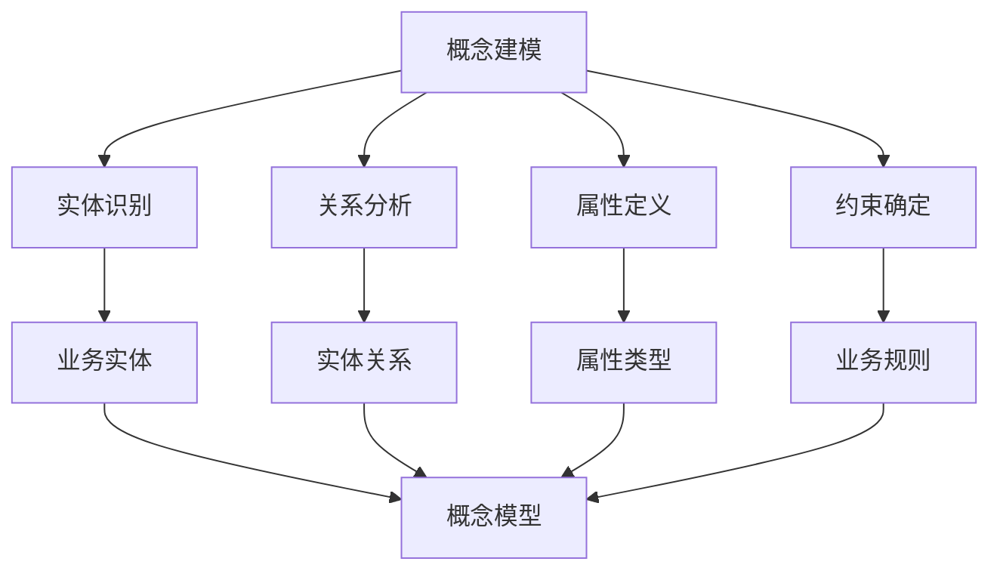
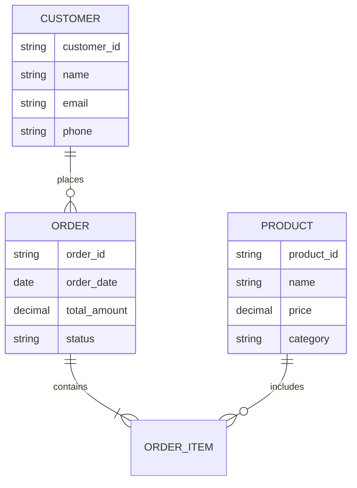
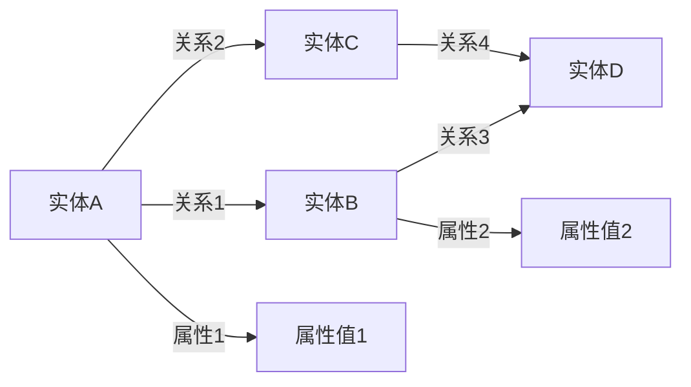
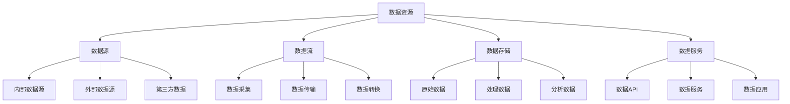
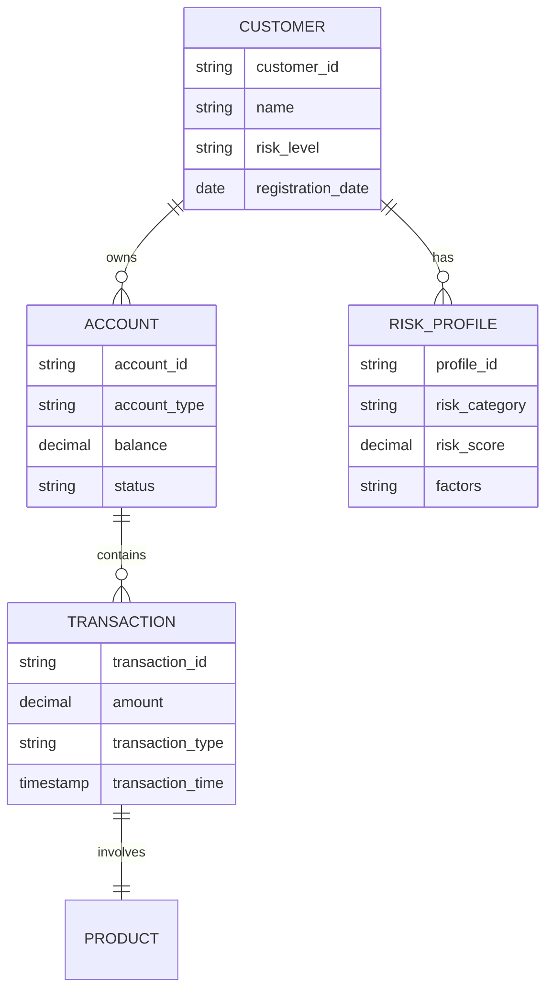
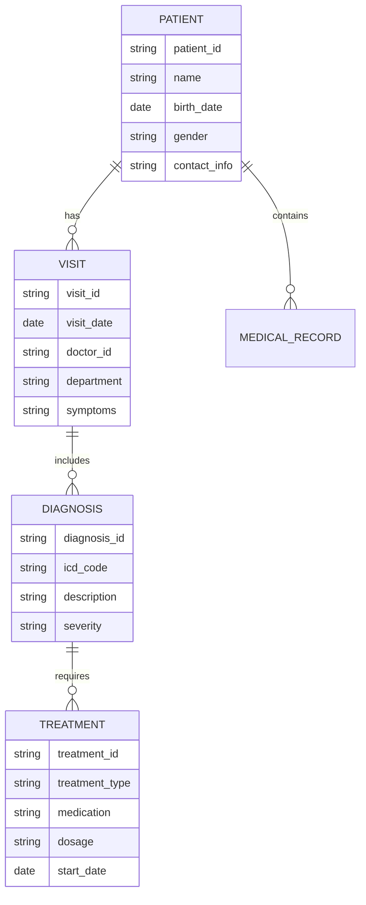
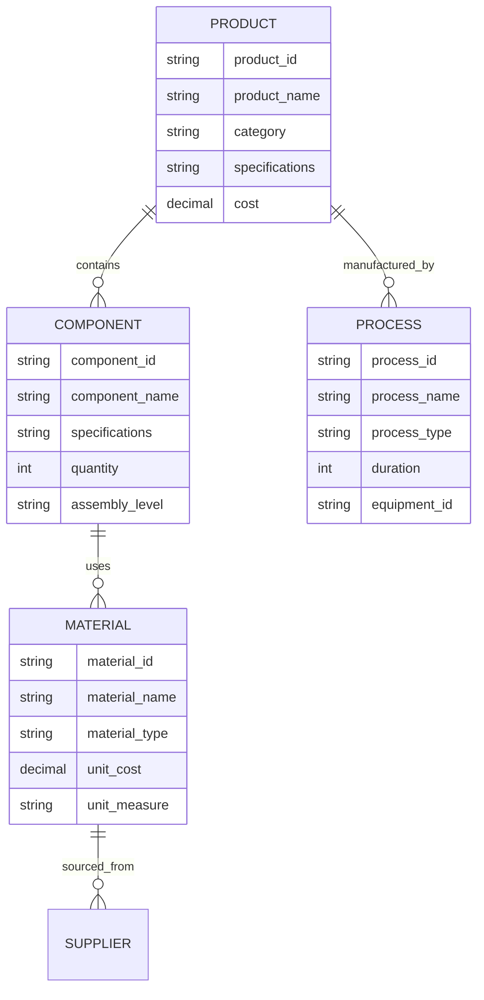
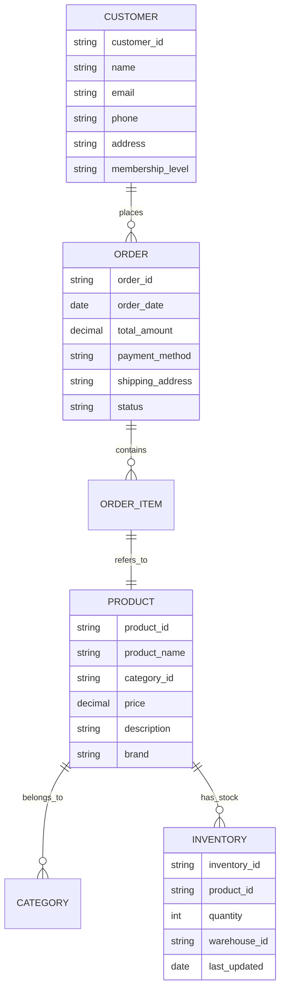
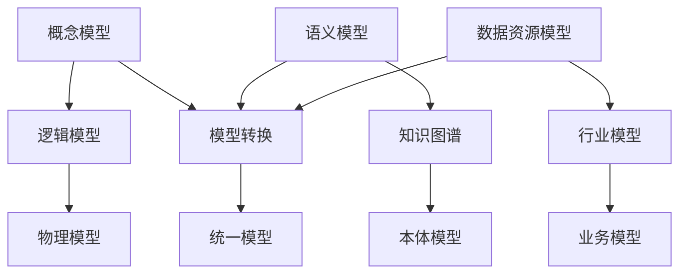

# 3.2.1-数据模型的形式化理论

## 📋 概述

数据模型的形式化理论是数据科学的核心基础，涵盖了从概念建模到语义模型的完整理论体系。本文档系统性地阐述数据建模的理论框架、分类体系和关联性分析。

## 🏗️ 数据建模理论框架

### 1. 建模层次体系

```text
┌─────────────────────────────────────┐
│           应用层建模                 │
│  (业务模型、行业模型、领域模型)        │
├─────────────────────────────────────┤
│           逻辑层建模                 │
│  (概念模型、语义模型、关系模型)        │
├─────────────────────────────────────┤
│           物理层建模                 │
│  (存储模型、索引模型、分布模型)        │
└─────────────────────────────────────┘
```

### 2. 建模分类体系

#### 2.1 按抽象层次分类

| 层次 | 模型类型 | 主要特征 | 应用场景 |
|------|----------|----------|----------|
| **概念层** | 概念模型 | 业务概念抽象、实体关系 | 需求分析、业务理解 |
| **逻辑层** | 逻辑模型 | 数据结构设计、约束定义 | 系统设计、数据规划 |
| **物理层** | 物理模型 | 存储结构、性能优化 | 实现部署、运维管理 |

#### 2.2 按建模目的分类

| 目的 | 模型类型 | 核心功能 | 典型应用 |
|------|----------|----------|----------|
| **描述性建模** | 概念模型 | 描述业务概念和关系 | 业务分析、需求收集 |
| **规范性建模** | 逻辑模型 | 定义数据结构和约束 | 系统设计、数据规范 |
| **操作性建模** | 物理模型 | 优化存储和性能 | 实现部署、性能调优 |

## 🧠 概念建模理论

### 1. 概念建模基础

#### 1.1 核心概念

- **实体(Entity)**：现实世界中的对象或概念
- **属性(Attribute)**：实体的特征或性质
- **关系(Relationship)**：实体间的联系
- **约束(Constraint)**：数据必须满足的条件

#### 1.2 建模原则



### 2. 概念建模方法

#### 2.1 实体关系建模(ERM)



#### 2.2 统一建模语言(UML)

- **类图(Class Diagram)**：描述系统的静态结构
- **对象图(Object Diagram)**：描述特定时刻的对象状态
- **用例图(Use Case Diagram)**：描述系统功能需求

## 🌐 语义模型理论

### 1. 语义模型基础

#### 1.1 语义层次

```text
┌─────────────────────────────────────┐
│           语义层                     │
│  (本体、知识图谱、语义网络)           │
├─────────────────────────────────────┤
│           语法层                    │
│  (数据格式、结构定义、语法规则)       │
├─────────────────────────────────────┤
│           物理层                    │
│  (存储格式、传输协议、硬件实现)       │
└─────────────────────────────────────┘
```

#### 1.2 语义模型类型

| 类型 | 特征 | 应用 | 技术栈 |
|------|------|------|--------|
| **本体模型** | 概念层次、推理能力 | 知识表示、智能推理 | OWL、RDF、SPARQL |
| **语义网络** | 节点关系、图结构 | 知识图谱、关系挖掘 | Neo4j、GraphDB |
| **概念图** | 概念连接、语义关系 | 知识组织、学习辅助 | CMap、VUE |

### 2. 语义建模方法

#### 2.1 本体建模

```turtle
@prefix rdf: <http://www.w3.org/1999/02/22-rdf-syntax-ns#> .
@prefix rdfs: <http://www.w3.org/2000/01/rdf-schema#> .
@prefix owl: <http://www.w3.org/2002/07/owl#> .

# 类定义
:Person rdf:type owl:Class .
:Organization rdf:type owl:Class .
:Employee rdf:type owl:Class .

# 属性定义
:worksFor rdf:type owl:ObjectProperty .
:hasName rdf:type owl:DatatypeProperty .

# 关系定义
:Employee rdfs:subClassOf :Person .
:worksFor rdfs:domain :Person .
:worksFor rdfs:range :Organization .
```

#### 2.2 知识图谱建模



## 📊 数据资源模型

### 1. 数据资源分类

#### 1.1 按数据来源分类

| 类别 | 特征 | 示例 | 处理方式 |
|------|------|------|----------|
| **结构化数据** | 固定格式、关系明确 | 数据库表、CSV文件 | SQL查询、ETL处理 |
| **半结构化数据** | 部分结构、格式灵活 | JSON、XML、日志 | 解析提取、模式匹配 |
| **非结构化数据** | 无固定格式、内容多样 | 文本、图像、视频 | NLP、CV、音频处理 |

#### 1.2 按数据性质分类

| 性质 | 特征 | 应用场景 | 技术栈 |
|------|------|----------|--------|
| **事务数据** | 实时性、一致性 | 业务交易、用户操作 | 关系数据库、ACID |
| **分析数据** | 历史性、聚合性 | 报表分析、决策支持 | 数据仓库、OLAP |
| **流式数据** | 实时性、连续性 | 监控告警、实时分析 | 流处理、消息队列 |

### 2. 数据资源建模

#### 2.1 数据资源模型框架



#### 2.2 数据资源生命周期

```text
数据采集 → 数据清洗 → 数据转换 → 数据存储 → 数据服务 → 数据应用
    ↓         ↓         ↓         ↓         ↓         ↓
  原始数据   干净数据   标准数据   存储数据   服务数据   应用数据
```

## 🏭 行业模型体系

### 1. 金融行业模型

#### 1.1 金融数据模型



#### 1.2 金融业务模型

- **客户管理模型**：客户信息、关系管理、风险评估
- **产品管理模型**：产品定义、定价策略、风险控制
- **交易处理模型**：交易流程、清算结算、风险监控
- **风控模型**：信用评估、反欺诈、合规监管

### 2. 医疗健康模型

#### 2.1 医疗数据模型



#### 2.2 医疗业务模型

- **患者管理模型**：患者信息、病史记录、健康档案
- **诊疗流程模型**：就诊流程、诊断过程、治疗方案
- **药品管理模型**：药品信息、库存管理、处方管理
- **健康监测模型**：生命体征、健康指标、预警系统

### 3. 制造业模型

#### 3.1 制造数据模型



#### 3.2 制造业务模型

- **产品设计模型**：产品结构、设计规范、版本管理
- **生产计划模型**：生产计划、资源调度、产能规划
- **质量控制模型**：质量标准、检测流程、缺陷管理
- **供应链模型**：供应商管理、采购流程、库存控制

### 4. 零售电商模型

#### 4.1 零售数据模型



#### 4.2 零售业务模型

- **客户管理模型**：客户信息、购买历史、偏好分析
- **商品管理模型**：商品信息、分类体系、价格管理
- **订单处理模型**：订单流程、支付处理、物流配送
- **库存管理模型**：库存控制、补货策略、仓储管理

## 🔗 模型关联性分析

### 1. 模型间关系



### 2. 建模方法论

#### 2.1 自顶向下方法

```text
业务需求 → 概念建模 → 逻辑建模 → 物理建模 → 实现部署
```

#### 2.2 自底向上方法

```text
数据源分析 → 数据建模 → 逻辑整合 → 概念抽象 → 业务应用
```

#### 2.3 混合方法

```text
需求分析 ←→ 数据建模 ←→ 概念建模 ←→ 业务验证
```

## 🛠️ 建模工具与技术

### 1. 概念建模工具

- **ER图工具**：Lucidchart、Draw.io、ERDPlus
- **UML工具**：Visual Paradigm、Enterprise Architect、StarUML
- **思维导图**：XMind、MindManager、FreeMind

### 2. 语义建模工具

- **本体编辑器**：Protégé、TopBraid Composer、NeOn Toolkit
- **知识图谱工具**：Neo4j、GraphDB、AllegroGraph
- **语义标注**：GATE、UIMA、Stanford NLP

### 3. 数据建模工具

- **数据库设计**：ERwin、PowerDesigner、Toad Data Modeler
- **数据仓库**：Kimball、Inmon、Data Vault
- **大数据建模**：Hadoop、Spark、Flink

## 📈 建模最佳实践

### 1. 建模原则

- **简洁性**：模型应简洁明了，避免过度复杂
- **一致性**：保持模型内部和模型间的一致性
- **可扩展性**：模型应支持未来的扩展和变化
- **可维护性**：模型应易于理解和维护

### 2. 建模流程

```text
1. 需求分析 → 2. 概念建模 → 3. 逻辑建模 → 4. 物理建模 → 5. 验证测试
```

### 3. 质量保证

- **模型审查**：定期审查模型的正确性和完整性
- **版本控制**：对模型进行版本管理和变更控制
- **文档管理**：维护完整的模型文档和说明

---

-**📖 相关导航**

- [返回上级目录](../README.md)
- [3.3-算法实现](../3.3-算法实现/README.md)
- [6-知识图谱与可视化](../../6-知识图谱与可视化/README.md)

## 多表征

数据模型的形式化理论支持多种表征方式，包括：

- 符号表征（数据模型、关系、约束、公式等）
- 图结构（模型结构图、ER图、数据流图等）
- 向量/张量（特征向量、嵌入、参数矩阵）
- 自然语言（定义、注释、描述）
- 图像/可视化（结构图、流程图、模型可视化等）
这些表征可互映，提升数据模型理论表达力。

## 形式化语义

- 语义域：$D$，如数据对象集、关系空间、模型空间
- 解释函数：$I: S \to D$，将符号/结构映射到具体语义对象
- 语义一致性：每个结构/关系/公式在$D$中有明确定义

## 形式化语法与证明

- 语法规则：如模型定义、关系约束、推理规则、约束条件
- **定理**：数据模型的形式化理论的语法系统具一致性与可扩展性。
- **证明**：由模型定义、关系约束与推理规则递归定义，保证系统一致与可扩展。
