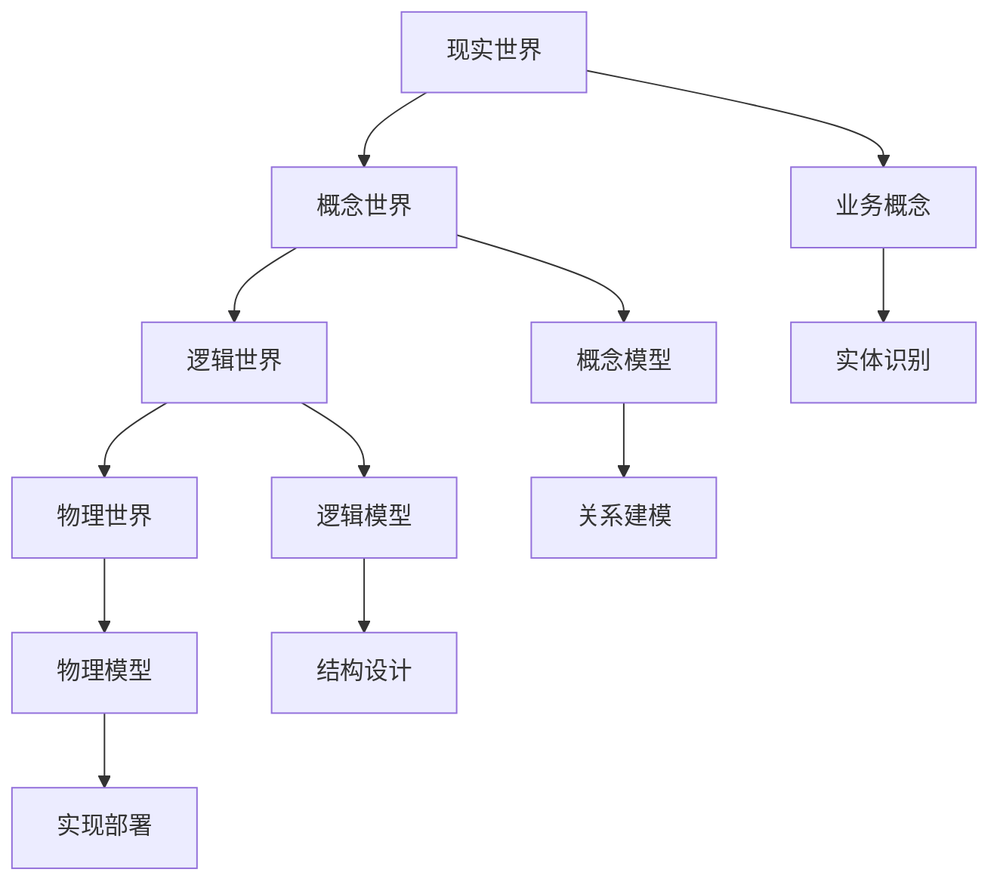
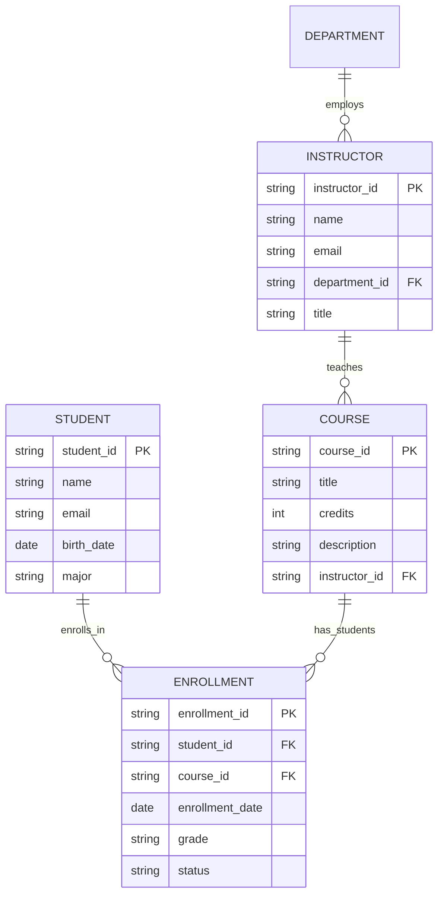
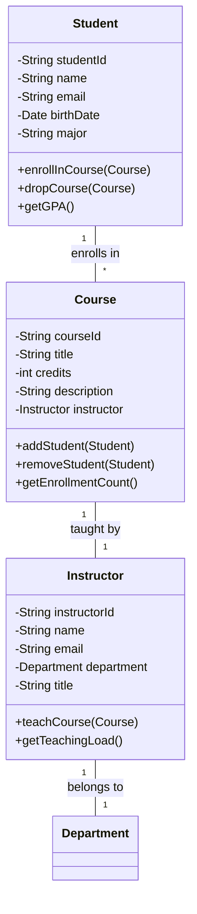
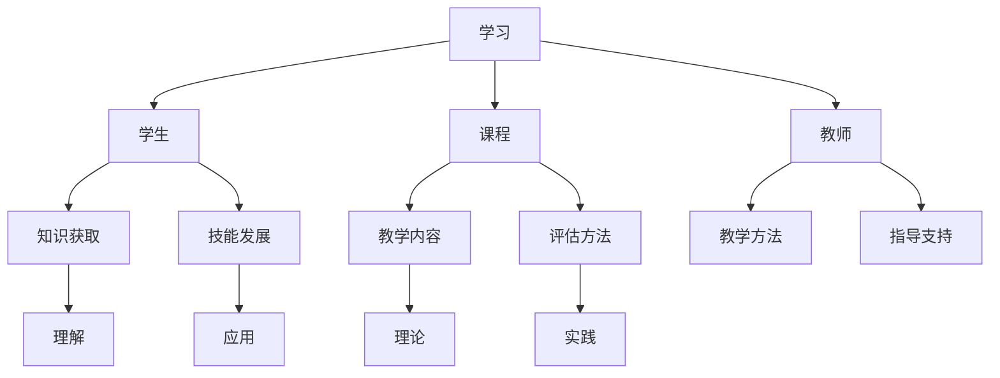
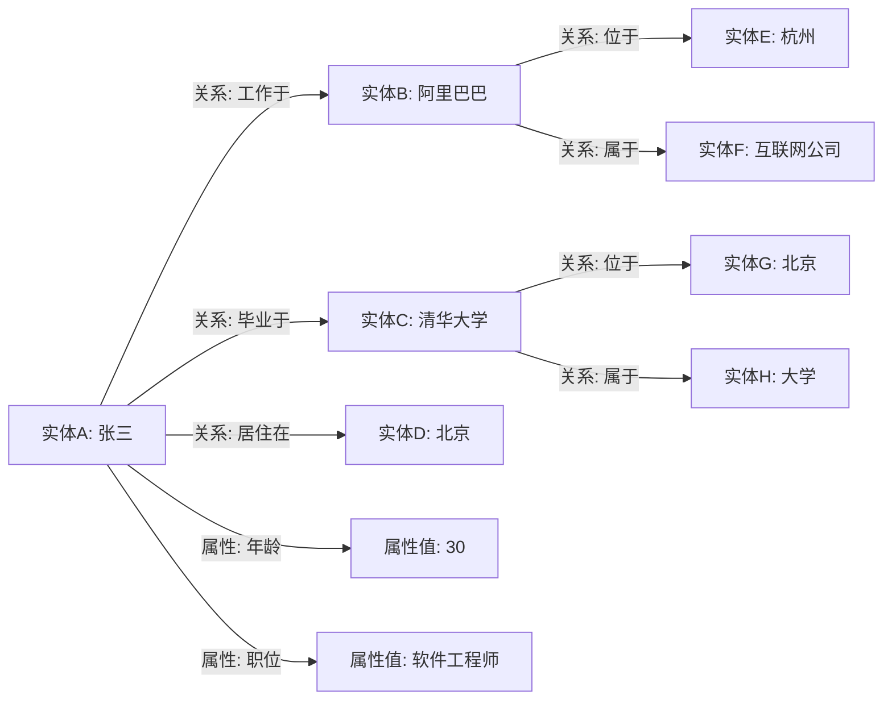
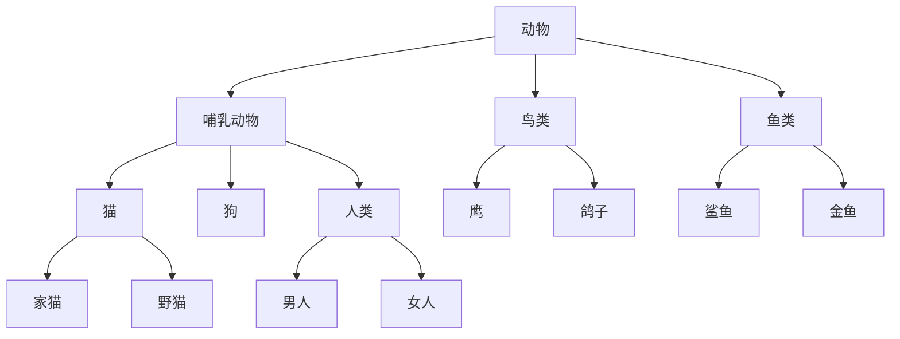
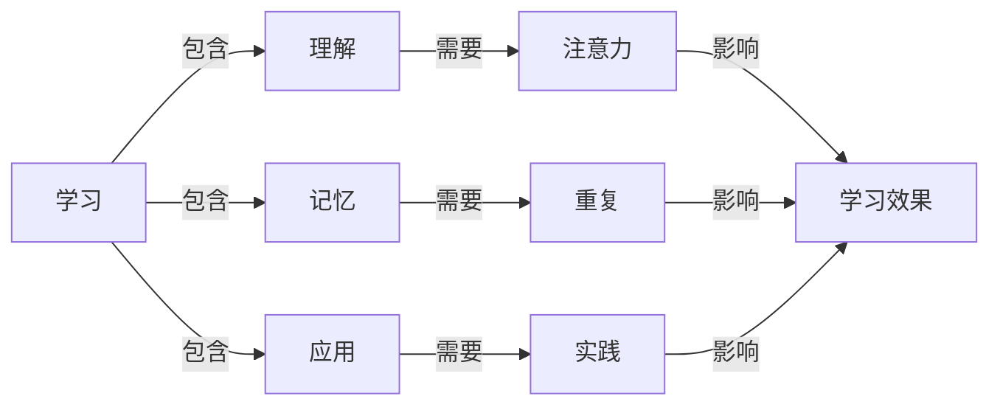
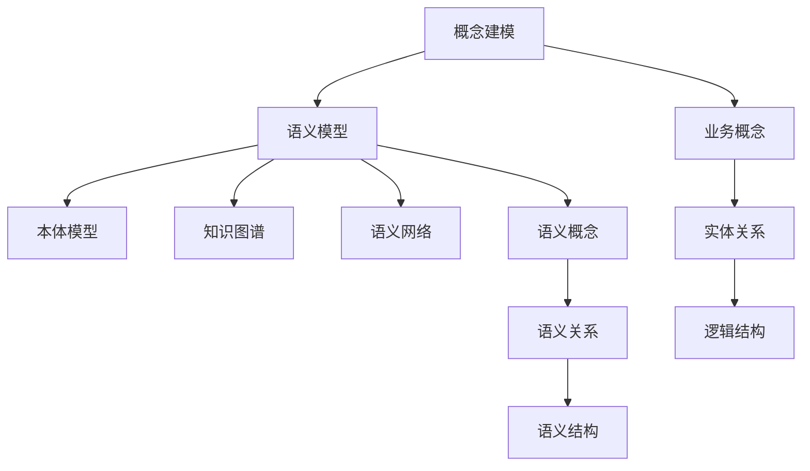

# 3.2.2-概念建模与语义模型

## 📋 概述

概念建模与语义模型是数据科学中的核心理论，它们从不同角度描述和理解数据的内在含义和关系。概念建模关注业务概念的结构化表达，而语义模型则深入探讨数据的语义层次和知识表示。

## 🧠 概念建模理论

### 1. 概念建模基础

#### 1.1 概念建模定义

概念建模是将现实世界的业务概念、实体和关系抽象为结构化模型的过程，它是连接业务需求和技术实现的桥梁。

#### 1.2 概念建模层次



### 2. 概念建模方法

#### 2.1 实体关系建模(ERM)

**核心要素：**

- **实体(Entity)**：现实世界中的对象或概念
- **属性(Attribute)**：实体的特征或性质
- **关系(Relationship)**：实体间的联系
- **约束(Constraint)**：数据必须满足的条件

**建模示例：**



#### 2.2 统一建模语言(UML)

**类图建模：**



#### 2.3 概念图建模

概念图是一种用于表示概念和概念间关系的图形化工具。

**概念图示例：**



### 3. 概念建模最佳实践

#### 3.1 建模原则

1. **简洁性**：模型应简洁明了，避免过度复杂
2. **一致性**：保持模型内部和模型间的一致性
3. **完整性**：模型应完整反映业务需求
4. **可扩展性**：模型应支持未来的扩展和变化

#### 3.2 建模流程

```text
1. 需求收集 → 2. 实体识别 → 3. 关系分析 → 4. 属性定义 → 5. 约束确定 → 6. 模型验证
```

## 🌐 语义模型理论

### 1. 语义模型基础

#### 1.1 语义层次理论

语义模型建立在多层次的语义表达基础上：

```text
┌─────────────────────────────────────┐
│           语义层                    │
│  (本体、知识图谱、语义网络)           │
├─────────────────────────────────────┤
│           语法层                    │
│  (数据格式、结构定义、语法规则)       │
├─────────────────────────────────────┤
│           物理层                    │
│  (存储格式、传输协议、硬件实现)       │
└─────────────────────────────────────┘
```

#### 1.2 语义模型类型

| 类型 | 特征 | 应用 | 技术栈 |
|------|------|------|--------|
| **本体模型** | 概念层次、推理能力 | 知识表示、智能推理 | OWL、RDF、SPARQL |
| **语义网络** | 节点关系、图结构 | 知识图谱、关系挖掘 | Neo4j、GraphDB |
| **概念图** | 概念连接、语义关系 | 知识组织、学习辅助 | CMap、VUE |
| **框架语义** | 语义框架、角色关系 | 自然语言理解 | FrameNet、PropBank |

### 2. 本体建模

#### 2.1 本体定义

本体是对特定领域概念的形式化、明确的规范说明，包括概念、概念间的关系以及使用这些概念和关系的约束。

#### 2.2 本体建模语言

**RDF (Resource Description Framework)：**

```turtle
@prefix rdf: <http://www.w3.org/1999/02/22-rdf-syntax-ns#> .
@prefix rdfs: <http://www.w3.org/2000/01/rdf-schema#> .
@prefix owl: <http://www.w3.org/2002/07/owl#> .
@prefix xsd: <http://www.w3.org/2001/XMLSchema#> .

# 类定义
:Person rdf:type owl:Class .
:Organization rdf:type owl:Class .
:Employee rdf:type owl:Class .
:Student rdf:type owl:Class .

# 属性定义
:worksFor rdf:type owl:ObjectProperty .
:hasName rdf:type owl:DatatypeProperty .
:hasAge rdf:type owl:DatatypeProperty .

# 关系定义
:Employee rdfs:subClassOf :Person .
:Student rdfs:subClassOf :Person .

:worksFor rdfs:domain :Person .
:worksFor rdfs:range :Organization .

:hasName rdfs:domain :Person .
:hasName rdfs:range xsd:string .

:hasAge rdfs:domain :Person .
:hasAge rdfs:range xsd:integer .
```

**OWL (Web Ontology Language)：**

```xml
<?xml version="1.0"?>
<rdf:RDF xmlns="http://example.org/ontology#"
         xmlns:owl="http://www.w3.org/2002/07/owl#"
         xmlns:rdf="http://www.w3.org/1999/02/22-rdf-syntax-ns#"
         xmlns:rdfs="http://www.w3.org/2000/01/rdf-schema#">
    
    <owl:Class rdf:about="#Person"/>
    <owl:Class rdf:about="#Organization"/>
    <owl:Class rdf:about="#Employee">
        <rdfs:subClassOf rdf:resource="#Person"/>
    </owl:Class>
    
    <owl:ObjectProperty rdf:about="#worksFor">
        <rdfs:domain rdf:resource="#Person"/>
        <rdfs:range rdf:resource="#Organization"/>
    </owl:ObjectProperty>
    
    <owl:DatatypeProperty rdf:about="#hasName">
        <rdfs:domain rdf:resource="#Person"/>
        <rdfs:range rdf:resource="http://www.w3.org/2001/XMLSchema#string"/>
    </owl:DatatypeProperty>
</rdf:RDF>
```

#### 2.3 本体推理

本体支持多种推理能力：

- **分类推理**：自动识别概念间的层次关系
- **一致性检查**：检测本体中的逻辑矛盾
- **实例推理**：基于规则推导新的事实
- **查询推理**：支持复杂的语义查询

### 3. 知识图谱建模

#### 3.1 知识图谱结构

知识图谱是一种语义网络，用于表示实体及其关系。



#### 3.2 知识图谱查询

**SPARQL查询示例：**

```sparql
# 查询所有在互联网公司工作的员工
PREFIX rdf: <http://www.w3.org/1999/02/22-rdf-syntax-ns#>
PREFIX rdfs: <http://www.w3.org/2000/01/rdf-schema#>
PREFIX : <http://example.org/ontology#>

SELECT ?person ?company
WHERE {
    ?person rdf:type :Person .
    ?person :worksFor ?company .
    ?company rdf:type :InternetCompany .
}
```

### 4. 语义网络建模

#### 4.1 语义网络结构

语义网络是一种图结构，节点表示概念，边表示概念间的关系。



#### 4.2 语义网络推理

语义网络支持多种推理模式：

- **继承推理**：子概念继承父概念的特征
- **传播推理**：属性在关系网络中传播
- **类比推理**：基于相似性进行推理
- **因果推理**：基于因果关系进行推理

### 5. 概念图建模

#### 5.1 概念图结构

概念图是一种用于表示概念和概念间关系的图形化工具。



#### 5.2 概念图应用

概念图在多个领域有广泛应用：

- **教育领域**：知识组织、学习辅助
- **知识管理**：知识表示、知识共享
- **决策支持**：问题分析、方案设计
- **信息检索**：语义搜索、相关性排序

## 🔗 概念建模与语义模型的关联

### 1. 层次关系



### 2. 转换关系

概念模型和语义模型之间存在自然的转换关系：

- **概念模型 → 语义模型**：通过语义标注和本体映射
- **语义模型 → 概念模型**：通过概念提取和关系抽象

### 3. 协同应用

两种模型在实际应用中往往协同使用：

- **概念建模**：提供业务层面的结构化理解
- **语义建模**：提供语义层面的深度理解
- **协同应用**：实现从业务到语义的完整建模

## 🛠️ 建模工具与技术

### 1. 概念建模工具

- **ER图工具**：Lucidchart、Draw.io、ERDPlus
- **UML工具**：Visual Paradigm、Enterprise Architect、StarUML
- **思维导图**：XMind、MindManager、FreeMind

### 2. 语义建模工具

- **本体编辑器**：Protégé、TopBraid Composer、NeOn Toolkit
- **知识图谱工具**：Neo4j、GraphDB、AllegroGraph
- **语义标注**：GATE、UIMA、Stanford NLP

### 3. 集成平台

- **语义集成**：Apache Jena、Sesame、Virtuoso
- **知识管理**：PoolParty、Ontotext GraphDB、Stardog
- **语义搜索**：Elasticsearch、Solr、Apache Lucene

## 📈 应用场景与案例

### 1. 教育领域

- **知识图谱**：构建学科知识体系
- **学习路径**：个性化学习推荐
- **智能问答**：基于语义的问答系统

### 2. 医疗健康

- **医学本体**：疾病分类和诊断支持
- **药物知识图谱**：药物相互作用分析
- **临床决策支持**：基于语义的医疗决策

### 3. 金融科技

- **风险模型**：基于语义的风险评估
- **反欺诈**：语义网络分析
- **智能投顾**：个性化投资建议

### 4. 电子商务

- **商品推荐**：基于语义的商品推荐
- **搜索优化**：语义搜索和相关性排序
- **用户画像**：基于语义的用户建模

## 🔮 发展趋势

### 1. 技术趋势

- **深度学习集成**：结合深度学习的语义理解
- **多模态语义**：文本、图像、音频的语义统一
- **实时语义处理**：流式数据的语义分析

### 2. 应用趋势

- **智能对话系统**：基于语义的自然语言交互
- **知识图谱应用**：大规模知识图谱的构建和应用
- **语义计算**：基于语义的智能计算

### 3. 标准化趋势

- **语义标准**：统一的语义表示标准
- **互操作性**：不同语义模型的互操作
- **质量保证**：语义模型的质量评估标准

## 多表征

概念建模与语义模型支持多种表征方式，包括：

- 符号表征（概念、关系、属性、语义约束等）
- 图结构（概念图、语义网络、ER图、模型结构图等）
- 向量/张量（概念嵌入、属性向量、语义向量）
- 自然语言（定义、注释、描述）
- 图像/可视化（概念结构图、语义网络图、模型可视化等）
这些表征可互映，提升概念建模与语义模型的表达力。

## 形式化语义

- 语义域：$D$，如概念集合、关系空间、属性集、语义网络
- 解释函数：$I: S \to D$，将符号/结构映射到具体语义对象
- 语义一致性：每个概念/关系/属性/语义约束在$D$中有明确定义

## 形式化语法与证明

- 语法规则：如概念定义、关系约束、语义规则、推理规则
- **定理**：概念建模与语义模型的语法系统具一致性与可扩展性。
- **证明**：由概念定义、关系约束与语义规则递归定义，保证系统一致与可扩展。

---

-**📖 相关导航**

- [返回上级目录](../README.md)
- [3.2.1-数据模型的形式化理论](3.2.1-数据模型的形式化理论.md)
- [6-知识图谱与可视化](../../6-知识图谱与可视化/README.md)
