# 3.2.3-数据资源模型与行业模型

## 📑 目录

- [3.2.3-数据资源模型与行业模型](#323-数据资源模型与行业模型)
  - [📑 目录](#-目录)
  - [1. 📋 概述](#1--概述)
  - [2. 数据资源模型](#2-数据资源模型)
    - [2.1. 数据资源分类体系](#21-数据资源分类体系)
      - [2.1.1. 按数据来源分类](#211-按数据来源分类)
      - [2.1.2. 按数据性质分类](#212-按数据性质分类)
      - [2.1.3. 按数据格式分类](#213-按数据格式分类)
    - [2.2. 数据资源生命周期模型](#22-数据资源生命周期模型)
      - [2.2.1. 生命周期阶段](#221-生命周期阶段)
      - [2.2.2. 数据质量管理](#222-数据质量管理)
    - [2.3. 数据资源模型框架](#23-数据资源模型框架)
      - [2.3.1. 数据资源模型结构](#231-数据资源模型结构)
      - [2.3.2. 数据资源元数据模型](#232-数据资源元数据模型)
  - [3. 🏭 行业模型体系](#3--行业模型体系)
    - [3.1. 金融行业模型](#31-金融行业模型)
      - [3.1.1. 金融数据模型](#311-金融数据模型)
      - [3.1.2. 金融业务模型](#312-金融业务模型)
    - [3.2. 医疗健康模型](#32-医疗健康模型)
      - [3.2.1. 医疗数据模型](#321-医疗数据模型)
      - [3.2.2. 医疗业务模型](#322-医疗业务模型)
    - [3.3. 制造业模型](#33-制造业模型)
      - [3.3.1. 制造数据模型](#331-制造数据模型)
      - [3.3.2. 制造业务模型](#332-制造业务模型)
    - [3.4. 零售电商模型](#34-零售电商模型)
      - [3.4.1. 零售数据模型](#341-零售数据模型)
      - [3.4.2. 零售业务模型](#342-零售业务模型)
    - [3.5. 教育行业模型](#35-教育行业模型)
      - [3.5.1. 教育数据模型](#351-教育数据模型)
      - [3.5.2. 教育业务模型](#352-教育业务模型)
  - [4. 🔗 模型关联性分析](#4--模型关联性分析)
    - [4.1. 跨行业模型关联](#41-跨行业模型关联)
    - [4.2. 数据资源与行业模型映射](#42-数据资源与行业模型映射)
    - [4.3. 模型演进路径](#43-模型演进路径)
  - [5. 🛠️ 实施方法论](#5-️-实施方法论)
    - [5.1. 模型设计原则](#51-模型设计原则)
    - [5.2. 实施流程](#52-实施流程)
    - [5.3. 质量保证](#53-质量保证)
  - [6. 发展趋势](#6-发展趋势)
    - [6.1. 技术趋势](#61-技术趋势)
    - [6.2. 应用趋势](#62-应用趋势)
    - [6.3. 标准化趋势](#63-标准化趋势)
  - [7. 多表征](#7-多表征)
  - [8. 形式化语义](#8-形式化语义)
  - [9. 形式化语法与证明](#9-形式化语法与证明)

---


## 1. 📋 概述

数据资源模型与行业模型是数据科学中的重要组成部分，它们从不同角度描述和组织数据资源，为各行业的业务应用提供结构化的数据基础。数据资源模型关注数据的分类、组织和生命周期管理，而行业模型则针对特定行业的业务特点提供专业化的数据建模方案。

## 2. 数据资源模型

### 2.1. 数据资源分类体系

#### 2.1.1. 按数据来源分类

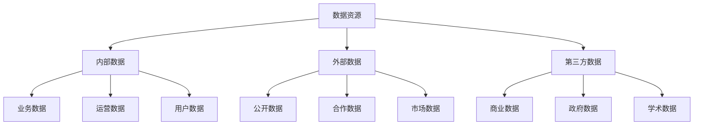

#### 2.1.2. 按数据性质分类

| 性质 | 特征 | 应用场景 | 技术栈 |
|------|------|----------|--------|
| **事务数据** | 实时性、一致性 | 业务交易、用户操作 | 关系数据库、ACID |
| **分析数据** | 历史性、聚合性 | 报表分析、决策支持 | 数据仓库、OLAP |
| **流式数据** | 实时性、连续性 | 监控告警、实时分析 | 流处理、消息队列 |
| **文档数据** | 非结构化、多样性 | 内容管理、知识库 | 文档数据库、搜索引擎 |
| **图数据** | 关系复杂、网络结构 | 社交网络、知识图谱 | 图数据库、图算法 |

#### 2.1.3. 按数据格式分类

| 格式 | 特征 | 处理方式 | 存储方案 |
|------|------|----------|----------|
| **结构化数据** | 固定格式、关系明确 | SQL查询、ETL处理 | 关系数据库、数据仓库 |
| **半结构化数据** | 部分结构、格式灵活 | 解析提取、模式匹配 | NoSQL数据库、文档存储 |
| **非结构化数据** | 无固定格式、内容多样 | NLP、CV、音频处理 | 对象存储、文件系统 |

### 2.2. 数据资源生命周期模型

#### 2.2.1. 生命周期阶段

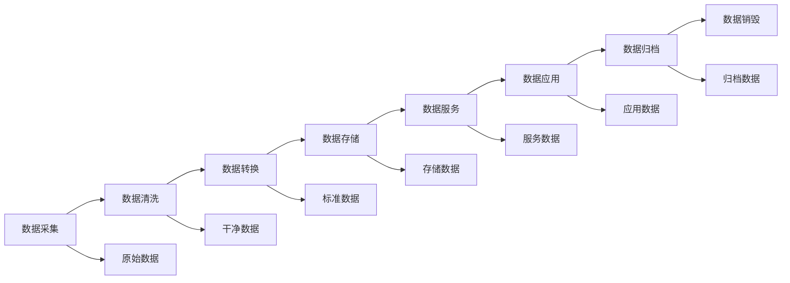

#### 2.2.2. 数据质量管理

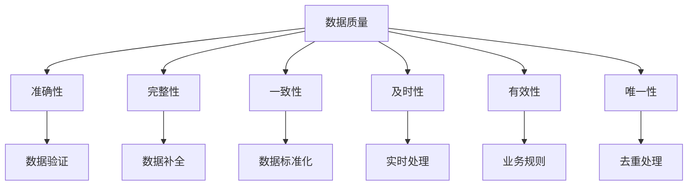

### 2.3. 数据资源模型框架

#### 2.3.1. 数据资源模型结构

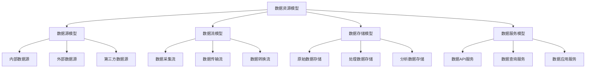

#### 2.3.2. 数据资源元数据模型

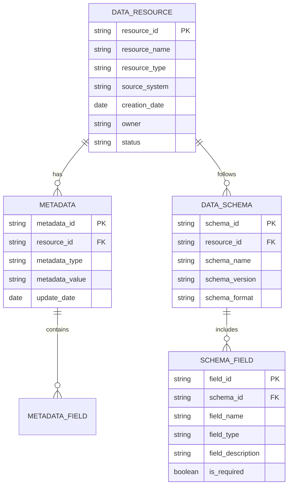

## 3. 🏭 行业模型体系

### 3.1. 金融行业模型

#### 3.1.1. 金融数据模型

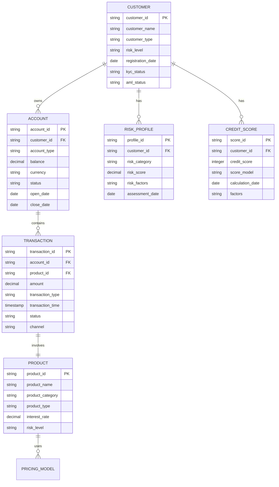

#### 3.1.2. 金融业务模型

**客户管理模型：**

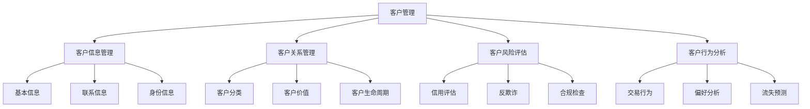

**产品管理模型：**

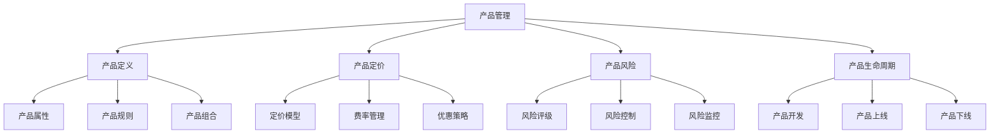

### 3.2. 医疗健康模型

#### 3.2.1. 医疗数据模型

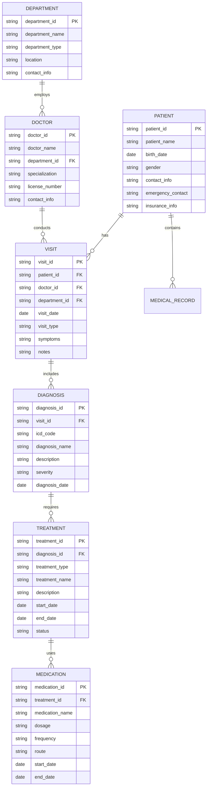

#### 3.2.2. 医疗业务模型

**患者管理模型：**

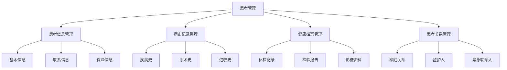

**诊疗流程模型：**

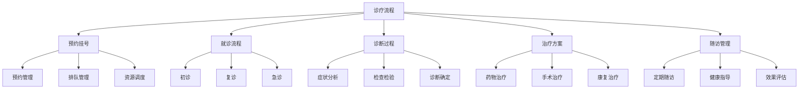

### 3.3. 制造业模型

#### 3.3.1. 制造数据模型

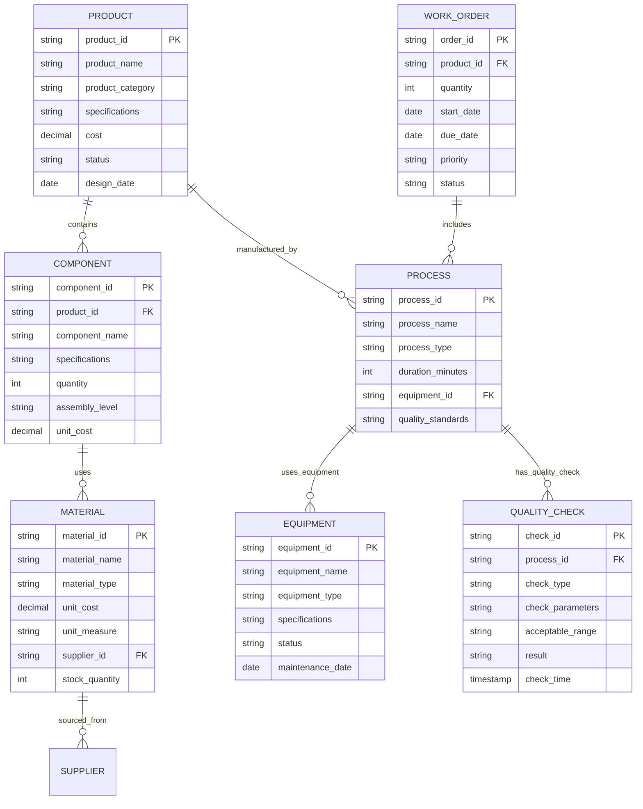

#### 3.3.2. 制造业务模型

**产品设计模型：**

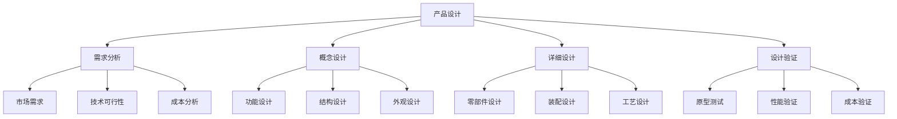

**生产计划模型：**

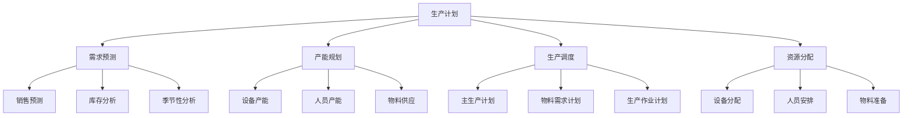

### 3.4. 零售电商模型

#### 3.4.1. 零售数据模型

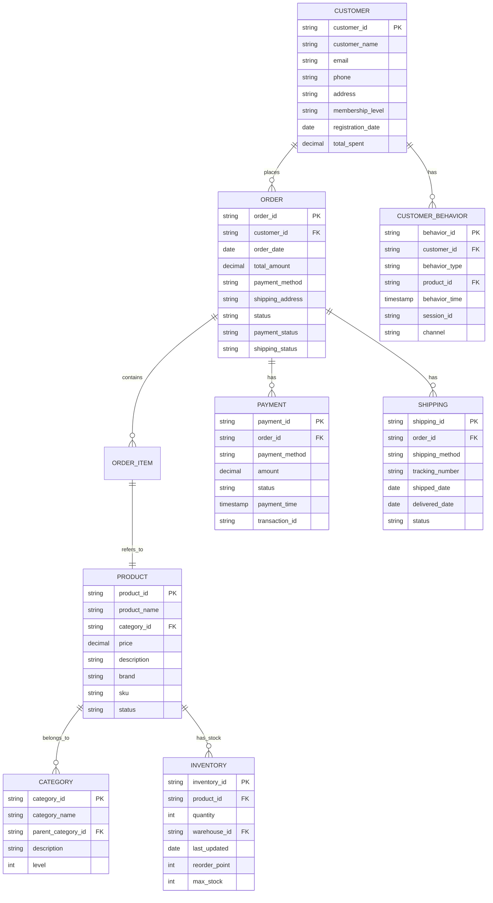

#### 3.4.2. 零售业务模型

**客户管理模型：**

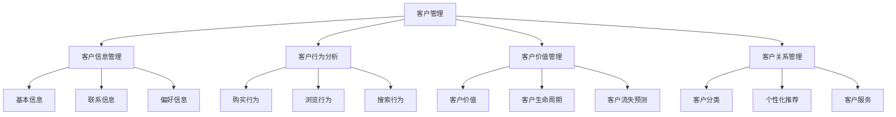

**商品管理模型：**

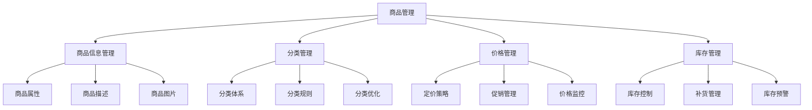

### 3.5. 教育行业模型

#### 3.5.1. 教育数据模型

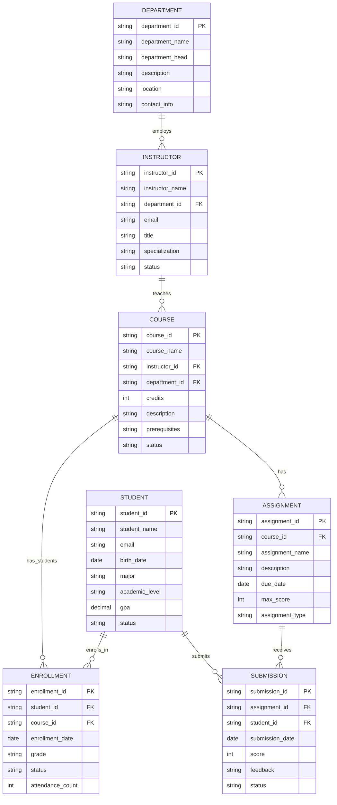

#### 3.5.2. 教育业务模型

**学习管理模型：**

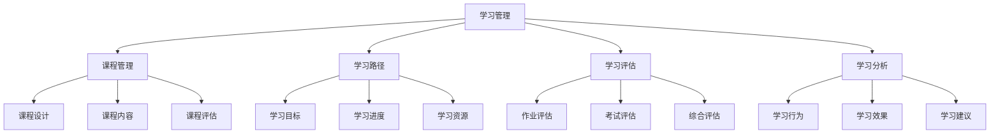

## 4. 🔗 模型关联性分析

### 4.1. 跨行业模型关联

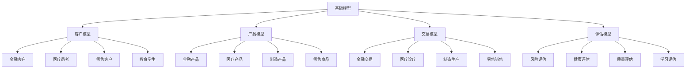

### 4.2. 数据资源与行业模型映射

| 数据资源类型 | 金融行业 | 医疗行业 | 制造行业 | 零售行业 | 教育行业 |
|-------------|----------|----------|----------|----------|----------|
| **客户数据** | 客户信息、信用记录 | 患者信息、病史 | 客户需求、订单 | 客户画像、行为 | 学生信息、成绩 |
| **产品数据** | 金融产品、定价 | 医疗产品、药品 | 产品设计、BOM | 商品信息、库存 | 课程信息、教材 |
| **交易数据** | 交易记录、支付 | 诊疗记录、处方 | 生产订单、工单 | 销售订单、支付 | 选课记录、作业 |
| **评估数据** | 风险评估、信用评分 | 健康评估、诊断 | 质量检测、性能 | 客户评价、反馈 | 学习评估、考试 |
| **行为数据** | 交易行为、风险行为 | 就医行为、用药 | 生产行为、操作 | 购买行为、浏览 | 学习行为、参与 |

### 4.3. 模型演进路径

```mermaid
graph LR
    A[基础数据模型] --> B[行业特定模型]
    B --> C[业务场景模型]
    C --> D[智能应用模型]

    A --> E[标准化]
    B --> F[专业化]
    C --> G[场景化]
    D --> H[智能化]

    E --> I[数据标准]
    F --> J[行业标准]
    G --> K[业务标准]
    H --> L[智能标准]
```

## 5. 🛠️ 实施方法论

### 5.1. 模型设计原则

- **业务导向**：模型设计应以业务需求为导向
- **标准化**：采用行业标准和最佳实践
- **可扩展性**：模型应支持未来的扩展和变化
- **可维护性**：模型应易于理解和维护

### 5.2. 实施流程

```text
1. 需求分析 → 2. 模型设计 → 3. 数据准备 → 4. 模型实现 → 5. 测试验证 → 6. 部署应用
```

### 5.3. 质量保证

- **数据质量**：确保数据的准确性、完整性和一致性
- **模型质量**：验证模型的正确性和有效性
- **应用质量**：保证应用的稳定性和性能

## 6. 发展趋势

### 6.1. 技术趋势

- **大数据集成**：支持大规模数据的处理和分析
- **实时处理**：支持实时数据流处理
- **智能化**：集成机器学习和人工智能技术

### 6.2. 应用趋势

- **跨行业应用**：支持多行业的模型复用和扩展
- **个性化服务**：基于模型的个性化推荐和服务
- **智能决策**：支持基于模型的智能决策支持

### 6.3. 标准化趋势

- **行业标准**：建立行业标准的数据模型
- **互操作性**：提高不同系统间的互操作性
- **质量保证**：建立模型质量评估标准

---

-**📖 相关导航**

- [返回上级目录](../README.md)
- [3.2.1-数据模型的形式化理论](3.2.1-数据模型的形式化理论.md)
- [3.2.2-概念建模与语义模型](3.2.2-概念建模与语义模型.md)
- [5-行业应用与场景](../../5-行业应用与场景/README.md)

## 7. 多表征

数据资源模型与行业模型支持多种表征方式，包括：

- 符号表征（资源类型、行业结构、模型公式、约束等）
- 图结构（资源关系图、行业模型结构图、数据流图等）
- 向量/张量（资源特征向量、行业嵌入、参数矩阵）
- 自然语言（定义、注释、行业描述）
- 图像/可视化（结构图、流程图、行业模型可视化等）
这些表征可互映，提升数据资源与行业模型的表达力。

## 8. 形式化语义

- 语义域：$D$，如资源对象集、行业结构空间、模型空间、行业语义网络
- 解释函数：$I: S \to D$，将符号/结构映射到具体行业语义对象
- 语义一致性：每个资源/结构/行业模型/公式在$D$中有明确定义

## 9. 形式化语法与证明

- 语法规则：如资源模型定义、行业结构约束、推理规则、行业约束条件
- **定理**：数据资源模型与行业模型的语法系统具一致性与可扩展性。
- **证明**：由资源模型、行业结构与推理规则递归定义，保证系统一致与可扩展。
