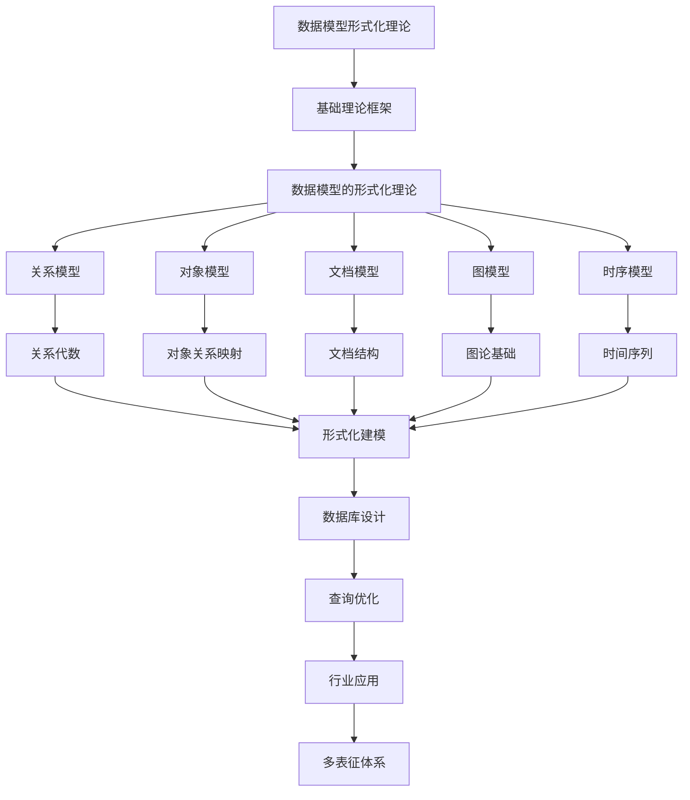

# 3.2-形式化模型 分支导航

## 目录结构与本地跳转
- [3.2.1-数据模型的形式化理论](3.2.1-数据模型的形式化理论.md) - 预留分支

---

## 主题交叉引用
| 主题      | 基础理论 | 形式化模型 | 应用场景 | 算法实现 | 行业案例 | 多表征 |
|-----------|----------|------------|----------|----------|----------|--------|
| 数据模型的形式化理论| 预留 | 预留       | 预留     | 预留     | 预留     | 预留   |

- 交叉引用：[2.1-类型理论](../../../2-形式科学理论/2.1-类型理论/README.md)、[3.1-基础理论](../3.1-基础理论/README.md)、[1-数据库系统](../../../1-数据库系统/README.md)

---

## 全链路知识流（Mermaid流程图）

---

[返回数据模型与算法总导航](../README.md)
