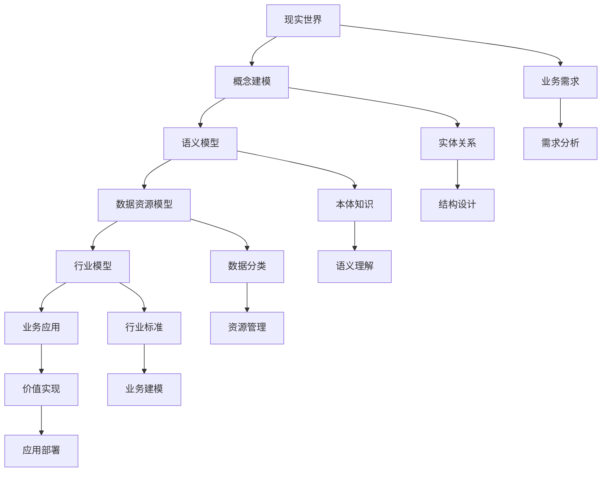

# 3.2-形式化模型

## 📋 概述

形式化模型是数据科学中的核心理论分支，它通过数学和逻辑的方法对数据、概念和语义进行精确的建模和描述。本分支涵盖了从基础的数据模型形式化理论到高级的概念建模、语义模型，以及数据资源模型与行业模型的完整体系。

## 🏗️ 目录结构

```text
3.2-形式化模型/
├── 3.2.1-数据模型的形式化理论.md     # 数据建模的基础理论框架
├── 3.2.2-概念建模与语义模型.md       # 概念建模方法和语义模型理论
├── 3.2.3-数据资源模型与行业模型.md   # 数据资源分类和行业模型体系
└── README.md                        # 本导航文档
```

## 🔗 主题交叉引用表

| 主题 | 相关文档 | 关联理论 | 应用场景 |
|------|----------|----------|----------|
| **数据建模基础** | 3.2.1 | 形式化理论、建模方法 | 系统设计、数据规划 |
| **概念建模** | 3.2.2 | 实体关系、UML、概念图 | 需求分析、业务理解 |
| **语义模型** | 3.2.2 | 本体、知识图谱、语义网络 | 知识表示、智能推理 |
| **数据资源** | 3.2.3 | 数据分类、生命周期、质量管理 | 数据治理、资源管理 |
| **行业模型** | 3.2.3 | 金融、医疗、制造、零售、教育 | 行业应用、业务建模 |

## 🌊 全链路知识流



## 🎯 知识体系特色

### 1. 理论严谨性

- **形式化表达**：采用数学和逻辑的精确表达
- **模型验证**：通过形式化方法验证模型正确性
- **理论完备性**：构建完整的理论体系框架

### 2. 方法系统性

- **层次化建模**：从概念到逻辑到物理的完整建模
- **多维度分析**：从数据、语义、业务多角度建模
- **标准化流程**：建立标准化的建模流程和方法

### 3. 应用实践性

- **行业导向**：针对不同行业的专业建模
- **业务驱动**：以业务需求为导向的模型设计
- **技术实现**：提供具体的技术实现方案

### 4. 创新前瞻性

- **语义计算**：集成语义理解和智能计算
- **知识图谱**：构建大规模知识表示体系
- **智能建模**：结合AI技术的智能建模方法

## 📚 学习路径建议

### 🎯 入门路径

```text
1. 数据模型的形式化理论 (3.2.1)
   ├── 建模层次体系
   ├── 建模分类方法
   └── 建模原则和流程

2. 概念建模与语义模型 (3.2.2)
   ├── 概念建模方法
   ├── 语义模型理论
   └── 本体和知识图谱

3. 数据资源模型与行业模型 (3.2.3)
   ├── 数据资源分类
   ├── 行业模型体系
   └── 模型关联分析
```

### 🔬 进阶路径

```text
1. 深度理论探索
   ├── 形式化理论深化
   ├── 语义计算研究
   └── 知识表示理论

2. 行业应用实践
   ├── 金融行业建模
   ├── 医疗健康建模
   ├── 制造业建模
   └── 零售电商建模

3. 技术创新应用
   ├── 智能建模方法
   ├── 大规模知识图谱
   └── 语义计算平台
```

### 🚀 专家路径

```text
1. 理论创新
   ├── 新形式化方法
   ├── 语义计算理论
   └── 知识表示创新

2. 行业标准制定
   ├── 建模标准
   ├── 语义标准
   └── 行业规范

3. 技术平台建设
   ├── 建模平台
   ├── 语义计算平台
   └── 知识管理平台
```

## ⚡ 快速导航

### 📖 核心理论

- **[数据模型的形式化理论](3.2.1-数据模型的形式化理论.md)** - 建模基础理论框架
- **[概念建模与语义模型](3.2.2-概念建模与语义模型.md)** - 概念和语义建模方法
- **[数据资源模型与行业模型](3.2.3-数据资源模型与行业模型.md)** - 数据资源和行业模型体系

### 🛠️ 实用工具

- **建模工具**：ER图、UML、本体编辑器
- **语义技术**：RDF、OWL、SPARQL、知识图谱
- **行业模型**：金融、医疗、制造、零售、教育

### 📊 应用场景

- **系统设计**：数据模型设计、系统架构
- **知识管理**：知识表示、知识图谱构建
- **业务建模**：行业应用、业务分析

## 🔧 技术栈映射

| 技术领域 | 核心技术 | 相关工具 | 应用场景 |
|----------|----------|----------|----------|
| **概念建模** | ER模型、UML | Lucidchart、Draw.io | 需求分析、系统设计 |
| **语义建模** | RDF、OWL、本体 | Protégé、Neo4j | 知识表示、智能推理 |
| **数据建模** | 关系模型、NoSQL | ERwin、PowerDesigner | 数据库设计、数据规划 |
| **行业建模** | 领域模型、业务模型 | 行业标准、最佳实践 | 行业应用、业务分析 |

## 🎯 应用场景体系

### 1. 系统设计与开发

- **数据模型设计**：数据库设计、数据仓库建模
- **系统架构设计**：微服务架构、分布式系统
- **API设计**：RESTful API、GraphQL

### 2. 知识管理与智能应用

- **知识图谱构建**：实体关系抽取、知识推理
- **语义搜索**：智能搜索、相关性排序
- **智能问答**：自然语言理解、问答系统

### 3. 行业应用与业务分析

- **金融科技**：风险建模、反欺诈、智能投顾
- **医疗健康**：医学本体、临床决策支持
- **制造业**：产品设计、生产计划、质量控制
- **零售电商**：客户画像、商品推荐、库存管理
- **教育科技**：学习路径、智能评估、个性化教学

### 4. 数据治理与质量管理

- **数据分类**：结构化、半结构化、非结构化数据
- **数据质量**：准确性、完整性、一致性管理
- **数据生命周期**：采集、清洗、存储、应用、归档

## 🔮 发展趋势与前沿

### 1. 技术发展趋势

- **语义计算**：深度语义理解和智能计算
- **知识图谱**：大规模知识图谱构建和应用
- **多模态建模**：文本、图像、音频的统一建模
- **实时建模**：流式数据的实时建模和处理

### 2. 应用发展趋势

- **智能化建模**：AI辅助的自动建模
- **跨领域应用**：多领域知识的融合应用
- **个性化建模**：基于场景的个性化建模
- **协作建模**：多用户协作的建模平台

### 3. 标准化趋势

- **语义标准**：统一的语义表示标准
- **建模标准**：标准化的建模方法和流程
- **行业标准**：各行业的建模标准和规范

## 📈 学习资源推荐

### 📚 理论资源

- **形式化理论**：集合论、逻辑学、代数理论
- **语义理论**：语义学、本体论、知识表示
- **建模方法**：软件工程、数据建模、系统设计

### 🛠️ 实践资源

- **建模工具**：ER图工具、UML工具、本体编辑器
- **语义技术**：RDF工具、知识图谱平台、语义搜索引擎
- **行业案例**：各行业的建模案例和最佳实践

### 🔬 研究资源

- **学术论文**：形式化建模、语义计算、知识图谱
- **技术报告**：行业标准、技术规范、最佳实践
- **开源项目**：建模工具、语义平台、知识图谱系统

---

-**📖 相关导航**

- [返回上级目录](../README.md)
- [3.1-基础理论](../3.1-基础理论/README.md)
- [3.3-算法实现](../3.3-算法实现/README.md)
- [6-知识图谱与可视化](../../6-知识图谱与可视化/README.md)

## 多表征

形式化模型分支支持多种表征方式，包括：

- 符号表征（数据模型、形式系统、语义模型、公式等）
- 图结构（模型结构图、语义网络、数据流图等）
- 向量/张量（特征向量、嵌入、参数矩阵）
- 自然语言（定义、注释、描述）
- 图像/可视化（结构图、流程图、模型可视化等）
这些表征可互映，提升形式化模型理论与应用表达力。

## 形式化语义

- 语义域：$D$，如数据对象集、模型空间、语义网络、操作空间
- 解释函数：$I: S \to D$，将符号/结构映射到具体语义对象
- 语义一致性：每个结构/模型/公式在$D$中有明确定义

## 形式化语法与证明

- 语法规则：如模型定义、语义规则、推理规则、约束条件
- **定理**：形式化模型分支的语法系统具一致性与可扩展性。
- **证明**：由模型定义、语义规则与推理规则递归定义，保证系统一致与可扩展。
