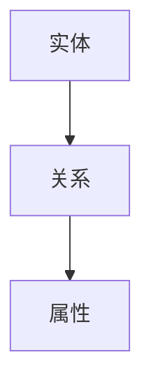

# 3.2 形式化模型 主题导航与多表征案例

## 目录结构与本地跳转

- [3.2.1 数据模型的形式化理论](./3.2.1-数据模型的形式化理论.md)

---

## 行业案例与多表征

### 3.2.x 典型行业案例

- 金融数据建模：ER模型与规范化（详见5.1-金融数据分析、3.5.6-数据结构转换与建模）
- 科学计算：复杂数据结构的形式化表达（详见5.2-科学计算）
- AI系统：知识图谱与本体建模（详见3.4-AI与机器学习算法）

### 3.2.x 多表征示例

- ER图、UML类图、数据流图、Latex公式等

---

[返回数据分析与ETL](../3.5-数据分析与ETL/README.md)
