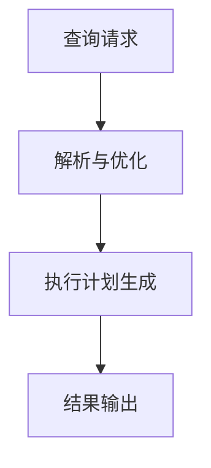

# 3.3 算法实现 主题导航与多表征案例

## 目录结构与本地跳转

- [3.3.1 核心数据处理算法](./3.3.1-核心数据处理算法.md)
- [3.3.2 查询优化算法](./3.3.2-查询优化算法.md)
- [3.3.3 并发控制算法](./3.3.3-并发控制算法.md)

---

## 行业案例与多表征

### 3.3.x 典型行业案例

- 数据库查询优化：SQL执行计划与索引优化（详见1.1-PostgreSQL、3.5.2-ETL理论与实践）
- 并发控制：金融交易系统高并发一致性保障（详见5.1-金融数据分析）
- 大数据处理：分布式算法在科学计算中的应用（详见5.2-科学计算）

### 3.3.x 多表征示例

- 算法流程图、执行计划图、并发控制时序图、性能对比表等

---

[返回数据分析与ETL](../3.5-数据分析与ETL/README.md)
