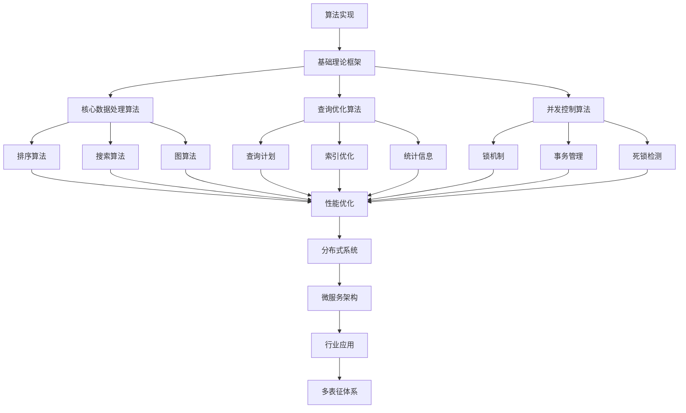

# 3.3-算法实现 分支导航

## 目录结构与本地跳转

- [3.3.1-核心数据处理算法](3.3.1-核心数据处理算法.md) - 预留分支
- [3.3.2-查询优化算法](3.3.2-查询优化算法.md) - 预留分支
- [3.3.3-并发控制算法](3.3.3-并发控制算法.md) - 预留分支

---

## 主题交叉引用

| 主题      | 基础理论 | 形式化模型 | 应用场景 | 算法实现 | 行业案例 | 多表征 |
|-----------|----------|------------|----------|----------|----------|--------|
| 核心数据处理算法| 预留 | 预留       | 预留     | 预留     | 预留     | 预留   |
| 查询优化算法| 预留   | 预留       | 预留     | 预留     | 预留     | 预留   |
| 并发控制算法| 预留   | 预留       | 预留     | 预留     | 预留     | 预留   |

- 交叉引用：[2.5-分布式系统理论](../../../2-形式科学理论/2.5-分布式系统理论/README.md)、[1-数据库系统](../../../1-数据库系统/README.md)、[4.3-微服务架构](../../../4-软件架构与工程/4.3-微服务架构/README.md)

---

## 全链路知识流（Mermaid流程图）

---

[返回数据模型与算法总导航](../README.md)

## 多表征

算法实现分支支持多种表征方式，包括：

- 符号表征（算法伪代码、数据结构、公式等）
- 图结构（算法流程图、数据流图、依赖图等）
- 向量/张量（特征向量、参数矩阵、嵌入）
- 自然语言（定义、注释、描述）
- 图像/可视化（流程图、结构图、算法可视化等）
这些表征可互映，提升算法实现的表达力。

## 形式化语义

- 语义域：$D$，如数据对象集、算法操作空间、模型空间
- 解释函数：$I: S \to D$，将符号/结构映射到具体语义对象
- 语义一致性：每个结构/算法/公式在$D$中有明确定义

## 形式化语法与证明

- 语法规则：如算法定义、数据结构约束、推理规则、约束条件
- **定理**：算法实现分支的语法系统具一致性与可扩展性。
- **证明**：由算法定义、数据结构与推理规则递归定义，保证系统一致与可扩展。
