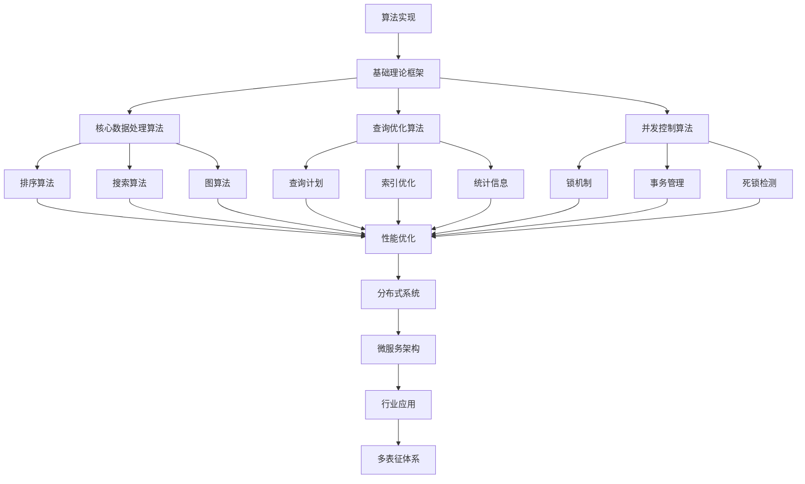

# 3.3-算法实现 分支导航

## 📑 目录

- [3.3-算法实现 分支导航](#33-算法实现-分支导航)
  - [📑 目录](#-目录)
  - [1. 概述](#1-概述)
  - [2. 目录结构与本地跳转](#2-目录结构与本地跳转)
  - [3. 核心概念](#3-核心概念)
    - [3.1. 核心数据处理算法](#31-核心数据处理算法)
    - [3.2. 查询优化算法](#32-查询优化算法)
    - [3.3. 并发控制算法](#33-并发控制算法)
  - [4. 理论基础](#4-理论基础)
    - [4.1. 算法复杂度](#41-算法复杂度)
    - [4.2. 算法正确性](#42-算法正确性)
    - [4.3. 分布式算法](#43-分布式算法)
  - [5. 应用场景](#5-应用场景)
    - [5.1. 数据库系统](#51-数据库系统)
    - [5.2. 大数据处理](#52-大数据处理)
    - [5.3. 分布式系统](#53-分布式系统)
  - [6. 行业案例与多表征](#6-行业案例与多表征)
    - [6.1. 典型行业案例](#61-典型行业案例)
    - [6.2. 多表征示例](#62-多表征示例)
  - [7. 主题交叉引用](#7-主题交叉引用)
  - [8. 全链路知识流](#8-全链路知识流)
  - [9. 多表征](#9-多表征)
  - [10. 形式化语义](#10-形式化语义)
  - [11. 形式化语法与证明](#11-形式化语法与证明)
  - [12. 工具与实现](#12-工具与实现)
    - [12.1. 算法库](#121-算法库)
    - [12.2. 性能分析工具](#122-性能分析工具)
    - [12.3. 算法可视化](#123-算法可视化)
  - [13. 学习与研究路径](#13-学习与研究路径)
    - [13.1. 基础知识](#131-基础知识)
    - [13.2. 核心技能](#132-核心技能)
    - [13.3. 实践应用](#133-实践应用)
  - [14. 总结](#14-总结)

---

## 1. 概述

算法实现是数据科学和计算机科学的核心，涵盖了从基础数据处理算法到高级查询优化和并发控制的完整算法体系。
算法实现为数据处理、数据库系统、分布式系统等提供了高效的算法支持。

**核心特征**：

1. **高效性**：追求算法的时间复杂度和空间复杂度优化
2. **正确性**：保证算法的正确性和可靠性
3. **可扩展性**：支持大规模数据和分布式处理
4. **实用性**：面向实际应用和工程实践

**应用领域**：

- 数据库系统
- 大数据处理
- 分布式系统
- 实时系统
- 搜索引擎
- 机器学习

---

## 2. 目录结构与本地跳转

- [3.3.1-核心数据处理算法](3.3.1-核心数据处理算法.md) - 核心数据处理算法文档
- [3.3.2-查询优化算法](3.3.2-查询优化算法.md) - 查询优化算法文档
- [3.3.3-并发控制算法](3.3.3-并发控制算法.md) - 并发控制算法文档
- [3.3.4-算法实现实践案例](3.3.4-算法实现实践案例.md) - 实践案例文档

---

## 3. 核心概念

### 3.1. 核心数据处理算法

核心数据处理算法包括排序、查找、聚合、分组等基础算法。

**排序算法**：

- 快速排序：平均$O(n \log n)$，最坏$O(n^2)$
- 归并排序：稳定$O(n \log n)$
- 堆排序：$O(n \log n)$，原地排序

**查找算法**：

- 二分查找：$O(\log n)$，要求有序
- 哈希查找：平均$O(1)$，最坏$O(n)$

### 3.2. 查询优化算法

查询优化算法用于优化数据库查询性能。

**优化技术**：

- 查询计划选择
- 索引优化
- 连接顺序优化
- 统计信息使用

### 3.3. 并发控制算法

并发控制算法用于保证并发访问的正确性。

**并发控制方法**：

- 锁机制：两阶段锁、多粒度锁
- 时间戳：时间戳排序
- 多版本：MVCC
- 乐观控制：乐观并发控制

---

## 4. 理论基础

### 4.1. 算法复杂度

**时间复杂度**：

- 最好情况：$T_{best}(n)$
- 平均情况：$T_{avg}(n)$
- 最坏情况：$T_{worst}(n)$

**空间复杂度**：

- 额外空间：$S(n)$
- 原地算法：$S(n) = O(1)$

### 4.2. 算法正确性

**算法正确性证明**：

- 循环不变量
- 数学归纳法
- 形式化验证

### 4.3. 分布式算法

**分布式算法特性**：

- 容错性
- 一致性
- 可用性
- 分区容错性

---

## 5. 应用场景

### 5.1. 数据库系统

算法在数据库系统中的应用包括查询处理、索引管理、事务处理等。

### 5.2. 大数据处理

算法在大数据处理中的应用包括MapReduce、Spark、Flink等框架。

### 5.3. 分布式系统

算法在分布式系统中的应用包括一致性算法、共识算法、分布式锁等。

---

## 6. 行业案例与多表征

### 6.1. 典型行业案例

- **分布式系统理论**：算法在分布式系统中的应用（详见[2.5-分布式系统理论](../../../2-形式科学理论/2.5-分布式系统理论/README.md)）
- **数据库系统**：算法在数据库系统中的应用（详见[1-数据库系统](../../../1-数据库系统/README.md)）
- **微服务架构**：算法在微服务中的应用（详见[4.3-微服务架构](../../../4-软件架构与工程/4.3-微服务架构/README.md)）

### 6.2. 多表征示例

- **符号表征**：算法伪代码、数据结构、公式、复杂度分析
- **图结构**：算法流程图、数据流图、依赖图、执行计划
- **向量/张量**：特征向量、参数矩阵、嵌入
- **自然语言**：定义、注释、描述、算法说明
- **图像/可视化**：流程图、结构图、算法可视化、性能图表

---

## 7. 主题交叉引用

| 主题      | 基础理论 | 形式化模型 | 应用场景 | 算法实现 | 行业案例 | 多表征 |
|-----------|----------|------------|----------|----------|----------|--------|
| 核心数据处理算法| ✅ | ✅       | ✅     | ✅     | ✅     | ✅   |
| 查询优化算法| ✅ | ✅       | ✅     | ✅     | ✅     | ✅   |
| 并发控制算法| ✅ | ✅       | ✅     | ✅     | ✅     | ✅   |

**交叉引用**：

- [2.5-分布式系统理论](../../../2-形式科学理论/2.5-分布式系统理论/README.md)：分布式算法
- [1-数据库系统](../../../1-数据库系统/README.md)：数据库算法
- [4.3-微服务架构](../../../4-软件架构与工程/4.3-微服务架构/README.md)：微服务算法

---

## 8. 全链路知识流



---

## 9. 多表征

算法实现分支支持多种表征方式，包括：

- **符号表征**：算法伪代码、数据结构、公式、复杂度分析、算法规范
- **图结构**：算法流程图、数据流图、依赖图、执行计划、状态转换图
- **向量/张量**：特征向量、参数矩阵、嵌入、算法参数
- **自然语言**：定义、注释、描述、算法说明、性能分析
- **图像/可视化**：流程图、结构图、算法可视化、性能图表、执行轨迹

这些表征可互映，提升算法实现的表达力。

---

## 10. 形式化语义

**语义域**：$D$，包括：

- 数据对象集：$\mathcal{D} = \{d_1, d_2, \ldots\}$
- 算法操作空间：$\mathcal{A}$
- 状态空间：$\mathcal{S}$
- 复杂度空间：$\mathcal{C}$

**解释函数**：$I: \mathcal{L} \to D$，将算法规范映射到语义对象：

- $I(\text{algorithm}) \in \mathcal{A}$：算法的解释
- $I(\text{data}) \in \mathcal{D}$：数据的解释
- $I(\text{state}) \in \mathcal{S}$：状态的解释
- $I(\text{complexity}) \in \mathcal{C}$：复杂度的解释

**语义一致性**：每个算法/数据结构/操作在$D$中有明确定义，满足算法正确性、复杂度保证、性能要求。

---

## 11. 形式化语法与证明

**语法规则**：

- **算法语法**：$Algorithm ::= Sort \mid Search \mid Aggregate \mid Optimize$
- **数据结构语法**：$DS ::= Array \mid List \mid Tree \mid HashTable$
- **操作语法**：$Operation ::= Insert \mid Delete \mid Update \mid Query$

**推理规则**：

- **算法正确性**：$\frac{Precondition \land Algorithm}{Postcondition}$
- **复杂度分析**：$\frac{Algorithm}{Time(n) = O(f(n))}$

**定理**：算法实现分支的语法系统具一致性与可扩展性。

**证明**：由算法定义、数据结构与推理规则递归定义，保证系统一致与可扩展。

---

## 12. 工具与实现

### 12.1. 算法库

**标准库**：

- C++ STL：标准模板库
- Java Collections：集合框架
- Python标准库：内置算法

**第三方库**：

- Boost C++：C++扩展库
- Apache Commons：Java工具库
- NumPy/SciPy：Python科学计算

### 12.2. 性能分析工具

**性能分析**：

- Valgrind：内存和性能分析
- gprof：性能分析工具
- perf：Linux性能分析

### 12.3. 算法可视化

**可视化工具**：

- VisuAlgo：算法可视化网站
- Algorithm Visualizer：算法可视化工具
- Python matplotlib：算法可视化

---

## 13. 学习与研究路径

### 13.1. 基础知识

1. **数据结构**：数组、链表、树、图、哈希表
2. **算法基础**：排序、查找、图算法、动态规划

### 13.2. 核心技能

1. **算法设计**：分治法、贪心法、动态规划
2. **复杂度分析**：时间复杂度、空间复杂度
3. **算法优化**：性能优化、空间优化

### 13.3. 实践应用

1. **系统实现**：数据库系统、分布式系统
2. **性能优化**：查询优化、并发优化
3. **研究前沿**：并行算法、量子算法、近似算法

---

## 14. 总结

算法实现是数据科学和计算机科学的核心，为数据处理、数据库系统、分布式系统等提供了高效的算法支持。从基础排序查找到高级查询优化，从单机算法到分布式算法，算法实现涵盖了算法的各个方面。

**核心价值**：

1. **高效性**：追求算法的高效性
2. **正确性**：保证算法的正确性
3. **可扩展性**：支持大规模和分布式
4. **实用性**：面向实际应用

**应用前景**：
随着大数据、分布式系统等技术的发展，算法实现将继续发展，特别是在并行算法、分布式算法、近似算法等领域，算法实现将提供更强大的功能和更好的性能。

---

## 深入学习建议

### 理论基础强化

**数学基础**：

- **离散数学**：集合论、图论、组合数学
- **线性代数**：矩阵运算、向量空间
- **概率论**：概率分布、随机过程
- **算法分析**：时间复杂度、空间复杂度

**计算机科学基础**：

- **数据结构**：树、图、哈希表、堆
- **算法设计**：贪心、动态规划、分治
- **计算理论**：可计算性、复杂度理论
- **并行计算**：并行算法、分布式算法

### 实践能力提升

**编程能力**：

- **多语言编程**：Python、Java、C++、Rust
- **算法实现**：经典算法实现
- **性能优化**：算法性能优化
- **测试验证**：算法测试和验证

**工具使用**：

- **算法库**：标准算法库使用
- **性能分析**：性能分析工具
- **可视化工具**：算法可视化
- **测试框架**：单元测试框架

### 研究能力培养

**文献阅读**：

- **经典论文**：算法经典论文
- **前沿研究**：最新研究进展
- **应用论文**：实际应用案例
- **会议论文**：顶级会议论文

---

## 学习资源汇总

### 在线课程

- **Coursera**：算法课程
- **edX**：数据结构与算法课程
- **Udemy**：算法实现课程
- **YouTube**：算法教程

### 书籍推荐

- **入门书籍**：《算法导论》
- **进阶书籍**：《算法设计手册》
- **应用书籍**：《算法实战》
- **工具书籍**：《算法可视化》

### 学术资源

- **期刊**：ACM Transactions、IEEE Transactions
- **会议**：SODA、FOCS、STOC
- **数据库**：IEEE Xplore、ACM Digital Library
- **预印本**：arXiv、ResearchGate

---

## 实践项目建议

### 基础项目

- **排序算法**：实现各种排序算法
- **搜索算法**：实现搜索算法
- **图算法**：实现图算法
- **动态规划**：动态规划问题求解

### 进阶项目

- **并行算法**：并行算法实现
- **分布式算法**：分布式算法实现
- **近似算法**：近似算法设计
- **在线算法**：在线算法实现

### 高级项目

- **算法优化**：算法性能优化
- **算法库开发**：开发算法库
- **算法可视化**：算法可视化工具
- **算法应用**：实际应用系统

---

## 职业发展路径

### 学术研究

- **研究方向**：算法设计、算法分析、算法优化
- **职业路径**：博士研究、博士后、教职、研究机构

### 工业应用

- **应用领域**：软件开发、系统优化、算法工程
- **职业路径**：算法工程师、软件工程师、系统架构师

---

## 技术发展趋势

### 算法优化技术

**并行算法**：

- **多核并行**：多核处理器并行算法
- **GPU并行**：GPU加速算法
- **分布式并行**：分布式并行算法
- **异步并行**：异步并行算法

**并行排序算法示例**：

```python
from multiprocessing import Pool, cpu_count
import numpy as np
from typing import List

def parallel_merge_sort(data: List[int], num_processes: int = None) -> List[int]:
    """
    并行归并排序实现
    
    Args:
        data: 待排序数据
        num_processes: 进程数，默认使用CPU核心数
    
    Returns:
        排序后的数据
    """
    if num_processes is None:
        num_processes = cpu_count()
    
    if len(data) <= 1:
        return data
    
    # 如果数据量小或只有一个进程，使用串行排序
    if len(data) < 1000 or num_processes == 1:
        return merge_sort_sequential(data)
    
    # 分割数据
    chunk_size = len(data) // num_processes
    chunks = [data[i:i + chunk_size] for i in range(0, len(data), chunk_size)]
    
    # 并行排序各个块
    with Pool(processes=num_processes) as pool:
        sorted_chunks = pool.map(merge_sort_sequential, chunks)
    
    # 合并排序后的块
    result = sorted_chunks[0]
    for chunk in sorted_chunks[1:]:
        result = merge(result, chunk)
    
    return result

def merge_sort_sequential(data: List[int]) -> List[int]:
    """串行归并排序"""
    if len(data) <= 1:
        return data
    
    mid = len(data) // 2
    left = merge_sort_sequential(data[:mid])
    right = merge_sort_sequential(data[mid:])
    return merge(left, right)

def merge(left: List[int], right: List[int]) -> List[int]:
    """合并两个有序数组"""
    result = []
    i = j = 0
    
    while i < len(left) and j < len(right):
        if left[i] <= right[j]:
            result.append(left[i])
            i += 1
        else:
            result.append(right[j])
            j += 1
    
    result.extend(left[i:])
    result.extend(right[j:])
    return result

# 使用示例
if __name__ == '__main__':
    # 生成测试数据
    data = np.random.randint(0, 1000000, size=1000000).tolist()
    
    # 并行排序
    import time
    start = time.time()
    sorted_data = parallel_merge_sort(data)
    parallel_time = time.time() - start
    
    # 串行排序对比
    start = time.time()
    sorted_data_seq = merge_sort_sequential(data.copy())
    sequential_time = time.time() - start
    
    print(f"并行排序时间: {parallel_time:.4f}秒")
    print(f"串行排序时间: {sequential_time:.4f}秒")
    print(f"加速比: {sequential_time / parallel_time:.2f}x")
```

**GPU加速算法示例**（使用CuPy）：

```python
import cupy as cp
import numpy as np
import time

def gpu_matrix_multiplication(A, B):
    """
    GPU加速矩阵乘法
    
    Args:
        A: 矩阵A (numpy数组)
        B: 矩阵B (numpy数组)
    
    Returns:
        矩阵乘积结果
    """
    # 将数据转移到GPU
    A_gpu = cp.asarray(A)
    B_gpu = cp.asarray(B)
    
    # GPU矩阵乘法
    C_gpu = cp.dot(A_gpu, B_gpu)
    
    # 将结果转回CPU
    C = cp.asnumpy(C_gpu)
    
    return C

# 使用示例
if __name__ == '__main__':
    # 创建大矩阵
    size = 5000
    A = np.random.rand(size, size).astype(np.float32)
    B = np.random.rand(size, size).astype(np.float32)
    
    # CPU计算
    start = time.time()
    C_cpu = np.dot(A, B)
    cpu_time = time.time() - start
    
    # GPU计算
    start = time.time()
    C_gpu = gpu_matrix_multiplication(A, B)
    gpu_time = time.time() - start
    
    print(f"CPU时间: {cpu_time:.4f}秒")
    print(f"GPU时间: {gpu_time:.4f}秒")
    print(f"加速比: {cpu_time / gpu_time:.2f}x")
    print(f"结果差异: {np.max(np.abs(C_cpu - C_gpu)):.6f}")
```

**近似算法**：

- **近似比优化**：改进近似比
- **在线算法**：在线算法设计
- **随机算法**：随机算法优化
- **启发式算法**：启发式算法改进

**近似算法示例**（集合覆盖问题）：

```python
from typing import List, Set, Tuple
import random

def greedy_set_cover(universe: Set, subsets: List[Set]) -> List[Set]:
    """
    贪心算法求解集合覆盖问题（近似算法）
    
    近似比：H(n)，其中n是最大子集大小，H(n)是第n个调和数
    
    Args:
        universe: 全集
        subsets: 子集列表
    
    Returns:
        覆盖全集的子集列表
    """
    uncovered = set(universe)
    cover = []
    
    while uncovered:
        # 选择覆盖最多未覆盖元素的子集
        best_subset = None
        best_covered = set()
        
        for subset in subsets:
            covered = subset & uncovered
            if len(covered) > len(best_covered):
                best_covered = covered
                best_subset = subset
        
        if best_subset:
            cover.append(best_subset)
            uncovered -= best_covered
        else:
            break  # 无法完全覆盖
    
    return cover

def randomized_set_cover(universe: Set, subsets: List[Set], 
                        num_iterations: int = 100) -> List[Set]:
    """
    随机算法求解集合覆盖问题
    
    Args:
        universe: 全集
        subsets: 子集列表
        num_iterations: 迭代次数
    
    Returns:
        覆盖全集的子集列表（可能不是最优解）
    """
    best_cover = None
    best_size = float('inf')
    
    for _ in range(num_iterations):
        # 随机选择子集
        random.shuffle(subsets)
        cover = []
        covered = set()
        
        for subset in subsets:
            if not (subset <= covered):
                cover.append(subset)
                covered |= subset
                if covered >= universe:
                    break
        
        if covered >= universe and len(cover) < best_size:
            best_cover = cover
            best_size = len(cover)
    
    return best_cover

# 使用示例
if __name__ == '__main__':
    universe = {1, 2, 3, 4, 5, 6, 7, 8, 9, 10}
    subsets = [
        {1, 2, 3, 4},
        {3, 4, 5, 6},
        {5, 6, 7, 8},
        {7, 8, 9, 10},
        {1, 5, 9},
        {2, 6, 10}
    ]
    
    greedy_cover = greedy_set_cover(universe, subsets)
    print(f"贪心算法覆盖: {len(greedy_cover)} 个子集")
    print(f"子集: {greedy_cover}")
    
    random_cover = randomized_set_cover(universe, subsets)
    if random_cover:
        print(f"\n随机算法覆盖: {len(random_cover)} 个子集")
        print(f"子集: {random_cover}")
```

### 算法应用拓展

**AI算法**：

- **机器学习算法**：ML算法优化
- **深度学习算法**：深度学习算法
- **强化学习算法**：强化学习算法
- **优化算法**：优化算法应用

**机器学习算法优化示例**：

```python
from sklearn.ensemble import RandomForestClassifier
from sklearn.model_selection import GridSearchCV, cross_val_score
from sklearn.datasets import make_classification
import numpy as np

# 生成示例数据
X, y = make_classification(n_samples=10000, n_features=20, 
                          n_informative=15, n_redundant=5,
                          random_state=42)

# 基础模型
base_model = RandomForestClassifier(n_estimators=100, random_state=42)
base_scores = cross_val_score(base_model, X, y, cv=5, scoring='accuracy')
print(f"基础模型准确率: {base_scores.mean():.4f} (+/- {base_scores.std() * 2:.4f})")

# 超参数优化
param_grid = {
    'n_estimators': [100, 200, 300],
    'max_depth': [10, 20, None],
    'min_samples_split': [2, 5, 10],
    'min_samples_leaf': [1, 2, 4]
}

grid_search = GridSearchCV(
    RandomForestClassifier(random_state=42),
    param_grid,
    cv=5,
    scoring='accuracy',
    n_jobs=-1,
    verbose=1
)

grid_search.fit(X, y)
print(f"\n最优参数: {grid_search.best_params_}")
print(f"最优准确率: {grid_search.best_score_:.4f}")

# 使用最优模型
best_model = grid_search.best_estimator_
best_scores = cross_val_score(best_model, X, y, cv=5, scoring='accuracy')
print(f"优化后准确率: {best_scores.mean():.4f} (+/- {best_scores.std() * 2:.4f})")
```

**大数据算法**：

- **流式算法**：流式数据处理算法
- **分布式算法**：大数据分布式算法
- **近似算法**：大数据近似算法
- **采样算法**：大数据采样算法

**流式算法示例**（流式K-means）：

```python
import numpy as np
from collections import defaultdict
from typing import List, Tuple

class StreamingKMeans:
    """
    流式K-means聚类算法
    
    适用于大数据流式处理场景，不需要存储所有数据
    """
    
    def __init__(self, k: int, decay_factor: float = 0.9):
        """
        初始化流式K-means
        
        Args:
            k: 聚类数量
            decay_factor: 衰减因子，用于更新聚类中心
        """
        self.k = k
        self.decay_factor = decay_factor
        self.centroids = None
        self.counts = np.zeros(k)  # 每个聚类的样本计数
    
    def fit_partial(self, X: np.ndarray):
        """
        增量训练（处理新数据）
        
        Args:
            X: 新数据点，形状为 (n_samples, n_features)
        """
        if self.centroids is None:
            # 初始化聚类中心（使用前k个点）
            self.centroids = X[:self.k].copy()
            self.counts[:len(X[:self.k])] = 1
        
        for point in X:
            # 找到最近的聚类中心
            distances = np.linalg.norm(self.centroids - point, axis=1)
            closest_cluster = np.argmin(distances)
            
            # 更新聚类中心（使用衰减因子）
            self.counts[closest_cluster] += 1
            learning_rate = 1.0 / self.counts[closest_cluster]
            
            self.centroids[closest_cluster] = (
                (1 - learning_rate) * self.centroids[closest_cluster] +
                learning_rate * point
            )
    
    def predict(self, X: np.ndarray) -> np.ndarray:
        """预测数据点所属的聚类"""
        if self.centroids is None:
            raise ValueError("模型尚未训练")
        
        labels = []
        for point in X:
            distances = np.linalg.norm(self.centroids - point, axis=1)
            labels.append(np.argmin(distances))
        
        return np.array(labels)
    
    def get_centroids(self) -> np.ndarray:
        """获取当前聚类中心"""
        return self.centroids.copy()

# 使用示例
if __name__ == '__main__':
    # 生成测试数据
    np.random.seed(42)
    true_centroids = np.array([[0, 0], [5, 5], [0, 5]])
    data = []
    for center in true_centroids:
        cluster_data = np.random.randn(1000, 2) + center
        data.append(cluster_data)
    all_data = np.vstack(data)
    
    # 流式处理
    stream_kmeans = StreamingKMeans(k=3)
    
    # 分批处理数据（模拟流式数据）
    batch_size = 100
    for i in range(0, len(all_data), batch_size):
        batch = all_data[i:i + batch_size]
        stream_kmeans.fit_partial(batch)
    
    # 预测
    labels = stream_kmeans.predict(all_data)
    centroids = stream_kmeans.get_centroids()
    
    print(f"学习到的聚类中心:\n{centroids}")
    print(f"\n真实聚类中心:\n{true_centroids}")
```

**分布式算法示例**（使用Spark）：

```python
from pyspark.sql import SparkSession
from pyspark.ml.clustering import KMeans
from pyspark.ml.feature import VectorAssembler
import numpy as np

def distributed_kmeans_example():
    """分布式K-means聚类示例"""
    
    # 创建Spark会话
    spark = SparkSession.builder \
        .appName("DistributedKMeans") \
        .master("local[*]") \
        .getOrCreate()
    
    # 生成大规模数据
    np.random.seed(42)
    n_samples = 1000000
    n_features = 10
    data = np.random.randn(n_samples, n_features)
    
    # 转换为Spark DataFrame
    from pyspark.sql.types import StructType, StructField, DoubleType
    from pyspark.sql import Row
    
    schema = StructType([
        StructField(f"feature_{i}", DoubleType(), True) 
        for i in range(n_features)
    ])
    
    rows = [Row(*row) for row in data]
    df = spark.createDataFrame(rows, schema)
    
    # 特征向量化
    feature_cols = [f"feature_{i}" for i in range(n_features)]
    assembler = VectorAssembler(
        inputCols=feature_cols,
        outputCol="features"
    )
    df_vectorized = assembler.transform(df).select("features")
    
    # 分布式K-means聚类
    kmeans = KMeans(k=5, seed=42, maxIter=20)
    model = kmeans.fit(df_vectorized)
    
    # 预测
    predictions = model.transform(df_vectorized)
    
    # 显示结果
    print(f"聚类中心数量: {len(model.clusterCenters())}")
    print(f"总成本: {model.summary.trainingCost}")
    
    # 统计每个聚类的样本数
    predictions.groupBy("prediction").count().show()
    
    spark.stop()

# 运行示例
# distributed_kmeans_example()
```

---

## 应用前景

### 系统优化

- **性能优化**：系统性能优化
- **资源优化**：资源使用优化
- **能耗优化**：能耗优化算法
- **成本优化**：成本优化算法

### 智能系统

- **推荐系统**：推荐算法优化
- **搜索引擎**：搜索算法优化
- **广告系统**：广告算法优化
- **智能调度**：智能调度算法

---

[返回数据模型与算法总导航](../README.md)
