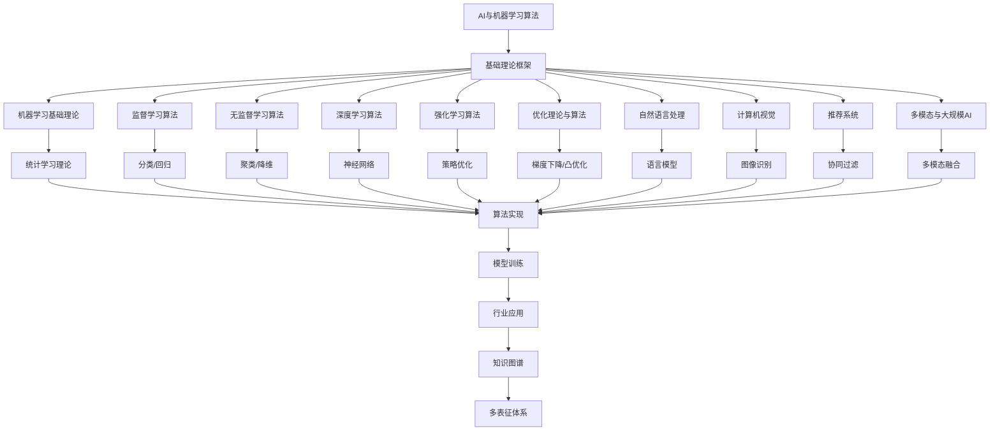

# 3.4-AI与机器学习算法 分支导航

## 📑 目录

- [3.4-AI与机器学习算法 分支导航](#34-ai与机器学习算法-分支导航)
  - [📑 目录](#-目录)
  - [1. 概述](#1-概述)
  - [2. 目录结构与本地跳转](#2-目录结构与本地跳转)
  - [3. 核心概念](#3-核心概念)
    - [3.1. 机器学习基础](#31-机器学习基础)
    - [3.2. 深度学习](#32-深度学习)
    - [3.3. 自然语言处理](#33-自然语言处理)
    - [3.4. 计算机视觉](#34-计算机视觉)
  - [4. 理论基础](#4-理论基础)
    - [4.1. 统计学习理论](#41-统计学习理论)
    - [4.2. 优化理论](#42-优化理论)
    - [4.3. 信息论](#43-信息论)
  - [5. 应用场景](#5-应用场景)
    - [5.1. 自然语言处理](#51-自然语言处理)
    - [5.2. 计算机视觉](#52-计算机视觉)
    - [5.3. 推荐系统](#53-推荐系统)
  - [6. 行业案例与多表征](#6-行业案例与多表征)
    - [6.1. 典型行业案例](#61-典型行业案例)
    - [6.2. 多表征示例](#62-多表征示例)
  - [7. 主题交叉引用](#7-主题交叉引用)
  - [8. 全链路知识流](#8-全链路知识流)
  - [9. 多表征](#9-多表征)
  - [10. 形式化语义](#10-形式化语义)
  - [11. 形式化语法与证明](#11-形式化语法与证明)
  - [12. 工具与实现](#12-工具与实现)
    - [12.1. 机器学习框架](#121-机器学习框架)
    - [12.2. 自然语言处理工具](#122-自然语言处理工具)
    - [12.3. 计算机视觉工具](#123-计算机视觉工具)
    - [12.4. 推荐系统工具](#124-推荐系统工具)
  - [13. 学习与研究路径](#13-学习与研究路径)
    - [13.1. 基础知识](#131-基础知识)
    - [13.2. 核心技能](#132-核心技能)
    - [13.3. 实践应用](#133-实践应用)
  - [14. 机器学习算法详解](#14-机器学习算法详解)
    - [14.1. 监督学习算法](#141-监督学习算法)
    - [14.2. 无监督学习算法](#142-无监督学习算法)
    - [14.3. 深度学习算法](#143-深度学习算法)
    - [14.4. 强化学习算法](#144-强化学习算法)
  - [15. 模型评估与优化](#15-模型评估与优化)
    - [15.1. 评估指标](#151-评估指标)
    - [15.2. 模型选择](#152-模型选择)
    - [15.3. 正则化技术](#153-正则化技术)
  - [16. 实际应用案例](#16-实际应用案例)
    - [16.1. 自然语言处理案例](#161-自然语言处理案例)
    - [16.2. 计算机视觉案例](#162-计算机视觉案例)
    - [16.3. 推荐系统案例](#163-推荐系统案例)
  - [17. 前沿技术与发展趋势](#17-前沿技术与发展趋势)
    - [17.1. 大模型技术](#171-大模型技术)
    - [17.2. 可解释AI](#172-可解释ai)
    - [17.3. 联邦学习](#173-联邦学习)
    - [17.4. 自监督学习](#174-自监督学习)
  - [18. 总结](#18-总结)

---

## 1. 概述

AI与机器学习算法是人工智能的核心，涵盖了从基础机器学习理论到深度学习、强化学习、自然语言处理、计算机视觉等各个领域。AI与机器学习算法为智能系统提供了理论基础和实现方法。

**核心特征**：

1. **理论基础**：统计学习理论、优化理论、信息论
2. **算法多样性**：监督学习、无监督学习、强化学习
3. **应用广泛**：自然语言处理、计算机视觉、推荐系统
4. **技术前沿**：深度学习、大模型、多模态AI

**应用领域**：

- 自然语言处理
- 计算机视觉
- 推荐系统
- 语音识别
- 机器人控制
- 游戏AI

---

## 2. 目录结构与本地跳转

- [3.4.1-机器学习基础理论](3.4.1-机器学习基础理论.md) - 机器学习基础理论文档
- [3.4.2-监督学习算法](3.4.2-监督学习算法.md) - 监督学习算法文档
- [3.4.3-无监督学习算法](3.4.3-无监督学习算法.md) - 无监督学习算法文档
- [3.4.4-深度学习算法](3.4.4-深度学习算法.md) - 深度学习算法文档
- [3.4.5-强化学习算法](3.4.5-强化学习算法.md) - 强化学习算法文档
- [3.4.6-优化理论与算法](3.4.6-优化理论与算法.md) - 优化理论与算法文档
- [3.4.7-自然语言处理](3.4.7-自然语言处理.md) - 自然语言处理文档
- [3.4.8-计算机视觉](3.4.8-计算机视觉.md) - 计算机视觉文档
- [3.4.9-推荐系统](3.4.9-推荐系统.md) - 推荐系统文档
- [3.4.10-多模态与大规模AI](3.4.10-多模态与大规模AI.md) - 多模态与大规模AI文档

---

## 3. 核心概念

### 3.1. 机器学习基础

机器学习是让计算机从数据中学习，无需显式编程。

**学习类型**：

- **监督学习**：有标签数据，学习输入到输出的映射
- **无监督学习**：无标签数据，发现数据中的模式
- **强化学习**：通过与环境交互，学习最优策略

### 3.2. 深度学习

深度学习使用多层神经网络学习数据的层次表示。

**核心架构**：

- **前馈神经网络**：多层感知机
- **卷积神经网络**：图像处理
- **循环神经网络**：序列处理
- **Transformer**：注意力机制

### 3.3. 自然语言处理

自然语言处理使计算机理解和生成人类语言。

**核心任务**：

- 文本分类、情感分析
- 机器翻译、文本生成
- 问答系统、对话系统

### 3.4. 计算机视觉

计算机视觉使计算机理解和分析图像和视频。

**核心任务**：

- 图像分类、目标检测
- 图像分割、人脸识别
- 视频分析、场景理解

---

## 4. 理论基础

### 4.1. 统计学习理论

统计学习理论为机器学习提供理论基础，包括PAC学习、VC维等概念。

**PAC学习框架**：

一个概念类$\mathcal{C}$是PAC可学习的，如果存在算法$A$，对于任意$\epsilon > 0$和$\delta > 0$，当样本数$m \geq poly(1/\epsilon, 1/\delta, size(c))$时，算法$A$以至少$1-\delta$的概率输出一个假设$h$，使得$error(h) \leq \epsilon$。

### 4.2. 优化理论

**梯度下降**：

$$\theta_{t+1} = \theta_t - \alpha \nabla_\theta J(\theta_t)$$

其中$\alpha$是学习率，$\nabla_\theta J(\theta_t)$是损失函数$J$关于参数$\theta$的梯度。

### 4.3. 信息论

**熵**：

$$H(X) = -\sum_{i=1}^n p(x_i) \log p(x_i)$$

**互信息**：

$$I(X;Y) = H(X) - H(X|Y) = H(Y) - H(Y|X)$$

---

## 5. 应用场景

### 5.1. 自然语言处理

**应用**：

- 机器翻译：Google Translate、DeepL
- 文本生成：GPT、BERT
- 情感分析：社交媒体分析
- 问答系统：ChatGPT、Claude

### 5.2. 计算机视觉

**应用**：

- 图像分类：ImageNet竞赛
- 目标检测：YOLO、R-CNN
- 人脸识别：Face ID、人脸支付
- 自动驾驶：Tesla、Waymo

### 5.3. 推荐系统

**应用**：

- 电商推荐：Amazon、淘宝
- 内容推荐：Netflix、YouTube
- 社交推荐：Facebook、LinkedIn

---

## 6. 行业案例与多表征

### 6.1. 典型行业案例

- **数学基础理论**：机器学习中的数学基础（详见[2.7-数学基础理论](../../../2-形式科学理论/2.7-数学基础理论/README.md)）
- **机器学习应用**：机器学习在行业中的应用（详见[5.3-机器学习](../../../5-行业应用与场景/5.3-机器学习/README.md)）
- **知识图谱**：知识图谱在AI中的应用（详见[6-知识图谱与可视化](../../../6-知识图谱与可视化/README.md)）

### 6.2. 多表征示例

- **符号表征**：算法伪代码、模型公式、损失函数、优化目标
- **图结构**：神经网络结构图、模型流程图、数据流图、计算图
- **向量/张量**：特征向量、参数矩阵、嵌入、张量数据
- **自然语言**：定义、注释、描述、算法说明
- **图像/可视化**：结构图、流程图、模型可视化、训练曲线

---

## 7. 主题交叉引用

| 主题      | 基础理论 | 形式化模型 | 应用场景 | 算法实现 | 行业案例 | 多表征 |
|-----------|----------|------------|----------|----------|----------|--------|
| 机器学习基础理论| ✅ | ✅       | ✅     | ✅     | ✅     | ✅   |
| 监督学习算法| ✅ | ✅       | ✅     | ✅     | ✅     | ✅   |
| 无监督学习算法| ✅ | ✅       | ✅     | ✅     | ✅     | ✅   |
| 深度学习算法| ✅ | ✅       | ✅     | ✅     | ✅     | ✅   |
| 强化学习算法| ✅ | ✅       | ✅     | ✅     | ✅     | ✅   |
| 优化理论与算法| ✅ | ✅       | ✅     | ✅     | ✅     | ✅   |
| 自然语言处理| ✅ | ✅       | ✅     | ✅     | ✅     | ✅   |
| 计算机视觉| ✅ | ✅       | ✅     | ✅     | ✅     | ✅   |
| 推荐系统  | ✅ | ✅       | ✅     | ✅     | ✅     | ✅   |
| 多模态与大规模AI| ✅ | ✅       | ✅     | ✅     | ✅     | ✅   |

**交叉引用**：

- [2.7-数学基础理论](../../../2-形式科学理论/2.7-数学基础理论/README.md)：机器学习中的数学基础
- [5.3-机器学习](../../../5-行业应用与场景/5.3-机器学习/README.md)：机器学习在行业中的应用
- [6-知识图谱与可视化](../../../6-知识图谱与可视化/README.md)：知识图谱在AI中的应用

---

## 8. 全链路知识流

---

## 9. 多表征

AI与机器学习算法分支支持多种表征方式，包括：

- **符号表征**：算法伪代码、模型公式、损失函数、优化目标、正则化项
- **图结构**：神经网络结构图、模型流程图、数据流图、计算图、注意力图
- **向量/张量**：特征向量、参数矩阵、嵌入、张量数据、梯度向量
- **自然语言**：定义、注释、描述、算法说明、理论解释
- **图像/可视化**：结构图、流程图、模型可视化、训练曲线、特征可视化

这些表征可互映，提升AI与机器学习算法的表达力。

---

## 10. 形式化语义

**语义域**：$D$，包括：

- 数据对象集：$\mathcal{D} = \{d_1, d_2, \ldots\}$
- 模型空间：$\mathcal{M}$
- 参数空间：$\Theta$
- 损失空间：$\mathcal{L}$
- 优化空间：$\mathcal{O}$

**解释函数**：$I: \mathcal{L} \to D$，将AI与机器学习规范映射到语义对象：

- $I(\text{model}) \in \mathcal{M}$：模型的解释
- $I(\text{parameter}) \in \Theta$：参数的解释
- $I(\text{loss}) \in \mathcal{L}$：损失函数的解释
- $I(\text{optimizer}) \in \mathcal{O}$：优化器的解释

**语义一致性**：每个模型/算法/公式在$D$中有明确定义，满足模型有效性、算法正确性、优化收敛性。

---

## 11. 形式化语法与证明

**语法规则**：

- **模型语法**：$Model ::= Linear \mid Neural \mid Tree \mid Ensemble$
- **算法语法**：$Algorithm ::= Train \mid Predict \mid Optimize \mid Evaluate$
- **损失语法**：$Loss ::= MSE \mid CrossEntropy \mid Hinge \mid Custom$

**推理规则**：

- **模型训练**：$\frac{Data \land Model \land Loss \land Optimizer}{TrainedModel}$
- **模型预测**：$\frac{TrainedModel \land Input}{Output}$
- **优化收敛**：$\frac{Optimizer \land Loss}{Convergence}$

**定理**：AI与机器学习算法分支的语法系统具一致性与可扩展性。

**证明**：由模型定义、算法伪代码与推理规则递归定义，保证系统一致与可扩展。

---

## 12. 工具与实现

### 12.1. 机器学习框架

**传统机器学习**：

- Scikit-learn：Python机器学习库
- XGBoost：梯度提升框架
- LightGBM：轻量级梯度提升

**深度学习**：

- TensorFlow：Google深度学习框架
- PyTorch：Facebook深度学习框架
- Keras：高级神经网络API
- JAX：Google的自动微分框架

### 12.2. 自然语言处理工具

**NLP库**：

- Transformers：Hugging Face的预训练模型库
- spaCy：工业级NLP库
- NLTK：自然语言工具包
- Stanza：Stanford NLP库

### 12.3. 计算机视觉工具

**CV库**：

- OpenCV：计算机视觉库
- PIL/Pillow：图像处理库
- scikit-image：图像处理库
- Detectron2：Facebook的目标检测框架

### 12.4. 推荐系统工具

**推荐系统库**：

- Surprise：推荐系统库
- Implicit：隐式反馈推荐
- TensorFlow Recommenders：TensorFlow推荐系统

---

## 13. 学习与研究路径

### 13.1. 基础知识

1. **数学基础**：线性代数、概率论、统计学、微积分
2. **编程基础**：Python、NumPy、Pandas

### 13.2. 核心技能

1. **机器学习**：监督学习、无监督学习、强化学习
2. **深度学习**：神经网络、CNN、RNN、Transformer
3. **应用领域**：NLP、CV、推荐系统

### 13.3. 实践应用

1. **项目实践**：Kaggle竞赛、开源项目
2. **工具掌握**：TensorFlow、PyTorch、Scikit-learn
3. **研究前沿**：大模型、多模态AI、可解释AI、联邦学习

---

## 14. 机器学习算法详解

### 14.1. 监督学习算法

**分类算法**：

- **逻辑回归**：$P(y=1|x) = \frac{1}{1+e^{-\theta^T x}}$
- **支持向量机**：$\min_{\theta} \frac{1}{2}||\theta||^2 + C\sum_{i=1}^m \xi_i$
- **决策树**：基于信息增益或基尼不纯度
- **随机森林**：集成多个决策树
- **梯度提升**：XGBoost、LightGBM

**回归算法**：

- **线性回归**：$y = \theta^T x + b$
- **岭回归**：$J(\theta) = ||y - X\theta||^2 + \alpha||\theta||^2$
- **Lasso回归**：$J(\theta) = ||y - X\theta||^2 + \alpha||\theta||_1$

### 14.2. 无监督学习算法

**聚类算法**：

- **K-means**：$\min \sum_{i=1}^k \sum_{x \in C_i} ||x - \mu_i||^2$
- **DBSCAN**：基于密度的聚类
- **层次聚类**：自底向上或自顶向下

**降维算法**：

- **PCA**：主成分分析，最大化方差
- **t-SNE**：t-分布随机邻域嵌入
- **UMAP**：统一流形逼近与投影

### 14.3. 深度学习算法

**前馈神经网络**：

$$h^{(l)} = \sigma(W^{(l)} h^{(l-1)} + b^{(l)})$$

**卷积神经网络**：

$$y = \text{Conv}(x, W) + b$$

**循环神经网络**：

$$h_t = \tanh(W_{hh} h_{t-1} + W_{xh} x_t + b)$$

**Transformer**：

$$\text{Attention}(Q, K, V) = \text{softmax}\left(\frac{QK^T}{\sqrt{d_k}}\right)V$$

### 14.4. 强化学习算法

**Q-learning**：

$$Q(s, a) \leftarrow Q(s, a) + \alpha[r + \gamma \max_{a'} Q(s', a') - Q(s, a)]$$

**策略梯度**：

$$\nabla_\theta J(\theta) = \mathbb{E}[\nabla_\theta \log \pi_\theta(a|s) Q(s, a)]$$

**Actor-Critic**：

结合策略梯度和价值函数估计

---

## 15. 模型评估与优化

### 15.1. 评估指标

**分类指标**：

- **准确率**：$Accuracy = \frac{TP + TN}{TP + TN + FP + FN}$
- **精确率**：$Precision = \frac{TP}{TP + FP}$
- **召回率**：$Recall = \frac{TP}{TP + FN}$
- **F1分数**：$F1 = \frac{2 \times Precision \times Recall}{Precision + Recall}$
- **AUC-ROC**：ROC曲线下面积

**回归指标**：

- **MSE**：$MSE = \frac{1}{n}\sum_{i=1}^n (y_i - \hat{y}_i)^2$
- **MAE**：$MAE = \frac{1}{n}\sum_{i=1}^n |y_i - \hat{y}_i|$
- **R²**：$R^2 = 1 - \frac{\sum_{i=1}^n (y_i - \hat{y}_i)^2}{\sum_{i=1}^n (y_i - \bar{y})^2}$

### 15.2. 模型选择

**交叉验证**：

- K折交叉验证
- 留一交叉验证
- 时间序列交叉验证

**超参数优化**：

- 网格搜索
- 随机搜索
- 贝叶斯优化
- 进化算法

### 15.3. 正则化技术

**L1正则化**：

$$J(\theta) = Loss(\theta) + \lambda \sum_{i=1}^n |\theta_i|$$

**L2正则化**：

$$J(\theta) = Loss(\theta) + \lambda \sum_{i=1}^n \theta_i^2$$

**Dropout**：

训练时随机丢弃部分神经元

**Batch Normalization**：

$$\hat{x} = \frac{x - \mu}{\sqrt{\sigma^2 + \epsilon}}$$

---

## 16. 实际应用案例

### 16.1. 自然语言处理案例

**机器翻译**：

- Google Translate使用Transformer架构
- 支持100+种语言
- 实时翻译和离线翻译

**文本生成**：

- GPT系列：GPT-3、GPT-4
- ChatGPT：对话生成
- 代码生成：GitHub Copilot

**情感分析**：

- 社交媒体情感分析
- 产品评论分析
- 舆情监控

### 16.2. 计算机视觉案例

**图像分类**：

- ImageNet竞赛：ResNet、EfficientNet
- 医疗影像：疾病诊断
- 自动驾驶：场景理解

**目标检测**：

- YOLO：实时目标检测
- R-CNN系列：高精度检测
- 人脸识别：Face ID、人脸支付

**图像生成**：

- GAN：生成对抗网络
- Stable Diffusion：文本到图像
- DALL-E：创意图像生成

### 16.3. 推荐系统案例

**电商推荐**：

- Amazon：协同过滤
- 淘宝：个性化推荐
- 京东：商品推荐

**内容推荐**：

- Netflix：电影推荐
- YouTube：视频推荐
- Spotify：音乐推荐

---

## 17. 前沿技术与发展趋势

### 17.1. 大模型技术

**大语言模型**：

- GPT-4：多模态大模型
- Claude：对话大模型
- LLaMA：开源大模型

**多模态大模型**：

- GPT-4V：视觉理解
- DALL-E 3：图像生成
- Sora：视频生成

### 17.2. 可解释AI

**可解释性方法**：

- LIME：局部可解释模型
- SHAP：SHapley Additive exPlanations
- 注意力可视化
- 特征重要性分析

### 17.3. 联邦学习

**联邦学习框架**：

- 横向联邦学习
- 纵向联邦学习
- 联邦迁移学习

**应用场景**：

- 医疗数据隐私保护
- 金融风控
- 物联网设备

### 17.4. 自监督学习

**自监督方法**：

- 对比学习
- 掩码语言模型
- 自编码器

**应用**：

- 预训练模型
- 无标签数据学习
- 表征学习

---

## 18. 总结

AI与机器学习算法是人工智能的核心，为智能系统提供了理论基础和实现方法。从基础机器学习到深度学习，从自然语言处理到计算机视觉，AI与机器学习算法涵盖了人工智能的各个方面。

**核心价值**：

1. **理论基础**：为AI系统提供理论基础
2. **算法支持**：提供丰富的算法和模型
3. **应用广泛**：应用于各个领域
4. **技术前沿**：推动AI技术发展

**应用前景**：

随着大模型、多模态AI、可解释AI等技术的发展，AI与机器学习算法将继续发展，特别是在大模型、多模态融合、可解释性、联邦学习等领域，AI与机器学习算法将提供更强大的功能和更好的性能。

**发展趋势**：

1. **大模型**：更大规模的模型和更强的能力
2. **多模态**：文本、图像、音频的统一理解
3. **可解释性**：提高AI系统的可解释性和可信度
4. **效率优化**：模型压缩、量化、蒸馏等技术
5. **边缘AI**：在边缘设备上部署AI模型

---

[返回数据模型与算法总导航](../README.md)
