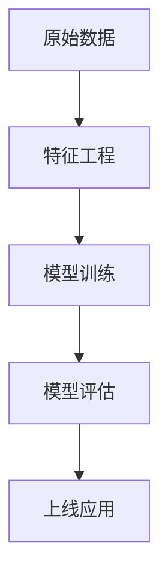

# 3.4 AI与机器学习算法

## 概述

本目录包含人工智能与机器学习算法的形式化理论、数学基础、算法实现和工程应用。从数据科学视角全面构建AI理论体系，涵盖从基础数学理论到前沿深度学习技术的完整知识图谱。

## 目录结构与本地跳转

- [3.4.1 机器学习基础理论](./3.4.1-机器学习基础理论.md)
- [3.4.2 监督学习算法](./3.4.2-监督学习算法.md)
- [3.4.3 无监督学习算法](./3.4.3-无监督学习算法.md)
- [3.4.4 强化学习理论](./3.4.4-强化学习理论.md)
- [3.4.5 深度学习架构](./3.4.5-深度学习架构.md)
- [3.4.6 优化理论与算法](./3.4.6-优化理论与算法.md)
- [3.4.7 概率图模型](./3.4.7-概率图模型.md)
- [3.4.8 多模态与大规模AI](./3.4.8-多模态与大规模AI.md)
- [3.4.10 多模态与大规模AI](./3.4.10-多模态与大规模AI.md)

---

## 行业案例与多表征

### 3.4.x 典型行业案例

- 金融风控：深度学习识别欺诈、风险预测（详见5.1-金融数据分析、3.5.4-专业数据分析算法）
- 医疗影像：卷积神经网络识别病灶（详见5.3-机器学习、3.5.3-数据可视化方法与工具）
- 智能推荐：大规模用户行为建模与实时推荐（详见3.5.5-数据流处理与架构）

### 3.4.x 多表征示例

- 算法流程图、模型结构图、评估指标表、可视化结果等

---

[返回数据分析与ETL](../3.5-数据分析与ETL/README.md)

## 数学基础依赖

### 线性代数

- 向量空间理论 → [2.1.1-基础类型理论.md](../../2-形式科学理论/2.1-类型理论/2.1.1-基础类型理论.md)
- 矩阵分解、特征值理论
- 张量代数与微分几何

### 概率论与统计

- 测度论基础 → [参见数学基础](../../5-数学基础/)
- 信息论、熵理论
- 统计推断、假设检验

### 优化理论

- 凸优化理论
- 非凸优化、全局优化
- 变分方法、拉格朗日对偶

### 函数分析

- Hilbert空间、Banach空间
- 函数逼近理论
- 泛函导数、变分学

## 工程实现框架

### 编程语言支持

- **Rust**: 高性能机器学习库（Candle、tch、SmartCore）
- **Python**: 科学计算生态（NumPy、SciPy、scikit-learn、PyTorch、TensorFlow）
- **Julia**: 高性能科学计算（MLJ.jl、Flux.jl）
- **Haskell**: 函数式机器学习（HaskTorch、Grenade）

### 分布式计算

- 数据并行 vs 模型并行
- 联邦学习架构
- 边缘计算AI

## 与其他模块的关联

### 数据库系统集成

- AI驱动的查询优化 → [1.1.5-PostgreSQL查询优化.md](../../1-数据库系统/1.1-PostgreSQL/1.1.5-PostgreSQL查询优化.md)
- 向量数据库 → [1.2-向量数据库/](../../1-数据库系统/1.2-向量数据库/)
- 机器学习管道与ETL

### 形式科学理论应用

- 类型安全的机器学习 → [2.1-类型理论/](../../2-形式科学理论/2.1-类型理论/)
- 自动机在序列学习中的应用 → [2.2-自动机理论/](../../2-形式科学理论/2.2-自动机理论/)
- Petri网建模训练过程 → [2.3-Petri网理论/](../../2-形式科学理论/2.3-Petri网理论/)

### 软件架构设计

- MLOps与CI/CD → [4-软件架构与工程/](../../4-软件架构与工程/)
- 微服务架构中的AI服务
- 实时推理系统设计

## 应用领域

### 科学计算

- 计算物理、化学
- 生物信息学
- 天体物理学模拟

### 工程应用

- 计算机视觉
- 自然语言处理
- 语音识别与合成
- 推荐系统

### 金融科技

- 算法交易
- 风险评估
- 欺诈检测

## 前沿方向

### 神经符号AI

- 符号推理与神经网络融合
- 可解释AI
- 知识图谱增强学习

### 量子机器学习

- 量子算法优势
- 变分量子特征求解器
- 量子神经网络

### 持续学习

- 灾难性遗忘问题
- 元学习与少样本学习
- 终身学习系统

## 质量保证

### 理论验证

- 数学证明的严格性
- 算法复杂度分析
- 收敛性保证

### 工程验证

- 基准测试与评估
- 可重现性标准
- 性能优化

### 伦理与安全

- AI安全理论
- 公平性保证
- 隐私保护学习

---

## 版本信息

- **创建日期**: 2024-12-19
- **版本**: v1.0
- **贡献者**: Data Science Analysis Team
- **最后更新**: 2024-12-19

---

*本目录将持续更新，跟进AI与机器学习领域的最新理论发展和工程实践。*
