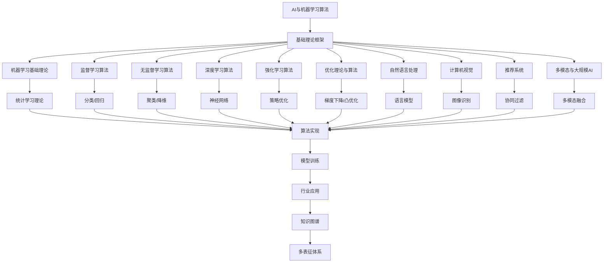

# 3.4-AI与机器学习算法 分支导航

## 目录结构与本地跳转

- [3.4.1-机器学习基础理论](3.4.1-机器学习基础理论.md) - 预留分支
- [3.4.2-监督学习算法](3.4.2-监督学习算法.md) - 预留分支
- [3.4.3-无监督学习算法](3.4.3-无监督学习算法.md) - 预留分支
- [3.4.4-深度学习算法](3.4.4-深度学习算法.md) - 预留分支
- [3.4.5-强化学习算法](3.4.5-强化学习算法.md) - 预留分支
- [3.4.6-优化理论与算法](3.4.6-优化理论与算法.md) - 预留分支
- [3.4.7-自然语言处理](3.4.7-自然语言处理.md) - 预留分支
- [3.4.8-计算机视觉](3.4.8-计算机视觉.md) - 预留分支
- [3.4.9-推荐系统](3.4.9-推荐系统.md) - 预留分支
- [3.4.10-多模态与大规模AI](3.4.10-多模态与大规模AI.md) - 预留分支

---

## 主题交叉引用

| 主题      | 基础理论 | 形式化模型 | 应用场景 | 算法实现 | 行业案例 | 多表征 |
|-----------|----------|------------|----------|----------|----------|--------|
| 机器学习基础理论| 预留 | 预留       | 预留     | 预留     | 预留     | 预留   |
| 监督学习算法| 预留   | 预留       | 预留     | 预留     | 预留     | 预留   |
| 无监督学习算法| 预留 | 预留       | 预留     | 预留     | 预留     | 预留   |
| 深度学习算法| 预留   | 预留       | 预留     | 预留     | 预留     | 预留   |
| 强化学习算法| 预留   | 预留       | 预留     | 预留     | 预留     | 预留   |
| 优化理论与算法| 预留 | 预留       | 预留     | 预留     | 预留     | 预留   |
| 自然语言处理| 预留   | 预留       | 预留     | 预留     | 预留     | 预留   |
| 计算机视觉| 预留     | 预留       | 预留     | 预留     | 预留     | 预留   |
| 推荐系统  | 预留     | 预留       | 预留     | 预留     | 预留     | 预留   |
| 多模态与大规模AI| 预留 | 预留       | 预留     | 预留     | 预留     | 预留   |

- 交叉引用：[2.7-数学基础理论](../../../2-形式科学理论/2.7-数学基础理论/README.md)、[5.3-机器学习](../../../5-行业应用与场景/5.3-机器学习/README.md)、[6-知识图谱与可视化](../../../6-知识图谱与可视化/README.md)

---

## 全链路知识流（Mermaid流程图）

---

## 多表征

AI与机器学习算法分支支持多种表征方式，包括：

- 符号表征（算法伪代码、模型公式、损失函数等）
- 图结构（神经网络结构图、模型流程图、数据流图等）
- 向量/张量（特征向量、参数矩阵、嵌入）
- 自然语言（定义、注释、描述）
- 图像/可视化（结构图、流程图、模型可视化等）
这些表征可互映，提升AI与机器学习算法的表达力。

## 形式化语义

- 语义域：$D$，如数据对象集、模型空间、参数空间、损失空间
- 解释函数：$I: S \to D$，将符号/结构映射到具体语义对象
- 语义一致性：每个结构/模型/算法/公式在$D$中有明确定义

## 形式化语法与证明

- 语法规则：如模型定义、算法伪代码、推理规则、约束条件
- **定理**：AI与机器学习算法分支的语法系统具一致性与可扩展性。
- **证明**：由模型定义、算法伪代码与推理规则递归定义，保证系统一致与可扩展。

---

[返回数据模型与算法总导航](../README.md)
