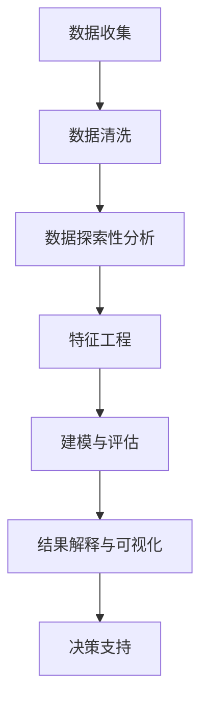

# 3.5.1 数据分析基础理论

## 1. 📋 概述

数据分析是数据科学的核心组成部分，通过系统性的方法对数据进行收集、清洗、探索、建模和解释，以发现数据中的模式、趋势和洞察。

## 2. ️ 理论框架

### 2.1. 数据分析的定义与流程

数据分析是指对原始数据进行清洗、转换、建模、解释的过程，旨在发现有用信息、得出结论并支持决策。

#### 2.1.1. 核心流程



#### 2.1.2. 详细步骤说明

1. **数据收集 (Data Collection)**
   - 确定数据需求
   - 选择数据源
   - 设计数据收集方案

2. **数据清洗 (Data Cleaning)**
   - 处理缺失值
   - 识别和处理异常值
   - 数据格式标准化

3. **探索性数据分析 (EDA)**
   - 数据分布分析
   - 相关性分析
   - 异常检测

4. **特征工程 (Feature Engineering)**
   - 特征选择
   - 特征变换
   - 特征组合

5. **建模与评估 (Modeling & Evaluation)**
   - 模型选择
   - 参数调优
   - 交叉验证

6. **结果解释与可视化 (Interpretation & Visualization)**
   - 模型解释
   - 结果可视化
   - 洞察总结

### 2.2. 主要分析方法

#### 2.2.1. 描述性统计 (Descriptive Statistics)

```python
import pandas as pd
import numpy as np
import matplotlib.pyplot as plt
import seaborn as sns

class DescriptiveAnalysis:
    def __init__(self, data):
        self.data = data

    def basic_statistics(self):
        """基础统计描述"""
        return {
            'count': self.data.count(),
            'mean': self.data.mean(),
            'std': self.data.std(),
            'min': self.data.min(),
            '25%': self.data.quantile(0.25),
            '50%': self.data.quantile(0.50),
            '75%': self.data.quantile(0.75),
            'max': self.data.max()
        }

    def distribution_analysis(self, column):
        """分布分析"""
        plt.figure(figsize=(12, 4))

# 直方图
        plt.subplot(1, 3, 1)
        plt.hist(self.data[column], bins=30, alpha=0.7)
        plt.title(f'{column} 分布直方图')

# 箱线图
        plt.subplot(1, 3, 2)
        plt.boxplot(self.data[column])
        plt.title(f'{column} 箱线图')

# Q-Q图
        plt.subplot(1, 3, 3)
        from scipy import stats
        stats.probplot(self.data[column], dist="norm", plot=plt)
        plt.title(f'{column} Q-Q图')

        plt.tight_layout()
        plt.show()

    def correlation_analysis(self):
        """相关性分析"""
        correlation_matrix = self.data.corr()

        plt.figure(figsize=(10, 8))
        sns.heatmap(correlation_matrix, annot=True, cmap='coolwarm', center=0)
        plt.title('相关性热力图')
        plt.show()

        return correlation_matrix

# 使用示例
df = pd.read_csv('data.csv')
analyzer = DescriptiveAnalysis(df)
stats = analyzer.basic_statistics()
analyzer.distribution_analysis('target_column')
corr_matrix = analyzer.correlation_analysis()
```

## 3. 推断性统计 (Inferential Statistics)

```python
from scipy import stats
from scipy.stats import ttest_ind, chi2_contingency, pearsonr

class InferentialAnalysis:
    def __init__(self, data):
        self.data = data

    def hypothesis_testing(self, group1, group2, test_type='t_test'):
        """假设检验"""
        if test_type == 't_test':
# 独立样本t检验
            statistic, p_value = ttest_ind(group1, group2)
            return {
                'test_type': 'Independent t-test',
                'statistic': statistic,
                'p_value': p_value,
                'significant': p_value < 0.05
            }
        elif test_type == 'chi_square':
# 卡方检验
            contingency_table = pd.crosstab(group1, group2)
            statistic, p_value, dof, expected = chi2_contingency(contingency_table)
            return {
                'test_type': 'Chi-square test',
                'statistic': statistic,
                'p_value': p_value,
                'significant': p_value < 0.05
            }

    def confidence_interval(self, data, confidence=0.95):
        """置信区间计算"""
        mean = np.mean(data)
        std_err = stats.sem(data)
        ci = stats.t.interval(confidence, len(data)-1, loc=mean, scale=std_err)
        return {
            'mean': mean,
            'confidence_interval': ci,
            'confidence_level': confidence
        }

# 使用示例
infer_analyzer = InferentialAnalysis(df)
t_test_result = infer_analyzer.hypothesis_testing(df['group1'], df['group2'])
ci_result = infer_analyzer.confidence_interval(df['target_column'])
```

## 4. 数据分析方法论

### 4.1. CRISP-DM 方法论

```python
class CRISPDM:
    """CRISP-DM 数据分析方法论实现"""

    def __init__(self):
        self.current_phase = None
        self.results = {}

    def business_understanding(self, business_objectives, success_criteria):
        """业务理解阶段"""
        self.current_phase = "Business Understanding"
        self.results['business_objectives'] = business_objectives
        self.results['success_criteria'] = success_criteria
        print(f"阶段: {self.current_phase}")
        print(f"业务目标: {business_objectives}")
        print(f"成功标准: {success_criteria}")

    def data_understanding(self, data_sources, data_quality_report):
        """数据理解阶段"""
        self.current_phase = "Data Understanding"
        self.results['data_sources'] = data_sources
        self.results['data_quality'] = data_quality_report
        print(f"阶段: {self.current_phase}")
        print(f"数据源: {data_sources}")
        print(f"数据质量报告: {data_quality_report}")

    def data_preparation(self, data_cleaning_steps, feature_engineering):
        """数据准备阶段"""
        self.current_phase = "Data Preparation"
        self.results['cleaning_steps'] = data_cleaning_steps
        self.results['feature_engineering'] = feature_engineering
        print(f"阶段: {self.current_phase}")
        print(f"数据清洗步骤: {data_cleaning_steps}")
        print(f"特征工程: {feature_engineering}")

    def modeling(self, model_selection, model_training):
        """建模阶段"""
        self.current_phase = "Modeling"
        self.results['model_selection'] = model_selection
        self.results['model_training'] = model_training
        print(f"阶段: {self.current_phase}")
        print(f"模型选择: {model_selection}")
        print(f"模型训练: {model_training}")

    def evaluation(self, model_performance, business_impact):
        """评估阶段"""
        self.current_phase = "Evaluation"
        self.results['model_performance'] = model_performance
        self.results['business_impact'] = business_impact
        print(f"阶段: {self.current_phase}")
        print(f"模型性能: {model_performance}")
        print(f"业务影响: {business_impact}")

    def deployment(self, deployment_plan, monitoring_strategy):
        """部署阶段"""
        self.current_phase = "Deployment"
        self.results['deployment_plan'] = deployment_plan
        self.results['monitoring_strategy'] = monitoring_strategy
        print(f"阶段: {self.current_phase}")
        print(f"部署计划: {deployment_plan}")
        print(f"监控策略: {monitoring_strategy}")

# 使用示例
crisp_dm = CRISPDM()
crisp_dm.business_understanding(
    business_objectives="提高客户满意度",
    success_criteria="满意度提升10%"
)
crisp_dm.data_understanding(
    data_sources=["CRM系统", "客服系统"],
    data_quality_report="数据完整性95%"
)
```

## 5. 数据分析技术栈

### 5.1. 数据处理技术栈

```python
class DataAnalysisTechStack:
    """数据分析技术栈"""

    def __init__(self):
        self.tech_stack = {
            'data_manipulation': {
                'pandas': '数据操作和分析',
                'numpy': '数值计算',
                'polars': '高性能数据处理'
            },
            'visualization': {
                'matplotlib': '基础可视化',
                'seaborn': '统计可视化',
                'plotly': '交互式可视化',
                'bokeh': 'Web可视化'
            },
            'statistical_analysis': {
                'scipy': '科学计算',
                'statsmodels': '统计建模',
                'pingouin': '统计测试'
            },
            'machine_learning': {
                'scikit-learn': '机器学习',
                'xgboost': '梯度提升',
                'lightgbm': '轻量级梯度提升'
            },
            'deep_learning': {
                'tensorflow': '深度学习框架',
                'pytorch': '深度学习框架',
                'keras': '高级神经网络API'
            }
        }

    def get_recommended_stack(self, analysis_type):
        """根据分析类型推荐技术栈"""
        recommendations = {
            'exploratory': ['pandas', 'numpy', 'matplotlib', 'seaborn'],
            'statistical': ['pandas', 'scipy', 'statsmodels', 'matplotlib'],
            'machine_learning': ['pandas', 'scikit-learn', 'matplotlib', 'seaborn'],
            'deep_learning': ['pandas', 'tensorflow', 'matplotlib', 'plotly'],
            'big_data': ['polars', 'dask', 'vaex', 'plotly']
        }
        return recommendations.get(analysis_type, [])

# 使用示例
tech_stack = DataAnalysisTechStack()
ml_tools = tech_stack.get_recommended_stack('machine_learning')
```

## 6. 数据质量评估框架

```python
class DataQualityFramework:
    """数据质量评估框架"""

    def __init__(self, data):
        self.data = data
        self.quality_metrics = {}

    def completeness_check(self):
        """完整性检查"""
        missing_data = self.data.isnull().sum()
        completeness_rate = 1 - (missing_data / len(self.data))

        self.quality_metrics['completeness'] = {
            'missing_counts': missing_data.to_dict(),
            'completeness_rate': completeness_rate.to_dict(),
            'overall_completeness': completeness_rate.mean()
        }
        return self.quality_metrics['completeness']

    def accuracy_check(self, validation_rules):
        """准确性检查"""
        accuracy_results = {}
        for column, rules in validation_rules.items():
            if column in self.data.columns:
                violations = 0
                for rule in rules:
                    violations += (~rule(self.data[column])).sum()
                accuracy_results[column] = 1 - (violations / len(self.data))

        self.quality_metrics['accuracy'] = accuracy_results
        return accuracy_results

    def generate_quality_report(self):
        """生成质量报告"""
        report = {
            'summary': {
                'total_records': len(self.data),
                'total_columns': len(self.data.columns),
                'overall_quality_score': self._calculate_overall_score()
            },
            'detailed_metrics': self.quality_metrics
        }
        return report

    def _calculate_overall_score(self):
        """计算总体质量分数"""
        scores = []
        if 'completeness' in self.quality_metrics:
            scores.append(self.quality_metrics['completeness']['overall_completeness'])
        if 'accuracy' in self.quality_metrics:
            scores.append(np.mean(list(self.quality_metrics['accuracy'].values())))

        return np.mean(scores) if scores else 0

# 使用示例
quality_framework = DataQualityFramework(df)
completeness = quality_framework.completeness_check()

# 定义验证规则
validation_rules = {
    'age': [lambda x: x >= 0, lambda x: x <= 120],
    'salary': [lambda x: x >= 0]
}
accuracy = quality_framework.accuracy_check(validation_rules)
quality_report = quality_framework.generate_quality_report()
```

## 7. 实际应用案例

### 7.1. 行业案例与多表征

#### 7.1.1. 金融行业案例

```python
class FinancialDataAnalysis:
    """金融数据分析案例"""

    def __init__(self, transaction_data, customer_data):
        self.transaction_data = transaction_data
        self.customer_data = customer_data

    def credit_scoring_analysis(self):
        """信用评分分析"""
# 特征工程
        features = self._engineer_credit_features()

# 统计分析
        credit_stats = self._analyze_credit_distribution()

# 风险建模
        risk_model = self._build_risk_model(features)

        return {
            'features': features,
            'statistics': credit_stats,
            'risk_model': risk_model
        }

    def _engineer_credit_features(self):
        """信用特征工程"""
        features = {}

# 交易频率
        features['transaction_frequency'] = self.transaction_data.groupby('customer_id').size()

# 平均交易金额
        features['avg_transaction_amount'] = self.transaction_data.groupby('customer_id')['amount'].mean()

# 交易金额标准差
        features['transaction_amount_std'] = self.transaction_data.groupby('customer_id')['amount'].std()

        return pd.DataFrame(features)

    def _analyze_credit_distribution(self):
        """信用分布分析"""
        return {
            'mean_credit_score': self.customer_data['credit_score'].mean(),
            'credit_score_distribution': self.customer_data['credit_score'].value_counts(),
            'credit_score_percentiles': self.customer_data['credit_score'].quantile([0.25, 0.5, 0.75])
        }

    def _build_risk_model(self, features):
        """构建风险模型"""
        from sklearn.ensemble import RandomForestClassifier
        from sklearn.model_selection import train_test_split

# 准备训练数据
        X = features.fillna(0)
        y = self.customer_data['default_risk']

# 分割数据
        X_train, X_test, y_train, y_test = train_test_split(X, y, test_size=0.2, random_state=42)

# 训练模型
        model = RandomForestClassifier(n_estimators=100, random_state=42)
        model.fit(X_train, y_train)

        return {
            'model': model,
            'feature_importance': model.feature_importances_,
            'test_score': model.score(X_test, y_test)
        }
```

## 8. 医疗行业案例

```python
class MedicalDataAnalysis:
    """医疗数据分析案例"""

    def __init__(self, patient_data, treatment_data):
        self.patient_data = patient_data
        self.treatment_data = treatment_data

    def patient_outcome_analysis(self):
        """患者预后分析"""
# 生存分析
        survival_analysis = self._perform_survival_analysis()

# 治疗效果分析
        treatment_effectiveness = self._analyze_treatment_effectiveness()

        return {
            'survival_analysis': survival_analysis,
            'treatment_effectiveness': treatment_effectiveness
        }

    def _perform_survival_analysis(self):
        """执行生存分析"""
        from lifelines import KaplanMeierFitter

# Kaplan-Meier生存分析
        kmf = KaplanMeierFitter()
        kmf.fit(self.patient_data['survival_time'], self.patient_data['event'])

        return {
            'kaplan_meier': kmf,
            'median_survival': kmf.median_survival_time_
        }

    def _analyze_treatment_effectiveness(self):
        """分析治疗效果"""
# 治疗前后对比
        before_after = self.patient_data.groupby('treatment_group').agg({
            'symptom_score': ['mean', 'std'],
            'quality_of_life': ['mean', 'std']
        })

# 统计检验
        from scipy.stats import ttest_ind
        treatment_effect = ttest_ind(
            self.patient_data[self.patient_data['treatment_group'] == 'treatment']['symptom_score'],
            self.patient_data[self.patient_data['treatment_group'] == 'control']['symptom_score']
        )

        return {
            'before_after_comparison': before_after,
            'treatment_effect_test': treatment_effect
        }
```

## 9. 零售行业案例

```python
class RetailDataAnalysis:
    """零售数据分析案例"""

    def __init__(self, sales_data, customer_data, product_data):
        self.sales_data = sales_data
        self.customer_data = customer_data
        self.product_data = product_data

    def sales_analysis(self):
        """销售分析"""
# 销售趋势分析
        sales_trends = self._analyze_sales_trends()

# 产品表现分析
        product_performance = self._analyze_product_performance()

        return {
            'sales_trends': sales_trends,
            'product_performance': product_performance
        }

    def _analyze_sales_trends(self):
        """分析销售趋势"""
# 时间序列分析
        sales_by_date = self.sales_data.groupby('date')['amount'].sum()

# 季节性分析
        from statsmodels.tsa.seasonal import seasonal_decompose
        decomposition = seasonal_decompose(sales_by_date, period=30)

        return {
            'sales_timeseries': sales_by_date,
            'seasonal_decomposition': decomposition
        }

    def _analyze_product_performance(self):
        """分析产品表现"""
        product_metrics = self.sales_data.groupby('product_id').agg({
            'amount': ['sum', 'mean', 'count'],
            'quantity': ['sum', 'mean']
        }).round(2)

# 产品排名
        product_ranking = product_metrics['amount']['sum'].sort_values(ascending=False)

# ABC分析
        cumulative_percentage = product_ranking.cumsum() / product_ranking.sum() * 100
        abc_classification = pd.cut(cumulative_percentage,
                                  bins=[0, 80, 95, 100],
                                  labels=['A', 'B', 'C'])

        return {
            'product_metrics': product_metrics,
            'product_ranking': product_ranking,
            'abc_classification': abc_classification
        }
```

## 10. 多表征示例

### 10.1. 可视化表征

```python
class DataVisualization:
    """数据可视化工具类"""

    def __init__(self):
        self.colors = ['#1f77b4', '#ff7f0e', '#2ca02c', '#d62728', '#9467bd']

    def create_comprehensive_dashboard(self, data, analysis_results):
        """创建综合分析仪表板"""
        fig, axes = plt.subplots(2, 3, figsize=(18, 12))

# 1. 数据分布图
        self._plot_distribution(axes[0, 0], data)

# 2. 相关性热力图
        self._plot_correlation_heatmap(axes[0, 1], data)

# 3. 时间序列图
        self._plot_time_series(axes[0, 2], data)

# 4. 箱线图
        self._plot_boxplot(axes[1, 0], data)

# 5. 散点图
        self._plot_scatter(axes[1, 1], data)

# 6. 统计摘要
        self._plot_statistics_summary(axes[1, 2], analysis_results)

        plt.tight_layout()
        plt.show()

    def _plot_distribution(self, ax, data):
        """绘制分布图"""
        for column in data.select_dtypes(include=[np.number]).columns[:3]:
            ax.hist(data[column].dropna(), alpha=0.7, label=column, bins=20)
        ax.set_title('数据分布')
        ax.legend()
        ax.grid(True, alpha=0.3)

    def _plot_correlation_heatmap(self, ax, data):
        """绘制相关性热力图"""
        corr_matrix = data.corr()
        im = ax.imshow(corr_matrix, cmap='coolwarm', aspect='auto')
        ax.set_xticks(range(len(corr_matrix.columns)))
        ax.set_yticks(range(len(corr_matrix.columns)))
        ax.set_xticklabels(corr_matrix.columns, rotation=45)
        ax.set_yticklabels(corr_matrix.columns)
        ax.set_title('相关性热力图')
        plt.colorbar(im, ax=ax)

    def _plot_time_series(self, ax, data):
        """绘制时间序列图"""
        if 'date' in data.columns:
            time_data = data.groupby('date').sum()
            ax.plot(time_data.index, time_data.iloc[:, 0])
            ax.set_title('时间序列趋势')
            ax.grid(True, alpha=0.3)

    def _plot_boxplot(self, ax, data):
        """绘制箱线图"""
        numeric_data = data.select_dtypes(include=[np.number])
        if len(numeric_data.columns) > 0:
            ax.boxplot([numeric_data[col].dropna() for col in numeric_data.columns[:5]])
            ax.set_xticklabels(numeric_data.columns[:5], rotation=45)
            ax.set_title('箱线图')
            ax.grid(True, alpha=0.3)

    def _plot_scatter(self, ax, data):
        """绘制散点图"""
        numeric_data = data.select_dtypes(include=[np.number])
        if len(numeric_data.columns) >= 2:
            ax.scatter(numeric_data.iloc[:, 0], numeric_data.iloc[:, 1], alpha=0.6)
            ax.set_xlabel(numeric_data.columns[0])
            ax.set_ylabel(numeric_data.columns[1])
            ax.set_title('散点图')
            ax.grid(True, alpha=0.3)

    def _plot_statistics_summary(self, ax, results):
        """绘制统计摘要"""
        ax.axis('off')
        summary_text = "统计摘要:\n"
        for key, value in results.items():
            summary_text += f"{key}: {value}\n"
        ax.text(0.1, 0.9, summary_text, transform=ax.transAxes,
                fontsize=10, verticalalignment='top')

# 使用示例
visualizer = DataVisualization()
# visualizer.create_comprehensive_dashboard(df, analysis_results)
```

## 11. 🔗 相关内容跳转

- 详见 [3.5.2-ETL理论与实践.md](./3.5.2-ETL理论与实践.md)
- 详见 [3.5.3-数据可视化方法与工具.md](./3.5.3-数据可视化方法与工具.md)
- 详见 [3.5.4-专业数据分析算法.md](./3.5.4-专业数据分析算法.md)
- 详见 [3.5.9-数据分析与ETL实践案例.md](./3.5.9-数据分析与ETL实践案例.md)

## 12. 总结

数据分析基础理论为整个数据科学流程提供了坚实的理论基础和方法论指导。通过系统性的分析流程、科学的方法论和丰富的技术栈，我们能够从原始数据中提取有价值的信息，为业务决策提供科学依据。

### 12.1. 关键要点

1. **系统性流程**：从数据收集到结果解释的完整分析流程
2. **科学方法论**：CRISP-DM、KDD等成熟的分析方法论
3. **技术栈支持**：丰富的数据分析工具和技术
4. **质量保证**：完善的数据质量评估框架
5. **实际应用**：各行业的实际应用案例

### 12.2. 学习建议

1. **理论基础**：深入理解数据分析的基本概念和方法
2. **工具掌握**：熟练使用各种数据分析工具和库
3. **实践应用**：通过实际项目积累经验
4. **持续学习**：关注新技术和方法的发展
