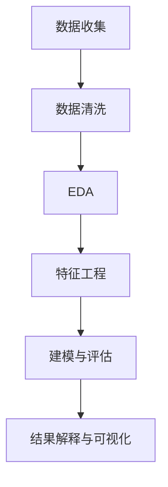

# 3.5.1 数据分析基础理论

## 3.5.1.1 数据分析的定义与流程

- 数据分析是指对原始数据进行清洗、转换、建模、解释的过程，旨在发现有用信息、得出结论并支持决策。
- 典型流程：数据收集 → 数据清洗 → 数据探索性分析（EDA）→ 特征工程 → 建模与评估 → 结果解释与可视化

## 3.5.1.2 主要分析方法

- 描述性统计、推断性统计、相关性分析、假设检验等

## 3.5.1.3 代码示例

```python
import pandas as pd
df = pd.read_csv('data.csv')
print(df.describe())
```

## 3.5.1.4 相关内容跳转

- 详见 3.5.3-数据可视化方法与工具.md
- 详见 3.5.4-专业数据分析算法.md

## 3.5.1.5 行业案例与多表征

### 金融行业案例

- 利用数据分析进行信用评分、风险评估、欺诈检测。
- 典型流程：收集用户交易数据，清洗与特征工程，建模与可视化，输出风险报告。

### 医疗行业案例

- 电子病历数据分析，辅助诊断与疾病预测。
- 典型流程：数据采集（EMR），数据清洗，统计分析与可视化，模型预测。

### 多表征示例

- 流程图、数据分布直方图、相关性热力图等。


