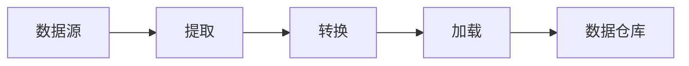

# 3.5.2 ETL理论与实践

## 1. ETL的定义与作用

- ETL（Extract-Transform-Load）是数据集成的核心过程，包括数据提取、转换和加载。

## 2. 主要ETL流程与方法

- 数据源采集、数据清洗、数据转换、数据加载
- 批处理与流处理的ETL对比

## 3. 主流ETL工具与开源框架

- Airflow、Kettle、Talend、Spark、Flink等

## 4. 代码示例

```python
# 使用pandas进行简单ETL
import pandas as pd
df = pd.read_csv('raw.csv')
df_clean = df.dropna()
df_clean.to_csv('clean.csv', index=False)
```

## 5. 相关内容跳转

- 详见 3.5.5-数据流处理与架构.md

## 6. 行业案例与多表征

### 6.1. 零售行业案例

- 多渠道销售数据ETL，统一分析库存与销售趋势。
- 典型流程：从POS、网店、ERP等多源提取数据，转换为统一格式，加载至数据仓库。

### 6.2. 互联网行业案例

- 用户行为日志ETL，支撑实时推荐与分析。
- 典型流程：日志采集、清洗、实时流式转换、入库分析。

### 6.3. 多表征示例

- ETL流程图、数据流图、批处理与流处理对比表。


