# 3.5.2 ETL理论与实践

## 📑 目录

- [3.5.2 ETL理论与实践](#352-etl理论与实践)
  - [📑 目录](#-目录)
  - [1. 概述](#1-概述)
    - [1.1. ETL定义](#11-etl定义)
    - [1.2. ETL作用](#12-etl作用)
    - [1.3. ETL历史](#13-etl历史)
  - [2. ETL核心流程](#2-etl核心流程)
    - [2.1. 数据抽取（Extract）](#21-数据抽取extract)
      - [2.1.1. 抽取策略](#211-抽取策略)
      - [2.1.2. 数据源类型](#212-数据源类型)
    - [2.2. 数据转换（Transform）](#22-数据转换transform)
      - [2.2.1. 数据清洗](#221-数据清洗)
      - [2.2.2. 数据转换](#222-数据转换)
    - [2.3. 数据加载（Load）](#23-数据加载load)
      - [2.3.1. 加载策略](#231-加载策略)
      - [2.3.2. 批量加载](#232-批量加载)
  - [3. ETL模式与方法](#3-etl模式与方法)
    - [3.1. 批处理ETL](#31-批处理etl)
      - [3.1.1. 批处理特点](#311-批处理特点)
      - [3.1.2. 批处理实现](#312-批处理实现)
    - [3.2. 流处理ETL](#32-流处理etl)
      - [3.2.1. 流处理特点](#321-流处理特点)
      - [3.2.2. 流处理实现](#322-流处理实现)
    - [3.3. 实时ETL](#33-实时etl)
      - [3.3.1. 实时ETL特点](#331-实时etl特点)
  - [4. ETL工具与框架](#4-etl工具与框架)
    - [4.1. 开源ETL工具](#41-开源etl工具)
      - [4.1.1. Apache Airflow](#411-apache-airflow)
      - [4.1.2. Apache Spark](#412-apache-spark)
    - [4.2. 商业ETL工具](#42-商业etl工具)
      - [4.2.1. Informatica](#421-informatica)
      - [4.2.2. Talend](#422-talend)
    - [4.3. 大数据ETL框架](#43-大数据etl框架)
      - [4.3.1. Apache Flink](#431-apache-flink)
  - [5. ETL设计模式](#5-etl设计模式)
    - [5.1. 数据抽取模式](#51-数据抽取模式)
      - [5.1.1. 抽取模式类型](#511-抽取模式类型)
    - [5.2. 数据转换模式](#52-数据转换模式)
      - [5.2.1. 转换模式类型](#521-转换模式类型)
    - [5.3. 数据加载模式](#53-数据加载模式)
      - [5.3.1. 加载模式类型](#531-加载模式类型)
  - [6. ETL性能优化](#6-etl性能优化)
    - [6.1. 抽取优化](#61-抽取优化)
      - [6.1.1. 抽取优化策略](#611-抽取优化策略)
    - [6.2. 转换优化](#62-转换优化)
      - [6.2.1. 转换优化策略](#621-转换优化策略)
    - [6.3. 加载优化](#63-加载优化)
      - [6.3.1. 加载优化策略](#631-加载优化策略)
  - [7. ETL质量保证](#7-etl质量保证)
    - [7.1. 数据质量检查](#71-数据质量检查)
      - [7.1.1. 质量检查指标](#711-质量检查指标)
    - [7.2. 错误处理](#72-错误处理)
      - [7.2.1. 错误处理策略](#721-错误处理策略)
    - [7.3. 数据验证](#73-数据验证)
      - [7.3.1. 验证规则](#731-验证规则)
  - [8. 实际应用案例](#8-实际应用案例)
    - [8.1. 零售行业案例](#81-零售行业案例)
    - [8.2. 互联网行业案例](#82-互联网行业案例)
  - [9. 形式化定义](#9-形式化定义)
    - [9.1. ETL形式化](#91-etl形式化)
    - [9.2. 数据质量形式化](#92-数据质量形式化)
  - [10. 多表征](#10-多表征)
  - [11. 总结与展望](#11-总结与展望)
    - [11.1. 总结](#111-总结)
    - [11.2. 发展趋势](#112-发展趋势)

## 1. 概述

### 1.1. ETL定义

**ETL（Extract-Transform-Load）**是数据集成和数据仓库建设的核心过程：

- **Extract（抽取）**：从各种数据源提取数据
- **Transform（转换）**：清洗、转换、验证数据
- **Load（加载）**：将数据加载到目标系统

**ETL形式化定义**：

设ETL过程为三元组 $ETL = (E, T, L)$，其中：

- $E: S \to D_{raw}$：抽取函数，从数据源集合 $S$ 抽取原始数据 $D_{raw}$
- $T: D_{raw} \to D_{clean}$：转换函数，将原始数据转换为清洗后的数据 $D_{clean}$
- $L: D_{clean} \to T$：加载函数，将清洗后的数据加载到目标系统 $T$

### 1.2. ETL作用

**ETL的主要作用**：

1. **数据集成**：整合多个异构数据源
2. **数据质量**：保证数据质量和一致性
3. **数据转换**：将数据转换为目标格式
4. **性能优化**：高效处理大数据量

### 1.3. ETL历史

**ETL发展历程**：

1. **1970s-1980s**：数据仓库概念提出，ETL开始发展
2. **1990s**：商业ETL工具出现（Informatica、DataStage）
3. **2000s**：开源ETL工具兴起（Pentaho、Talend）
4. **2010s**：大数据ETL框架（Hadoop、Spark）
5. **2020s**：实时ETL和流处理（Flink、Kafka）

---

## 2. ETL核心流程

### 2.1. 数据抽取（Extract）

#### 2.1.1. 抽取策略

**抽取策略类型**：

1. **全量抽取**：一次性抽取所有数据
2. **增量抽取**：只抽取变更的数据
3. **CDC（变更数据捕获）**：实时捕获数据变更

**全量抽取**：

```python
class FullExtract:
    def extract(self, source):
        """全量抽取"""
        # 从数据源抽取所有数据
        data = source.read_all()
        return data
```

**增量抽取**：

```python
class IncrementalExtract:
    def __init__(self, last_extract_time):
        self.last_extract_time = last_extract_time

    def extract(self, source):
        """增量抽取"""
        # 只抽取上次抽取后的变更数据
        data = source.read_since(self.last_extract_time)
        return data
```

#### 2.1.2. 数据源类型

**数据源类型**：

1. **关系数据库**：MySQL、PostgreSQL、Oracle
2. **NoSQL数据库**：MongoDB、Cassandra、Redis
3. **文件系统**：CSV、JSON、Parquet
4. **API接口**：REST API、GraphQL
5. **消息队列**：Kafka、RabbitMQ

**多数据源抽取**：

```python
class MultiSourceExtract:
    def __init__(self, sources):
        self.sources = sources

    def extract_all(self):
        """从多个数据源抽取"""
        results = {}
        for name, source in self.sources.items():
            results[name] = source.extract()
        return results
```

### 2.2. 数据转换（Transform）

#### 2.2.1. 数据清洗

**数据清洗操作**：

1. **去重**：删除重复数据
2. **空值处理**：处理缺失值
3. **格式转换**：统一数据格式
4. **异常值处理**：处理异常数据

**数据清洗实现**：

```python
class DataCleaning:
    def clean(self, data):
        """数据清洗"""
        # 去重
        data = data.drop_duplicates()

        # 空值处理
        data = data.fillna(method='ffill')

        # 格式转换
        data['date'] = pd.to_datetime(data['date'])

        # 异常值处理
        data = data[(data['value'] >= 0) & (data['value'] <= 100)]

        return data
```

#### 2.2.2. 数据转换

**数据转换操作**：

1. **数据类型转换**：转换数据类型
2. **计算字段**：计算衍生字段
3. **数据聚合**：数据聚合操作
4. **数据标准化**：数据标准化

**数据转换实现**：

```python
class DataTransform:
    def transform(self, data):
        """数据转换"""
        # 数据类型转换
        data['amount'] = data['amount'].astype(float)

        # 计算字段
        data['total'] = data['quantity'] * data['price']

        # 数据聚合
        aggregated = data.groupby('category').agg({
            'amount': 'sum',
            'quantity': 'sum'
        })

        # 数据标准化
        data['normalized'] = (data['value'] - data['value'].mean()) / data['value'].std()

        return data
```

### 2.3. 数据加载（Load）

#### 2.3.1. 加载策略

**加载策略类型**：

1. **全量加载**：清空后加载所有数据
2. **增量加载**：追加新数据
3. **更新加载**：更新已有数据
4. **UPSERT**：插入或更新

**全量加载**：

```python
class FullLoad:
    def load(self, target, data):
        """全量加载"""
        # 清空目标表
        target.truncate()

        # 加载数据
        target.insert(data)
```

**增量加载**：

```python
class IncrementalLoad:
    def load(self, target, data):
        """增量加载"""
        # 只加载新数据
        existing_ids = target.get_existing_ids()
        new_data = data[~data['id'].isin(existing_ids)]
        target.insert(new_data)
```

#### 2.3.2. 批量加载

**批量加载优化**：

```python
class BatchLoad:
    def __init__(self, batch_size=1000):
        self.batch_size = batch_size

    def load(self, target, data):
        """批量加载"""
        for i in range(0, len(data), self.batch_size):
            batch = data[i:i + self.batch_size]
            target.insert_batch(batch)
```

---

## 3. ETL模式与方法

### 3.1. 批处理ETL

#### 3.1.1. 批处理特点

**批处理ETL特点**：

- **定时执行**：按计划定时执行
- **大批量**：处理大批量数据
- **高吞吐**：高吞吐量处理
- **延迟较高**：数据延迟较高

**批处理ETL流程**：

```mermaid
flowchart LR
    S[数据源] -->|定时抽取| E[抽取]
    E --> T[转换]
    T --> L[加载]
    L --> W[数据仓库]
```



#### 3.1.2. 批处理实现

**批处理ETL实现**：

```python
class BatchETL:
    def __init__(self, extractor, transformer, loader):
        self.extractor = extractor
        self.transformer = transformer
        self.loader = loader

    def run(self):
        """执行批处理ETL"""
        # 抽取
        raw_data = self.extractor.extract()

        # 转换
        clean_data = self.transformer.transform(raw_data)

        # 加载
        self.loader.load(clean_data)
```

### 3.2. 流处理ETL

#### 3.2.1. 流处理特点

**流处理ETL特点**：

- **实时处理**：实时处理数据流
- **低延迟**：低延迟处理
- **连续处理**：连续处理数据
- **状态管理**：需要状态管理

**流处理ETL流程**：

```mermaid
flowchart LR
    S[数据流] -->|实时| E[抽取]
    E --> T[转换]
    T --> L[加载]
    L --> W[目标系统]
```



#### 3.2.2. 流处理实现

**流处理ETL实现（Apache Flink）**：

```python
from pyflink.datastream import StreamExecutionEnvironment
from pyflink.table import StreamTableEnvironment

env = StreamExecutionEnvironment.get_execution_environment()
table_env = StreamTableEnvironment.create(env)

# 定义源表
table_env.execute_sql("""
    CREATE TABLE source (
        id INT,
        name STRING,
        value DOUBLE
    ) WITH (
        'connector' = 'kafka',
        'topic' = 'input-topic'
    )
""")

# 定义目标表
table_env.execute_sql("""
    CREATE TABLE sink (
        id INT,
        name STRING,
        value DOUBLE,
        processed_time TIMESTAMP
    ) WITH (
        'connector' = 'jdbc',
        'url' = 'jdbc:postgresql://localhost:5432/mydb',
        'table-name' = 'target_table'
    )
""")

# 执行ETL
table_env.execute_sql("""
    INSERT INTO sink
    SELECT id, name, value, CURRENT_TIMESTAMP
    FROM source
""")
```

### 3.3. 实时ETL

#### 3.3.1. 实时ETL特点

**实时ETL特点**：

- **毫秒级延迟**：毫秒级处理延迟
- **事件驱动**：事件驱动处理
- **高可用**：高可用性要求
- **复杂处理**：支持复杂处理逻辑

---

## 4. ETL工具与框架

### 4.1. 开源ETL工具

#### 4.1.1. Apache Airflow

**Airflow特点**：

- **工作流编排**：DAG工作流编排
- **调度管理**：强大的调度功能
- **可扩展**：丰富的插件生态

**Airflow示例**：

```python
from airflow import DAG
from airflow.operators.python import PythonOperator
from datetime import datetime

def extract_data():
    # 抽取数据
    pass

def transform_data():
    # 转换数据
    pass

def load_data():
    # 加载数据
    pass

dag = DAG('etl_pipeline', start_date=datetime(2024, 1, 1))

extract_task = PythonOperator(
    task_id='extract',
    python_callable=extract_data,
    dag=dag
)

transform_task = PythonOperator(
    task_id='transform',
    python_callable=transform_data,
    dag=dag
)

load_task = PythonOperator(
    task_id='load',
    python_callable=load_data,
    dag=dag
)

extract_task >> transform_task >> load_task
```

#### 4.1.2. Apache Spark

**Spark ETL特点**：

- **分布式处理**：分布式数据处理
- **内存计算**：内存计算加速
- **多种数据源**：支持多种数据源

**Spark ETL示例**：

```python
from pyspark.sql import SparkSession

spark = SparkSession.builder.appName("ETL").getOrCreate()

# 抽取
df = spark.read.format("jdbc").options(
    url="jdbc:postgresql://localhost:5432/mydb",
    dbtable="source_table"
).load()

# 转换
df_transformed = df.filter(df["status"] == "active") \
    .groupBy("category") \
    .agg({"amount": "sum"})

# 加载
df_transformed.write.format("jdbc").options(
    url="jdbc:postgresql://localhost:5432/mydb",
    dbtable="target_table"
).mode("overwrite").save()
```

### 4.2. 商业ETL工具

#### 4.2.1. Informatica

**Informatica特点**：

- **企业级**：企业级ETL工具
- **可视化**：可视化设计界面
- **高性能**：高性能处理引擎

#### 4.2.2. Talend

**Talend特点**：

- **开源和商业版本**：开源和商业版本
- **代码生成**：自动生成代码
- **大数据支持**：支持大数据处理

### 4.3. 大数据ETL框架

#### 4.3.1. Apache Flink

**Flink ETL特点**：

- **流批一体**：统一的流批处理
- **低延迟**：低延迟处理
- **状态管理**：强大的状态管理

---

## 5. ETL设计模式

### 5.1. 数据抽取模式

#### 5.1.1. 抽取模式类型

**抽取模式**：

1. **全量抽取模式**：适合小数据量
2. **增量抽取模式**：适合大数据量
3. **CDC模式**：适合实时需求

### 5.2. 数据转换模式

#### 5.2.1. 转换模式类型

**转换模式**：

1. **简单转换**：直接映射
2. **复杂转换**：多步骤转换
3. **聚合转换**：数据聚合

### 5.3. 数据加载模式

#### 5.3.1. 加载模式类型

**加载模式**：

1. **全量替换**：清空后加载
2. **增量追加**：追加新数据
3. **更新合并**：更新已有数据

---

## 6. ETL性能优化

ETL性能优化是处理大规模数据的关键，需要从抽取、转换、加载三个环节进行优化。

### 6.1. 抽取优化

#### 6.1.1. 抽取优化策略

**增量抽取**：

只抽取自上次抽取后发生变化的数据，减少数据传输量。

**实现示例**：

```python
import json
from datetime import datetime
import pandas as pd

class IncrementalExtract:
    """增量抽取"""

    def __init__(self, source_db, checkpoint_file='checkpoint.json'):
        self.source_db = source_db
        self.checkpoint_file = checkpoint_file

    def get_last_timestamp(self):
        """获取上次抽取的时间戳"""
        try:
            with open(self.checkpoint_file, 'r') as f:
                checkpoint = json.load(f)
                return checkpoint.get('last_timestamp')
        except FileNotFoundError:
            return None

    def extract_incremental(self, table_name, timestamp_column='updated_at'):
        """增量抽取数据"""
        last_timestamp = self.get_last_timestamp()

        if last_timestamp:
            query = f"""
                SELECT * FROM {table_name}
                WHERE {timestamp_column} > '{last_timestamp}'
                ORDER BY {timestamp_column}
            """
        else:
            query = f"SELECT * FROM {table_name}"

        data = pd.read_sql(query, self.source_db)

        # 更新检查点
        if not data.empty:
            latest_timestamp = data[timestamp_column].max()
            self.save_checkpoint(latest_timestamp)

        return data

    def save_checkpoint(self, timestamp):
        """保存检查点"""
        checkpoint = {'last_timestamp': str(timestamp)}
        with open(self.checkpoint_file, 'w') as f:
            json.dump(checkpoint, f)
```

**并行抽取**：

使用多进程/多线程并行抽取多个数据源。

**实现示例**：

```python
from concurrent.futures import ThreadPoolExecutor
import multiprocessing as mp

def parallel_extract(sources: list, max_workers=None):
    """
    并行抽取多个数据源

    参数:
        sources: 数据源列表，每个元素是(数据源, 查询)元组
        max_workers: 最大工作线程数
    """
    if max_workers is None:
        max_workers = min(len(sources), mp.cpu_count())

    def extract_from_source(source_query):
        source, query = source_query
        return pd.read_sql(query, source)

    with ThreadPoolExecutor(max_workers=max_workers) as executor:
        results = list(executor.map(extract_from_source, sources))

    return results
```

**抽取优化**：

1. **并行抽取**：多线程并行抽取
2. **增量抽取**：只抽取变更数据
3. **分区抽取**：按分区抽取

**并行抽取**：

```python
from concurrent.futures import ThreadPoolExecutor

class ParallelExtract:
    def __init__(self, sources, max_workers=4):
        self.sources = sources
        self.max_workers = max_workers

    def extract_all(self):
        """并行抽取"""
        with ThreadPoolExecutor(max_workers=self.max_workers) as executor:
            results = executor.map(lambda s: s.extract(), self.sources)
        return list(results)
```

### 6.2. 转换优化

#### 6.2.1. 转换优化策略

**转换优化**：

1. **向量化操作**：使用向量化操作
2. **缓存中间结果**：缓存中间结果
3. **并行转换**：并行转换处理

### 6.3. 加载优化

#### 6.3.1. 加载优化策略

**加载优化**：

1. **批量加载**：批量插入
2. **并行加载**：并行加载
3. **索引优化**：加载后创建索引

---

## 7. ETL质量保证

### 7.1. 数据质量检查

#### 7.1.1. 质量检查指标

**质量检查指标**：

1. **完整性**：数据完整性检查
2. **准确性**：数据准确性检查
3. **一致性**：数据一致性检查
4. **及时性**：数据及时性检查

**质量检查实现**：

```python
class DataQualityCheck:
    def check_completeness(self, data):
        """完整性检查"""
        missing_rate = data.isnull().sum() / len(data)
        return missing_rate < 0.05  # 缺失率小于5%

    def check_accuracy(self, data, rules):
        """准确性检查"""
        for rule in rules:
            if not rule.validate(data):
                return False
        return True
```

### 7.2. 错误处理

#### 7.2.1. 错误处理策略

**错误处理策略**：

1. **跳过错误**：跳过错误记录
2. **记录错误**：记录错误到日志
3. **重试机制**：失败重试

**错误处理实现**：

```python
class ErrorHandler:
    def handle_error(self, error, record):
        """错误处理"""
        # 记录错误
        self.log_error(error, record)

        # 根据错误类型处理
        if error.type == 'data_quality':
            # 数据质量错误，跳过
            return 'skip'
        elif error.type == 'network':
            # 网络错误，重试
            return 'retry'
```

### 7.3. 数据验证

#### 7.3.1. 验证规则

**验证规则**：

1. **格式验证**：数据格式验证
2. **范围验证**：数据范围验证
3. **业务规则验证**：业务规则验证

---

## 8. 实际应用案例

### 8.1. 零售行业案例

**场景**：

- 多渠道销售数据ETL
- 统一分析库存与销售趋势

**实现**：

```python
# 从POS、网店、ERP等多源提取数据
sources = {
    'pos': POSExtractor(),
    'online': OnlineExtractor(),
    'erp': ERPExtractor()
}

# 转换为统一格式
transformer = UnifiedTransformer()

# 加载至数据仓库
loader = DataWarehouseLoader()

# 执行ETL
etl = ETLPipeline(sources, transformer, loader)
etl.run()
```

### 8.2. 互联网行业案例

**场景**：

- 用户行为日志ETL
- 支撑实时推荐与分析

**实现**：

```python
# 使用Flink进行实时ETL
from pyflink.datastream import StreamExecutionEnvironment

env = StreamExecutionEnvironment.get_execution_environment()

# 从Kafka读取日志
log_stream = env.add_source(KafkaSource())

# 实时转换
transformed_stream = log_stream \
    .filter(lambda x: x['event_type'] == 'click') \
    .map(lambda x: transform_log(x))

# 写入数据仓库
transformed_stream.add_sink(DataWarehouseSink())
```

---

## 9. 形式化定义

### 9.1. ETL形式化

**ETL过程形式化**：

$$ETL(S, T) = L(T(E(S)))$$

其中：

- $S$：数据源集合
- $E$：抽取函数
- $T$：转换函数
- $L$：加载函数

### 9.2. 数据质量形式化

**数据质量定义**：

$$Quality(D) = \alpha \cdot Completeness(D) + \beta \cdot Accuracy(D) + \gamma \cdot Consistency(D)$$

其中 $\alpha + \beta + \gamma = 1$。

---

## 10. 多表征

本主题支持多种表征方式：

1. **符号表征**：形式化定义、数学公式
2. **图结构**：ETL流程图、数据流图
3. **代码实现**：ETL代码示例
4. **自然语言**：概念定义、最佳实践
5. **可视化**：ETL可视化、监控面板

---

## 11. 总结与展望

### 11.1. 总结

ETL理论与实践的核心要点：

1. **核心流程**：抽取、转换、加载
2. **处理模式**：批处理、流处理、实时处理
3. **工具框架**：Airflow、Spark、Flink等
4. **质量保证**：数据质量检查、错误处理

### 11.2. 发展趋势

**未来发展方向**：

1. **实时化**：实时ETL成为主流
2. **自动化**：自动化ETL流程
3. **智能化**：AI驱动的ETL优化

---

**参考文献**：

1. Kimball, R., & Ross, M. (2013). "The Data Warehouse Toolkit"
2. Inmon, W. H. (2005). "Building the Data Warehouse"

---

[返回数据分析与ETL导航](../README.md)
