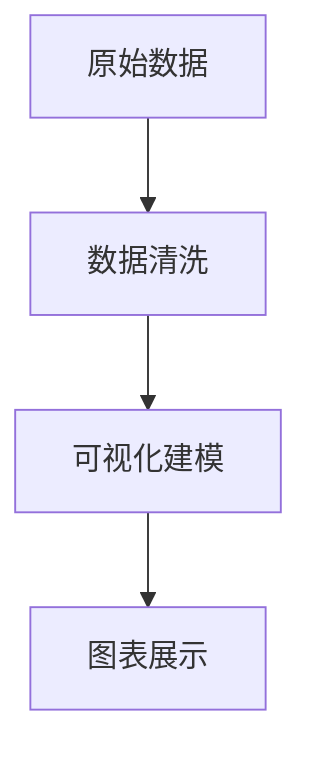

# 3.5.3 数据可视化方法与工具

## 3.5.3.1 数据可视化的意义与原则

- 数据可视化帮助理解数据分布、趋势和异常，提升数据洞察力。

## 3.5.3.2 主流可视化方法

- 柱状图、折线图、散点图、热力图、箱线图等

## 3.5.3.3 主流可视化工具

- Python（matplotlib、seaborn、plotly）、Tableau、PowerBI、Echarts等

## 3.5.3.4 代码示例

```python
import matplotlib.pyplot as plt
df['value'].plot(kind='hist')
plt.show()
```

## 3.5.3.5 相关内容跳转

- 详见 3.5.1-数据分析基础理论.md

## 3.5.3.6 行业案例与多表征

### 金融行业案例

- 利用可视化展示风险分布、资产配置、市场趋势。
- 典型图表：热力图、K线图、资产分布饼图。

### 医疗行业案例

- 病人分布、疾病趋势、诊疗流程可视化。
- 典型图表：分布直方图、流程图、时序折线图。

### 多表征示例

- 相关性热力图、流程图、交互式仪表盘等。


