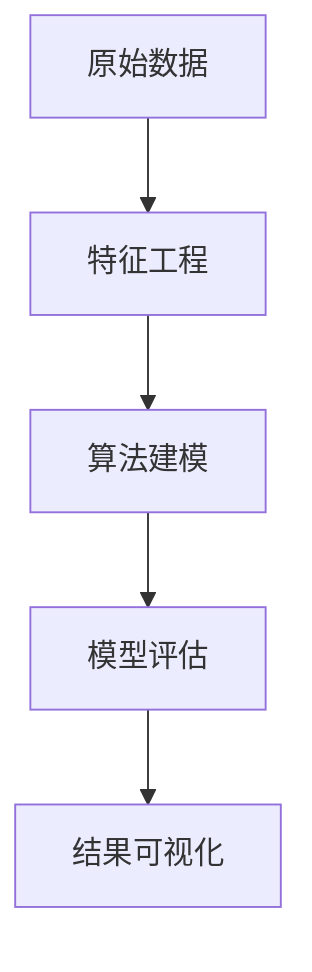

# 3.5.4 专业数据分析算法

## 3.5.4.1 常用算法分类

- 聚类（KMeans、DBSCAN等）
- 分类（决策树、SVM、逻辑回归等）
- 回归（线性回归、岭回归等）
- 降维（PCA、t-SNE等）
- 异常检测

## 3.5.4.2 算法原理与应用场景

- 每类算法的基本原理、适用场景、优缺点

## 3.5.4.3 代码示例

```python
from sklearn.cluster import KMeans
kmeans = KMeans(n_clusters=3)
kmeans.fit(X)
```

## 3.5.4.4 相关内容跳转

- 详见 3.5.1-数据分析基础理论.md

## 3.5.4.5 行业案例与多表征

### 零售行业案例

- 聚类算法用于用户分群，提升精准营销。
- 分类算法用于商品推荐、客户流失预测。

### 互联网行业案例

- 回归算法用于广告点击率预测。
- 降维算法用于高维行为数据可视化。

### 多表征示例

- 算法流程图、模型评估指标表、特征重要性可视化。


